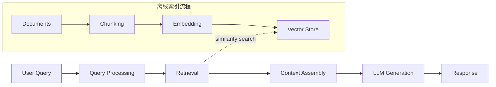
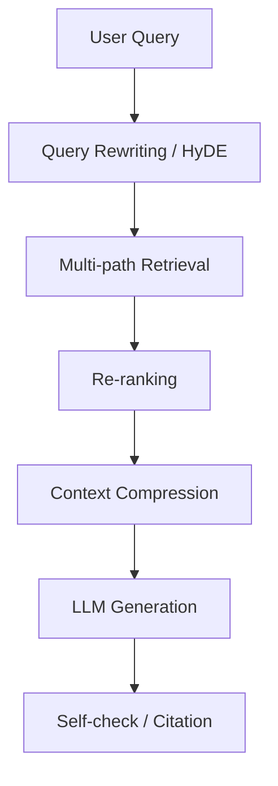

## Definition

**RAG（Retrieval-Augmented Generation，检索增强生成）** 是一种将信息检索与大语言模型（LLM）生成相结合的架构模式。核心思路：先从外部知识库中检索与用户问题相关的内容，再将检索结果作为上下文注入 Prompt，让 LLM 基于真实数据生成回答。

> [!tip] 为什么需要 RAG？
> LLM 存在 **知识截止（knowledge cutoff）** 和 **幻觉（hallucination）** 问题。RAG 通过引入外部知识源，让模型回答更准确、可溯源、可更新，而无需重新训练模型。

## Architecture / Flow

## 核心组件

### 1. 文档处理与分块（Chunking）

将原始文档拆分为适合检索的片段，常见策略：

| 策略 | 说明 | 适用场景 |
|------|------|----------|
| Fixed-size | 按固定 token 数切分 | 通用文本 |
| Recursive | 按段落→句子→字符递归切分 | 结构化文档 |
| Semantic | 按语义相似度分组 | 主题混杂的长文 |
| Document-aware | 按 Markdown 标题、表格等结构切分 | 技术文档 |

> [!warning] 分块粒度的权衡
> 块太大 → 检索精度下降，噪声增多；块太小 → 上下文不完整，语义丢失。通常 200–1000 tokens 是合理起点。

### 2. 向量化（Embedding）

将文本块转换为高维向量，捕捉语义信息。常用模型：

- **OpenAI text-embedding-3-small/large**
- **BGE / GTE** 系列（开源中文表现好）
- **Cohere embed-v3**

### 3. 向量数据库（Vector Store）

存储和检索向量的专用数据库：

- **Milvus / Zilliz**：高性能、分布式
- **Pinecone**：全托管
- **Chroma**：轻量本地开发
- **pgvector**：PostgreSQL 扩展，适合已有 PG 的团队
- **FAISS**：Meta 开源，纯向量索引库

### 4. 检索策略

- **Dense Retrieval**：基于向量相似度（余弦/内积）
- **Sparse Retrieval**：传统 BM25 关键词匹配
- **Hybrid Search**：Dense + Sparse 加权融合，兼顾语义和关键词

## Advanced RAG Patterns

### Query Rewriting

将用户原始问题改写为更适合检索的形式：

- **HyDE（Hypothetical Document Embedding）**：先让 LLM 生成一个"假设性答案"，用这个答案的向量去检索
- **Multi-Query**：将一个问题拆分为多个子问题，分别检索后合并结果
- **Step-back Prompting**：将具体问题抽象为更通用的问题来检索

### Re-ranking

对初步检索结果进行二次排序，提升相关性：

- **Cross-encoder**（如 Cohere Rerank、BGE-reranker）
- **LLM-based Reranking**：用 LLM 判断每段内容与问题的相关性

### Context Window 管理

- **Compression**：压缩检索到的上下文，去除冗余
- **Lost in the Middle**：LLM 更关注上下文的开头和结尾，关键信息应放在这些位置
- **Chunk 排序**：按相关性降序排列，截断低质量结果

## RAG vs Fine-tuning vs Long Context

| 维度 | RAG | Fine-tuning | Long Context |
|------|-----|-------------|--------------|
| 知识更新 | 实时（更新索引即可） | 需要重新训练 | 每次传入 |
| 成本 | 中（检索 + 生成） | 高（训练资源） | 高（token 消耗） |
| 可溯源 | 可以引用原文 | 不可追溯 | 可以但难定位 |
| 适用数据量 | 大规模知识库 | 领域风格/格式 | 少量文档 |
| 幻觉控制 | 较好 | 一般 | 一般 |

> [!note] 实践建议
> 三者并非互斥。常见组合：**Fine-tuning 调整模型风格 + RAG 注入领域知识**，或 **Long Context 处理单次会话文档 + RAG 处理长期知识库**。

## 企业落地要点

1. **数据质量**：垃圾进、垃圾出——文档清洗和结构化是前提
2. **评估体系**：需建立 Retrieval Recall、Answer Accuracy、Faithfulness 等指标
3. **权限控制**：检索结果需遵循数据权限，避免越权访问
4. **与数据治理结合**：元数据、数据血缘、指标口径等治理资产可作为 RAG 的知识源

## Related

- [[Text2SQL]] — RAG 可以为 Text2SQL 提供 schema/指标口径等上下文
- [[Data Agent Architecture]] — RAG 是 Data Agent 的核心能力之一
- [[MCP]] — MCP Server 可以作为 RAG 的数据源接入层
- [[Prompt Engineering]] — Prompt 设计直接影响 RAG 的生成质量
- [[Knowledge Distillation（知识蒸馏）]] — 蒸馏可用于训练更小的 Embedding 或 Reranker 模型
