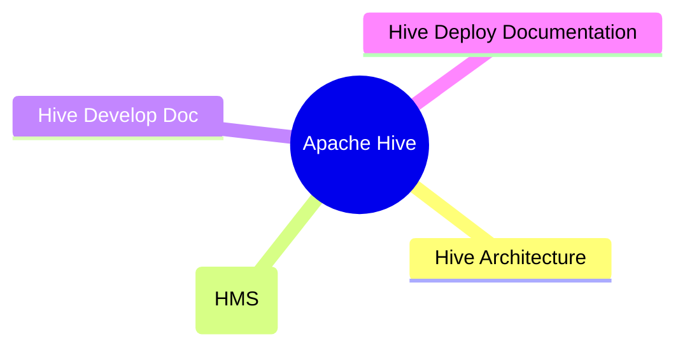

---
aliases:
  - hive
tags:
  - hadoop
  - database
  - offline-compute
date: 2022-01-14
draft: false
---

## Apache Hive

> Hive由Facebook开源，是基于Hadoop的一个数据仓库工具，可以将结构化的数据文件映射为一张表，并提供类`SQL`查询功能，解决 `海量结构化日志` 的数据统计工具

> [!info] Hive本质：将HQL转化成 [[MapReduce]] 程序

- hive处理的数据存在[[HDFS]]
- hive默认分析计算引擎是[[MapReduce]]
- hive执行程序运行在[[Hadoop Yarn]]

## Hive Architecture

![[hive-architecture.png]]

- 用户接口：Client
	- CLI（command-line interface）、JDBC/ODBC(jdbc访问hive)、WEBUI（浏览器访问hive）
- 元数据：Metastore
	- 默认存储在自带的`derby`数据库中，推荐使用`MySQL`存储Metastore(表名，表的列，库信息)
- Hadoop
	- 使用HDFS进行存储，使用MapReduce进行计算
	- 路径: /user/hive/warehouse
- 驱动器：Driver
	- 解析器（SQL Parser）：将SQL字符串转换成抽象语法树AST，这一步一般都用第三方工具库完成，比如antlr；对AST进行语法分析，比如表是否存在、字段是否存在、SQL语义是否有误
	- 编译器（Physical Plan）：将AST编译生成逻辑执行计划
	- 优化器（Query Optimizer）：对逻辑执行计划进行优化
	-  执行器（Execution）：把逻辑执行计划转换成可以运行的物理计划。对于Hive来说，就是MR/Spark

## Hive Metastore Server (HMS)

> [!warning] Hive是针对数据仓库应用设计的，而数据仓库的内容是`读多写少`的。因此，Hive中不建议对数据的改写，所有的数据都是在加载的时候确定好的

## Hive的数据模型

| Hive | HDFS |
| ---- | ---- |
| 表    | 目录   |
| 分区   | 目录   |
| 数据   | 文件   |
| 桶    | 文件   |
| 视图   | /    |

## Hive Relateion

### Hive Integration

- [Hive on Spark: Getting Started](https://cwiki.apache.org/confluence/display/Hive/Hive+on+Spark%3A+Getting+Started)
- [Hive HBase Integration](https://cwiki.apache.org/confluence/display/Hive/HBaseIntegration)
- [Druid Integration](https://cwiki.apache.org/confluence/display/Hive/Druid+Integration)
- [Kudu Integration](https://cwiki.apache.org/confluence/display/Hive/Kudu+Integration)
[Streaming Data Ingest](https://cwiki.apache.org/confluence/display/Hive/Streaming+Data+Ingest), and [Streaming Mutation API](https://cwiki.apache.org/confluence/display/Hive/HCatalog+Streaming+Mutation+API)
- [Hive Counters](https://cwiki.apache.org/confluence/display/Hive/HiveCounters)
- [Using TiDB as the Hive Metastore database](https://cwiki.apache.org/confluence/display/Hive/Using+TiDB+as+the+Hive+Metastore+database)
- [StarRocks Integration](https://cwiki.apache.org/confluence/display/Hive/StarRocks+Integration)
- [Hive Accumulo Integration](https://cwiki.apache.org/confluence/display/Hive/AccumuloIntegration)
- [Hive Transactions](https://cwiki.apache.org/confluence/display/Hive/Hive+Transactions), 

### Hive On Cloud

- Hive on Aliyun JMR
- Hive on JDCLoud JMR
- [Hive on Amazon Web Services](https://cwiki.apache.org/confluence/display/Hive/HiveAws)

## Resources

- [Hive Tutorial](https://cwiki.apache.org/confluence/display/Hive/Tutorial)
- [Hive SQL Language Manual](https://cwiki.apache.org/confluence/display/Hive/LanguageManual):  [Commands](https://cwiki.apache.org/confluence/display/Hive/LanguageManual+Commands), [CLIs](https://cwiki.apache.org/confluence/display/Hive/LanguageManual+Cli), [Data Types](https://cwiki.apache.org/confluence/display/Hive/LanguageManual+Types),  
    DDL ([create/drop/alter/truncate/show/describe](https://cwiki.apache.org/confluence/display/Hive/LanguageManual+DDL)), [Statistics (analyze)](https://cwiki.apache.org/confluence/display/Hive/StatsDev), [Indexes](https://cwiki.apache.org/confluence/display/Hive/LanguageManual+Indexing), [Archiving](https://cwiki.apache.org/confluence/display/Hive/LanguageManual+Archiving),  
    DML ([load/insert/update/delete/merge](https://cwiki.apache.org/confluence/display/Hive/LanguageManual+DML), [import/export](https://cwiki.apache.org/confluence/display/Hive/LanguageManual+ImportExport), [explain plan](https://cwiki.apache.org/confluence/display/Hive/LanguageManual+Explain)),  
    [Queries (select)](https://cwiki.apache.org/confluence/display/Hive/LanguageManual+Select), [Operators and UDFs](https://cwiki.apache.org/confluence/display/Hive/LanguageManual+UDF), [Locks](https://cwiki.apache.org/confluence/display/Hive/LanguageManual+Locks), [Authorization](https://cwiki.apache.org/confluence/display/Hive/LanguageManual+Authorization)
- [File Formats and Compression](https://cwiki.apache.org/confluence/display/Hive/FileFormats):  [RCFile](https://cwiki.apache.org/confluence/display/Hive/RCFile), [Avro](https://cwiki.apache.org/confluence/display/Hive/AvroSerDe), [ORC](https://cwiki.apache.org/confluence/display/Hive/LanguageManual+ORC), [Parquet](https://cwiki.apache.org/confluence/display/Hive/Parquet); [Compression](https://cwiki.apache.org/confluence/display/Hive/CompressedStorage), [LZO](https://cwiki.apache.org/confluence/display/Hive/LanguageManual+LZO)
- Procedural Language:  [Hive HPL/SQL](https://cwiki.apache.org/confluence/pages/viewpage.action?pageId=59690156)
- [Hive Configuration Properties](https://cwiki.apache.org/confluence/display/Hive/Configuration+Properties)
- Hive Clients
    - [Hive Client](https://cwiki.apache.org/confluence/display/Hive/HiveClient) ([JDBC](https://cwiki.apache.org/confluence/display/Hive/HiveClient#HiveClient-JDBC), [ODBC](https://cwiki.apache.org/confluence/display/Hive/HiveClient#HiveClient-ODBC), [Thrift](https://cwiki.apache.org/confluence/display/Hive/HiveClient#HiveClient-ThriftJavaClient))
    - HiveServer2:  [Overview](https://cwiki.apache.org/confluence/display/Hive/HiveServer2+Overview), [HiveServer2 Client and Beeline](https://cwiki.apache.org/confluence/display/Hive/HiveServer2+Clients), [Hive Metrics](https://cwiki.apache.org/confluence/display/Hive/Hive+Metrics)
- [Hive Web Interface](https://cwiki.apache.org/confluence/display/Hive/HiveWebInterface)
- [Hive SerDes](https://cwiki.apache.org/confluence/display/Hive/SerDe):  [Avro SerDe](https://cwiki.apache.org/confluence/display/Hive/AvroSerDe), [Parquet SerDe](https://cwiki.apache.org/confluence/display/Hive/Parquet#Parquet-HiveQLSyntax), [CSV SerDe](https://cwiki.apache.org/confluence/display/Hive/CSV+Serde), [JSON SerDe](https://cwiki.apache.org/confluence/display/Hive/LanguageManual+DDL#LanguageManualDDL-JSON)   

## Deploy Documentation

- [Installing Hive](https://cwiki.apache.org/confluence/display/Hive/AdminManual+Installation)
- [Configuring Hive](https://cwiki.apache.org/confluence/display/Hive/AdminManual+Configuration)
- [Setting Up Metastore](https://cwiki.apache.org/confluence/display/Hive/AdminManual+Metastore+Administration) [Hive Schema Tool](https://cwiki.apache.org/confluence/display/Hive/Hive+Schema+Tool)
- [Setting Up Hive Web Interface](https://cwiki.apache.org/confluence/display/Hive/HiveWebInterface)
- [Setting Up Hive Server](https://cwiki.apache.org/confluence/display/Hive/AdminManual+SettingUpHiveServer) ([JDBC](https://cwiki.apache.org/confluence/display/Hive/HiveJDBCInterface), [ODBC](https://cwiki.apache.org/confluence/display/Hive/HiveODBC), [Thrift](https://cwiki.apache.org/confluence/display/Hive/HiveServer), [HiveServer2](https://cwiki.apache.org/confluence/display/Hive/Setting+Up+HiveServer2))
- [Hive Replication](https://cwiki.apache.org/confluence/display/Hive/Replication)
- [Hive on Amazon Elastic MapReduce](https://cwiki.apache.org/confluence/display/Hive/HiveAmazonElasticMapReduce)

