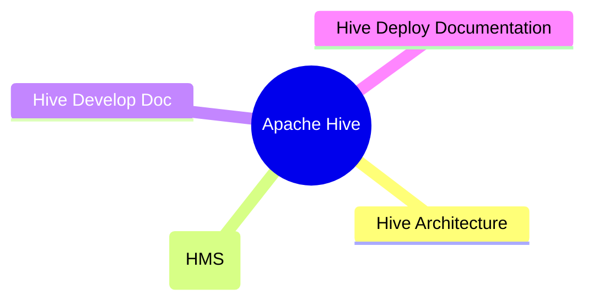

---
aliases:
  - Apache Hive
tags:
  - hadoop
  - database
  - offline-compute
date: 2022-01-14
draft: false
---




## Apache Hive

> [!info] Hive本质：将HQL转化成 [[MapReduce]] 程序

Hive由Facebook开源，是基于[[Hadoop]]的一个数据仓库工具，可以将结构化的数据文件映射为一张表，并提供类`SQL`查询功能，能将SQL语句转变成MapReduce任务来执行。Hive的优点是学习成本低，可以通过类似SQL语句实现快速[[MapReduce]]统计，使MapReduce变得更加简单，而不必开发专门的MapReduce应用程序。

hive强大之处不要求数据转换成特定的格式，而是利用hadoop本身`InputFormat API`来从不同的数据源读取数据，同样地使用`OutputFormat API`将数据写成不同的格式。所以对于不同的数据源，或者写出不同的格式就需要不同的对应的`InputFormat`和`OutputFormat`类的实现。以`stored as textFile`为例，其在底层java API中表现是输入`InputFormat`格式：`TextInputFormat`以及输出`OutputFormat`格式：`HiveIgnoreKeyTextOutputFormat`。这里`InputFormat`中定义了如何对数据源文本进行读取划分，以及如何将切片分割成记录存入表中。而`OutputFormat`定义了如何将这些切片写回到文件里或者直接在控制台输出。

## Hive 与 Hadoop

### Hive 产生的背景

- MR 的问题
	- 学习使用成本高，编程模型复杂
	- 不容易实现复杂查询
- 数仓建设需要，可作为数仓的工具
	- 类SQL，从而转换成MR程序
	- 支持自定义函数
	
### Hive与Hadoop生态的联系

- hive处理的数据存在[[HDFS]]
- hive默认分析计算引擎是[[MapReduce]]、后续版本也使用了 Tez
- hive执行程序运行在[[Hadoop Yarn]]

### Hive与HDFS数据模型的区别

| Hive | HDFS |
| ---- | ---- |
| 表    | 目录   |
| 分区   | 目录   |
| 数据   | 文件   |
| 分桶   | 文件   |
| 视图   | -    |
|      |      |
### Hive与 [[Apache HBase|Hbase]] 的区别

`HBase`是一个面向列式存储、分布式、可伸缩的数据库，它可以提供数据的实时访问功能，而`Hive`只能处理静态数据，主要是`BI`报表数据。就设计初衷而言，在`Hadoop`上设计`Hive`，是为了减少复杂`MapReduce`应用程序的编写工作，在`Hadoop`上设计`HBase`是为了实现对数据的实时访问。所以，`HBase`与`Hive`的功能是互补的，它实现了`Hive`不能提供的功能。

### Hive与传统数据库的对比

| 对比内容 |        Hive         |  传统数据库  |
| :--: | :-----------------: | :-----: |
| 数据存储 |        HDFS         | 本地文件系统  |
|  索引  |       支持有限索引        | 支持复杂索引  |
|  分区  |         支持          |   支持    |
| 执行引擎 | MapReduce、Tez、Spark | 自身的执行引擎 |
| 执行延迟 |          高          |    低    |
| 扩展性  |          好          |   有限    |
| 数据规模 |          大          |    小    |

## Hive Architecture

![[content/Apache Hadoop/images/hive-architecture.png]]

- 用户接口：Client
	- CLI（command-line interface）、JDBC/ODBC(jdbc访问hive)、WEBUI（浏览器访问hive）
- 元数据：Metastore
	- 默认存储在自带的`derby`数据库中，推荐使用`MySQL`存储Metastore(表名，表的列，库信息)
- Hadoop
	- 使用HDFS进行存储，使用MapReduce进行计算
	- 路径: /user/hive/warehouse
- 驱动器：Driver
	- 解析器（SQL Parser）：将SQL字符串转换成抽象语法树AST，这一步一般都用第三方工具库完成，比如antlr；对AST进行语法分析，比如表是否存在、字段是否存在、SQL语义是否有误
	- 编译器（Physical Plan）：将AST编译生成逻辑执行计划
	- 优化器（Query Optimizer）：对逻辑执行计划进行优化
	-  执行器（Execution）：把逻辑执行计划转换成可以运行的物理计划。对于Hive来说，就是MR/Spark


## Hive 的元数据管理

> [!warning] Hive是针对数据仓库应用设计的，而数据仓库的内容是`读多写少`的。因此，Hive中不建议对数据的改写，所有的数据都是在加载的时候确定好的

Hive Metastore Server (HMS) 拥有统一的元数据管理，所以和Spark、Impala等SQL引擎是通用的。通用是指，在拥有了统一的metastore之后，在Hive中创建一张表，在Spark/Impala中是能用的；反之在Spark中创建一张表，在Hive中也是能用的，只需要共用元数据，就可以切换SQL引擎，涉及到了Spark sql和Hive On Spark。
### 内/外部表

| 对比内容     | 内部表                                                                                                           | 外部表                                         |     |
| :------- | :------------------------------------------------------------------------------------------------------------ | :------------------------------------------ | --- |
| 数据存储位置   | 内部表数据存储的位置由`hive.Metastore.warehouse.dir`参数指定，  <br>默认情况下，表的数据存储在`HDFS`的`/user/hive/warehouse/数据库名.db/表名/`目录下 | 外部表数据的存储位置创建表时由`Location`参数指定               |     |
| 导入数据     | 在导入数据到内部表，内部表将数据移动到自己的数据仓库目录下，  <br>数据的生命周期由`Hive`来进行管理                                                       | 外部表不会将数据移动到自己的数据仓库目录下，  <br>只是在元数据中存储了数据的位置 |     |
| 删除表      | 只删除元数据（metadata）                                                                                              | 删除元数据（metadata）和文件                          |     |
| **使用场景** |                                                                                                               | 与 HDFS 外部文件关联                               |     |
|          |                                                                                                               |                                             |     |
**将内部表转成外部表** 

```sql
alter table Table_A set tblproperties('EXTERNAL' = 'TRUE');
# true一定要大写，小写不报错，但是不会进行修改
```

**将 外部表 转成 内部表**

```sql
alter table Table_A set tblproperties('EXTERNAL' = 'FALSE');
alter table Table_B set tblproperties('EXTERNAL' = 'false');
#false 大小写都可以，都会进行修改
```
### 分区 VS 分桶

|      | 分区                                        | 分桶                                                                                             |
| ---- | ----------------------------------------- | ---------------------------------------------------------------------------------------------- |
| 场景   | 分区是一个优化的手段，目的是**减少全表扫描**，提高查询效率<br>       | 分桶是针对数据文件本身进行拆分，根据表中字段（例如，编号ID）的值，经过`hash`计算规则，将数据文件划分成指定的若干个小文件；分桶的优点是**优化join查询**和**方便抽样查询** |
| 数据模型 | 目录                                        | 文件                                                                                             |
| 建表语句 | 分区表使用partitioned by 子句指定，指定字段为伪列，需要指定字段类型 | 分桶表由clustered by 子句指定，指定字段为真实字段，需要指定桶的个数                                                       |
| 形式上  | 分区表的分区个数可以增长                              | 分桶表一旦指定，不能再增长                                                                                  |
| 作用   | 分区避免全表扫描，根据分区列查询指定目录提高查询速度                | - 分桶保存分桶查询结果的分桶结构（数据已经按照分桶字段进行了hash散列）<br>- 分桶表数据进行抽样和JOIN时可以提高MR程序效率                          |
|      |                                           |                                                                                                |

### Hive 基本数据类型

| 大类                          | 类型                                                                                    |
| :-------------------------- | :------------------------------------------------------------------------------------ |
| Integers（整型）                | TINYINT：1字节的有符号整数；  <br>SMALLINT：2字节的有符号整数；  <br>INT：4字节的有符号整数；  <br>BIGINT：8字节的有符号整数 |
| Boolean（布尔型）                | BOOLEAN：TRUE/FALSE                                                                    |
| Floating point numbers（浮点型） | FLOAT：单精度浮点型；  <br>DOUBLE：双精度浮点型                                                      |
| Fixed point numbers（定点数）    | DECIMAL：用户自定义精度定点数，比如 DECIMAL(7,2)                                                    |
| String types（字符串）           | STRING：指定字符集的字符序列；  <br>VARCHAR：具有最大长度限制的字符序列；  <br>CHAR：固定长度的字符序列                    |
| Date and time types（日期时间类型） | TIMESTAMP：时间戳；  <br>TIMESTAMP WITH LOCAL TIME ZONE：时间戳，纳秒精度；  <br>DATE：日期类型           |
| Binary types（二进制类型）         | BINARY：字节序列                                                                           |
|                             |                                                                                       |
> [!info] 注：`TIMESTAMP`和`TIMESTAMP WITH LOCAL TIME ZONE`的区别如下：
> - **TIMESTAMP WITH LOCAL TIME ZONE**：用户提交`TIMESTAMP`给数据库时，会被转换成数据库所在的时区来保存。查询时，则按照查询客户端的不同，转换为查询客户端所在时区的时间
> - **TIMESTAMP** ：提交的时间按照原始时间保存，查询时，也不做任何转换

### 复杂数据类型

| 类型     | 描述                                         | 示例                                    |
| ------ | ------------------------------------------ | ------------------------------------- |
| STRUCT | 类似于对象，是字段的集合，字段的类型可以不同，可以使用`名称.字段名`方式进行访问  | STRUCT('xiaoming', 12 , '2018-12-12') |
| MAP    | 键值对的集合，可以使用`名称[key]`的方式访问对应的值              | map('a', 1, 'b', 2)                   |
| ARRAY  | 数组是一组具有相同类型和名称的变量的集合，可以使用`名称[index]`访问对应的值 | ARRAY('a', 'b', 'c', 'd')             |
|        |                                            |                                       |

```sql
CREATE TABLE students( 
	name STRING, -- 姓名 
	age INT, -- 年龄 
	subject ARRAY<STRING>, -- 学科 
	score MAP<STRING,FLOAT>, -- 各个学科考试成绩 
	address STRUCT<houseNumber:int, street:STRING, city:STRING, 
	province:STRING> -- 家庭居住地址 
	) ROW FORMAT DELIMITED FIELDS TERMINATED BY "\t";
```

### 数据类型的转化

Hive的原子数据类型是可以进行隐式转换的 
- 小 -> 大 ：但是Hive不会进行反向转化
- STRING 隐式转换成 DOUBLE
- BOOLEAN 类型不可以转换为任何其它的类型

```sql
cast ( 值 as 数据类型 ） :   cast（ '1'  as  int)

select  cast('100000000000000000000' as tinyint);  >> null
select  cast(100000000000000000000 as tinyint);  >> -1
select 'dd' + 1 ;      >> null
select '1' + 1 ;       >> 2.0
select  cast('1' as int) + 1;  >> 2  
```

### Hive Integration

- [Hive on Spark: Getting Started](https://cwiki.apache.org/confluence/display/Hive/Hive+on+Spark%3A+Getting+Started)
- [Hive HBase Integration](https://cwiki.apache.org/confluence/display/Hive/HBaseIntegration)
- [Druid Integration](https://cwiki.apache.org/confluence/display/Hive/Druid+Integration)
- [Kudu Integration](https://cwiki.apache.org/confluence/display/Hive/Kudu+Integration)
[Streaming Data Ingest](https://cwiki.apache.org/confluence/display/Hive/Streaming+Data+Ingest), and [Streaming Mutation API](https://cwiki.apache.org/confluence/display/Hive/HCatalog+Streaming+Mutation+API)
- [Hive Counters](https://cwiki.apache.org/confluence/display/Hive/HiveCounters)
- [Using TiDB as the Hive Metastore database](https://cwiki.apache.org/confluence/display/Hive/Using+TiDB+as+the+Hive+Metastore+database)
- [StarRocks Integration](https://cwiki.apache.org/confluence/display/Hive/StarRocks+Integration)
- [Hive Accumulo Integration](https://cwiki.apache.org/confluence/display/Hive/AccumuloIntegration)
- [Hive Transactions](https://cwiki.apache.org/confluence/display/Hive/Hive+Transactions), 


### Hive On Cloud

- Hive on Aliyun JMR
- Hive on JDCLoud JMR
- [Hive on Amazon Web Services](https://cwiki.apache.org/confluence/display/Hive/HiveAws)

## Reference

- [Hive Tutorial](https://cwiki.apache.org/confluence/display/Hive/Tutorial)
- [Hive SQL Language Manual](https://cwiki.apache.org/confluence/display/Hive/LanguageManual):  [Commands](https://cwiki.apache.org/confluence/display/Hive/LanguageManual+Commands), [CLIs](https://cwiki.apache.org/confluence/display/Hive/LanguageManual+Cli), [Data Types](https://cwiki.apache.org/confluence/display/Hive/LanguageManual+Types),  
    DDL ([create/drop/alter/truncate/show/describe](https://cwiki.apache.org/confluence/display/Hive/LanguageManual+DDL)), [Statistics (analyze)](https://cwiki.apache.org/confluence/display/Hive/StatsDev), [Indexes](https://cwiki.apache.org/confluence/display/Hive/LanguageManual+Indexing), [Archiving](https://cwiki.apache.org/confluence/display/Hive/LanguageManual+Archiving),  
    DML ([load/insert/update/delete/merge](https://cwiki.apache.org/confluence/display/Hive/LanguageManual+DML), [import/export](https://cwiki.apache.org/confluence/display/Hive/LanguageManual+ImportExport), [explain plan](https://cwiki.apache.org/confluence/display/Hive/LanguageManual+Explain)),  
    [Queries (select)](https://cwiki.apache.org/confluence/display/Hive/LanguageManual+Select), [Operators and UDFs](https://cwiki.apache.org/confluence/display/Hive/LanguageManual+UDF), [Locks](https://cwiki.apache.org/confluence/display/Hive/LanguageManual+Locks), [Authorization](https://cwiki.apache.org/confluence/display/Hive/LanguageManual+Authorization)
- [File Formats and Compression](https://cwiki.apache.org/confluence/display/Hive/FileFormats):  [RCFile](https://cwiki.apache.org/confluence/display/Hive/RCFile), [Avro](https://cwiki.apache.org/confluence/display/Hive/AvroSerDe), [ORC](https://cwiki.apache.org/confluence/display/Hive/LanguageManual+ORC), [Parquet](https://cwiki.apache.org/confluence/display/Hive/Parquet); [Compression](https://cwiki.apache.org/confluence/display/Hive/CompressedStorage), [LZO](https://cwiki.apache.org/confluence/display/Hive/LanguageManual+LZO)
- Procedural Language:  [Hive HPL/SQL](https://cwiki.apache.org/confluence/pages/viewpage.action?pageId=59690156)
- [Hive Configuration Properties](https://cwiki.apache.org/confluence/display/Hive/Configuration+Properties)
- Hive Clients
    - [Hive Client](https://cwiki.apache.org/confluence/display/Hive/HiveClient) ([JDBC](https://cwiki.apache.org/confluence/display/Hive/HiveClient#HiveClient-JDBC), [ODBC](https://cwiki.apache.org/confluence/display/Hive/HiveClient#HiveClient-ODBC), [Thrift](https://cwiki.apache.org/confluence/display/Hive/HiveClient#HiveClient-ThriftJavaClient))
    - HiveServer2:  [Overview](https://cwiki.apache.org/confluence/display/Hive/HiveServer2+Overview), [HiveServer2 Client and Beeline](https://cwiki.apache.org/confluence/display/Hive/HiveServer2+Clients), [Hive Metrics](https://cwiki.apache.org/confluence/display/Hive/Hive+Metrics)
- [Hive Web Interface](https://cwiki.apache.org/confluence/display/Hive/HiveWebInterface)
- [Hive SerDes](https://cwiki.apache.org/confluence/display/Hive/SerDe):  [Avro SerDe](https://cwiki.apache.org/confluence/display/Hive/AvroSerDe), [Parquet SerDe](https://cwiki.apache.org/confluence/display/Hive/Parquet#Parquet-HiveQLSyntax), [CSV SerDe](https://cwiki.apache.org/confluence/display/Hive/CSV+Serde), [JSON SerDe](https://cwiki.apache.org/confluence/display/Hive/LanguageManual+DDL#LanguageManualDDL-JSON)   


## Deploy Documentation

- [Installing Hive](https://cwiki.apache.org/confluence/display/Hive/AdminManual+Installation)
- [Configuring Hive](https://cwiki.apache.org/confluence/display/Hive/AdminManual+Configuration)
- [Setting Up Metastore](https://cwiki.apache.org/confluence/display/Hive/AdminManual+Metastore+Administration) [Hive Schema Tool](https://cwiki.apache.org/confluence/display/Hive/Hive+Schema+Tool)
- [Setting Up Hive Web Interface](https://cwiki.apache.org/confluence/display/Hive/HiveWebInterface)
- [Setting Up Hive Server](https://cwiki.apache.org/confluence/display/Hive/AdminManual+SettingUpHiveServer) ([JDBC](https://cwiki.apache.org/confluence/display/Hive/HiveJDBCInterface), [ODBC](https://cwiki.apache.org/confluence/display/Hive/HiveODBC), [Thrift](https://cwiki.apache.org/confluence/display/Hive/HiveServer), [HiveServer2](https://cwiki.apache.org/confluence/display/Hive/Setting+Up+HiveServer2))
- [Hive Replication](https://cwiki.apache.org/confluence/display/Hive/Replication)
- [Hive on Amazon Elastic MapReduce](https://cwiki.apache.org/confluence/display/Hive/HiveAmazonElasticMapReduce)


