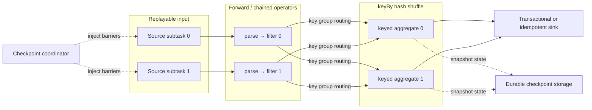
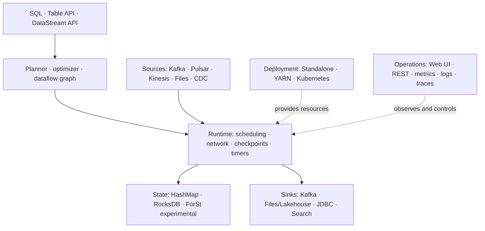
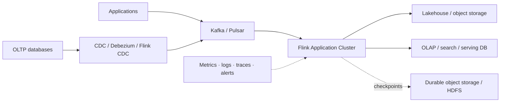

> [!infobox]
>
> ## Apache Flink
>
> ### Meta
>
> | Item     | Value                                  |
> | -------- | -------------------------------------- |
> | Type     | Distributed stream-processing engine   |
> | Core     | Stateful dataflow + time + checkpoints |
> | Input    | Bounded and unbounded streams          |
> | APIs     | SQL, Table API, DataStream API         |
> | Runtime  | JobManager + TaskManager               |
> | Verified | Flink 2.3.0 docs, 2026-07-22           |

## Definition

Apache Flink 是一个面向**有界与无界数据流上的有状态计算**的分布式处理框架和执行引擎。它采用 streaming-first runtime：实时流持续、增量地处理；批数据则被视为有明确结束位置的有界流，并可选择针对批执行优化过的调度与数据交换方式。[^official-architecture][^execution-mode]

> [!summary]
> 一句话心智模型：Flink 把业务逻辑编译成并行数据流图，把状态放在处理它的算子附近，用 watermark 表达事件时间进度，用 checkpoint 将分布式状态与输入位置保存成一致快照。

Flink 适合实时 ETL、流式分析、事件驱动应用、有状态规则计算和有界批任务。它不是消息队列，也不是长期数据仓库；生产系统通常让 Kafka、Pulsar 或文件系统承载输入，让数据库、湖仓或搜索系统承载结果，而 Flink 负责持续计算。

<nav class="gallery-card-view" aria-label="Apache Flink knowledge sections">
  <a class="gallery-card internal" href="#核心知识模型">
    核心知识
    Stream · State · Time · Snapshot
  </a>
  <a class="gallery-card internal" href="#运行时与数据架构">
    数据架构
    Control · Data · State planes
  </a>
  <a class="gallery-card internal" href="#数据流模型">
    数据流模型
    Graph · Parallelism · Exchange
  </a>
  <a class="gallery-card internal" href="#基础技术栈">
    基础栈
    API · Runtime · Deploy · Ecosystem
  </a>
</nav>

## 核心知识模型

理解 Flink 不需要先记算子列表。先掌握五个彼此连接的概念：

| 概念        | 核心问题                 | Flink 的答案                                                              |
| ----------- | ------------------------ | ------------------------------------------------------------------------- |
| Stream      | 数据是否结束？           | 无界流持续到达；有界流有确定终点，二者都用数据流表达                      |
| State       | 跨事件的信息放在哪里？   | Keyed State 与 Operator State 由运行时管理，并与并行算子一起分区          |
| Time        | 乱序事件按什么时间计算？ | Event Time + Watermark 表达业务时间及其进度；Processing Time 使用机器时钟 |
| Parallelism | 计算如何扩展？           | Operator 被拆成并行 subtask，`keyBy` 等分区规则决定记录路由               |
| Snapshot    | 故障后如何恢复？         | Checkpoint 保存输入位置、算子状态及必要的在途数据，失败后回放并恢复       |

### 有界流与无界流

- **Unbounded stream** 有开始但没有预先定义的结束，必须在数据到达时持续处理。
- **Bounded stream** 有确定边界，可以在输入结束后得到最终结果，也可以使用排序、全局聚合和批式 shuffle 等优化。
- “批流统一”指统一的数据流抽象和 API 能力，不代表两种执行模式的物理行为完全相同。`STREAMING` 模式使用 pipelined exchange；`BATCH` 模式可使用 blocking 或 hybrid shuffle。[^execution-mode][^batch-shuffle]

### Stateful computation

无状态算子只依赖当前记录；有状态算子还依赖过去事件留下的信息，例如窗口中的部分聚合、规则匹配进度、去重集合或模型参数。Flink 将状态分为两类：

- **Keyed State**：只能在 keyed stream 上访问；状态与 key 一起分区，使同一 key 的记录和状态被路由到同一个并行实例。
- **Operator State**：绑定到算子的并行实例，常用于 source offsets、缓存或需要在扩缩容时重新分配的局部状态。

Keyed State 的最小重分配单位是 key group。这样 Flink 在改变并行度时可以重新分配状态，而不需要改变业务代码。[^stateful-processing]

### Time, watermark, window

| 时间语义        | 含义                               | 典型用途                                        |
| --------------- | ---------------------------------- | ----------------------------------------------- |
| Event Time      | 事件实际发生时间，通常来自记录字段 | 需要可重放、能解释乱序的业务统计                |
| Processing Time | 算子处理记录时的机器时间           | 更简单、低延迟，但结果受调度和重放时机影响      |
| Watermark       | 对 event-time 进度的估计           | 触发窗口或 timer，并划分 on-time 与 late events |

Watermark 不是“已经收齐所有数据”的证明。它表达的是：系统认为时间戳早于某个位置的事件不应再正常到达；更晚到达的记录需要按允许迟到、更新结果、侧输出或丢弃策略处理。并行输入通常由最慢的活跃输入约束下游 watermark，因此空闲分区和分区间进度差需要显式治理。[^timely-processing][^watermarks]

窗口把无界流切成可计算的有限范围：tumbling window 不重叠，sliding window 可以重叠，session window 由不活跃间隔分隔。Window 会持有状态，因此窗口数量、允许迟到时间和清理策略都会影响状态规模。

## 运行时与数据架构

Flink 集群由一个 JobManager 进程和一个或多个 TaskManager 进程组成。Client 负责准备并提交数据流，但不属于运行时本身。[^runtime-architecture]

### Control plane

| 组件                  | 职责                                            | 关键边界                                     |
| --------------------- | ----------------------------------------------- | -------------------------------------------- |
| Client                | 将应用转换为可提交的数据流图并提交              | 可以 detached，不负责长期执行                |
| Dispatcher            | REST 提交入口、Web UI，为每个作业启动 JobMaster | 位于 JobManager 进程内                       |
| ResourceManager       | 申请、回收并分配 task slots                     | 对接 Standalone、YARN、Kubernetes 等资源环境 |
| JobMaster             | 管理单个 JobGraph 的调度、执行与恢复            | 每个运行中的 job 有自己的 JobMaster          |
| CheckpointCoordinator | 触发 checkpoint、收集确认并管理完成快照         | 属于单个 job 的协调逻辑                      |

### Data plane

TaskManager 是执行 worker。Operator 的并行实例称为 subtask；可链化的相邻 operators 会合并为一个 task，通常由一个线程执行，以减少线程切换、序列化与缓冲开销。Task slot 是资源调度单位：它隔离一部分 managed memory，但**不提供 CPU 隔离**；同一个 job 的不同 task 默认还可以共享 slot。[^runtime-architecture]

TaskManager 之间通过网络交换数据。下游来不及消费时，缓冲区逐渐占满，压力会反向传播到上游，这就是 backpressure。它是流式管道的流量控制机制，也是定位瓶颈的核心信号。

### State plane

需要明确区分 working state、state backend 与 checkpoint storage：

| 层次               | 保存什么                        | 常见实现                                                            |
| ------------------ | ------------------------------- | ------------------------------------------------------------------- |
| Working state      | 作业运行中可读写的当前状态      | TaskManager heap、embedded RocksDB、本地缓存 + remote state         |
| State backend      | 状态的内存/磁盘表示以及快照方式 | HashMapStateBackend、EmbeddedRocksDBStateBackend、ForStStateBackend |
| Checkpoint storage | 已完成快照的持久化位置          | JobManager heap（开发/小状态）、分布式文件系统或对象存储            |

Flink 2.3 文档将 HashMap、EmbeddedRocksDB 和 ForSt 列为 state backend；ForSt 面向解耦状态，将 SST 文件放在远程文件系统，但当前仍标注为 experimental。生产选型不能只看吞吐，还要同时评估状态规模、访问延迟、checkpoint、恢复时间和扩缩容成本。[^state-backends]

## 数据流模型

Flink application 最终被表示为一个有向数据流图：一个或多个 source 产生记录，transformation 形成 operators，结果进入一个或多个 sink。程序构图是 lazy 的，真正执行由 `execute()` 或 SQL 提交触发。[^learn-overview]

### 从逻辑算子到并行执行

1. **Program / SQL** 定义 source、transformation、sink 以及并行度、时间和状态语义。
2. **Logical graph** 描述算子及其依赖，Table/SQL 还会经过优化器。
3. **JobGraph** 是提交给 runtime 的作业图；可链化的 operators 被组合为 tasks。
4. **Parallel subtasks** 在 TaskManager slots 中执行；parallelism 决定一个 operator 的实例数。
5. **Exchange** 决定记录如何到达下游：forward 保持分区对应关系，`keyBy` 按 key hash 重分区，rebalance 均衡重分区，broadcast 发送到所有下游实例。

`keyBy` 的意义不只是 shuffle：它把记录路由与 keyed state 分区对齐，使同一 key 的事件总能访问同一份逻辑状态。重新分区之后，只保证单个发送 subtask 到单个接收 subtask 之间的顺序，不保证不同通道之间的全局顺序。[^learn-overview]

### 数据流中的三类信号

| 信号               | 作用            | 典型处理                                                             |
| ------------------ | --------------- | -------------------------------------------------------------------- |
| Data record        | 业务数据        | map、filter、join、aggregate、process                                |
| Watermark          | event-time 进度 | 触发 event-time timer/window，识别迟到数据                           |
| Checkpoint barrier | 快照边界        | 对齐输入并生成一致状态快照，或在 unaligned checkpoint 中记录在途数据 |

Aligned checkpoint 会在多输入算子等待同一 checkpoint 的 barriers，使快照对应一致的输入边界。严重 backpressure 会拉长 barrier 传播和对齐时间；unaligned checkpoint 将 in-flight buffers 纳入快照，让 barrier 越过积压，但会增加 checkpoint I/O，不能作为所有背压问题的默认解法。[^fault-tolerance][^checkpoint-backpressure]

### Streaming 与 Batch 的物理差异

| 维度          | STREAMING                  | BATCH                                   |
| ------------- | -------------------------- | --------------------------------------- |
| 输入          | 通常无界，也可处理有界输入 | 仅有界输入                              |
| Task 生命周期 | 上下游通常同时运行         | 可以分阶段调度                          |
| Exchange      | Pipelined                  | 默认 blocking，可选 experimental hybrid |
| Event time    | Watermark 是进度启发式     | 输入有界，可形成接近“完整”的最终进度    |
| Recovery      | 周期 checkpoint + replay   | 可利用批任务区域/中间结果重算策略       |

## 状态一致性与容错

Checkpoint 保存的不只是内存数据，还包括可重放 source 的读取位置以及各个有状态 operator 在同一逻辑边界上的状态。故障发生后，Flink 恢复快照、重置 source 位置并重放后续记录。该机制来自异步 barrier snapshot 思路：barrier 随数据流传播，operator 在不停止整个流水线的情况下生成一致快照。[^abs-paper][^state-paper]

### Exactly-once 的准确边界

> [!warning]
> Exactly-once 不等于“每条记录的用户代码物理上只执行一次”。失败恢复时记录可能被重放；Flink 的 exactly-once checkpoint 语义保证每条记录对 **Flink managed state** 的效果与无故障执行一致。

端到端 exactly-once 还要求：

1. source 可重放，并将读取位置纳入 checkpoint；
2. sink 参与 checkpoint，或提供事务/幂等写入；
3. 用户与外部系统的副作用也遵守同一提交协议。

只满足内部状态一致性时，不应宣称整个 Kafka → Flink → database 链路已经 exactly-once。官方 connector guarantee 表也需要按具体 connector 和版本逐项核对。[^fault-tolerance][^connector-guarantees]

### Checkpoint 与 savepoint

| 项目           | Checkpoint           | Savepoint                        |
| -------------- | -------------------- | -------------------------------- |
| 主要目的       | 自动故障恢复         | 有计划的升级、迁移、回滚或扩缩容 |
| 生命周期       | 通常由 Flink 管理    | 由用户触发和管理                 |
| 优化目标       | 频繁、轻量、快速恢复 | 操作灵活性与可移植性             |
| 是否应长期归档 | 通常不应当作备份     | 可作为运维变更的明确恢复点       |

概念上，checkpoint 更像数据库 recovery log，savepoint 更像人为管理的 backup。[^checkpoint-savepoint]

## 基础技术栈

### API layer

| API             | 适合场景                                   | 选择原则                           |
| --------------- | ------------------------------------------ | ---------------------------------- |
| Flink SQL       | 标准关系计算、实时数仓、动态表与 changelog | 优先用于能清晰写成 SQL 的逻辑      |
| Table API       | 在 Java、Scala、Python 中组合关系操作      | 需要类型安全和程序化生成查询       |
| DataStream API  | 自定义事件逻辑、复杂状态、timer、低层控制  | 只有 SQL/Table 难以表达时再下沉    |
| ProcessFunction | 最细粒度的 keyed state、timer 与多流协同   | 能力最强，也最需要控制状态生命周期 |

Table API 和 SQL 共享底层引擎，可以与 DataStream 互相转换。Flink 2.3 中 DataStream API V2 仍是 experimental，尚未完全适合生产；没有明确验证前，生产代码应继续使用稳定 API。[^table-api][^datastream-v2]

### Connectors and formats

Connector 负责与外部系统交换数据，format 负责序列化与反序列化。Flink 社区将大量 connectors 外置到独立仓库，connector 版本和 Flink core 版本不一定同步；依赖加入集群前必须检查兼容矩阵、delivery guarantee 和 shaded dependency。[^connectors][^github]

基础组合通常包括：

- **消息与日志**：Kafka、Pulsar、Kinesis 等可重放 source/sink。
- **文件与湖仓**：FileSystem connector + Parquet/Avro/ORC；需要更新表与 changelog 时结合 [[content/BigData/Data Store/ApachePaimon|Apache Paimon]] 等湖仓存储。
- **数据库变更**：[[FlinkCDC]] 是独立 Apache 项目，适合数据库 snapshot + change log 的流式集成，不等同于 Flink core 内置能力。
- **服务系统**：JDBC、Elasticsearch/OpenSearch 等；必须核对 append/upsert、幂等和事务语义。

### Deployment and operations

Flink 支持 Standalone、YARN 和 Kubernetes 等资源环境，以及两种主要部署模式：

- **Application Mode**：一个 cluster 服务一个 application，隔离更清晰，application 的 `main()` 在集群侧执行。
- **Session Mode**：预先启动的 cluster 接收多个 applications，启动快、资源共享，但故障和资源竞争影响面更大。

生产系统还需要独立设计 HA service、持久 checkpoint storage、日志与 metrics、告警、savepoint 升级流程和 connector secrets。部署方式本身不会自动提供这些能力。[^deployment]

## 最小生产参考架构

这是一个参考边界，不是固定产品清单。落地时至少回答：

1. source 能否从 checkpoint 位置重放，保留期是否覆盖最坏恢复时间？
2. key 是否均匀，最大并行度和未来扩缩容空间是否合理？
3. state backend 与 checkpoint storage 是否分别按访问延迟和持久性选型？
4. sink 是 append、upsert、idempotent 还是 transactional，失败恢复会不会重复副作用？
5. watermark 策略如何处理乱序、idle partition 和迟到数据？
6. checkpoint duration、alignment、backpressure、state size、restart 和 end-to-end lag 是否有监控与告警？
7. 升级是否验证 savepoint 兼容性、operator UID、connector 版本与 schema evolution？

## 常见误区

| 误区                               | 正确认识                                                                        |
| ---------------------------------- | ------------------------------------------------------------------------------- |
| Flink 是消息队列                   | Flink 是计算引擎；输入日志通常由 Kafka/Pulsar 等系统持久化                      |
| Exactly-once 表示代码只运行一次    | 恢复时可能重放；保证首先针对 managed state，端到端还取决于 source/sink          |
| State backend 就是 checkpoint 目录 | Backend 决定工作状态表示与快照方式；checkpoint storage 决定快照持久化位置       |
| Watermark 能消除迟到数据           | Watermark 是进度估计，迟到策略仍需业务定义                                      |
| 一个 slot 等于一个 operator        | 一个 slot 可以承载同一 job 的整段 task pipeline，多个 operators 还可能 chaining |
| Slot 会隔离 CPU                    | Slot 主要隔离 managed memory，不提供 CPU 隔离                                   |
| 批流统一意味着物理执行完全一样     | API/模型统一，但调度、shuffle、time 和 recovery 策略可不同                      |

## Source Map

| Source                                                                                                                            | Type                 | Supports                                                     |
| --------------------------------------------------------------------------------------------------------------------------------- | -------------------- | ------------------------------------------------------------ |
| [Flink Architecture](https://nightlies.apache.org/flink/flink-docs-release-2.3/docs/concepts/flink-architecture/)                 | Official docs        | JobManager、TaskManager、slots、operator chaining            |
| [Concepts Overview](https://nightlies.apache.org/flink/flink-docs-release-2.3/docs/concepts/overview/)                            | Official docs        | API 层级与统一数据流抽象                                     |
| [Learn Flink Overview](https://nightlies.apache.org/flink/flink-docs-release-2.3/docs/learn-flink/overview/)                      | Official docs        | 并行 dataflow、partition、state locality                     |
| [Stateful Stream Processing](https://nightlies.apache.org/flink/flink-docs-release-2.3/docs/concepts/stateful-stream-processing/) | Official docs        | Keyed State、key groups、checkpoint/savepoint                |
| [Timely Stream Processing](https://nightlies.apache.org/flink/flink-docs-release-2.3/docs/concepts/time/)                         | Official docs        | Event Time、watermark、late data、window                     |
| [Fault Tolerance](https://nightlies.apache.org/flink/flink-docs-release-2.3/docs/learn-flink/fault_tolerance/)                    | Official docs        | Snapshot、barrier、exactly-once 边界                         |
| [Deployment Overview](https://nightlies.apache.org/flink/flink-docs-release-2.3/docs/deployment/overview/)                        | Official docs        | Resource providers 与 deployment modes                       |
| [apache/flink](https://github.com/apache/flink)                                                                                   | Official GitHub      | 源码模块、runtime、Table、state、deployment、外置 connectors |
| [Apache Flink: Stream and Batch Processing in a Single Engine](https://dblp.org/rec/journals/debu/CarboneKEMHT15)                 | Research paper, 2015 | 流式优先、pipelined dataflow 与批流统一设计                  |
| [Lightweight Asynchronous Snapshots for Distributed Dataflows](https://arxiv.org/abs/1506.08603)                                  | Research paper, 2015 | Asynchronous Barrier Snapshot 算法                           |
| [State Management in Apache Flink](https://www.vldb.org/pvldb/vol10/p1718-carbone.pdf)                                            | PVLDB paper, 2017    | 一致状态、快照、恢复与外部提交                               |
| [Disaggregated State Management in Apache Flink 2.0](https://www.vldb.org/pvldb/vol18/p4846-mei.pdf)                              | PVLDB paper, 2025    | ForSt、远程状态与异步 state access 的演进                    |

> [!warning]
> 论文解释设计动机和机制，官方 2.3 文档定义当前行为。旧论文中的 DataSet、早期 backend 或部署细节不应直接当作当前产品接口；connector 还需要在自己的发布仓库中再次核对版本。

## Related Notes

- [[0-BigData Map]]：BigData Wiki 的工程能力入口。
- [[FlinkCodebaseArchitecture]]：源码模块、调度器、runtime 与网络栈。
- [[FlinkStateManagement]]：状态与 checkpoint 的专题笔记。
- [[FlinkTableAPIAndSQL]]：动态表、SQL planner 与执行。
- [[FlinkCDC]]：数据库变更捕获和数据同步。
- [[Streaming Processing]]：流处理的通用概念。
- [[content/BigData/Data Store/ApachePaimon|Apache Paimon]]：实时湖仓存储与 changelog。

[^official-architecture]: Apache Flink, [What is Apache Flink? — Architecture](https://flink.apache.org/what-is-flink/flink-architecture/).

[^execution-mode]: Apache Flink 2.3, [Execution Mode (Batch/Streaming)](https://nightlies.apache.org/flink/flink-docs-release-2.3/docs/dev/datastream/execution_mode/).

[^batch-shuffle]: Apache Flink 2.3, [Batch Shuffle](https://nightlies.apache.org/flink/flink-docs-release-2.3/docs/ops/batch/batch_shuffle/).

[^stateful-processing]: Apache Flink 2.3, [Stateful Stream Processing](https://nightlies.apache.org/flink/flink-docs-release-2.3/docs/concepts/stateful-stream-processing/).

[^timely-processing]: Apache Flink 2.3, [Timely Stream Processing](https://nightlies.apache.org/flink/flink-docs-release-2.3/docs/concepts/time/).

[^watermarks]: Apache Flink 2.3, [Generating Watermarks](https://nightlies.apache.org/flink/flink-docs-release-2.3/docs/dev/datastream/event-time/generating_watermarks/).

[^runtime-architecture]: Apache Flink 2.3, [Flink Architecture](https://nightlies.apache.org/flink/flink-docs-release-2.3/docs/concepts/flink-architecture/).

[^state-backends]: Apache Flink 2.3, [State Backends](https://nightlies.apache.org/flink/flink-docs-release-2.3/docs/ops/state/state_backends/).

[^learn-overview]: Apache Flink 2.3, [Learn Flink: Overview](https://nightlies.apache.org/flink/flink-docs-release-2.3/docs/learn-flink/overview/).

[^fault-tolerance]: Apache Flink 2.3, [Fault Tolerance](https://nightlies.apache.org/flink/flink-docs-release-2.3/docs/learn-flink/fault_tolerance/).

[^checkpoint-backpressure]: Apache Flink 2.3, [Checkpointing under backpressure](https://nightlies.apache.org/flink/flink-docs-release-2.3/docs/ops/state/checkpointing_under_backpressure/).

[^abs-paper]: Paris Carbone et al., [Lightweight Asynchronous Snapshots for Distributed Dataflows](https://arxiv.org/abs/1506.08603), 2015.

[^state-paper]: Paris Carbone et al., [State Management in Apache Flink: Consistent Stateful Distributed Stream Processing](https://www.vldb.org/pvldb/vol10/p1718-carbone.pdf), PVLDB 10(12), 2017.

[^connector-guarantees]: Apache Flink 2.3, [Fault Tolerance Guarantees of Data Sources and Sinks](https://nightlies.apache.org/flink/flink-docs-release-2.3/docs/connectors/datastream/guarantees/).

[^checkpoint-savepoint]: Apache Flink 2.3, [Checkpoints vs. Savepoints](https://nightlies.apache.org/flink/flink-docs-release-2.3/docs/ops/state/checkpoints_vs_savepoints/).

[^table-api]: Apache Flink 2.3, [Table API Overview](https://nightlies.apache.org/flink/flink-docs-release-2.3/docs/dev/table/overview/).

[^datastream-v2]: Apache Flink 2.3, [DataStream API V2 Overview](https://nightlies.apache.org/flink/flink-docs-release-2.3/docs/dev/datastream-v2/overview/).

[^connectors]: Apache Flink 2.3, [DataStream Connectors](https://nightlies.apache.org/flink/flink-docs-release-2.3/docs/connectors/datastream/overview/) and [Connectors and Formats](https://nightlies.apache.org/flink/flink-docs-release-2.3/docs/dev/configuration/connector/).

[^github]: Apache Software Foundation, [apache/flink](https://github.com/apache/flink). The repository lists core modules and the externalized connector repositories maintained under Apache.

[^deployment]: Apache Flink 2.3, [Deployment Overview](https://nightlies.apache.org/flink/flink-docs-release-2.3/docs/deployment/overview/).
