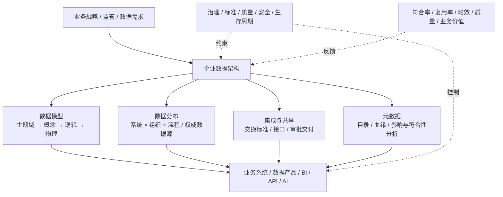
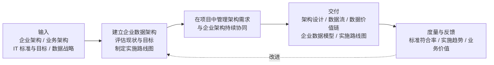

## 一句话定义

> [!box] 
> **数据架构是组织级数据蓝图**：它把业务战略和数据需求转化为统一的数据语义与结构、权威来源与分布、集成共享方式及元数据规范，并通过路线图和项目遵从机制持续演进。

这一定义是对 DCMM 与 DAMA-DMBOK 的综合归纳。它首先回答“组织拥有什么数据、数据代表什么、在哪里、由谁负责、如何流动和使用”，然后才回答“采用什么数据库、湖仓或计算引擎”。

> [!box] 版本口径
> 截至 2026-07-31，现行 DCMM 标准是 **GB/T 36073-2025**：2025-12-31 发布、2026-07-01 实施，并全部代替 GB/T 36073-2018。[^dcmm-current] DAMA 采用 **DAMA-DMBOK2 Revised（第 2 版修订版，2024）** 的公开框架与上下文图。[^dama-context]

## DCMM 与 DAMA：同一对象，两种视角

| 维度         | [[DCMM]]                                           | DAMA-DMBOK                                                   |
| ------------ | ---------------------------------------------- | ------------------------------------------------------------ |
| 性质         | 国家推荐性标准与成熟度评估模型                 | 数据管理知识体系与通用实践框架                               |
| 核心问题     | 能力是否制度化、可度量，当前处于哪一级         | 架构工作为何做、由谁做、怎样做、交付什么                     |
| 数据架构核心 | 数据模型、数据分布、数据集成与共享、元数据管理 | 企业数据架构、现状与目标评估、路线图、项目遵从、企业架构协同 |
| 使用方式     | 评估现状、查缺补漏、形成改进证据               | 统一术语、活动、角色和交付物                                 |

**最简组合方式：DAMA 定义工作方法与交付物，DCMM 检查这些能力是否从“项目局部”进化到“组织级、量化和持续优化”。** DAMA 官方也明确说明 DMBOK 不是强制性标准、技术手册或“一刀切”方案。[^dama-dmbok]

## DCMM：四项能力与五级演进

GB/T 36073-2025 将数据架构置于 9 个能力域、33 个能力项的整体模型中；数据架构域仍由四项能力构成。[^dcmm-draft]

| 能力项             | 核心内容                                                                                                   | 最小交付物                                   |
| ------------------ | ---------------------------------------------------------------------------------------------------------- | -------------------------------------------- |
| **数据模型**([[Data Model]])       | 把业务、管理、决策和监管需求组织为主题域、概念、逻辑和物理模型；维护组织级与系统级模型的映射、变更和符合性 | 企业数据模型、模型规范、模型映射与评审记录   |
| **数据分布**       | 明确数据与系统、组织、流程的关系，识别关键数据、责任人和权威数据源（SOR），优化存储与集成关系              | 数据分布矩阵、数据目录、权威数据源清单       |
| **数据集成与共享** | 建立制度、交换标准、集成共享环境；管理接入、整合、共享申请、审批、交付及新系统遵从                         | 接口/事件清单、数据流、共享流程与服务目录    |
| **元数据管理**     | 统一元模型和元数据标准，持续采集、整合、应用和质检；支撑查询、血缘、影响、符合性与质量分析                 | 元数据仓库、业务词汇表、目录、血缘与影响分析 |

成熟度不是“买了什么平台”，而是能力的组织化程度：

`L1 初始级：项目内、局部` → `L2 受管理级：部门或部分领域` → `L3 稳健级：组织级制度与闭环` → `L4 量化管理级：指标、自动化与智能化` → `L5 优化级：持续创新、标准与行业标杆`

## DAMA：输入—活动—交付—度量闭环

DAMA 将数据管理组织为 11 个知识领域；数据架构与治理、建模、存储、集成、元数据、安全和质量等领域协同，而不是独立的技术孤岛。[^dama-areas] 其公开数据架构上下文图进一步把数据架构描述为一项持续的企业能力，而不是一次性技术设计。[^dama-context]

DAMA 的三项目标可压缩为：

1. 识别数据存储与处理需求；
2. 让产品、服务和数据能够适应业务与技术变化；
3. 设计同时满足当前和长期数据需求的结构与计划。

其核心参与者是企业数据架构师与数据建模师；企业架构师、数据管理员、领域专家和分析师提供输入，开发、DBA、项目与运维团队消费架构成果。架构因此必须同时具备**业务可读性、工程可执行性和变更可追溯性**。

## 可执行的最小闭环

| 顺序 | 必要动作                                     | 可审计证据                         |
| ---- | -------------------------------------------- | ---------------------------------- |
| 1    | 以业务能力/主题域统一术语、实体和边界        | 业务词汇表、主题域图、概念模型     |
| 2    | 建立组织级模型，并映射到系统级逻辑/物理模型  | 模型版本、映射关系、符合性检查     |
| 3    | 盘点数据分布，确认 Owner、SOR、关键/敏感数据 | 数据目录、分布矩阵、责任清单       |
| 4    | 设计数据流、接口、共享审批和服务契约         | DFD/血缘、接口与事件契约、共享记录 |
| 5    | 自动采集元数据、血缘和质量结果               | 元数据事件、运行记录、质量门禁     |
| 6    | 形成基线—目标差距、路线图和量化指标          | 路线图、项目例外、符合率与价值指标 |

**验收原则：**每个业务目标都能追溯到数据需求和架构决策；每个关键数据都能定位语义、Owner、SOR、流向、消费者和控制规则；每次变更都能完成影响分析并留下证据。

## 现代工程映射：不是标准指定的技术栈

NIST 的厂商中立大数据参考架构把提供者、消费者、应用、框架与系统编排角色分开，并把管理、安全和隐私作为横切能力，说明数据架构应描述稳定职责与接口，而不是绑定单一产品。[^nist] Lakehouse 论文则是物理架构的一种候选：以开放数据湖存储统一数仓与高级分析能力；它能实现部分目标，但不等于数据架构本身。[^lakehouse]

| 开源实现                                                      | 可验证的工程机制                                                               | 对应能力                     |
| ------------------------------------------------------------- | ------------------------------------------------------------------------------ | ---------------------------- |
| [OpenMetadata](https://github.com/open-metadata/OpenMetadata) | 统一元数据模型、目录、Owner、词汇表、血缘、质量与治理                          | 数据分布、元数据管理         |
| [OpenLineage](https://github.com/OpenLineage/OpenLineage)     | 以 Run / Job / Dataset 事件采集跨平台运行血缘，规范由 OpenAPI/JSON Schema 定义 | 元数据、数据流与影响分析     |
| [dbt Core](https://github.com/dbt-labs/dbt-core)              | 将系统级转换模型、依赖、文档和测试纳入版本控制                                 | 数据模型、模型依赖与质量证据 |

这些项目只提供**实现机制和证据载体**；工具上线不能替代制度、责任、企业模型、架构评审和成熟度改进。

## 常见偏差

- **把架构等同于技术栈图**：缺少业务语义、Owner、SOR、数据流和路线图。
- **只有模型，没有分布与流转**：实体画得完整，却无法回答数据在哪、谁负责、谁消费。
- **只有目录，没有自动证据**：元数据靠人工填报，无法反映真实系统和变更。
- **只有目标图，没有项目遵从**：架构不进入立项、设计评审、发布门禁和例外管理，最终必然失真。

## 参考依据与证据边界

以下按“国家/组织官方 → 论文/参考架构 → 开源代码”排序。正文均为转述和综合，图为原创归纳，不复刻受版权保护的标准图。

[^dcmm-current]: **[国家标准]** 国家市场监督管理总局、国家标准化管理委员会，[GB/T 36073-2025《数据管理能力成熟度评估模型》](https://openstd.samr.gov.cn/bzgk/std/newGbInfo?hcno=22559F9C7BF9EAC6A3927223FE33CE20)。官方页面给出现行状态、发布日期、实施日期及发布单位；[全国标准信息公共服务平台](https://std.samr.gov.cn/gb/search/gbDetailed?id=473EBB99D6AB455EE06397BE0A0ABB9A)给出其全部代替 2018 版的信息。

[^dcmm-draft]: **[国家标准起草材料]** 国家标准委，[GB/T 36073 修订草案 PDF](https://std.samr.gov.cn/dcpspTools/gbPlan/download?path=%2Fzxd%2F2023002213%2F20_%E6%A0%87%E5%87%86%E8%B5%B7%E8%8D%89%2F20_WD_2023002213_%E6%95%B0%E6%8D%AE%E7%AE%A1%E7%90%86%E8%83%BD%E5%8A%9B%E6%88%90%E7%86%9F%E5%BA%A6%E8%AF%84%E4%BC%B0%E6%A8%A1%E5%9E%8B.pdf)。用于核对能力域、能力项、过程目标与等级演进；正式发布文本优先于起草材料。

[^dama-dmbok]: **[官方框架]** DAMA International, [DAMA-DMBOK](https://dama.org/learning-resources/dama-data-management-body-of-knowledge-dmbok/)。官方说明其定位、适用边界及非强制、厂商中立等特征。

[^dama-areas]: **[官方文章]** DAMA International, [What is Data Management?](https://dama.org/about-dama/what-is-data-management/)。官方说明 DMBOK 的 11 个知识领域，并将数据架构概括为数据采集、存储、集成和使用方式的组织级蓝图。

[^dama-context]: **[官方图例]** DAMA International, [DAMA-DMBOK2 Revised Infographics](https://dama.org/dmbok2r-infographics/) 及其 [Data Architecture Context Diagram](https://growthzonecmsprodeastus.azureedge.net/sites/2326/2025/04/x-13.png)，引用信息为 _DAMA-DMBOK2R, 2nd ed., revised, 2024_。

[^nist]: **[政府参考架构/Paper]** NIST SP 1500-6r1, [NIST Big Data Interoperability Framework: Volume 6, Reference Architecture](https://doi.org/10.6028/NIST.SP.1500-6r1), 2018。

[^lakehouse]: **[同行评审会议论文]** Armbrust et al., [Lakehouse: A New Generation of Open Platforms that Unify Data Warehousing and Advanced Analytics](https://www.cidrdb.org/cidr2021/papers/cidr2021_paper17.pdf), CIDR 2021。
