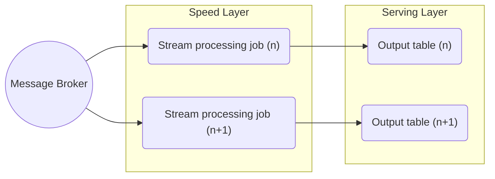

*Kappa architecture is a big data processing pattern that has historically diverged from [[Lambda Architecture|Lambda]]. Its foundation is to treat all arriving data as a stream, therefore it contains no batch layer by design, relying solely on a [[Stream Data Processing|stream processing]] layer ("speed layer").* 

> [!summary] 
>  Kappa 架构本质上是通过改进 Lambda 架构中的加速层(删除了 Batch Layer 的架构,将数据通道以消息队列进行替代)，使它既能够进行实时数据处理，同时也有能力在业务逻辑更新的情况下重新处理以前处理过的历史数据

![[Kappa Architecture.png]]

### Lambda VS Kappa 

| Content    | Lambda                                       | Kappa                                     |
| ---------- | -------------------------------------------- | ----------------------------------------- |
| 复杂度与开发维护成本 | 维护两套系统（引擎），复杂度高，成本高,周期性批处理计算，持续实时计算          | 维护一套系统（引擎），复杂度低，成本低                       |
| 计算开销       | 计算开销大                                        | 必要时进行全量计算                                 |
| 实时性        | 满足实时性                                        | 计算开销相对较小                                  |
| 历史数据处理能力   | 批式全量处理，吞吐量大 历史数据处理能力强 批视图与实时视图存在冲突可能 | 满足实时性 流式全量处理，吞吐量相对较低 历史数据处理能力相对较弱 |
| 业务需求与技术要求  | 依赖 Hadoop、 Spark、Storm 技术                    | 依赖 Flink 计算引擎，偏流式计算                       |
| 复杂度        | 实时处理和离线处理结果可能不一致                             | 频繁修改算法模型参数                                |
| 开发维护成本     | 成本预算充足                                       | 成本预算有限                                    |
| 历史数据处理能力   | 频繁使用海量历史数据                                   | 仅使用小规模数据集                                 |
|            |                                              |                                           |

## Kappa Architecture Advantages

- Only need to maintain, develop and debug a much smaller codebase compared to Lambda architecture.
- Advantageous for use cases that require high data velocity.
## Kappa Architecture Disadvantages

- General challenges related to implementing stream processing at scale.
- Higher data loss risks by design - requires specific data storage and recovery strategies.
## Kappa Architecture Learning Resources

[Questioning the Lambda Architecture – O’Reilly (oreilly.com)](https://www.oreilly.com/radar/questioning-the-lambda-architecture/)

