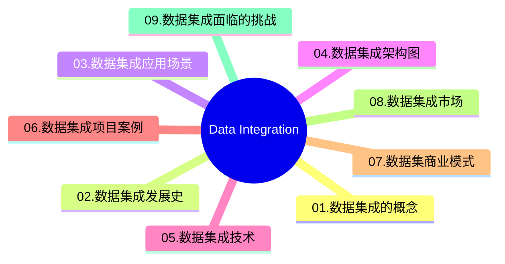

# MindMap

## 01.数据集成的概念

>[!abstract] [DAMA]认为“数据集成旨在将数据整合为物理的或虚拟的一致格式” 

`数据集成` 是指将异构数据源（不同数据库，系统或者是其他第三方数据源）的数据，通过某种方式整合到一起。从而为数据分析或者其他应用提供统一、准确的数据视图

`时延（Latency）` 是指从源生态生成数据到目标系统可用该数据的时间差。不同的数据处理方法会导致不同程度的数据延迟。延迟高 -> 批处理；延迟低 -> 事件驱动或者实时同步

## 02.数据集成发展史

## 03.数据集成应用场景

| 主数据应用       | 实现企业各应用系统之间共享的数据，强调单一数据视图，通过整合多个数据源，形成主数据的单一视图，保证单一视图的准确性、一致性以及完整性，从而提供数据质量。一般统一业务实体的定义，简化改进业务流程并提升业务的响应速度。 |
|-------------|-------------------------------------------------------------------------------------------------------------|
| 大数据迁移上云     | 快速迁移云下数据至云上存储，解决业务数据上云中遇到的技术、成本、人力等问题。上云迁移过程支持全量、增量方式，具备数据源类型丰富、简单易用、安全可靠、轻量灵活等优势。                          |
| 数据入仓入湖/交互分析 | 基于大数据云服务的弹性和按需能力，通过快速连接云下自建/云上数据源进行采集同步、清洗转换、开发分析、治理及建模，帮助用户轻松快速完成数据入仓入湖和业务数据分析，有效实现数据价值最大化。                |
| 数据工程与科学平台构建 | 数据集成提供了开放的技术能力，可与统一调度、元数据管理等技术/产品服务深度融合，为企业数据平台提供可靠技术底座和核心能力支撑，帮助企业搭建先进灵活的平台架构以更好应对快速变化、日益增长的业务数据需求         |

## 04.数据集成架构图

![[Data Integration-2.png]]

- 批处理：定时调度，周期调度，针对数据量大的，要求非实时性的。如：“T+1” 今天处理昨天的数据
- 准实时：处理时间极短，毫秒级
- 实时：来一条处理一条，时间极低
- 流数据：手机短视频播放
- 增量同步：数据增量捕获 [[CDC（Change Data Capture）]]
- 物理集成 & 虚拟集成
- [[ETL & ELT]]
- Push & Pull & Publish/Subscribe
- [[MQ（Message Queue）]] & API

## 05.数据集成技术

### 数据集成方式

> [!note] 根据业务流程，数据环境，数据格式，确定数据需求，并考虑相关的安全性、合规性、可扩展性等因素再选择合适的集成方式

| 数据集成场景    | 数据集成类型 | 数据集成类型                                          |
|-----------|--------|-------------------------------------------------|
| ETL & ELT | 下游集成   | 基于物化或是 ETL 方法的引擎(Materialization or ETL engine) |
| 实时数据集成    | 中游集成   | 基于联邦数据库或中间件方法的引擎(Federation engine or Mediator) |
| 云数据集成     | 上游集成   | 基于数据流方法的引擎(Stream engine)                       |
| 大数据集成     |        | 基于搜索引擎的方法(Search engine)                        |
### 数据集成技术 - 数据库结构化数据

| 方案    | Datax | Canal | Debezium | FlinkCDC | ChunJun | Sqoop |
| ----- | ----- | ----- | -------- | -------- | ------- | ----- |
| 采集机制  | 查询    | 日志    | 日志       | 日志       | 查询      | 查询    |
| 增量同步  | ❌     | ✅     | ✅        | ✅        | ✅       | ❌     |
| 断点续传  | ❌     | ✅     | ✅        | ✅        | ✅       | ❌     |
| 全量同步  | ✅     | ❌     | ❌        | ❌        | ✅       | ✅     |
| 全量+增量 | ✅     | ❌     | ❌        | ✅        | ✅       | ✅     |

### 数据集成技术 - 文件采集

| 技术               | 架构                                               | 特点                                                     |
| ---------------- | ------------------------------------------------ | ------------------------------------------------------ |
| [[content/Apache Hadoop/Apache Flume]] | 由source， channel、 sink组成。多个Agent可以组成调用链          | 支持一个Agent中有多个不同类型的channel和sink，可以选择把Source的数据分发给不同的目的地 |
| LogStash         | 包含input、 Filter、 output组成                        | 灵活性高，支持很多插件                                            |
| Fluentd          | 包含Input. Parser、 Output、match、 Formatter、 Buffer | fluentd设计简洁，pipeline内数据传递可靠性高。                         |
| Filebeta         | prospector和 harvesters                           | 没有任何依赖，古用资源极少，可靠性高                                     |
| logtail          | 阿里云日志服务的生产者，为阿里公有云用户提供日志收集服务                     | 采用C++语言实现，对稳定性、资源控制、管理等下过很大的功夫，性能良好                    |

### 数据集成技术 - 消息队列

| 比较项      | [[Apache Kafka]]                              | TubeMQ                             | [[Apache Pulsar]]    |
|----------|-----------------------------------------------|------------------------------------|----------------------|
| 数据时延     | 非用1，1oms                                      | 比较低，250ms                          | 非常低，10ms             |
| TPS      | 高，14W+/s                                      | 一般，10W+/s                          | 高，14W+/s（高性能场景）      |
| 过滤消费     | 支持服务端过滤和客户端过滤                                 | 客户端过滤                              | 客户端过滤                |
| 数据副本同步策略 | 无，通过RAID10磁盘备份•低时延消费解决                        | 多机异步备份                             | 多机异步备份（高性能场景）        |
| 数据可靠性    | 一般（单机磁盘故障未消费数据存在丢失风险）                         | 一般（主机磁盘故障未同步的                      | 高                    |
| 系统稳定性    | 一般，只提供Java和C++的Lib存在丢失风险）                     | 数据存在丢失风险）                          | 一般，高压下存在性能下降、服务受阻等情况 |
| 配置可管理性   | 高，已线上运营近7年，每天33万亿的数据量，已做到单集群400台Broker的线上运营规模 | 一般，性能随Topic数增多出现不稳定情况，没有超大数据运营规模场景 | 一般，基于zk配置管理，API或页面操作 |
| 易用性      | 一般，热备存储，中心化管理，API或页面操作                        | 一般，基于zk配置管理，API或页面操作               | 高，有很多配套插件使用          |
|          |                                               |                                    |                      |

## 06.数据集成项目案例

- 全链路数据中台
- 离线数仓与数据同步
- 离线数据开发与调度
- 元数据、数据资产管理与治理

## 07.数据集商业模式

![[Data Integration 05.png]]

## 08.数据集成市场（产品）

| 国内市场                 | 国外市场                                     | 开源                          |
| -------------------- | ---------------------------------------- | --------------------------- |
| 阿里云 Data Integration | Google Data Fusion                       | [[Apache Inlong]]           |
| 腾讯云 DataInLong       | [AWS Glue](https://aws.amazon.com/glue/) | Apache Seatunnal            |
| 华为云 ROMA             | DBT                                      | Apache Gobblin              |
| DataPipeline         | Azure Data-Factory                       | DataX                       |
| Kettle               | Airbyte                                  | [[Flink CDC]]               |
|                      | Fivetran                                 | [[FlinkX （chunjun）]]        |
|                      |                                          | [[Apache Nifi]]             |
|                      |                                          |                              |
|                      |                                          |                             |

## 09.数据集成面临的挑战

>[!summary] 数据集成的价值：消除企业信息孤岛，实现数据集中共享，进而实现数据治理和数据应用的重要手段

| 成本和实效                  | 数据链路管理                      | 数据质量                            |
| ---------------------- | --------------------------- | ------------------------------- |
| 海量数据多 目标存储 时效性要求 | 数据源兼容 任务隔离容错 数据对账  | 异构数据源 丰富的数据格式 多阶段数据链路  |

## 10. 数据集成和数据迁移的区别

***
## Reference

- [Top 5 reasons to modernize your data integration](https://www.ibm.com/downloads/cas/QAZGP2PA) By IBM
- [DataFun](https://www.datafuntalk.com/) 

