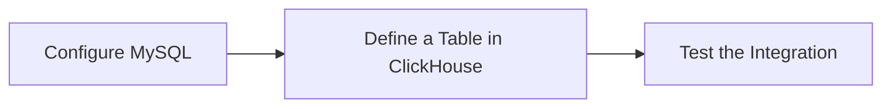

---
aliases:
  - clickhouse
tags:
  - data-warehouse
  - database
  - olap
  - data-store
date: 2022-03-11
draft:
---
![[content/Data Store/image/ClickHouse-1.png]]
## What‘s ClickHouse?

> ClickHouse® is a `high-performance`, `column-oriented` SQL database management system (DBMS) for online analytical processing (OLAP). It is available as both an [open-source software](https://github.com/ClickHouse/ClickHouse) and a [cloud offering](https://clickhouse.com/cloud).

[[ClickHouse]]是一个高性能，面向列的SQL数据库管理系统（[[DBMS]]），用于在线分析处理[[OLAP]]

### Key Characteristics

- `column-oriented` SQL database 

### R & W

![[content/Data Store/image/ck-sync.png]]


## Quick Start

```sh
curl https://clickhouse.com/ | sh
```

### Create Database

```mysql
CREATE DATABASE IF NOT EXISTS helloworld
```
### Create Table

```mysql
CREATE TABLE helloworld.my_first_table
(
    user_id UInt32,
    message String,
    timestamp DateTime,
    metric Float32
)
ENGINE = MergeTree()
PRIMARY KEY (user_id, timestamp)
```

### Insert

```mysql
INSERT INTO helloworld.my_first_table (user_id, message, timestamp, metric) VALUES
    (101, 'Hello, ClickHouse!',                                 now(),       -1.0    ),
    (102, 'Insert a lot of rows per batch',                     yesterday(), 1.41421 ),
    (102, 'Sort your data based on your commonly-used queries', today(),     2.718   ),
    (101, 'Granules are the smallest chunks of data read',      now() + 5,   3.14159 )
```

### Query

```mysql
SELECT *
FROM helloworld.my_first_table
ORDER BY timestamp
```

### Updating and Deleting ClickHouse Data

```mysql
ALTER TABLE [<database>.]<table> UPDATE <column> = <expression> WHERE <filter_expr>
```

```sql
ALTER TABLE website.clicks
UPDATE visitor_id = getDict('visitors', 'new_visitor_id', visitor_id)
WHERE visit_date < '2022-01-01'
```

> [!note] 
> ALTER TABLE [db.]table [ON CLUSTER cluster] DELETE WHERE filter_expr
> 
### Sync Delele Status

```sql
SELECT
	database,
	table,
	command,
	is_done,
	create_time,
	now() - create_time as running_time
	FROM system.mutations
WHERE database = '${database_name}' AND table = '${table_name}';
```

## Integrating MySQL with ClickHouse

> [!obsidian] The [[MySQL]] table engine allows you to connect ClickHouse to MySQL. **SELECT** and **INSERT** statements can be made in either ClickHouse or in the MySQL table. This article illustrates the basic methods of how to use the `MySQL` table engine.




## Reference

- [Fast Open-Source OLAP DBMS - ClickHouse](https://clickhouse.com/?country=en)
- [ClickHouse Playground](https://sql.clickhouse.com/)
	![[content/Data Store/image/ClickHouse.png|Code]]

- [CryptoHouse](https://crypto.clickhouse.com/)
