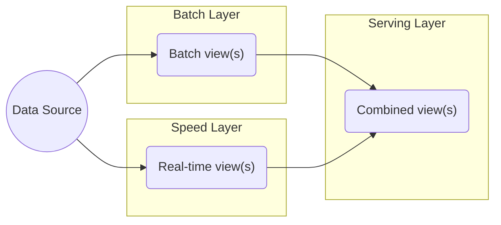

### 数据架构的定义

#### DAMA观点

定义：识别企业的数据需求（无论数据结构如何），并设计和维护总监图已满足这些数据需求；使用总蓝图来指导数据集成、控制数据资产，并使数据资产与业务战略保持一致。

[[DAMA]] 的数据架构主要包括企业 **数据模型** 和 **数据流的设计**（也称数据价值链的设计）

#### DCMM 观点

[[DCMM]] 的数据架构包括

- 数据模型
- 数据架构（[[Data Architecture]]）
- 数据分布
- 数据集成与共享（[[01 Data Integration Homepage|Data Integration]]）
- 元数据管理
- 数据标准 
- 数据模型 
- 数据生存周期（[[Data Lifecycle]]）

#### 建设方法论

架构现状分析、架构实体分、数据主题域划分、数据概念模型及数据分布规划

#### 数据架构类型

- 集中式数据架构
- 分布式数据架构

#### 数据架构框架

- DAMA-DMBOK（数据管理知识体系）框架概述了整个生命周期内有效数据管理的最佳实践、原则和流程
- Zachman 框架

## 传统数据处理系统的问题

传统应用的数据系统架构设计时，应用直接访问数据库系统。当用户访问量增加时，数据库无法支撑日益增长的用户请求的负载，从而导致数据库服务器无法及时响应用户请求，出现超时的错误。关于这个问题的常用解决方法如下： 

- 增加异步处理队列，通过工作处理层批量处理异步处理队列中的数据修改请求
- 建立数据库水平分区，通常建立 Key 分区，以主键/唯一键 Hash 值作为 Key
- 建立数据库分片或重新分片，通常专门编写脚本来自动完成，且要进行充分测试
- 引入读写分离技术，主数据库处理写请求，通过复制机制分发至从数据库
- 引入分库分表技术，按照业务上下文边界拆分数据组织结构，拆分单数据库压力

### 大数据的特点 

大数据具有体量大、时效性强的特点，并非构造单调，而是类型多样；处理大数据时，传统数据处理系统因数据过载，来源复杂，类型多样等诸多原因性能低下，需要采用以新式计算架构和智能算法为代表的新技术；大数据的应用重在发掘数据间的相关性，而非传统逻辑上的因果关系；因此，大数据的目的和价值就在于发现新的知识，洞悉并进行科学决策。现代大数据处理技术，主要分为以下几种： 

- 基于分布式文件系统 [[Apache Hadoop|Hadoop]] 
- 使用 map 或 [[Apache Spark|Spark]] 数据处理技术
- 使用 [[Apache Kafka|Kafka]] 数据传输消息队列及二进制格式

## 典型的大数据架构 

### [[Lambda Architecture]]

### [[Kappa Architecture]]

### [[Data Lake]]

### [[01 Data Store Homepage|Data Store]]

### 数据架构的评估

[Data Architecture](https://en.wikipedia.org/wiki/Data_architecture) describes how data is processed, stored, and utilized in an [information system](https://en.wikipedia.org/wiki/Information_system "Information system").

## Data Architecture Examples

- [AWS Reference Architecture Examples](https://aws.amazon.com/architecture/reference-architecture-diagrams/)
- [Azure Architecture Examples](https://learn.microsoft.com/en-us/azure/architecture/browse/)
- [GCP Architecture Center](https://cloud.google.com/architecture)

***
## Reference

- [深入理解大数据架构之——Lambda架构](https://www.cnblogs.com/cciejh/p/lambda-architecture.html)
- [Lambda架构：一个用于亿级实时数据分析的架构](https://www.duidaima.com/Group/Topic/ArchitecturedDesign/14319)
- [Questioning the Lambda Architecture – O’Reilly](https://www.oreilly.com/radar/questioning-the-lambda-architecture/)
- [aws](https://aws.amazon.com/cn/what-is/data-architecture/) what's architecture?
- [企业架构设计方法与实践](https://tonydeng.github.io/EA-practices/tech-arch/index.html)