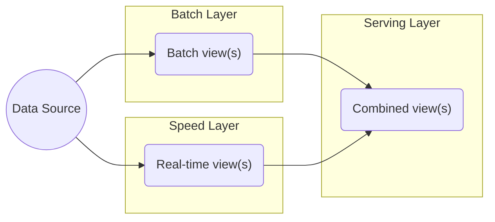

> Lambda架构（Lambda Architecture） 是由Twitter工程师南森•马茨 （Nathan Marz）提出的大数据处理架构

*Lambda architecture is a data processing pattern designed to strike a balance between low latency, high throughput, and fault tolerance. This architecture type uses a combination of batch processing to create accurate views of large data sets and real-time stream processing to provide views of live data. The results from both sets can then be merged and presented together.*

Lambda 总共由三层系统组成：批处理层（Batch Layer）， 速度处理层（Speed Layer），以及用于响应查询的 服务层（Serving Layer），是一种用于同时处理离线和实时数据的、可容错的、可扩展的分布式系统，如图所示

- 批处理层：该层核心功能是存储主数据集，主数据集数据具有原始、不可变、真实的特征。批处理层周期性地将增量数据转储至主数据集，并在主数据集上执行批处理，生成批视图。架构实现方面可以使用 [[HDFS]] 或 [[Apache HBase|Hbase]] 存储主数据集，再利用 [[What is Apache Spark?|Spark]] 或 [[MapReduce]] 执行周期批处理，之后使用 MapReduce 创建批视图

- 加速层：该层的核心功能是处理增量实时数据，生成实时视图，快速执行即席查询。架构实现方面可以使用 [[HDFS]] 或 [[Apache HBase|Hbase]] 存储实时数据，利用 [[What is Apache Spark?|Spark]] 或 [[Apache Storm]] 实现实时数据处理和实时视图。

- 服务层：该层的核心功能是响应用户请求，合并批视图和实时视图中的结果数据集得到最终数据集。具体来说就是接收用户请求，通过索引加速访问批视图，直接访问实时视图，然后合并两个视图的结果数据集生成最终数据集，响应用户请求。架构实现方面可以使用 HBase Cassandra 作为服务层，通过 Hive 创建可查询的视图

#### Lambda 架构优缺点 

- Lambda 架构的优点：对硬件故障和人为失误有很好的容错性，查询灵活度高，弹性伸缩，易于扩展
- Lambda 架构的缺点：编码量大，持续处理成本高，重新部署和迁移成本高。 与 Lambda 架构相似的模式有事件溯源模式、命令查询职责分离模式

### Lambda 在Twitter

> [!info] 
> 与 Lambda 架构相似的模式有事件溯源模式、命令查询职责分离模式
![[lambda-twitter.png]]

## Lambda Architecture Learning Resources

- http://nathanmarz.com/blog/how-to-beat-the-cap-theorem.html
- http://radar.oreilly.com/2014/07/questioning-the-lambda-architecture.html

