> [!infobox]
>
> ## AI Agent
>
> ### Meta
>
> | Item | Value |
> | --- | --- |
> | 核心论文 | ReAct · Reflexion · CoALA |
> | 核心指南 | Anthropic · OpenAI |
> | 关键协议 | MCP (2024.11) |

## Definition

Anthropic 在《Building Effective Agents》[^src-anthropic]中给出业界引用最广的区分：

- **Workflow（工作流）**：LLM 和工具按**预先写好的代码路径**编排，路径由开发者决定。
- **Agent（智能体）**：**LLM 在运行时自主决定**执行过程和工具使用，自己掌控如何完成任务。

[^src-anthropic]: Anthropic, [Building Effective Agents](https://www.anthropic.com/research/building-effective-agents), 2024-12。该文另一个核心结论：成功的实现靠简单、可组合的模式，而不是复杂框架。

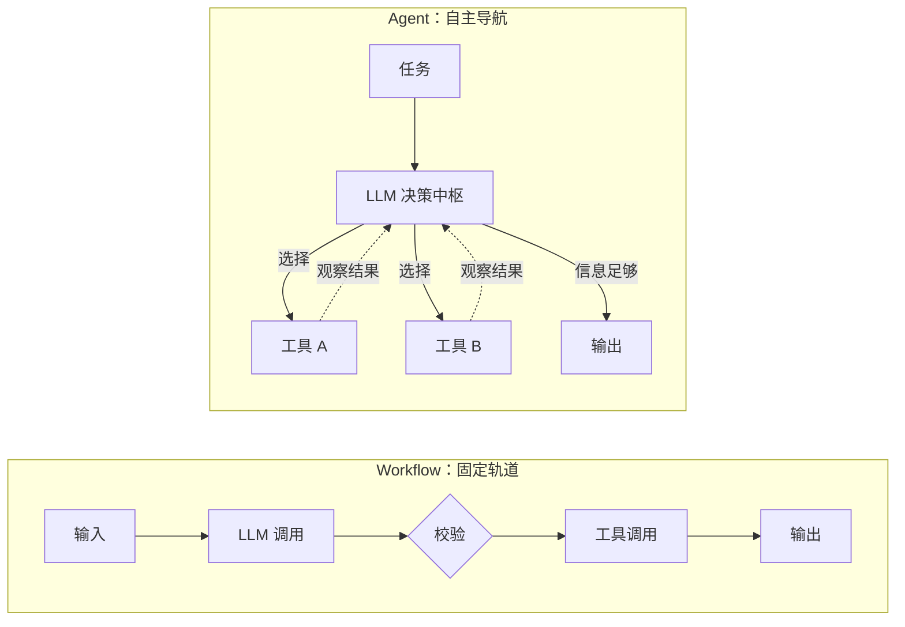

> [!info] 类比：地铁 vs 出租车
> Workflow 像地铁——轨道固定、准点可靠、票价便宜，适合固定通勤路线；Agent 像出租车——司机（LLM）根据路况实时决定怎么走，能去地铁到不了的地方，但更贵、也可能绕路。**能坐地铁就别打车**：从最简单的方案开始，只有确实需要时才引入 Agent 的复杂度。

## Why It Matters

单次问答的 LLM 只是"能动嘴的顾问"。接上工具、记忆和规划循环后，它才变成"能干活的员工"——能查资料、写代码、操作系统、自我纠错。2022–2023 年论文解决"会不会"，2024 年解决"接得上"（标准化接口与设计模式），2025–2026 年解决"用得好"（上下文工程、记忆、评估与治理）。

## Architecture：四大组件

Lilian Weng 的经典框架[^src-weng]：Agent = **LLM（大脑）+ 规划 + 记忆 + 工具**。后续几乎所有框架都是这个骨架的工程化。

[^src-weng]: Lilian Weng, [LLM Powered Autonomous Agents](https://lilianweng.github.io/posts/2023-06-23-agent/), 2023-06。

![[agent-four-components.svg|center]]
Agent 四大组件：规划指导决策，记忆双向读写，工具执行后将结果反馈回 LLM 决策中枢。

> [!info] 类比：一位新入职的员工
> LLM 是他的大脑；**规划**是把"做季度报告"拆成查数据、写初稿、校对的待办清单；**记忆**分两层——脑子里正在想的事（短期）和随手记的工作笔记（长期）；**工具**是他的电脑、Excel 和内部系统。

## Core Loop：ReAct

ReAct（Reasoning + Acting）[^src-react]让模型交替进行"思考 → 行动 → 观察"，是今天绝大多数 Agent 框架内核的循环。

[^src-react]: Yao et al., [ReAct: Synergizing Reasoning and Acting in Language Models](https://arxiv.org/abs/2210.03629), ICLR 2023。

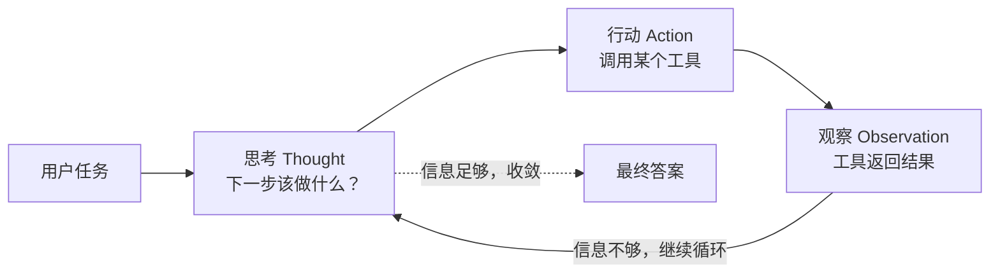

> [!info] 类比：侦探破案
> 侦探不会看一眼现场就宣布凶手（那是一次性问答），而是：推理（谁有嫌疑）→ 行动（查不在场证明）→ 观察（证词对不上）→ 再推理，循环推进直到真相水落石出。

> [!tip] 延伸：Reflexion
> Reflexion[^src-reflexion] 在循环外再加一层"复盘"：任务失败后用**语言写下反思**存入记忆，下次执行前先读反思——用语言化的自我批评替代传统强化学习的梯度更新。类比：办砸案子后写复盘日记，下次先翻日记。

[^src-reflexion]: Shinn et al., [Reflexion: Language Agents with Verbal Reinforcement Learning](https://arxiv.org/abs/2303.11366), NeurIPS 2023。

## 五大 Workflow 模式

《Building Effective Agents》总结了五种可组合模式。

### ① 提示链 Prompt Chaining

任务步骤固定时使用。类比：**流水线**，每道工序质检后交给下一道。

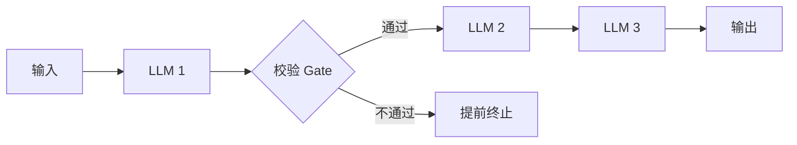

### ② 路由 Routing

输入类型多样时使用。类比：**医院分诊台**，按症状分给专科医生。

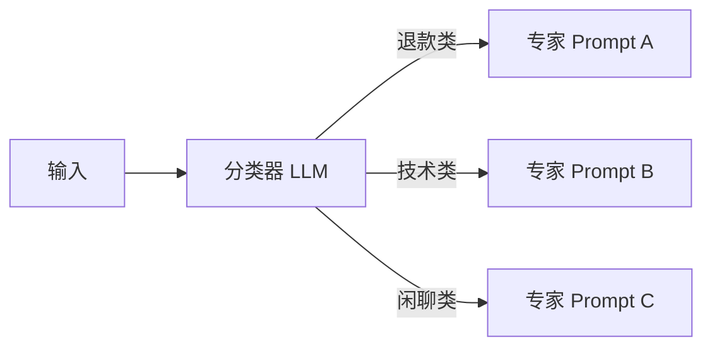

### ③ 并行化 Parallelization

子任务独立（分段 Sectioning）或需要多数表决（投票 Voting）时使用。类比：**多位阅卷老师**同时打分再汇总。

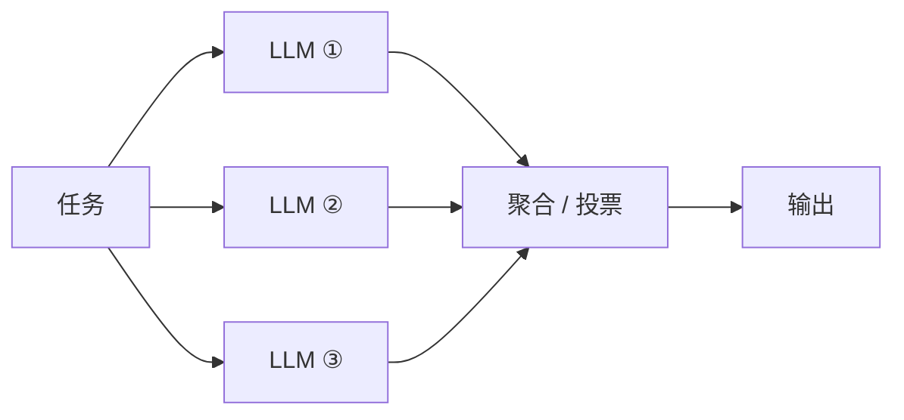

### ④ 编排者-执行者 Orchestrator-Workers

子任务**无法预知、需要动态拆解**时使用。类比：**装修包工头**，看完现场才决定叫几个水电工。

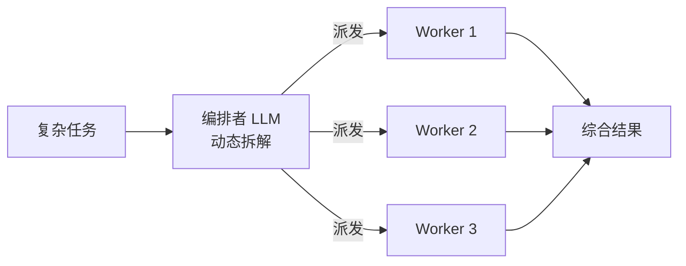

### ⑤ 评估-优化 Evaluator-Optimizer

有明确评价标准、值得迭代打磨时使用。类比：**作家写稿、编辑退稿**，循环到过关。

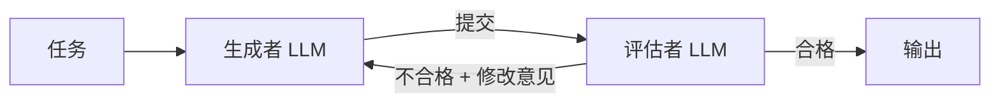

> [!tip] 选型口诀
> 步骤固定 → 提示链；输入多样 → 路由；子任务独立/需投票 → 并行化；子任务不可预知 → 编排者-执行者；有明确好坏标准 → 评估-优化；开放式、步数不可预测且能容错 → 才用真正的 Agent。

## Memory 与 Context Engineering

上下文窗口有限，且"注意力预算"随长度递减。2025 年后业界从 Prompt Engineering 转向 **Context Engineering**[^src-ctx]：在每一步只把"恰好需要的信息"放进窗口。CoALA[^src-coala] 借认知科学把 Agent 记忆分为四类。

[^src-ctx]: Anthropic, [Effective context engineering for AI agents](https://www.anthropic.com/engineering/effective-context-engineering-for-ai-agents), 2025。

[^src-coala]: Sumers et al., [Cognitive Architectures for Language Agents (CoALA)](https://arxiv.org/abs/2309.02427), TMLR 2024。

> [!column|2 clean]
>
> > [!note] 工作记忆 Working
> >
> > 当前上下文窗口里的内容，相当于"正摊在办公桌上的文件"。
>
> > [!note] 情景记忆 Episodic
> >
> > 过往交互与经历的记录："上次和这个客户聊了什么"。

> [!column|2 clean]
>
> > [!note] 语义记忆 Semantic
> >
> > 事实与知识，常存于向量库，用 RAG 按需检索。
>
> > [!note] 程序记忆 Procedural
> >
> > 技能与规则：系统提示词、代码、Skill 文件——"怎么做事"。

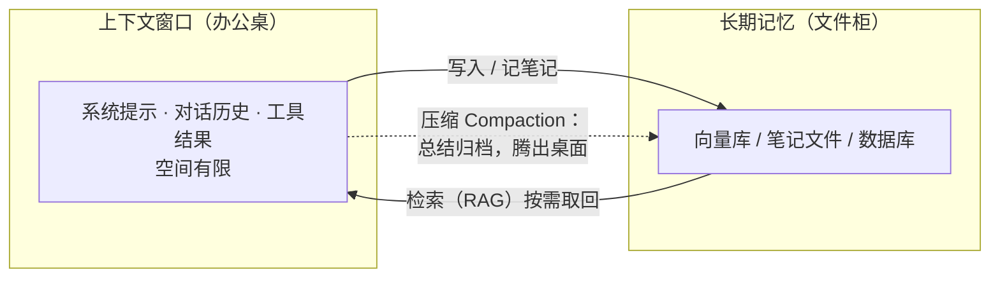

> [!info] 类比：办公桌与文件柜
> 桌面（上下文窗口）再大也摆不下所有档案。高效员工把常用文件放桌上，其余归档进文件柜（长期记忆），需要时让秘书按索引取回（RAG），桌子快满时把处理完的材料写摘要归档（Compaction）。Agent 记忆系统做的就是这套桌面管理。

## Tools 与 MCP

Agent 通过 Function Calling 使用工具：模型输出结构化调用请求，宿主程序执行后把结果喂回。问题是每接一个外部系统都要写一次胶水代码。Anthropic 于 2024 年 11 月开源 **MCP（Model Context Protocol）**[^src-mcp]，把"模型 ↔ 外部世界"的接口标准化，此后被 OpenAI、Google 等生态采纳，成为事实标准。

[^src-mcp]: [Model Context Protocol](https://modelcontextprotocol.io)，Anthropic 开源，2024-11。Server 通过 Tools / Resources / Prompts 三类原语暴露能力。

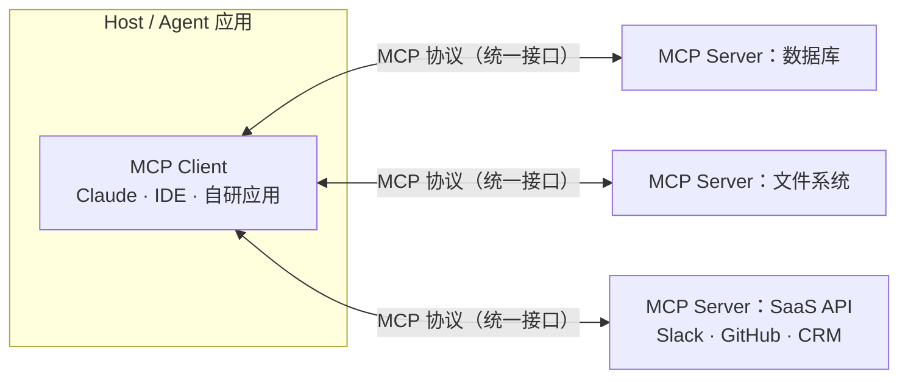

> [!info] 类比：USB-C 接口
> MCP 出现前，接每个外设都要配专用线：M 个模型 × N 个工具 = M×N 条集成。MCP 统一成 USB-C——工具厂商只实现一次 Server，任何支持 MCP 的应用即插即用，M×N 变成 M+N。

## Multi-Agent：什么时候需要一个团队

单个 Agent 的上下文和注意力有限。Anthropic 的多 Agent 研究系统[^src-multi]实测：主管拆解 → 子 Agent 并行检索 → 汇总，在内部研究评测上比单 Agent 提升约 90%，代价是 token 消耗约为普通对话的 15 倍——**团队更强，也更烧钱**。

[^src-multi]: Anthropic, [How we built our multi-agent research system](https://www.anthropic.com/engineering/multi-agent-research-system), 2025-06。

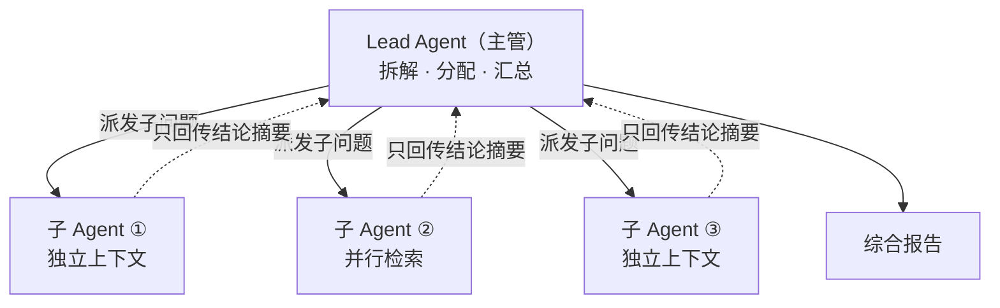

> [!info] 类比：咨询公司项目组
> 合伙人（Lead Agent）把客户问题拆成几个调研方向，分析师们（子 Agent）各带一块并行开工、互不打扰（独立上下文），最后只交结论摘要给合伙人整合——而不是把全部草稿堆到合伙人桌上（避免撑爆上下文）。

开源框架的不同"组队哲学"：**AutoGen** 让 Agent 像开会一样对话协作；**CrewAI** 按"角色 + 任务"组队；**MetaGPT** 直接模拟一家软件公司的岗位分工（产品经理 → 架构师 → 工程师）。

## Framework 选型（2026）

| 框架 / SDK | 核心范式 | 适合场景 |
| --- | --- | --- |
| [LangGraph](https://github.com/langchain-ai/langgraph) | 状态图：节点=步骤，边=流转与分支 | 需要精确控制、审计与回滚的企业级流程 |
| [AutoGen](https://github.com/microsoft/autogen)（Microsoft） | 事件驱动多 Agent 对话，1.0 GA（2026-02） | 多 Agent 协作研究与企业系统 |
| [CrewAI](https://github.com/crewAIInc/crewAI) | 角色扮演：定角色、目标、工具 | 快速原型，上手最快 |
| [Dify](https://github.com/langgenius/dify) | 低代码可视化编排（~14 万 star） | 非重度开发团队搭建 LLM 应用 |
| OpenAI Agents SDK / Claude Agent SDK | 官方轻量级：循环 + 工具 + 交接 | 贴近模型原生能力、依赖少的生产应用 |

> [!warning] Anthropic 与 OpenAI 的一致建议
> 先用**裸 API + 简单模式**把任务跑通，理解每一层抽象再上框架。框架方便起步，但会隐藏真实的 prompt 与响应，让调试变难，也诱使人堆不必要的复杂度。

> [!info] 类比：做饭
> 裸 API 是自己买菜下厨（完全可控）；官方 SDK 是净菜包（省事但仍是自己炒）；LangGraph/AutoGen 是请帮厨团队（能办大宴席，但要学会管理）；Dify 是自助配餐（最快，菜单之外做不了）。宴请规模决定用哪种，别为一碗面雇一个厨师团。

## Timeline

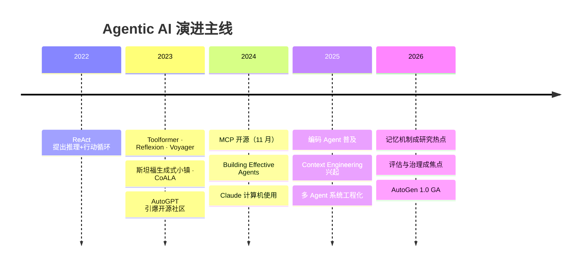

一条主线：**2022–2023 解决"会不会"**（推理与工具使用范式），**2024 解决"接得上"**（标准化接口与设计模式），**2025–2026 解决"用得好"**（上下文工程、记忆、评估、安全治理）。

## Evaluation 与 Guardrails

> [!column|2 clean]
>
> > [!success] 评估 Evaluation
> >
> > **结果评估**：任务最终完成了吗——SWE-bench 看测试是否通过、GAIA 看答案对错、OSWorld 看电脑操作是否达成。
> >
> > **轨迹评估**：过程合理吗——工具选得对不对、有没有绕远路、成本多少。
>
> > [!danger] 护栏 Guardrails
> >
> > **最小权限**：只给完成任务所需的工具与数据。
> >
> > **人类审批**：付款、删库、发邮件等高风险动作必须 human-in-the-loop。
> >
> > **沙箱执行** + 防 **Prompt Injection**：警惕工具返回内容中夹带的恶意指令。

> [!info] 类比：新员工的试用期
> 考核不只看"报告交没交"（结果评估），也看"过程专不专业"（轨迹评估）；权限逐步放开——第一周只读，表现稳定才给审批权；同时教他别轻信陌生来电的"老板转账指令"（Prompt Injection 防护）。

## Common Pitfalls

- 一上来就上 Agent：多数场景一个提示链或路由就够了。
- 框架先行：没理解裸 API 循环就叠框架抽象，出问题无从调试。
- 上下文当垃圾桶：什么都塞进窗口，模型反而"翻不到重点"。
- 无护栏放权：给 Agent 生产库写权限而没有审批环节。
- 只测结果不测轨迹：结果碰巧对了，过程里工具乱调、成本失控。

## References

1. Anthropic, [Building Effective Agents](https://www.anthropic.com/research/building-effective-agents), 2024-12
2. Anthropic, [How we built our multi-agent research system](https://www.anthropic.com/engineering/multi-agent-research-system), 2025-06
3. Anthropic, [Effective context engineering for AI agents](https://www.anthropic.com/engineering/effective-context-engineering-for-ai-agents), 2025
4. OpenAI, [A Practical Guide to Building Agents](https://cdn.openai.com/business-guides-and-resources/a-practical-guide-to-building-agents.pdf), 2025
5. Yao et al., [ReAct](https://arxiv.org/abs/2210.03629), ICLR 2023
6. Shinn et al., [Reflexion](https://arxiv.org/abs/2303.11366), NeurIPS 2023
7. Sumers et al., [CoALA](https://arxiv.org/abs/2309.02427), TMLR 2024
8. Lilian Weng, [LLM Powered Autonomous Agents](https://lilianweng.github.io/posts/2023-06-23-agent/), 2023-06
9. [Model Context Protocol](https://modelcontextprotocol.io), 2024-11
10. GitHub: [LangGraph](https://github.com/langchain-ai/langgraph) · [AutoGen](https://github.com/microsoft/autogen) · [CrewAI](https://github.com/crewAIInc/crewAI) · [Dify](https://github.com/langgenius/dify) · [MetaGPT](https://github.com/FoundationAgents/MetaGPT) · [awesome-ai-agent-papers](https://github.com/VoltAgent/awesome-ai-agent-papers)

> [!box]
> 框架 star 数与下载量为 2026 年中的近似值，随时间变化；论文结论以原文为准。

## Links

- related:: [[MOC-DATA+AI Agent 地图]]
- related:: [[QuartzStyleGuide]]
