> [!note] DCMM 能力项 / Capability Item
> 关联能力域 [[Data Standard]]（指标数据 [[Indicator Data]]）、[[Data Architecture]]（数据模型 [[Data Model]]）。

A data indicator system (数据指标体系) is the **single source of truth** for how an organization measures its business. Without it, the same metric — say "GMV" — yields three different numbers on three different dashboards, and executive trust in data collapses.

This article presents a **complete technical blueprint**: methodology, four-step construction framework, platform architecture, data models, workflow orchestration, and governance — grounded in e-commerce practice.

---

## 1 Methodology: OSM × UJM Cross-Matrix

Two complementary frameworks, intersected into one matrix, produce a metric framework that is both **goal-aligned** (vertical) and **journey-complete** (horizontal).

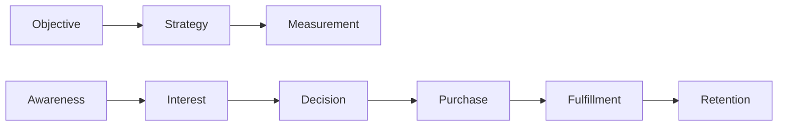

| | Awareness | Interest | Decision | Purchase | Fulfillment | Retention |
|---|---|---|---|---|---|---|
| **Acquisition** | Impressions, CPM | Bounce rate | New-user CVR | New-user GMV, CAC | — | 7-day repurchase |
| **Frequency** | — | Homepage CTR | Add-to-cart rate | Orders per user | — | 30-day repurchase |
| **ARPU** | — | — | Detail dwell time | AOV, cross-sell rate | — | — |
| **Retention** | — | — | — | Payment success | On-time delivery | Refund rate |

Empty cells reveal **gaps** — either genuine or missed opportunities.

### Metric Layering

| Level | Name | Audience | Characteristic |
|---|---|---|---|
| L0 | North Star | CEO / entire company | Singular, reflects long-term value |
| L1 | Result metrics | Business leads | Lagging, accountable |
| L2 | Process metrics | Team leads | Leading, actionable |
| L3 | Execution metrics | Front-line operators | Attributable to specific actions |

---

## 2 Four-Step Construction Framework

The four steps follow a strict logical chain — each step's output feeds the next:


### Step ① — Map Business Processes

Follow **entity state transitions**, not org charts. E-commerce has three core entities:

**Order**: AddToCart → Submit → Paid → Shipped → Signed → Confirmed *(branches: Submit→Cancelled, Paid→Refunded)*

**User**: Visitor → Registered → FirstPurchase → Repeat → Dormant → Churned → Recalled

**Product**: Created → Listed → Selling ⇄ Replenish → Delisted

**Deliverable** — a Business Process Registry:

| Business Process | Domain | Trigger | Timestamp Field | Entities | Source Table |
|---|---|---|---|---|---|
| Product impression | Traffic | Item enters viewport | `expose_time` | User/Item/Slot | `ods_log_expose` |
| Product click | Traffic | Click item card | `click_time` | User/Item/Slot | `ods_log_click` |
| Add to cart | Trade | Click add-to-cart | `add_cart_time` | User/Item | `ods_cart` |
| Submit order | Trade | Order created | `create_time` | User/Item/Shop | `ods_order` |
| Payment success | Trade | Payment callback | `pay_time` | User/Order | `ods_payment` |
| Shipment | Fulfillment | Carrier pickup | `ship_time` | Order/Warehouse | `ods_shipment` |
| Delivery signed | Fulfillment | Sign-off confirmed | `sign_time` | Order | `ods_shipment` |
| Refund request | After-sales | Submit refund | `refund_apply_time` | Order/User | `ods_refund` |

**Three qualifying criteria** for a business process:
1. Produces a data record (falls into a table)
2. Has a definite timestamp
3. Causes an entity state change

### Step ② — Define Result Metrics

For each business process, ask: *"What summable quantity does this step produce?"*

Only three primitive measure types exist:

| Type | Aggregation | Example |
|---|---|---|
| Count | `COUNT` | Impression PV, click PV |
| Amount / Quantity | `SUM` | Payment amount, refund amount |
| Distinct count | `COUNT DISTINCT` | Payment UV, active SKU count |

**Indicator tree** — validate completeness via multiplicative and additive decomposition:

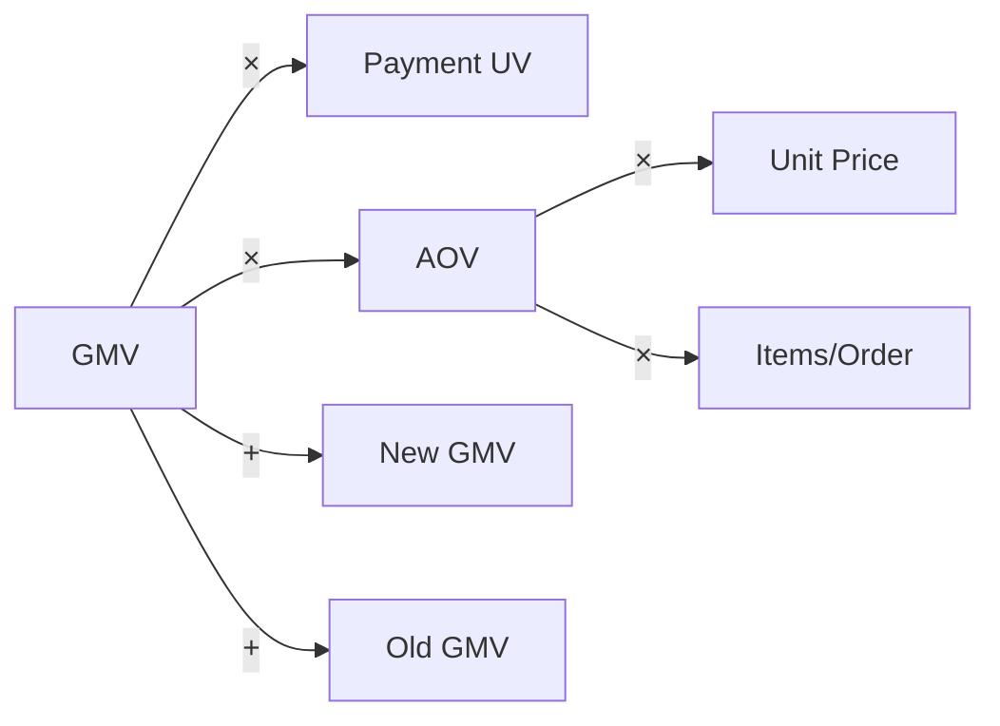

**Atomic metric** = Business Process + Measure + Aggregation — no filters, no time window, no granularity.

**Derived metric** = Atomic Metric × Modifier (filter) × Time Window × Granularity.

```
Derived = Atomic × Modifier × Period × Grain

Example:  最近1天_无线端_店铺粒度_支付金额
          = pay_amount × platform='APP' × 1d × shop_id
```

This separation is the foundation that enables a metrics platform to auto-generate SQL, detect duplicates, and match pre-aggregated tables.

### Step ③ — Design Dimensions

Dimensions come from four sources:

| Source | Dimensions | Hierarchy Example |
|---|---|---|
| **A. Entity** | User, Product, Shop, Geography | SKU → SPU → Cat3 → Cat2 → Cat1 |
| **B. Time** | Calendar, Promotion flag | Day → Week → Month → Quarter → Year |
| **C. Behavioral context** | Channel, Device, Slot/Position | Touchpoint → Channel → Channel Group |
| **D. Derived/Tag** | New/Repeat, RFM segment, Price band | Computed from entity + behavior data |

**Conformed dimensions** (一致性维度) are the technical core — the same dimension must have the same name, encoding, and hierarchy across all business processes. The **bus matrix** is the verification tool:

| Business Process | Time | User | Product | Shop | Channel | Device | Geo | Campaign |
|---|:-:|:-:|:-:|:-:|:-:|:-:|:-:|:-:|
| Impression | ✓ | ✓ | ✓ | ✓ | ✓ | ✓ | ✓ | ✓ |
| Click | ✓ | ✓ | ✓ | ✓ | ✓ | ✓ | ✓ | ✓ |
| Add to cart | ✓ | ✓ | ✓ | ✓ | ✓ | ✓ | ✓ | ✓ |
| Submit order | ✓ | ✓ | ✓ | ✓ | ✓ | ✓ | ✓ | ✓ |
| Payment | ✓ | ✓ | ✓ | ✓ | ✓ | ✓ | ✓ | ✓ |
| Shipment | ✓ | ✓ | ✓ | ✓ | — | — | ✓ | — |
| Refund | ✓ | ✓ | ✓ | ✓ | — | — | ✓ | ✓ |

A `—` demands investigation: is the data genuinely absent, or merely not joined?

**SCD Type-2 handling**: Product categories change, user levels shift. When computing "March Baby-category GMV", use the category at order time, not today's category — join with temporal conditions:

```sql
JOIN dim_item_zip d
  ON o.item_id = d.item_id
 AND o.pay_date BETWEEN d.start_date AND d.end_date
```

### Step ④ — Add Process Metrics

Process metrics answer "why" and "what to do". Three sources:

**A. Funnel conversion rates** — adjacent business processes divided:


| Process Metric | Formula | Owner | Intervention |
|---|---|---|---|
| CTR | Click UV / Impression UV | Search/Rec team | Ranking algorithm, thumbnails |
| Add-to-cart rate | Cart UV / Click UV | Product/Detail page | Page optimization, pricing |
| Order rate | Order UV / Cart UV | Trade/Marketing | Coupons, urgency prompts |
| Payment rate | Pay UV / Order UV | Payment/Inventory | Payment methods, stock |

**B. Multiplicative factor decomposition**:

```
GMV = Pay UV × AOV
AOV = Unit Price × Items per Order (cross-sell rate)
Pay UV = Visit UV × Payment CVR
```

Each factor is a process metric with a clear owner.

**C. Efficiency and quality metrics**: page load time, payment success rate, sell-through rate, defect rate, CAC, fulfillment cost.

**Three qualifying criteria** for a process metric:
1. **Actionable** — a specific team can influence it through concrete actions
2. **Leading** — its change precedes the result metric change (early warning value)
3. **Owned** — a named person/team is accountable

---

## 3 Technical Architecture

### 3.1 Overall Platform Architecture

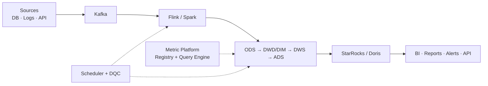

### 3.2 Three Semantic Layer Architecture Paradigms


| Criterion | Warehouse-Native | Transformation-Layer | OLAP-Acceleration |
|---|---|---|---|
| **Performance** | Good (2–10s) | Good (warehouse-bound) | Excellent (sub-second cached) |
| **Freshness** | Real-time | Real-time | Delayed (refresh interval) |
| **Infrastructure** | None (built-in) | Minimal (API server) | Significant (cluster + store) |
| **Multi-warehouse** | Single vendor | Multi-cloud | Multi-cloud |
| **Version control** | Limited | Native (Git-first) | Native (code-based) |
| **Governance** | Native RBAC/audit | Git + dbt Cloud | Application-level |
| **Best for** | Single-warehouse, governance-heavy | dbt-native, multi-cloud | High-concurrency dashboards |

### 3.3 Data Warehouse Layering

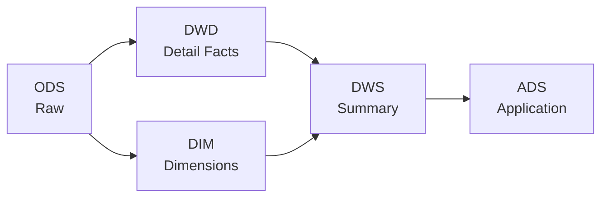

### 3.4 Three Fact Table Types

E-commerce needs all three:

| Type | Purpose | E-commerce Example | Update Pattern |
|---|---|---|---|
| **Transaction fact** | Records a single event | Payment ledger, click log | Append-only |
| **Periodic snapshot** | State at regular intervals | Daily inventory snapshot, daily user balance | Full partition per period |
| **Accumulating snapshot** | Milestones across a lifecycle | **Order fulfillment**: `create_time / pay_time / ship_time / sign_time / confirm_time` | Repeated row updates |

The accumulating snapshot is critical for e-commerce fulfillment metrics (average delivery time = `sign_time - ship_time`). It requires **row-level update** support — this is why lake formats like Apache Hudi, Iceberg, or Paimon are needed.

---

## 4 Data Model Design

### 4.1 Metric Meta-Model (How Metrics Are Described)

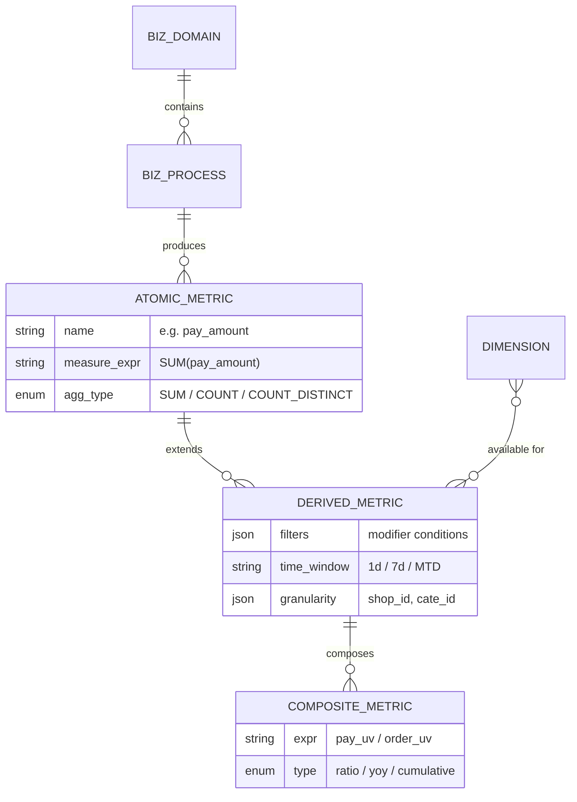

### 4.2 Physical Star Schema (Trade Domain Example)

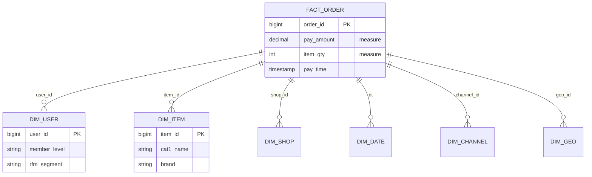

### 4.3 Metric Definition in MetricFlow / Cube Style

```yaml
# MetricFlow / dbt Semantic Layer style
semantic_models:
  - name: fct_order_pay
    model: ref('dwd_trd_order_pay_di')
    entities:
      - { name: order_id, type: primary }
      - { name: user_id, type: foreign }
      - { name: item_id, type: foreign }
    dimensions:
      - { name: pay_date, type: time, time_granularity: day }
      - { name: platform, type: categorical }
      - { name: is_new_customer, type: categorical }
    measures:
      - { name: pay_amt, agg: sum, expr: pay_amount }
      - { name: pay_orders, agg: count_distinct, expr: order_id }
      - { name: pay_users, agg: count_distinct, expr: user_id }

metrics:
  - name: gmv_paid          # Atomic → simple derived
    type: simple
    type_params: { measure: pay_amt }

  - name: aov               # Ratio — engine ensures correct re-aggregation
    type: ratio
    type_params:
      numerator: pay_amt
      denominator: pay_orders

  - name: gmv_paid_app      # With modifier
    type: simple
    type_params: { measure: pay_amt }
    filter: "{{ Dimension('platform') }} = 'APP'"
```

---

## 5 Workflow Orchestration

### 5.1 Batch Scheduling Pipeline

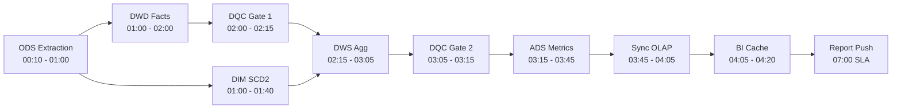

### 5.2 Scheduling Engineering Principles

| # | Principle | Rationale |
|---|---|---|
| 1 | **Data dependency, not time dependency** | `WAIT ods_order.dt=${bizdate} READY` instead of "run at 03:00". Time-based triggers produce empty output when upstream delays. |
| 2 | **Self-dependency for SCD/accumulating tables** | Zipper table T requires T-1 output. Scheduler must support self-dependency to prevent parallel backfill corruption. |
| 3 | **Idempotency** | All tasks use `INSERT OVERWRITE PARTITION`. Re-runs produce identical results — the prerequisite for safe backfill. |
| 4 | **SLA baseline with backward propagation** | Set "daily report available by 07:00" as baseline. Scheduler computes per-node warning times. Alerts when a node misses its threshold, not at 07:00. |
| 5 | **DQC gates block downstream** | Quality rules that fail **halt the DAG**. A delayed report is better than a wrong report. |
| 6 | **Asset-based orchestration** | Dagster / dbt's asset model fits metrics naturally — users care about "is this metric fresh?", not "which task ran?" |

### 5.3 Real-Time + Batch Convergence (Lambda-Lite)

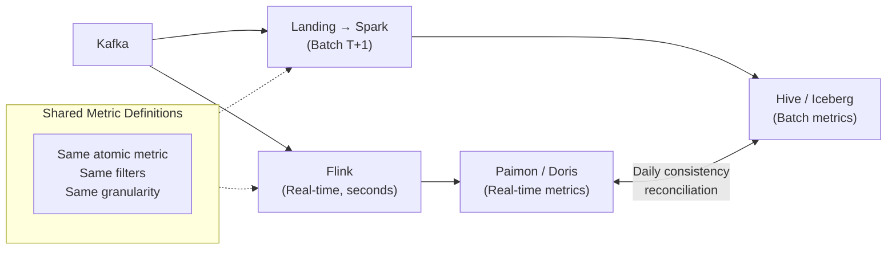

Real-time and batch pipelines **share the same metric definitions** (same atomic metric, same filter conditions, same grain). A daily reconciliation job compares real-time vs. batch outputs — divergence beyond threshold triggers alerts.

---

## 6 Metric Platform Core Capabilities

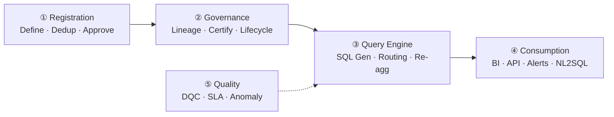

### Metric Registration Flow (Internal)

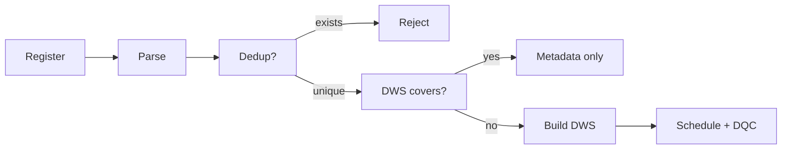

80% of new metrics should produce **zero new scheduled tasks** — they are metadata registrations that reuse existing summary tables.

---

## 7 Governance & Operational Framework

### Metric Lifecycle

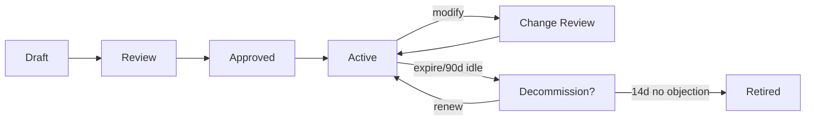

### Change Management Protocol

1. **Impact analysis** — trace lineage to find all downstream reports and consumers
2. **7-day advance notice** — announce upcoming change to all consumers
3. **2-week dual-run** — old and new definitions run in parallel, differences published
4. **Backfill decision** — explicit statement on whether historical data is recomputed
5. **Version bump** — metric dictionary version +1, full change history preserved

### Health Metrics (Meta-indicators)

| Meta-indicator | Target | Description |
|---|---|---|
| Metric reuse rate | >70% | Queries via registered metrics vs. ad-hoc SQL |
| Semantic duplication rate | <5% | Semantically equivalent metrics with different names |
| Definition consistency rate | 100% | Same-named metric yields same number across all reports |
| Metric activity rate | >60% | Metrics queried in the last 30 days |
| SLA attainment rate | >99% | P0 metrics delivered on time |
| DQC pass rate | >99.5% | Data quality rule pass rate |
| Avg delivery cycle | <5 days | New metric from request to available |

---

## 8 Implementation Roadmap

### Phase Strategy: MVP First


### Phase 1 — Twelve-Week Breakdown

| Week | 1–2 | 3–4 | 5–6 | 7–8 | 9–10 | 11–12 |
|---|---|---|---|---|---|---|
| **Diagnosis** | ██ | | | | | |
| **Goal decomposition** | | ██ | | | | |
| **Metric design** | | ██ | ██ | | | |
| **Review & sign-off** | | | ██ | | | |
| **Instrumentation backfill** | | ██ | ██ | ██ | | |
| **Modeling & development** | | | | ██ | ██ | |
| **Scheduling + DQC** | | | | | ██ | |
| **Dashboard + push** | | | | | ██ | |
| **Dual-run + old report sunset** | | | | | | ██ |

> [!important] Critical Path
> Instrumentation (event tracking / buried points) takes 4–6 weeks from request to production. It must be initiated at Week 3, not after metric design is complete — otherwise it becomes the project bottleneck.

---

## 9 Anti-Patterns & Mitigations

| # | Anti-pattern | Consequence | Mitigation |
|---|---|---|---|
| 1 | Data team designs in isolation | Business rejects, continues using Excel | Business as co-author (workshop format) |
| 2 | Pursue completeness in one shot | Nothing delivered for 6 months | MVP: single domain, close the loop |
| 3 | Build but never embed in workflow | Metrics go unused | Attach to existing meeting rhythms |
| 4 | No metric owner | Definition disputes unresolvable | Every metric has a named business owner |
| 5 | Buy platform before building system | Platform becomes empty shell | Dictionary first, platform last |
| 6 | Definitions only in documents | Docs and code diverge | Definitions in metadata; SQL auto-generated |
| 7 | Only result metrics, no process | Data can alert but not act | Every L1 needs ≥3 actionable L2 indicators |
| 8 | Instrumentation deferred | Half the metrics are incalculable | Instrumentation requests at design stage |
| 9 | Old reports not sunset | Old and new coexist, confusion persists | Dual-run period, then mandatory sunset |
| 10 | No change management | Definitions silently drift | Impact analysis + notice + dual-run |

---

## 10 Success Criteria

A metric system is successful when:

1. **Same question, same number** — the same metric queried by different people on different tools yields the same result (definition consistency rate = 100%)
2. **Business references the platform** — meetings cite platform metrics, not personal spreadsheets (reuse rate > 70%)
3. **Anomaly → root cause in 30 minutes** — multi-dimensional drill-down and attribution analysis enable rapid diagnosis

---

## Related

- [[Indicator Data]] — DCMM capability item for metric data governance
- [[Data Model]] — Data modeling standards and practices
- [[Data Architecture]] — Enterprise data architecture framework
- [[Data Quality Analysis]] — Quality assurance for metric pipelines
- [[Data Standard]] — Data standardization capability domain
- [[DCMM]] — Data Management Capability Maturity Assessment Model
