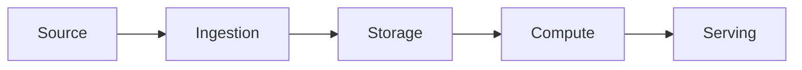
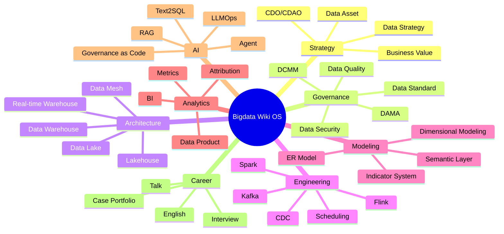
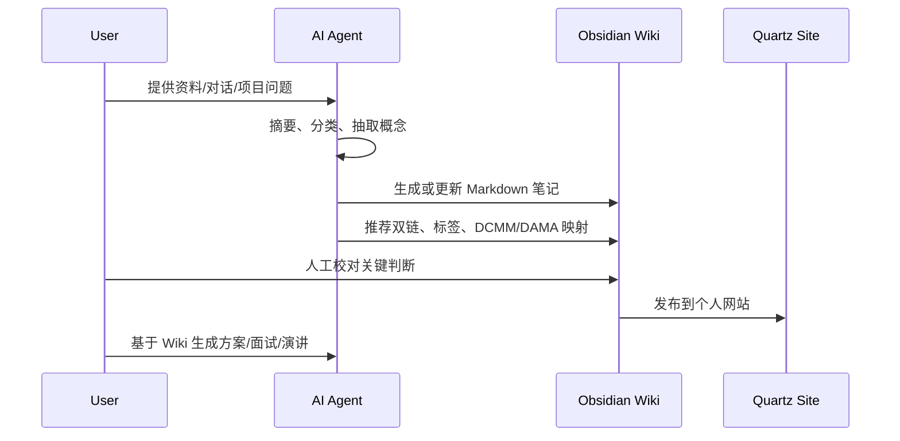

## 一句话定位

**Bigdata Wiki OS** 是一个面向大数据全栈工程师、数据架构师与未来 [[CDO]] / CDAO 角色的个人知识图谱系统，融合 [[DCMM]]、DAMA-DMBOK、数据工程、数据架构、商业分析与 DATA+AI Agent 能力，用于工作交付、项目沉淀、面试准备、演讲教程和长期职业资产建设。

它不是资料收藏夹，而是一个持续编译的 Markdown Wiki：原始资料、项目经验、面试题、架构图、代码片段、业务案例和 AI 对话会被逐步沉淀为可双链、可复用、可审计、可生成交付物的知识资产。

## 设计原则

1. **以角色能力为主线**：从大数据工程师、数据架构师、数据治理负责人、CDO/CDAO 四类角色反推知识结构。
2. **以企业数据价值链为骨架**：数据战略 -> 数据架构 -> 数据集成 -> 数据存储 -> 数据计算 -> 数据治理 -> 数据服务 -> 数据产品 -> 业务价值。
3. **以 DCMM 和 DAMA 做治理坐标系**：DCMM 负责成熟度和能力项，DAMA 负责国际化数据管理知识域。
4. **以 Obsidian 双链做知识神经网络**：每篇笔记必须连接上游概念、下游实践、项目案例、工具产品或面试问题。
5. **以 AI Agent 做知识编译器**：AI 不只回答问题，还要把原始资料编译成结构化笔记、图谱关系、模板、检查清单和演讲材料。
6. **以交付物反哺知识库**：方案、PPT、面试回答、架构评审、排障复盘都要回流成可复用资产。

## 总体架构

<section class="wiki-diagram wiki-diagram-architecture" aria-labelledby="bigdata-wiki-os-architecture">
  <span class="wiki-diagram-kicker">Architecture</span>
  <h2 class="wiki-diagram-title" id="bigdata-wiki-os-architecture">Bigdata Wiki OS Operating Model</h2>
  <div class="wiki-diagram-layers">
    <div class="wiki-diagram-layer">
      <div class="wiki-diagram-layer-label">Source</div>
      <div class="wiki-diagram-layer-items">
        <div class="wiki-diagram-node">
          <span class="wiki-diagram-node-title">Work Evidence</span>
          <span class="wiki-diagram-node-text">项目经验、复盘、方案、代码、SQL</span>
        </div>
        <div class="wiki-diagram-node">
          <span class="wiki-diagram-node-title">External Knowledge</span>
          <span class="wiki-diagram-node-text">标准、文档、论文、课程、面试题</span>
        </div>
      </div>
    </div>
    <div class="wiki-diagram-layer">
      <div class="wiki-diagram-layer-label">Compile</div>
      <div class="wiki-diagram-layer-items">
        <div class="wiki-diagram-node is-accent">
          <span class="wiki-diagram-node-title">AI Agent</span>
          <span class="wiki-diagram-node-text">摘要、分类、双链推荐、图表生成、质量审查</span>
        </div>
        <div class="wiki-diagram-node">
          <span class="wiki-diagram-node-title">Governance Lens</span>
          <span class="wiki-diagram-node-text">DCMM、DAMA、CDO/CDAO 价值映射</span>
        </div>
      </div>
    </div>
    <div class="wiki-diagram-layer">
      <div class="wiki-diagram-layer-label">Wiki</div>
      <div class="wiki-diagram-layer-items">
        <div class="wiki-diagram-node">
          <span class="wiki-diagram-node-title">MOC</span>
          <span class="wiki-diagram-node-text">主题地图、职业能力地图、治理地图</span>
        </div>
        <div class="wiki-diagram-node">
          <span class="wiki-diagram-node-title">Knowledge Cards</span>
          <span class="wiki-diagram-node-text">概念、架构模式、Playbook、案例和面试资产</span>
        </div>
      </div>
    </div>
    <div class="wiki-diagram-layer">
      <div class="wiki-diagram-layer-label">Output</div>
      <div class="wiki-diagram-layer-items">
        <div class="wiki-diagram-node">
          <span class="wiki-diagram-node-title">Delivery</span>
          <span class="wiki-diagram-node-text">工作方案、架构评审、演讲教程、个人网站</span>
        </div>
        <div class="wiki-diagram-node">
          <span class="wiki-diagram-node-title">Agent Context</span>
          <span class="wiki-diagram-node-text">可检索、可引用、可审计的数据知识上下文</span>
        </div>
      </div>
    </div>
  </div>
  <p class="wiki-diagram-caption">组件版用于正式页面展示；下方 Mermaid 保留为可快速编辑的结构草图。</p>
</section>
## 顶层知识域

建议把知识库组织为 12 个顶层域。现有仓库已经有 [[Data Architecture]]、[[Data Model]]、[[Data Store]]、[[Apache Hadoop]]、[[Apache Flink]]、[[Data Visual]]、[[AI]] 等目录，可以在现有结构上渐进扩展。

## Phase 1 导航入口

- [[MOC-BigData Map]] - 工程能力、技术栈、Pipeline、平台和交付物导航
- [[MOC-Data Architecture Map]] - 架构、建模、治理、数据产品和 CDO/CDAO 视角导航
- [[MOC-DCMM-DAMA Map]] - DCMM、DAMA、元数据、标准、质量和成熟度证据导航
- [[MOC-DATA+AI Agent Map]] - Data Agent、语义层、指标体系、RAG、工具调用和治理边界导航
- [[MOC-职业资产地图]] - 面试、案例、架构评审、演讲教程和作品集导航

## Phase Roadmap

| Phase | 目标 | 当前状态 | 关键产物 |
| --- | --- | --- | --- |
| Phase 1 | 建立可导航的知识骨架 | 已完成 | [[00-Map]]、4 个 MOC、8 个核心骨架笔记、统一模板 |
| Phase 2 | 扩展核心能力图谱 | 进行中 | 数据架构、治理、建模、工程、DATA+AI 的概念卡、模式卡和面试题 |
| Phase 3 | 沉淀项目交付资产 | 已预置骨架 | 架构方案、ADR、项目案例、故障复盘、演讲教程 |
| Phase 4 | Agent 化维护和生成 | 待开始 | Link Review Agent、Knowledge Compile Agent、Text2SQL / DataOps / Quality Agent |

Phase 1 的完成标准不是“文章很多”，而是让每个核心主题都能通过 MOC 找到入口，并且每篇核心笔记都能回答 Definition、Business Value、Architecture、Commercial Practice、Interview Answer 和 Links。

Phase 2 的第一批能力卡已经覆盖 [[Data Architecture Blueprint]]、[[Data Governance Operating Model]]、[[Data Domain]]、[[Data Product]]、[[Data Contract]]、[[Metrics Governance]]、[[Data Pipeline SLA]]、[[Data Observability]]、[[Text2SQL]] 和 [[Agent Governance]]，后续应继续扩展为项目案例、面试题和演讲素材。

Phase 2 的第二批资产层已经预置 [[MOC-职业资产地图]]、[[Bigdata Interview Question Bank]]、[[Bigdata Project Case Library]]、[[Data Architecture Review Playbook]] 和 [[Bigdata Presentation Playbook]]，用于把能力卡转化为工作交付、面试表达和演讲教程。

| 知识域 | 核心问题 | 代表笔记 | 主要输出 |
| --- | --- | --- | --- |
| 00-Map | 我的知识库如何导航 | [[MOC-BigData Map]]、[[MOC-Data Architecture Map]] | 首页、MOC、图谱 |
| 01-Data Strategy | 数据如何服务业务战略 | 数据战略、数据资产化、[[CDO]] | 数据战略方案 |
| 02-Data Governance | 数据如何被管理和治理 | [[DCMM]]、[[DAMA-DMBOK]]、[[Metadata Management]]、[[Data Quality]] | 治理体系、评估表 |
| 03-Data Architecture | 数据系统如何分层与演进 | [[Data Architecture]]、[[Lakehouse]]、[[Data Warehouse]] | 架构蓝图、技术路线 |
| 04-Data Modeling | 如何把业务转成数据模型 | [[Dimensional Modeling]]、[[E-R Model]]、[[Indicator System]]、[[Semantic Layer]] | 模型设计、指标口径 |
| 05-Data Engineering | 数据如何采集、同步、调度、计算 | [[Kafka]]、[[Apache Flink]]、[[Spark]]、[[CDC]] | Pipeline、SLA、排障手册 |
| 06-Data Platform | 平台如何支撑规模化交付 | 数据中台、湖仓平台、元数据平台 | 平台规划、产品方案 |
| 07-Data Quality & Security | 如何保证可信、合规、安全 | [[Data Quality]]、数据安全、权限、审计 | 质量规则、安全方案 |
| 08-Analytics & BI | 如何把数据变成洞察 | [[Data Visual]]、指标分析、经营分析 | Dashboard、分析报告 |
| 09-Data Product | 如何把数据做成产品 | 数据服务、API、标签、画像、推荐 | 数据产品 PRD |
| 10-DATA+AI Agent | AI 如何增强数据工作 | [[Data Agent Architecture]]、[[Agent]]、[[RAG]]、Text2SQL、LLMOps | Agent 方案、自动化流程 |
| 11-Career Assets | 如何服务职业发展 | 面试题、演讲、案例集、英文表达 | 简历、面试库、课程 |

## DCMM / DAMA / CDO 三轴映射

### DCMM 轴：能力成熟度

按 GB/T 36073-2025，DCMM 2.0 已从 2018 版演进为 9 个能力域：数据战略、数据治理、数据架构、数据资产、数据标准、数据质量、数据安全、数据生存周期、数据应用流通。知识库应把每篇治理和架构类笔记映射到这些能力域。

```yaml
dcmm_domain: 数据架构
dcmm_process: 元数据管理
maturity_level: L2-受管理
evidence:
  - 元数据采集流程
  - 血缘分析截图
  - 数据目录使用规范
```

### DAMA 轴：数据管理知识域

DAMA-DMBOK 提供国际化的数据管理知识框架，适合把知识库的概念、职责、活动、产出物标准化。建议每篇核心笔记都标注 DAMA 知识域：

```yaml
dama_area:
  - Data Governance
  - Data Architecture
  - Metadata Management
  - Data Quality
```

### CDO/CDAO 轴：经营价值

CDO/CDAO 视角要求每个知识点能回答三个问题：

1. 这个能力如何降低风险、成本或交付周期？
2. 这个能力如何提升收入、效率、客户体验或决策质量？
3. 这个能力如何支持 AI、自动化或数据产品化？

```yaml
cdo_value:
  business_goal: 提升经营分析时效
  value_metric: T+1 -> T+0
  risk_control: 口径一致性、权限审计、质量监控
  ai_enablement: 指标语义层支持 Text2SQL 和 ChatBI
```

## 知识本体设计

Bigdata Wiki OS 的图谱节点不只是一篇篇文章，而是不同类型的知识对象。

| 节点类型 | 用途 | 示例 |
| --- | --- | --- |
| `Concept` | 基础概念 | [[CDC]]、[[OLAP]]、[[Metadata Management]] |
| `Technology` | 技术组件 | [[Apache Flink]]、[[Kafka]]、[[ClickHouse]] |
| `Architecture` | 架构模式 | [[Lambda Architecture]]、[[Lakehouse]] |
| `Capability` | 组织能力 | 数据标准、数据质量、数据资产运营 |
| `Process` | 工作流程 | 数据需求、模型评审、上线发布 |
| `Artifact` | 交付物 | 数据架构方案、指标字典、数据质量报告 |
| `Case` | 项目案例 | 电商实时数仓、用户画像平台 |
| `Question` | 面试/评审问题 | 如何治理指标口径不一致？ |
| `Decision` | 架构决策 | 为什么选择 Paimon 而不是 Hudi？ |
| `Agent` | AI 自动化能力 | SQL Review Agent、Data Catalog Agent |

## 关系类型

建议统一使用显式关系，减少“只有链接但不知道为什么链接”的问题。

| 关系 | 含义 | 示例 |
| --- | --- | --- |
| `is-a` | 类型归属 | Flink is-a Streaming Engine |
| `part-of` | 组成关系 | 元数据管理 part-of 数据架构 |
| `depends-on` | 依赖关系 | Text2SQL depends-on 语义层 |
| `produces` | 产出关系 | 数据建模 produces 维度模型 |
| `governs` | 治理关系 | 数据标准 governs 指标口径 |
| `measures` | 度量关系 | SLA measures Pipeline 稳定性 |
| `implements` | 实现关系 | Paimon implements 流式湖仓 |
| `compares-with` | 对比关系 | Doris compares-with StarRocks |
| `used-in` | 应用场景 | CDC used-in 实时数仓 |
| `asked-in` | 面试场景 | Lakehouse asked-in 架构师面试 |

在 Obsidian 中可以通过正文小节承载：

```markdown
## Links

- is-a:: [[Streaming Processing]]
- part-of:: [[Data Engineering]]
- depends-on:: [[Kafka]]
- used-in:: [[实时数仓]]
- asked-in:: [[数据架构师面试题]]
```

## 推荐目录结构

当前仓库可以保持 `content/index/*` 作为 Quartz 发布目录，同时在 Obsidian 中使用以下逻辑分层。

```text
content/index/
  00-Map/
    Bigdata Wiki OS.md
    Bigdata Capability Radar.md
    Bigdata Learning Roadmap.md
  01-Data Strategy/
  02-Data Governance/
    DCMM.md
    DAMA-DMBOK.md
    Data Governance Operating Model.md
  03-Data Architecture/
    Data Architecture.md
    Lakehouse.md
    Data Mesh.md
    Architecture Decision Records/
  04-Data Modeling/
    Dimensional Modeling.md
    Indicator System.md
    Semantic Layer.md
  05-Data Engineering/
    Data Integration.md
    Batch Processing.md
    Streaming Processing.md
    Scheduling.md
  06-Data Platform/
    Metadata Platform.md
    Data Quality Platform.md
    Data Service Platform.md
  07-Analytics-BI/
  08-Data Product/
  09-DATA-AI-Agent/
    Text2SQL.md
    Data Agent Architecture.md
    Agent Governance.md
  10-Career/
    Interview/
    Talks/
    Case Portfolio/
  90-Sources/
    Standards/
    Books/
    Papers/
    Vendor Docs/
  99-Templates/
```

## 核心 MOC 设计

MOC（Map of Content）是 Obsidian 中最重要的导航层。建议至少维护 8 张核心地图：

1. `MOC-大数据全栈工程师能力地图`
2. `MOC-数据架构师能力地图`
3. `MOC-DCMM-DAMA 数据治理地图`
4. `MOC-DATA+AI Agent 地图`
5. `MOC-湖仓一体与实时数仓地图`
6. `MOC-指标体系与语义层地图`
7. `MOC-面试与演讲资产地图`
8. `MOC-项目案例与职业资产地图`

每张 MOC 固定包含：

```markdown
## Scope
这张地图解决什么问题。

## Core Concepts
核心概念入口。

## Architecture
架构图、分层图、数据流图。

## Practices
项目实践、落地手册、踩坑复盘。

## Questions
面试题、评审题、演讲题。

## Outputs
可复用方案、PPT、Checklist、Demo。
```

## 笔记模板

### 概念卡模板

```markdown
---
type: concept
title:
aliases:
tags:
dcmm_domain:
dama_area:
status: seed
---

## Definition

## Why It Matters

## Mental Model

## Architecture / Flow

## Commercial Practice

## Common Pitfalls

## Interview Answer

## Links

- part-of::
- depends-on::
- used-in::
- compares-with::
```

### 架构模式模板

~~~markdown
---
type: architecture
title:
aliases:
tags:
dcmm_domain: 数据架构
dama_area:
status: evergreen
---

## Context

## Problem

## Forces

## Solution

## Reference Architecture



## Trade-offs

## Vendor / OSS Mapping

## Governance Checkpoints

## AI Enablement

## Interview / Talk Version
~~~

### 项目案例模板

```markdown
---
type: case
title:
industry:
scenario:
role:
tags:
business_metric:
tech_stack:
---

## Business Background

## Data Problems

## Architecture

## Modeling

## Governance

## AI / Automation

## Results

## Lessons Learned

## Reusable Assets
```

## DATA+AI Agent 能力规划

AI Agent 在这个知识库里有两类身份：一类是维护 Wiki 的知识工程 Agent，另一类是面向数据工作的业务 Agent。

### 知识工程 Agent

| Agent | 输入 | 输出 | 适用场景 |
| --- | --- | --- | --- |
| Ingest Agent | 文章、文档、会议纪要、AI 对话 | 原始资料摘要、候选笔记 | 快速入库 |
| Ontology Agent | 新笔记 | 类型、标签、DCMM/DAMA 映射 | 结构化归档 |
| Link Agent | 新笔记 + 全库索引 | 双链建议、孤岛笔记提示 | 图谱维护 |
| Diagram Agent | 架构描述 | Mermaid / Excalidraw 草图 | 演讲、方案 |
| Interview Agent | 概念和案例 | STAR 回答、追问清单 | 面试准备 |
| Talk Agent | MOC 和案例 | 课程大纲、讲稿、PPT 结构 | 演讲教程 |
| Review Agent | 笔记 | 准确性、过期风险、缺失链接 | 质量审查 |

### 数据业务 Agent

| Agent | 能力 | 依赖知识 |
| --- | --- | --- |
| Text2SQL Agent | 自然语言生成 SQL | 指标口径、语义层、权限 |
| Data Quality Agent | 自动生成质量规则和异常解释 | 数据标准、质量维度、血缘 |
| Data Catalog Agent | 自动补全表描述、字段解释、血缘关系 | 元数据、业务术语 |
| Data Modeling Agent | 辅助维度建模、ER 建模、指标建模 | 业务过程、事实维度、范式 |
| DataOps Agent | 任务失败诊断、SLA 风险分析 | 调度、日志、依赖、历史告警 |
| BI Insight Agent | 自动解读指标波动 | 指标体系、业务事件、归因方法 |
| Governance Agent | 合规检查、权限建议、数据分级分类 | 安全策略、制度、审计 |

## Obsidian 技能配置建议

| 能力 | 推荐用法 |
| --- | --- |
| 双链 | 每篇笔记至少有 3 条显式链接：上位概念、实践场景、面试/交付物 |
| Graph View | 按 `type`、`dcmm_domain`、`dama_area` 分组观察知识密度 |
| Canvas | 设计架构图、学习路线图、演讲结构 |
| Excalidraw | 画数据流图、平台架构、组织治理模型 |
| Dataview | 汇总待完善笔记、面试题、项目案例、成熟度证据 |
| Templater | 快速生成概念卡、架构卡、案例卡 |
| Mermaid | 版本可控的架构图、流程图、实体关系图 |
| Tags | 只做粗粒度入口，核心关系靠双链和 YAML 字段 |

## 数据架构师知识图谱主干



## 典型落地场景

### 工作交付

从 `Case` 和 `Architecture` 笔记生成方案：

```text
业务背景 -> 数据问题 -> 架构方案 -> 技术选型 -> 治理要求 -> 风险与成本 -> 里程碑
```

### 面试准备

从 `Concept`、`Case`、`Question` 三类笔记组织回答：

```text
定义 -> 业务价值 -> 架构落地 -> 项目案例 -> 指标结果 -> 风险权衡 -> 追问准备
```

### 演讲教程

从 MOC 生成课程：

```text
为什么重要 -> 核心模型 -> 典型架构 -> 落地案例 -> 常见误区 -> Demo/Checklist
```

### AI Agent 上下文

从结构化笔记生成 Agent Prompt：

```text
角色边界 -> 可用数据 -> 指标口径 -> 质量规则 -> 权限策略 -> 输出格式 -> 审计要求
```

## 维护流程



## 质量标准

每篇核心笔记达到以下条件后，才算从 `seed` 进入 `evergreen`：

- 有清晰定义和边界。
- 有至少一个架构图、流程图或模型图。
- 有商业落地场景。
- 有 DCMM 或 DAMA 映射。
- 有面试回答版本。
- 有相关工具、产品或开源实现。
- 有至少 3 个双链关系。
- 有来源或个人项目证据。
- 有风险、误区和取舍。

## 建设路线图

### Phase 1：知识骨架

- 建立 12 个顶层知识域和 8 张 MOC。
- 把已有笔记重新映射到 DCMM、DAMA、技术栈、职业资产四类视角。
- 建立概念卡、架构卡、案例卡、面试卡模板。

### Phase 2：核心能力图谱

- 完成数据架构、数据治理、数据建模、数据工程、DATA+AI Agent 五条主线。
- 每条主线至少沉淀 20 篇 evergreen 笔记。
- 建立数据架构师面试题库和项目案例库。

### Phase 3：交付物自动化

- 从 MOC 自动生成工作方案大纲。
- 从 Case 自动生成 STAR 面试回答。
- 从 Architecture 自动生成 Mermaid 架构图和 PPT 结构。
- 从 Concept 自动生成 3 分钟、10 分钟、30 分钟讲解版本。

### Phase 4：Agent 化

- 建立 Knowledge Compile Agent，把原始资料编译为 Wiki。
- 建立 Link Review Agent，定期发现孤岛笔记和重复概念。
- 建立 Interview Agent，基于个人项目案例生成追问。
- 建立 Data Architect Agent，基于业务场景输出架构评审清单。

## 首批建设清单

优先补齐这些笔记，它们会成为图谱骨架：

- [[DAMA-DMBOK]]
- [[CDO]]
- [[Data Governance Operating Model]]
- [[Metadata Management]]
- [[Data Quality]]
- [[Data Standard]]
- [[Data Asset]]
- [[Semantic Layer]]
- [[Indicator System]]
- [[Real-time Data Warehouse]]
- [[Data Mesh]]
- [[Data Agent Architecture]]
- [[Text2SQL]]
- [[Agent Governance]]
- [[数据架构师面试题]]
- [[大数据项目案例集]]

## References

- [Karpathy LLM Wiki pattern](https://gist.github.com/karpathy/442a6bf555914893e9891c11519de94f)
- [DAMA International: What is Data Management?](https://dama.org/about-dama/what-is-data-management/)
- [DAMA-DMBOK](https://dama.org/learning-resources/dama-data-management-body-of-knowledge-dmbok/?parent_ids=5fdbe52b51ea1f05cdd1a9f2)
- [GB/T 36073-2025 数据管理能力成熟度评估模型](https://www.gb-gbt.com/PDF/Chinese.aspx/GBT36073-2025)
- [IBM: What Is a Chief Data Officer?](https://www.ibm.com/think/topics/chief-data-officer)
