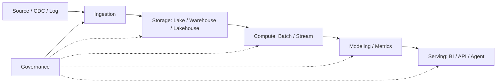

## Scope

这张地图用于组织大数据全栈工程师的能力体系：从数据接入、批流计算、湖仓存储、调度运维，到治理、BI、数据服务和 DATA+AI Agent。

## Core Concepts

- [[Bigdata Wiki OS]]
- [[Data Architecture]]
- [[Data Integration]]
- [[Data Pipeline SLA]]
- [[Data Observability]]
- [[Data Store]]
- [[Data Model]]
- [[Data Visual]]
- [[Bigdata With AI]]

## Engineering Backbone

## Technology Map

- Ingestion: [[Kafka]], [[Kafka Connect]], [[CDC]], [[Apache Flume]], [[Apache Nifi]]
- Batch: [[Spark]], [[MapReduce]], [[Apache Hive]]
- Streaming: [[Apache Flink]], [[Streaming Processing]], [[Flink CDC]]
- Storage: [[HDFS]], [[Data Lake]], [[Lakehouse]], [[ClickHouse]], [[What's StarRocks]], [[Apache Doris]]
- Scheduling: [[Apache Airflow]], [[Apache DolphinScheduler]]
- Reliability: [[Data Pipeline SLA]], [[Data Observability]], [[Data Lineage]], [[Data Quality]]
- Modeling: [[Dimensional Modeling]], [[Indicator System]], [[Semantic Layer]]
- AI Enablement: [[Data Agent Architecture]], [[Text2SQL]], [[RAG]], [[Agent]]

## Phase 2 Capability Cards

| 类型 | 笔记 | 用途 |
| --- | --- | --- |
| 工程实践卡 | [[Data Pipeline SLA]] | 定义链路时效、质量、恢复和通知承诺 |
| 工程能力卡 | [[Data Observability]] | 监控新鲜度、质量、Schema、血缘和调度风险 |
| 治理支撑卡 | [[Data Lineage]] | 支撑影响分析、质量追踪和问题定位 |
| AI 能力卡 | [[Text2SQL]] | 把工程链路和语义层暴露给受控查询助手 |

## Practices

- 设计一条从 ODS 到 DWD/DIM/DWS/ADS 的标准链路。
- 为关键 Pipeline 定义 SLA、质量规则、血缘和故障恢复路径。
- 用 [[Metadata Management]] 和 [[Data Quality]] 把工程能力沉淀为可治理资产。
- 用 [[Semantic Layer]] 和 [[Indicator System]] 支撑 BI、ChatBI 和 Text2SQL。

## Questions

- 如何解释批处理、流处理和流批一体的差异？
- 如何定位 Kafka 到 Flink 到 OLAP 的端到端延迟？
- 如何设计数仓分层并治理 ODS 直连报表？
- 如何把数据平台能力转化为业务价值指标？

## Outputs

- 大数据工程能力雷达
- 实时数仓架构图
- Pipeline SLA 和质量规则清单
- 数据可观测性和故障复盘清单
- 面试项目案例集
- [[Bigdata Interview Question Bank]]
- [[Bigdata Project Case Library]]

## Links

- part-of:: [[Bigdata Wiki OS]]
- related:: [[MOC-Data Architecture Map]]
- related:: [[MOC-DATA+AI Agent Map]]
- supports:: [[MOC-职业资产地图]]
