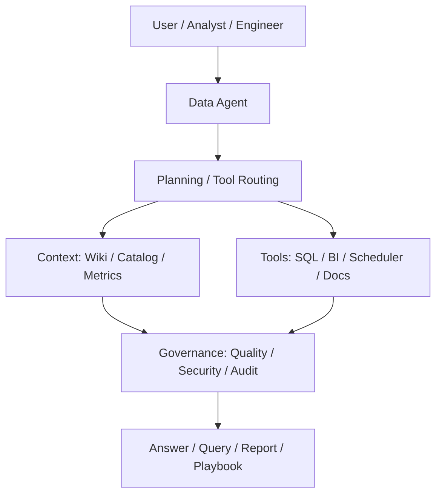

## Scope

这张地图用于规划 DATA+AI Agent 能力：让知识库既服务个人学习，也能成为数据 Agent 的上下文、规则库和交付物生成底座。

## Core Concepts

- [[Data Agent Architecture]]
- [[Agent]]
- [[RAG]]
- [[LLMOPS]]
- [[MCP]]
- [[Text2SQL]]
- [[Agent Governance]]
- [[Semantic Layer]]
- [[Indicator System]]
- [[Metadata Management]]
- [[Data Quality]]

## [[Agent]] Architecture

## Capability Areas

- Knowledge Compile Agent：把资料、项目经验、AI 对话编译为 Markdown Wiki。
- Link Review Agent：识别孤岛笔记、重复概念和缺失双链。
- Text2SQL Agent：依赖 [[Semantic Layer]]、[[Indicator System]]、权限和审计。
- Data Quality [[Agent]]：生成质量规则、异常解释和修复建议。
- Data Catalog Agent：补全表、字段、血缘和业务术语。
- DataOps Agent：定位任务失败、SLA 风险和依赖链路。
- BI Insight Agent：解释指标波动并生成分析报告。

## Phase 2 Capability Cards

| 类型 | 笔记 | 用途 |
| --- | --- | --- |
| AI 能力卡 | [[Text2SQL]] | 定义自然语言到 SQL 的语义、权限和校验边界 |
| 治理边界卡 | [[Agent Governance]] | 定义 Agent 的上下文、工具、权限、审计和人工确认 |
| 语义支撑卡 | [[Metrics Governance]] | 让 Agent 复用一致指标口径 |
| 工程支撑卡 | [[Data Observability]] | 支撑 DataOps Agent 做异常诊断和证据引用 |

## Practices

- 先治理语义和元数据，再让 Agent 写 SQL。
- 让 Agent 输出可审计的证据链：使用了哪些指标、表、规则和权限。
- 将高风险动作限定为建议或草稿，人工确认后再执行。
- 把 Agent 产物回流到 [[Bigdata Wiki OS]]，形成持续学习闭环。

## Questions

- Text2SQL 为什么不能只依赖数据库 schema？
- 数据 Agent 的权限、审计和质量边界如何设计？
- 如何把 Obsidian/Quartz 知识库变成 Agent 上下文？
- 数据架构师在 AI Agent 时代的核心能力是什么？

## Outputs

- Data Agent 总体架构图
- Text2SQL 上线检查清单
- Agent Prompt 和工具边界说明
- DATA+AI 演讲和面试题库
- Agent 治理和风险控制清单
- [[Bigdata Interview Question Bank]]
- [[Bigdata Presentation Playbook]]

## Links

- part-of:: [[Bigdata Wiki OS]]
- depends-on:: [[Semantic Layer]]
- depends-on:: [[Metadata Management]]
- governed-by:: [[Data Quality]]
- supports:: [[MOC-职业资产地图]]
