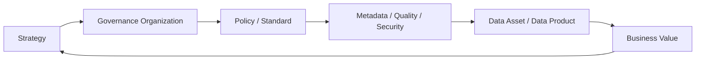

## Scope

这张地图用于把数据治理知识从“概念学习”推进到“能力评估、制度建设、平台落地和项目证据”。

## Core Concepts

- [[DCMM]]
- [[DAMA-DMBOK]]
- [[CDO]]
- [[Metadata Management]]
- [[Data Lineage]]
- [[Data Standard]]
- [[Data Quality]]
- [[Data Security]]
- [[Data Governance Operating Model]]
- [[Indicator System]]
- [[Semantic Layer]]

## Governance Operating Model

## DCMM Lens

- 数据战略：战略规划、实施、评估。
- 数据治理：组织、制度、沟通。
- 数据架构：模型、分布、集成共享、元数据。
- 数据标准：业务术语、参考数据、主数据、数据元、指标。
- 数据质量：需求、检查、分析、提升。
- 数据安全：策略、管理、审计。
- 数据生存周期：需求、设计开发、运维、退役。
- 数据应用流通：分析、服务、开放共享和价值实现。

## DAMA Lens

- Data Governance
- Data Architecture
- Data Modeling and Design
- Metadata Management
- Data Quality
- Reference and Master Data
- Data Warehousing and BI
- Data Security

## Phase 2 Capability Cards

| 类型 | 笔记 | DCMM / DAMA 视角 |
| --- | --- | --- |
| 治理机制卡 | [[Data Governance Operating Model]] | 数据治理组织、制度、流程、平台和度量 |
| 元数据能力卡 | [[Data Lineage]] | 元数据管理、影响分析、质量追踪和审计 |
| 安全控制卡 | [[Data Security]] | 数据分类分级、权限、脱敏和审计 |
| 指标治理卡 | [[Metrics Governance]] | 数据标准、指标口径、变更和质量规则 |
| 工程可靠性卡 | [[Data Observability]] | 数据质量监控、异常发现和问题闭环 |

## Practices

- 将每个治理主题沉淀为“制度 + 流程 + 平台能力 + 项目证据”。
- 为核心数据域定义业务术语、指标口径、数据标准和质量规则。
- 将元数据、血缘、质量、权限和审计纳入上线门禁。
- 用成熟度等级记录从不可控到可度量、可优化的演进路径。

## Questions

- DCMM 和 DAMA 的关系是什么？
- 数据标准、元数据、数据质量之间如何协同？
- 如何设计指标口径治理流程？
- 如何把治理结果转化为 CDO/CDAO 可理解的价值指标？

## Outputs

- 数据治理能力雷达
- DCMM 差距分析表
- DAMA 知识域学习路线
- 数据标准和质量规则模板
- 治理运行机制和责任矩阵
- [[Data Architecture Review Playbook]]

## Links

- part-of:: [[Bigdata Wiki OS]]
- related:: [[MOC-数据架构师能力地图]]
- supports:: [[CDO]]
- supports:: [[MOC-职业资产地图]]
