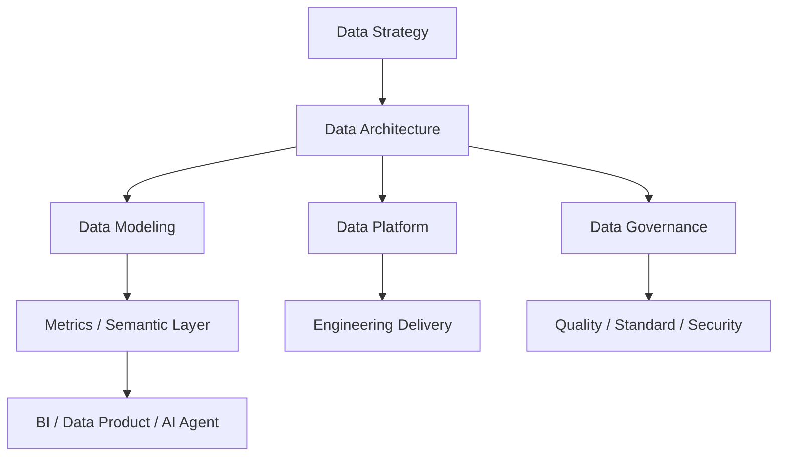

## Scope

这张地图用于从数据架构师视角组织知识：既覆盖技术架构，也覆盖治理体系、数据资产、组织协同和 CDO/CDAO 视角的商业价值。

## Core Concepts

- [[Data Architecture]]
- [[Data Architecture Blueprint]]
- [[Data Architecture Decision Record]]
- [[Data Domain]]
- [[Data Mesh]]
- [[Data Product]]
- [[Data Contract]]
- [[DCMM]]
- [[DAMA-DMBOK]]
- [[CDO]]
- [[Data Warehouse]]
- [[Data Lake]]
- [[Lakehouse]]
- [[Data Agent Architecture]]

## Architecture View

## Capability Areas

- Strategy: [[CDO]]、数据战略、数据资产化、业务价值指标。
- Blueprint: [[Data Architecture Blueprint]]、[[Data Architecture Decision Record]]、当前态/目标态/迁移路线。
- Architecture: [[Data Warehouse]]、[[Data Lake]]、[[Lakehouse]]、[[Lambda Architecture]]、[[Kappa Architecture]]、[[Data Mesh]]。
- Modeling: [[Data Domain]]、[[Dimensional Modeling]]、[[E-R Model]]、[[Indicator System]]、[[Semantic Layer]]、[[Metrics Governance]]。
- Governance: [[DAMA-DMBOK]]、[[DCMM]]、[[Metadata Management]]、[[Data Standard]]、[[Data Quality]]、[[Data Security]]。
- AI: [[Data Agent Architecture]]、[[Text2SQL]]、[[RAG]]、[[Agent Governance]]。

## Phase 2 Capability Cards

| 类型 | 笔记 | 用途 |
| --- | --- | --- |
| 架构模式卡 | [[Data Architecture Blueprint]] | 用于企业或项目级数据架构蓝图设计 |
| 决策记录卡 | [[Data Architecture Decision Record]] | 用于沉淀湖仓、实时、语义层、Agent 等架构取舍 |
| 概念卡 | [[Data Domain]] | 用于主题域、责任边界和模型范围划分 |
| 架构模式卡 | [[Data Mesh]] | 用于讨论分布式数据责任、数据产品和联邦治理 |
| 产品化卡 | [[Data Product]] | 用于定义数据资产的 owner、SLA、文档、质量和消费体验 |
| 治理模式卡 | [[Data Contract]] | 用于约束 schema、语义、质量、SLA 和变更 |
| 治理实践卡 | [[Metrics Governance]] | 用于指标口径、变更、质量和语义层治理 |

## Practices

- 通过业务目标反推数据域、主题域、指标体系和平台能力。
- 用架构决策记录沉淀技术选型取舍。
- 用 DCMM/DAMA 映射把项目经验转化为治理能力证据。
- 为 AI Agent 明确语义层、质量、权限和审计边界。

## Questions

- 数据架构师和大数据工程师的职责边界是什么？
- 如何在湖仓一体、实时数仓、Data Mesh 之间做取舍？
- 如何证明数据治理不是成本中心，而是业务增长和风险控制能力？
- CDO/CDAO 为什么关心语义层、元数据和数据质量？

## Outputs

- 企业数据架构蓝图
- 架构决策记录
- 数据治理能力评估表
- 指标体系和语义层方案
- CDO/CDAO 视角演讲稿
- [[Data Architecture Review Playbook]]
- [[Bigdata Presentation Playbook]]

## Links

- part-of:: [[Bigdata Wiki OS]]
- related:: [[MOC-DCMM-DAMA Map]]
- related:: [[MOC-DATA+AI Agent Map]]
- supports:: [[MOC-职业资产地图]]
