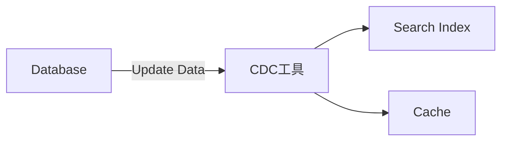

> [!info] Stable Version
> [v3.6.0-Apache Flink CDC](https://nightlies.apache.org/flink/flink-cdc-docs-stable/)
## Flink CDC 概述

> CDC（Change Data Capture ）：变更数据获取
	
核心思想是，监测并捕获'数据库的变动'（包括数据或数据表的插入、更新以及删除等），将这些变更按发生的顺序完整记录下来，写入到消息中间件中以供其他服务进行订阅及消费。
	
Flink-CDC ： 可以直接从 [[MySQL Binlog]]，PostgreSQL等数据库 基于"Binlog"直接"读取全量数据"和"增量变更数据"的 source 组件

### CDC技术应用场景

- 数据同步，用于备份，容灾
- 数据分发，一个数据源发送到多个下游
- 数据采集，面向数据仓库/数据湖的ETL数据集成

### 常见的开源CDC对比

|          | Flink CDC | Debezium | DataX | Canal | Kettle | Oracle Goldengate |
| -------- | --------- | -------- | ----- | ----- | ------ | ----------------- |
| CDC机制    | 日志        | 日志       | 查询    | 日志    | 查询     | 日志                |
| 架构       | 分布式架构     | 分布式架构    | 单机    | 单机    | 分布式架构  | 单机                |
| 是否可以断点续传 | 是         | 是        | 否     | 是     | 否      | 是                 |
| 是否可以增量同步 | 是         | 是        | 否     | 是     | 否      | 是                 |
| 是否可以全量同步 | 是         | 是        | 是     | 否     | 是      | 是                 |
| 全量+增量同步  | 是         | 是        | 否     | 否     | 否      | 是                 |
|          |           |          |       |       |        |                   |

### CDC 分类：**基于查询** 和 **基于Binlog**

|               | 基于Binlog               | 基于查询              |
| ------------- | ---------------------- | ----------------- |
| 产品            | Canal、Maxwell、Debezium | Kafka JDBC Source |
| 执行模式          | Streaming              | Batch             |
| 是否可以捕获所有数据的变化 | 是                      | 否                 |
| 延迟性           | 低延迟                    | 高延迟               |
| 是否增加数据库压力     | 否                      | 是                 |

### 传统 CDC ETL 分析 



### 基于Flink CDC 的ETL 分析


![[flinkcdc-etl.png]]

### 基于Flink CDC 的数据打宽

![[flink-etl-sql.png]]

### 基于Flink CDC 的聚合分析

![[flink-cdc.png]]

### CDC设计实现

- Chunk切分
- Chunk读取
- Chunk分配
- Chunk汇报
- Chunk分配

![[flink-reader-binlog.png]]

### flink 开启CDC功能
```shell
cd /opt/module/flink-1.13.1/lib
flink-shaded-hadoop-2-uber-2.8.3-10.0.jar
    
bin/start-cluster.sh #  开启flink
#  运行
bin/flink run -m hadoop102:8081  -c com.atguigu.FlinkCDC /home/zhj/atguigu-flink-cdc-1.0-SNAPSHOT-jar-with-dependencies.jar
```

### 案例 api

```java
package com.atguigu;

import com.ververica.cdc.connectors.mysql.MySqlSource;
import com.ververica.cdc.connectors.mysql.table.StartupOptions;
import com.ververica.cdc.debezium.DebeziumSourceFunction;
import com.ververica.cdc.debezium.StringDebeziumDeserializationSchema;
import org.apache.flink.runtime.state.filesystem.FsStateBackend;
import org.apache.flink.streaming.api.CheckpointingMode;
import org.apache.flink.streaming.api.datastream.DataStreamSource;
import org.apache.flink.streaming.api.environment.StreamExecutionEnvironment;

public class FlinkCDC {

    public static void main(String[] args) throws Exception {

        //1.获取Flink 执行环境
        StreamExecutionEnvironment env = StreamExecutionEnvironment.getExecutionEnvironment();
        env.setParallelism(1);

        //1.1 开启CK
        env.enableCheckpointing(5000);
        env.getCheckpointConfig().setCheckpointTimeout(10000);
        env.getCheckpointConfig().setCheckpointingMode(CheckpointingMode.EXACTLY_ONCE);
        env.getCheckpointConfig().setMaxConcurrentCheckpoints(1);

        env.setStateBackend(new FsStateBackend("hdfs://hadoop102:9820/cdc-test/ck"));

        //2.通过FlinkCDC构建SourceFunction
        DebeziumSourceFunction<String> sourceFunction = MySqlSource.<String>builder()
                .hostname("hadoop3")
                .port(3306)
                .username("root")
                .password("123456")
                .databaseList("cdc_test")
                .tableList("cdc_test.user_info")
                .deserializer(new StringDebeziumDeserializationSchema())
                .startupOptions(StartupOptions.initial())
                .build();
        DataStreamSource<String> dataStreamSource = env.addSource(sourceFunction);

        //3.数据打印
        dataStreamSource.print();

        //4.启动任务
        env.execute("FlinkCDC");

    }
}
```

### 案例2  

```java
package com.atguigu;

import org.apache.flink.api.java.tuple.Tuple2;
import org.apache.flink.streaming.api.datastream.DataStream;
import org.apache.flink.streaming.api.environment.StreamExecutionEnvironment;
import org.apache.flink.table.api.Table;
import org.apache.flink.table.api.bridge.java.StreamTableEnvironment;
import org.apache.flink.types.Row;

public class FlinkSQLCDC {

    public static void main(String[] args) throws Exception {

        //1.获取执行环境
        StreamExecutionEnvironment env = StreamExecutionEnvironment.getExecutionEnvironment();
        // 并行度
        env.setParallelism(1);
        // 创建表环境
        StreamTableEnvironment tableEnv = StreamTableEnvironment.create(env);

        //2.使用FLINKSQL DDL模式构建CDC 表
        tableEnv.executeSql("CREATE TABLE user_info ( " +
                " id STRING primary key, " +
                " name STRING, " +
                " sex STRING " +
                ") WITH ( " +
                " 'connector' = 'mysql-cdc', " +
                " 'scan.startup.mode' = 'latest-offset', " +
                " 'hostname' = 'hadoop3', " +
                " 'port' = '3306', " +
                " 'username' = 'root', " +
                " 'password' = '123456', " +
                " 'database-name' = 'cdc_test', " +
                " 'table-name' = 'user_info' " +
                ")");

        //3.查询数据并转换为流输出
        Table table = tableEnv.sqlQuery("select * from user_info");
        DataStream<Tuple2<Boolean, Row>> retractStream = tableEnv.toRetractStream(table, Row.class);
        retractStream.print();
        // 另一种输出格式
        tableEnv.sqlQuery("select * from user_info").print();

        //4.启动
        env.execute("FlinkSQLCDC");

    }
}
```

#### pom.xml

```xml
<dependencies>
    <dependency>
        <groupId>org.apache.flink</groupId>
        <artifactId>flink-java</artifactId>
        <version>1.12.0</version>
    </dependency>

    <dependency>
        <groupId>org.apache.flink</groupId>
        <artifactId>flink-streaming-java_2.12</artifactId>
        <version>1.12.0</version>
    </dependency>

    <dependency>
        <groupId>org.apache.flink</groupId>
        <artifactId>flink-clients_2.12</artifactId>
        <version>1.12.0</version>
    </dependency>

    <dependency>
        <groupId>org.apache.hadoop</groupId>
        <artifactId>hadoop-client</artifactId>
        <version>3.1.3</version>
    </dependency>

    <dependency>
        <groupId>mysql</groupId>
        <artifactId>mysql-connector-java</artifactId>
        <version>5.1.48</version>
    </dependency>

    <dependency>
        <groupId>com.alibaba.ververica</groupId>
        <artifactId>flink-connector-mysql-cdc</artifactId>
        <version>1.2.0</version>
    </dependency>

    <dependency>
        <groupId>com.alibaba</groupId>
        <artifactId>fastjson</artifactId>
        <version>1.2.75</version>
    </dependency>
</dependencies>
<build>
    <plugins>
        <plugin>
            <groupId>org.apache.maven.plugins</groupId>
            <artifactId>maven-assembly-plugin</artifactId>
            <version>3.0.0</version>
            <configuration>
                <descriptorRefs>
                    <descriptorRef>jar-with-dependencies</descriptorRef>
                </descriptorRefs>
            </configuration>
            <executions>
                <execution>
                    <id>make-assembly</id>
                    <phase>package</phase>
                    <goals>
                        <goal>single</goal>
                    </goals>
                </execution>
            </executions>
        </plugin>
    </plugins>
</build>
```

---
## Reference
- [Apache Flink CDC \| Apache Flink CDC](https://nightlies.apache.org/flink/flink-cdc-docs-stable/)
- 


