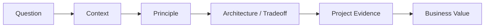

## Definition

**Bigdata Interview Question Bank** 用于把能力卡转化为可复用的面试回答框架，覆盖技术深度、架构取舍、治理落地、商业价值和 DATA+AI。

## Answer Framework

## Question Sets

### Data Architecture

- 如何从 0 到 1 设计企业级 [[Data Architecture Blueprint]]？
- [[Data Warehouse]]、[[Data Lake]]、[[Lakehouse]] 和 [[Data Mesh]] 怎么取舍？
- 你如何用 [[Data Architecture Decision Record]] 记录架构决策？
- [[Data Domain]] 和源系统、主题域、业务域有什么区别？

### Data Governance

- [[DCMM]] 和 [[DAMA-DMBOK]] 的关系是什么？
- 如何设计 [[Data Governance Operating Model]]？
- [[Metadata Management]]、[[Data Lineage]]、[[Data Quality]] 如何协同？
- [[Data Security]] 如何在 BI、API 和 Agent 场景中落地？

### Modeling And Metrics

- [[Dimensional Modeling]] 和 [[E-R Model]] 如何选择？
- [[Indicator System]] 和 [[Metrics Governance]] 如何建设？
- 为什么 [[Semantic Layer]] 是 Text2SQL 和 ChatBI 的关键前提？

### Data Engineering

- 如何定义核心链路的 [[Data Pipeline SLA]]？
- 如何用 [[Data Observability]] 降低数据事故恢复时间？
- Kafka、Flink、OLAP 端到端延迟如何排查？

### DATA+AI

- [[Text2SQL]] 为什么不能只依赖数据库 schema？
- [[Agent Governance]] 如何设计权限、工具和审计边界？
- [[Data Agent Architecture]] 如何和 Wiki、元数据、语义层结合？

## Interview Answer Template

- 背景：这个问题在什么业务或技术场景下出现。
- 原则：先说明判断原则，而不是直接背结论。
- 方案：给出架构、流程或治理机制。
- 取舍：说明 rejected options 和约束。
- 证据：连接项目案例、指标、故障复盘或交付物。
- 价值：落到效率、质量、风险、成本或收入。

## Links

- part-of:: [[MOC-职业资产地图]]
- uses:: [[Data Architecture Blueprint]]
- uses:: [[Data Governance Operating Model]]
- uses:: [[Text2SQL]]

