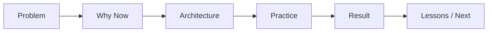

## Definition

**Bigdata Presentation Playbook** 用于把知识卡和项目案例转化为对外演讲、内部分享、教程课程和面试作品集。

## Narrative Flow

## Talk Tracks

### Data Architecture

- 从业务战略到 [[Data Architecture Blueprint]]。
- 湖仓一体、实时数仓和 [[Data Mesh]] 的取舍。
- 用 [[Data Architecture Decision Record]] 管理架构演进。

### Data Governance

- [[DCMM]] / [[DAMA-DMBOK]] 如何落到项目证据。
- [[Data Governance Operating Model]] 如何从制度走向运营。
- [[Data Lineage]]、[[Data Quality]]、[[Data Security]] 的组合打法。

### Engineering Reliability

- 从任务成功率到 [[Data Pipeline SLA]]。
- 用 [[Data Observability]] 做数据事故前置发现。
- 数据链路故障复盘如何沉淀为资产。

### DATA+AI

- 为什么 [[Text2SQL]] 需要 [[Semantic Layer]]。
- [[Agent Governance]] 如何控制权限、工具和审计。
- [[Data Agent Architecture]] 如何和 Bigdata Wiki OS 结合。

## Slide Skeleton

- 1 页：问题和业务背景。
- 1 页：现状痛点和约束。
- 2-3 页：架构图、数据流图、治理机制。
- 1 页：落地步骤和关键决策。
- 1 页：指标结果和商业价值。
- 1 页：复盘、风险和下一步。

## Links

- part-of:: [[MOC-职业资产地图]]
- depends-on:: [[Bigdata Project Case Library]]
- supports:: [[Bigdata Interview Question Bank]]
- uses:: [[Data Agent Architecture]]

