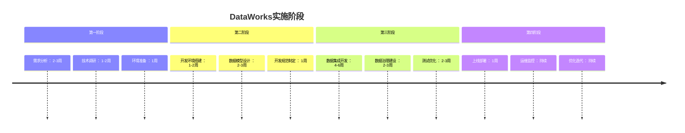

# DataWorks - 阿里云大数据开发治理平台

## 简介

**DataWorks** 是阿里云推出的企业级大数据开发治理平台，基于[[MaxCompute]]、[[Hologres]]、EMR、AnalyticDB、CDP等大数据引擎，为数据仓库、数据湖、湖仓一体等解决方案提供统一的全链路大数据开发治理平台。

### 产品能力

![[dw-产品能力.png]]

六大核心能力模块[智能数据建模](https://help.aliyun.com/zh/dataworks/user-guide/dataworks-data-modeling/)、[全域数据集成](https://help.aliyun.com/zh/dataworks/user-guide/overview-of-data-integration/)、[高效数据生产](https://help.aliyun.com/zh/dataworks/user-guide/overview-new-data-studio/)、[主动数据治理](https://help.aliyun.com/zh/dataworks/user-guide/data-asset-governance/)、[全面数据安全](https://help.aliyun.com/zh/dataworks/user-guide/security-center-1/)、数据分析服务六大全链路数据治理的能力

### **云上发展历程**
 
| 年份   | 里程碑事件                  |
| ---- | ---------------------- |
| 2009 | DataWorks 在阿里集团立项      |
| 2015 | DataWorks 正式上云         |
| 2017 | 走向国际化                  |
| 2018 | DataWorks V2.0 发布      |
| 2019 | DataWorks V3.0 发布      |
| 2024 | 拥抱 AIGC，发布 Data+AI 新能力 |
|      |                        |
## 功能特性

DataWorks产品分为基础版、标准版、专业版、企业版。每个版本又区分不同地域、政务云、金融云对应的版本。[DataWorks各版本的功能详情](https://help.aliyun.com/zh/dataworks/user-guide/differences-among-dataworks-editions?spm=a2c4g.11186623.help-menu-72772.d_0_0_1_0.75b440a3139ptl)
## 核心定位

DataWorks定位为**一站式数据开发治理平台**，覆盖从数据采集、处理、分析到服务的完整链路，实现：

- **开发标准化**：统一的开发环境、规范和流程
- **治理自动化**：元数据管理、数据质量、血缘追溯
- **运维智能化**：任务调度、资源管理、监控告警
- **服务一体化**：BI报表、API服务、应用开发

## 应用场景

离线与实时一体化的企业级智能云数仓（一套存储、一套开发、多套引擎）

![[dw-离线与实时一体化的企业级智能云数仓.png]]

## 生态体系中涉及的计算引擎和数据源

### 计算引擎类产品

**DataWorks 构建了开放的计算引擎生态**，深度集成MaxCompute、EMR、Hologres、Flink等主流引擎，支持跨引擎协同开发

> 参考：[支持的计算引擎与数据源](https://help.aliyun.com/zh/dataworks/user-guide/services-that-work-with-dataworks?spm=a2c4g.11186623.help-menu-72772.d_0_0_6.63ff7f3f0Lb0RD)

## 竞品对比

| 能力 | DataWorks | 华为云 DataArts | 腾讯云 WeData | 火山引擎 DataLeap |
|------|-----------|----------------|---------------|------------------|
| **统一平台** | ✅ 全链路覆盖 | ✅ 全链路覆盖 | ✅ 部分覆盖 | ✅ 全链路覆盖 |
| **多引擎支持** | ✅ MaxCompute/Hologres | ✅ 多引擎 | ✅ 多引擎 | ✅ 多引擎 |
| **数据治理** | ✅ 完善 | ✅ 完善 | ✅ 中等 | ✅ 完善 |
| **可视化开发** | ✅ 优秀 | ✅ 优秀 | ✅ 良好 | ✅ 优秀 |
| **实时处理** | ✅ 支持 | ✅ 支持 | ✅ 支持 | ✅ 支持 |
| **成本优势** | ✅ 价格优势 | 中等 | 中等 | 较高 |
| **本地化支持** | ✅ 优秀 | ✅ 优秀 | 良好 | 优秀 |

## 最佳实践

### 1. 项目规划
- **需求分析**：明确业务需求和技术需求
- **资源评估**：计算资源、存储资源、网络资源
- **团队组建**：数据工程师、数据分析师、业务专家
- **时间规划**：开发周期、测试周期、上线周期

### 2. 架构设计
- **分层架构**：ODS、DWD、DWS、ADS分层设计
- **资源隔离**：生产环境、开发环境、测试环境隔离
- **权限设计**：基于RBAC的权限控制
- **监控设计**：全链路监控、告警机制

### 3. 开发规范
- **命名规范**：表名、字段名、任务名规范
- **代码规范**：SQL代码规范、Python代码规范
- **注释规范**：表注释、字段注释、任务注释
- **版本管理**：Git分支管理、代码评审流程

### 4. 治理体系
- **元数据管理**：元数据采集、分类、搜索
- **数据质量**：质量规则、监控、告警
- **数据安全**：权限控制、数据脱敏、审计日志
- **成本管理**：资源监控、成本分析、优化建议

## 实施建议

### 1. 阶段实施

### 2. 团队配置
- **项目经理**：1人，负责项目整体协调
- **数据架构师**：1-2人，负责架构设计和技术选型
- **数据工程师**：3-5人，负责数据开发任务
- **数据分析师**：2-3人，负责需求分析和数据验证
- **运维工程师**：1-2人，负责系统运维和监控

### 3. 成本估算
| 资源类型 | 规格 | 数量 | 月费用 |
|----------|------|------|--------|
| 计算资源 | 16核64G | 4台 | ￥XX,XXX |
| 存储资源 | 10TB | - | ￥X,XXX |
| 网络带宽 | 100Mbps | - | ￥X,XXX |
| License费用 | DataWorks版 | 1套 | ￥XX,XXX |
| **总计** |  |  | ￥XX,XXX |

### 4. 风险控制
- **技术风险**：充分测试、灰度发布、回滚机制
- **业务风险**：需求变更管理、数据验证、业务沟通
- **运维风险**：监控告警、灾备方案、应急预案
- **安全风险**：权限控制、数据加密、安全审计

## 总结

DataWorks作为阿里云的大数据开发治理平台，具备以下核心优势：

1. **全链路覆盖**：从数据采集到服务输出的完整链路
2. **智能治理**：自动化的元数据管理、数据质量管理
3. **多引擎支持**：支持多种大数据引擎，避免工具孤岛
4. **高可用性**：99.9%的服务可用性承诺，企业级保障
5. **易用性**：可视化操作、低代码开发、智能推荐

通过DataWorks，企业可以快速构建现代化的数据平台，实现数据资产化、智能化服务，为企业数字化转型提供强有力的数据支撑。

## Reference

- [DataWorks基本概念 - 阿里云](https://www.alibabacloud.com/help/zh/dataworks/product-overview/terms?spm=a2c63.p38356.help-menu-72772.d_0_1_6.4372433eMl75kl)
- [DataWorks产品文档 - 阿里云](https://help.aliyun.com/product/27815.html)
- [DataWorks定价详情 - 阿里云](https://www.aliyun.com/product/dataworks/pricing)

