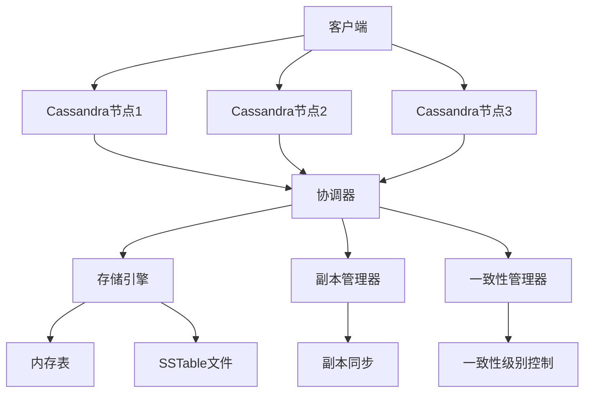

---
aliases:
  - cassandra
tags:
  - data-store
  - nosql
  - distributed-database
  - bigdata
date: 2023-04-21
---

# Apache Cassandra 详解

## 什么是 Apache Cassandra？

Apache Cassandra 是一个开源的分布式 NoSQL 数据库系统，最初由 Facebook 开发并于 2008 年开源。它被设计用于处理大量数据，同时提供高可用性、线性可扩展性和容错能力。

> **核心定位**：Cassandra 是一个高度可扩展的分布式数据库，专注于处理海量数据的高并发读写操作，特别适合需要高可用性和水平扩展的场景。

## 产生背景

### 1. 起源与发展
- **2008年**：Facebook 内部开发，用于解决收件箱系统的高并发问题
- **2009年**：正式开源并捐献给 Apache 软件基金会
- **2010年**：成为 Apache 顶级项目
- **2014年**：DataStax 推出商业版本和 Cloud 服务

### 2. 产生的技术需求背景
1. **数据爆炸增长**：社交媒体和互联网应用产生海量用户数据
2. **高并发访问**：数百万用户同时在线操作
3. **服务可用性要求**：7×24小时不间断服务
4. **水平扩展需求**：单机数据库无法满足数据量和性能要求
5. **容错能力**：硬件故障时不影响服务连续性

## 主要功能特性

### 1. 分布式架构特性
- **无单点故障**：所有节点都是平等的，没有主从之分
- **对等网络**：所有节点都参与数据读写和协调
- **去中心化**：没有中心控制节点，避免单点瓶颈

### 2. 高可用性
- **数据副本**：每个数据自动复制到多个节点（默认3副本）
- **故障自动检测**：节点故障时系统自动重新分配数据
- **自动故障转移**：读写请求自动避开故障节点
- **多数据中心支持**：支持跨数据中心部署和复制

### 3. 线性可扩展性
- **无缝添加节点**：通过增加节点线性提升性能和存储容量
- **负载均衡**：数据自动在节点间分布
- **无停机扩容**：扩容过程中无需停止服务

### 4. 高性能
- **写入优化**：优化的写入算法，支持高吞吐量写入
- **内存优化**：利用缓存提升读取性能
- **异步操作**：大部分操作是异步的，减少等待时间
- **批量操作**：支持高效的批量数据导入和导出

### 5. 数据一致性模型
- **最终一致性**：支持 tunable consistency
- **灵活的一致性级别**：可针对每个操作设置不同一致性级别
- **AP 架构**：优先保证可用性和分区容错性

### 6. 灵活的数据模型
- **宽列存储**：每个行可以有不同数量的列
- **多维度查询**：支持任意列的查询
- **动态模式**：无需预先定义完整的表结构
- **用户自定义类型**：支持复杂数据类型

### 7. 管理和运维
- **无中心管理**：所有节点功能相同，简化部署
- **自动故障恢复**：内置的监控和恢复机制
- **监控工具**：提供丰富的监控指标和管理工具

## 使用场景

### 1. 社交网络
- **用户关系数据**：好友关系、关注关系等
- **消息系统**：即时消息、推文、评论
- **活动流**：用户动态、时间线数据
- **聊天记录**：大规模聊天消息存储

### 2. 物联网(IoT)
- **传感器数据**：设备状态监测数据
- **时间序列数据**：设备运行数据、日志记录
- **设备管理**：设备注册、配置、状态信息

### 3. 内容管理
- **CMS系统**：文章、评论、用户生成内容
- **推荐系统**：用户行为、偏好数据
- **搜索索引**：搜索引擎的数据存储

### 4. 金融科技
- **交易记录**：大规模交易数据处理
- **实时分析**：交易监控、风险控制
- **用户行为分析**：交易模式分析

### 5. 游戏行业
- **玩家数据**：游戏进度、成就、装备
- **排行榜**：实时排行榜数据
- **游戏日志**：游戏行为日志记录

### 6. 日志分析
- **应用日志**：大规模应用日志存储
- **系统监控**：性能指标、监控数据
- **安全日志**：访问日志、安全事件记录

## 架构设计

### 1. 核心架构组件



### 2. 数据分布机制

**一致性哈希环**
- 使用一致性哈希算法将数据分布到节点
- 每个节点负责环上的一个范围
- 自动处理节点加入和离开

**虚拟节点**
- 每个物理节点划分为多个虚拟节点
- 提高数据分布的均匀性
- 减少数据倾斜问题

### 3. 数据写入流程

1. **客户端请求**：客户端向任意节点发送写请求
2. **协调器**：接收请求的节点作为协调器
3. **一致性检查**：根据一致性级别验证
4. **日志写入**：写入预写日志(WAL)
5. **内存表**：数据写入内存表
6. **副本同步**：同步到其他节点副本
7. **确认返回**：成功后返回确认信息

### 4. 数据读取流程

1. **客户端请求**：客户端向任意节点发送读请求
2. **协调器**：接收请求的节点作为协调器
3. **一致性级别**：根据读取的一致性级别
4. **本地查询**：优先查询本地节点
5. **副本查询**：必要时查询其他副本
6. **数据合并**：合并多个副本的数据
7. **结果返回**：返回合并后的结果

### 5. 故障恢复机制

**副本同步**
- 后台进程持续同步数据副本
- 自动检测和修复不一致的数据
- 支持手动修复和修复阈值控制

** hinted handoff**
- 临时存储无法送达的写操作
- 当故障节点恢复时重新发送
- 确保数据不丢失

## 数据模型和查询语言

### 1. 数据模型概述

Cassandra 采用宽列存储模型，类似于传统数据库的表，但更加灵活：

```
Keyspace1
├── Table1
│   ├── row_key1
│   │   ├── column1: value1
│   │   ├── column2: value2
│   │   └── column3: value3
│   └── row_key2
│       ├── column1: value4
│       ├── column2: value5
│       └── column4: value6
└── Table2
    └── row_key3
        ├── column1: value7
        ├── column2: value8
        └── column5: value9
```

### 2. CQL (Cassandra Query Language)

类似于 SQL，但针对分布式环境进行了优化：

```sql
-- 创建 keyspace
CREATE KEYSPACE my_keyspace
WITH replication = {'class': 'SimpleStrategy', 'replication_factor': 3};

-- 创建表
CREATE TABLE users (
    user_id UUID PRIMARY KEY,
    username TEXT,
    email TEXT,
    created_at TIMESTAMP,
    last_login TIMESTAMP,
    profile MAP<TEXT, TEXT>
);

-- 插入数据
INSERT INTO users (user_id, username, email, created_at, profile)
VALUES (uuid(), 'john_doe', 'john@example.com', now(),
        {'age': '30', 'city': 'New York'});

-- 查询数据
SELECT * FROM users WHERE user_id = <uuid>;

-- 范围查询
SELECT * FROM users WHERE created_at > '2023-01-01';
```

### 3. 主要数据类型

- **基本类型**：TEXT, INT, BIGINT, BOOLEAN, FLOAT, DOUBLE, TIMESTAMP
- **集合类型**：LIST, SET, MAP
- **用户定义类型**：可以创建自定义复合类型
- **集合类型**：Tuple, Counter

## 性能优化

### 1. 性能特点
- **写入性能**：极高的写入吞吐量，每秒可达数百万次操作
- **读取性能**：优化的读取算法，支持缓存和预取
- **延迟控制**：可配置的读取/写入延迟

### 2. 优化策略

#### 设计优化
- **合理分区键**：选择高基数的分区键避免热点
- **复合主键**：使用复合主键优化查询性能
- **数据分片**：合理分配数据到不同节点

#### 配置优化
- **内存配置**：调整 heap size 和缓存大小
- **并发设置**：优化并发连接数和线程池
- **磁盘优化**：SSD 存储和适当的文件配置

#### 查询优化
- **索引使用**：合理使用二级索引
- **批量操作**：使用批量操作减少网络往返
- **异步操作**：使用异步操作提升并发性能

## 竞品对比

### 1. 与 HBase 对比

| 特性 | Apache Cassandra | Apache HBase |
|------|------------------|--------------|
| 数据模型 | 宽列存储 | 列式存储 |
| 一致性模型 | 最终一致性 | 强一致性 |
| 架构 | 无主架构 | 主从架构 |
| 查询语言 | CQL | 类SQL |
| 适合场景 | 高写入、高可用 | 大规模分析 |
| 扩展方式 | 水平扩展 | 垂直扩展为主 |

### 2. 与 MongoDB 对比

| 特性 | Apache Cassandra | MongoDB |
|------|------------------|---------|
| 数据模型 | 宽列存储 | 文档存储 |
| 一致性 | 最终一致性 | 可配置一致性 |
| 架构 | 无主架构 | 主从架构 |
| 查询语言 | CQL | MongoDB查询语言 |
| 索引 | 支持二级索引 | 丰富的索引类型 |
| 事务支持 | 有限支持 | ACID事务 |

### 3. 与 Redis 对比

| 特性 | Apache Cassandra | Redis |
|------|------------------|-------|
| 数据类型 | 宽列为主 | 内存数据结构 |
| 持久化 | 磁盘存储 | 内存+可选持久化 |
| 性能 | 高吞吐量 | 极低延迟 |
| 用途 | 数据库 | 缓存、消息队列 |
| 数据规模 | TB/PB级别 | GB/GB级别 |

### 4. 与传统RDBMS对比

| 特性 | Apache Cassandra | MySQL/PostgreSQL |
|------|------------------|-------------------|
| 架构 | 分布式式 | 单机/主从 |
| 一致性 | 最终一致性 | ACID事务 |
| 扩展性 | 水平扩展 | 垂直扩展 |
| 数据模型 | 宽列存储 | 关系模型 |
| 性能 | 高并发写入 | 事务处理 |
| 适用场景 | 大规模高并发 | 事务密集型 |

## 商业落地方案

### 1. DataStax Enterprise
- **产品特点**：企业级Cassandra解决方案
- **功能**：包含Apache Cassandra + DSE Analytics + Search + Graph
- **服务模式**：本地部署 + 云服务
- **客户案例**：Netflix、Apple、eBay等

### 2. Astra DB (DataStax)
- **产品特点**：基于云的Cassandra服务
- **功能**：Serverless、按需付费、自动扩容
- **云平台**：AWS、Azure、GCP
- **优势**：免运维、弹性扩展

### 3. Amazon Keyspaces
- **产品特点**：AWS托管的Cassandra兼容服务
- **功能**：与Cassandra API兼容
- **优势**：AWS生态集成、自动化管理
- **适用**：AWS用户快速部署

### 4. Azure Cosmos DB
- **产品特点**：多模型数据库服务
- **兼容性**：Cassandra API支持
- **优势**：全球分布、多区域复制
- **服务**：企业级SLA保证

### 5. 成功案例

#### Netflix
- **使用场景**：视频推荐系统、用户行为分析
- **集群规模**：数百节点集群
- **数据量**：PB级数据
- **效果**：支撑全球数亿用户

#### Apple
- **使用场景**：App Store、iTunes用户数据
- **集群规模**：跨数据中心部署
- **优势**：高可用性、容灾能力

#### eBay
- **使用场景**：商品信息、用户评价
- **性能要求**：高并发读写
- **扩展能力**：线性扩展

#### Twitter
- **使用场景**：时间线数据、社交关系
- **技术优势**：高写入吞吐量
- **业务价值**：实时数据服务

## 部署和运维

### 1. 硬件要求
- **CPU**：多核处理器，建议8核以上
- **内存**：16GB以上，根据数据量调整
- **存储**：SSD硬盘，高速I/O
- **网络**：万兆网络，低延迟

### 2. 部署模式
- **单机部署**：开发测试环境
- **集群部署**：生产环境标准部署
- **多数据中心**：跨区域容灾部署

### 3. 监控和运维
- **监控指标**：CPU、内存、磁盘、网络
- **性能指标**：读写延迟、吞吐量
- **告警机制**：异常情况自动告警
- **备份策略**：定期备份和数据恢复

## 学习资源

### 1. 官方文档
- [Apache Cassandra 官方文档](https://cassandra.apache.org/)
- [DataStax 文档](https://docs.datastax.com/)
- [CQL 参考手册](https://cassandra.apache.org/doc/latest/cql/)

### 2. 社区资源
- [Apache 邮件列表](https://cassandra.apache.org/_/community.html)
- [Stack Overflow](https://stackoverflow.com/questions/tagged/cassandra)
- [GitHub 仓库](https://github.com/apache/cassandra)

### 3. 书籍和教程
- "Cassandra: The Definitive Guide"
- "Learning Apache Cassandra"
- [官方教程](https://cassandra.apache.org/doc/latest/)

## 总结

Apache Cassandra 作为一款成熟的分布式数据库，在高可用性、高并发、大数据量场景下具有独特优势。其无主架构、线性可扩展性和灵活的数据模型使其成为现代互联网应用的重要基础设施选择。

**核心价值**：
- 高可用性：7×24小时不间断服务
- 线性扩展：通过增加节点提升性能
- 高性能：海量数据的高吞吐处理
- 灵活适应：支持多种应用场景

**适用建议**：
- 适合：高并发写入、大数据量、高可用要求
- 不适合：强一致性、复杂事务、小规模数据
- 建议：评估业务需求后再选择合适的技术栈

---

*注：本文档持续更新中，如有建议或补充，欢迎提交修改。*