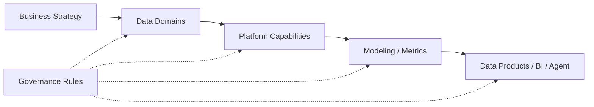

## Definition

**Data Architecture Blueprint** 是企业或项目级的数据架构总图，它描述数据从业务源头到采集、存储、建模、治理、服务和 AI 应用的整体路径。

## Business Value

- 让业务方、架构师、工程师和治理团队对建设范围形成同一张图。
- 支撑 CDO/CDAO 判断平台投入、治理优先级和业务价值闭环。
- 将 [[DCMM]]、[[DAMA-DMBOK]]、[[Data Architecture]] 和 [[Data Agent Architecture]] 连接成可执行路线。

## Architecture / Flow

## Commercial Practice

蓝图不应只画技术组件。实际落地时要同时包含数据域、系统边界、数据流、治理责任、核心指标、平台能力、阶段路线和风险清单。

## Common Pitfalls

- 只画技术栈，没有业务目标和数据域。
- 只覆盖目标态，没有当前态、过渡态和迁移路径。
- 没有把质量、标准、安全、元数据和成本纳入架构约束。

## Interview Answer

数据架构蓝图的核心是把业务战略翻译成数据域、平台能力、治理规则和交付路线。好的蓝图既能指导工程建设，也能帮助管理层理解为什么要建设、先建设什么、如何度量价值。

## Links

- part-of:: [[MOC-Data Architecture Map]]
- depends-on:: [[Data Architecture]]
- supports:: [[CDO]]
- supports:: [[Data Agent Architecture]]

