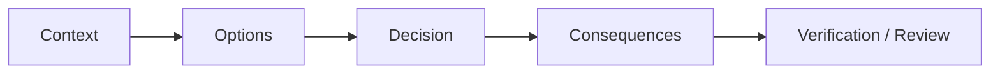

## Definition

**Data Architecture Decision Record** 是记录数据架构关键决策的轻量文档，说明为什么选择某个方案、拒绝哪些方案、有哪些约束和后续风险。

## Business Value

- 降低架构评审和项目交接成本。
- 让平台演进有可追溯依据，避免反复讨论同一个选型。
- 为面试、复盘和演讲提供高质量项目证据。

## Architecture / Flow

## Commercial Practice

常见决策包括：湖仓 vs 数仓、Lambda vs Kappa、实时链路技术栈、元数据平台选型、指标口径管理方式、是否引入语义层、Agent 是否允许执行 SQL。

## Common Pitfalls

- 只写结论，不写约束和拒绝方案。
- 把 ADR 写成会议纪要，没有后续验证标准。
- 决策过大，导致单篇记录难以复用。

## Interview Answer

我会用 ADR 记录数据架构中的关键取舍，例如为什么选择湖仓一体、为什么引入语义层、为什么限制 Agent 只能生成 SQL 草稿。ADR 的价值是让架构选择可解释、可复盘、可交接。

## Links

- part-of:: [[MOC-Data Architecture Map]]
- supports:: [[Data Architecture Blueprint]]
- used-in:: [[Bigdata Wiki OS]]

