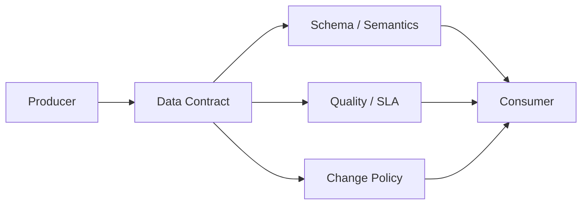

## Definition

**Data Contract** 是数据生产方和消费方之间的明确约定，描述字段结构、业务语义、质量规则、SLA、权限、变更通知和兼容性要求。

## Business Value

- 降低 schema 变更、口径变更和任务延迟带来的下游事故。
- 将 [[Data Quality]]、[[Data Standard]] 和 [[Data Pipeline SLA]] 前移到数据生产环节。
- 让 [[Text2SQL]] 和 [[Data Agent Architecture]] 使用更稳定的上下文。

## Architecture / Flow

## Commercial Practice

数据契约适合高价值、强依赖、跨团队消费的数据接口。落地时可以从核心明细表、宽表、指标服务和实时事件开始，配合 CI 校验、质量规则和变更审批。

## Common Pitfalls

- 只约束 schema，不约束业务语义和质量。
- 没有自动校验，契约变成静态文档。
- 生产方和消费方没有明确责任和变更响应时间。

## Interview Answer

数据契约的价值是把上游生产和下游消费之间的隐性依赖显性化。它约定 schema、语义、质量、SLA 和变更策略，可以显著降低数据链路变更导致的报表、指标和 Agent 事故。

## Links

- part-of:: [[MOC-数据架构师能力地图]]
- depends-on:: [[Data Standard]]
- depends-on:: [[Data Quality]]
- supports:: [[Data Pipeline SLA]]
- supports:: [[Data Product]]

