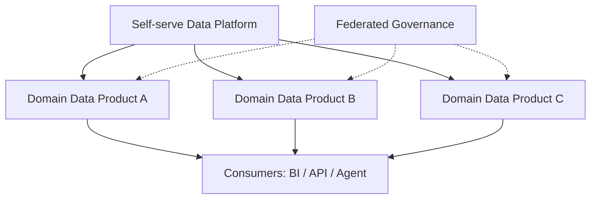

## Definition

**Data Mesh** 是一种分布式数据架构和组织模式，强调按业务域建设数据产品，由领域团队承担数据质量、语义和服务责任，同时通过联邦治理保持标准一致。

## Business Value

- 适合多业务线、大组织、中心数据团队成为瓶颈的场景。
- 推动数据从“项目交付物”变成“长期数据产品”。
- 与 [[Data Domain]]、[[Data Product]]、[[Data Contract]] 和 [[Semantic Layer]] 密切相关。

## Architecture / Flow

## Commercial Practice

Data Mesh 不是只把数据分散给各部门，而是要求平台提供自助能力，治理团队提供统一标准，领域团队对数据产品质量、文档、SLA 和消费体验负责。

## Common Pitfalls

- 组织能力不足时过早推 Data Mesh，导致标准碎片化。
- 只强调去中心化，忽略联邦治理和平台能力。
- 没有数据产品 owner、SLA 和质量承诺。

## Interview Answer

Data Mesh 适合解决中心化数据团队无法支撑复杂业务规模的问题。它把数据责任下放到领域团队，但必须配套统一标准、自助平台和联邦治理，否则会从中心化瓶颈变成分布式混乱。

## Links

- part-of:: [[MOC-Data Architecture Map]]
- depends-on:: [[Data Domain]]
- depends-on:: [[Data Product]]
- depends-on:: [[Data Contract]]
- supports:: [[Data Architecture Blueprint]]
- compares-with:: [[Lakehouse]]
