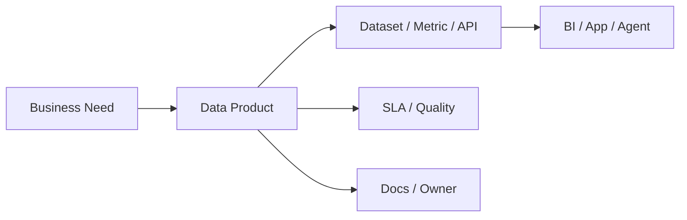

## Definition

**Data Product** 是面向明确用户和业务场景的数据交付单元，通常包含数据集、指标、API、Dashboard、文档、质量承诺、权限和运营机制。

## Business Value

- 让数据从一次性项目交付变成长期运营资产。
- 明确 owner、SLA、质量、文档和用户反馈闭环。
- 支撑 [[Data Mesh]]、[[Semantic Layer]] 和 [[Data Agent Architecture]] 的规模化消费。

## Architecture / Flow

## Commercial Practice

数据产品应像软件产品一样运营：定义目标用户、使用场景、服务接口、数据质量、SLA、变更流程和成功指标。常见形态包括指标服务、客户标签、画像服务、风险评分、经营看板和数据 API。

## Common Pitfalls

- 把一张表或一个报表直接称为数据产品，但没有 owner 和服务承诺。
- 只重视交付，不持续运营使用率、反馈和质量。
- 没有权限和变更治理，导致下游消费不可控。

## Interview Answer

数据产品不是简单的数据集，而是围绕业务场景封装的数据服务。它需要有明确用户、owner、文档、质量承诺、SLA 和反馈机制，这样数据资产才能被持续复用和运营。

## Links

- part-of:: [[MOC-数据架构师能力地图]]
- depends-on:: [[Data Domain]]
- supports:: [[Data Mesh]]
- supports:: [[Semantic Layer]]

