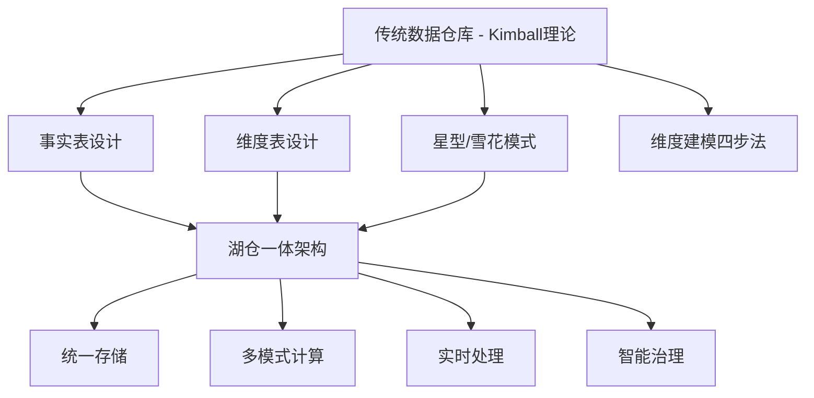
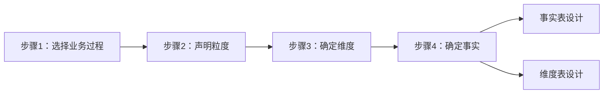
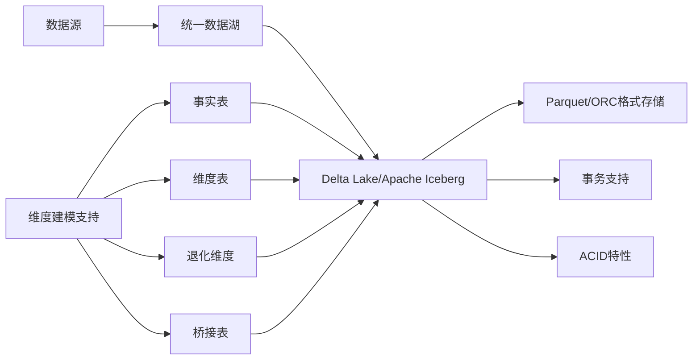
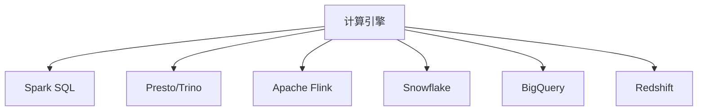
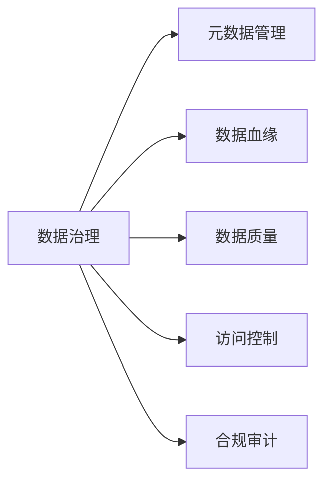
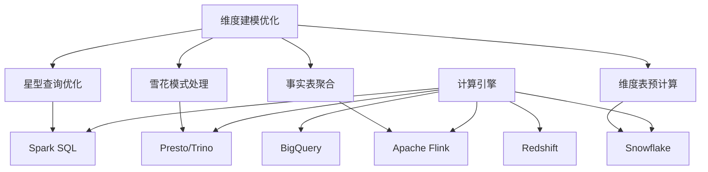
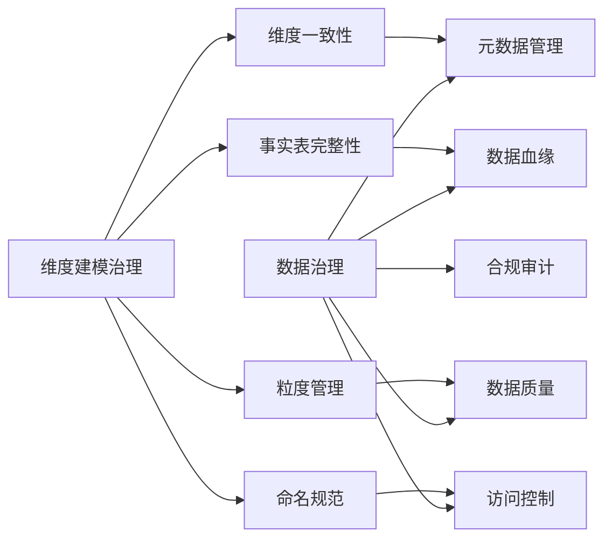
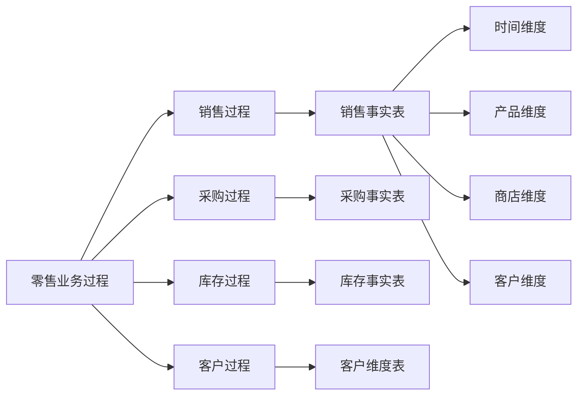
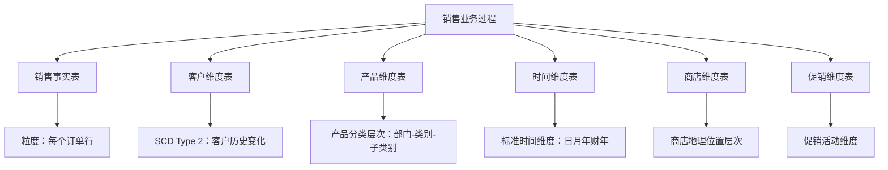
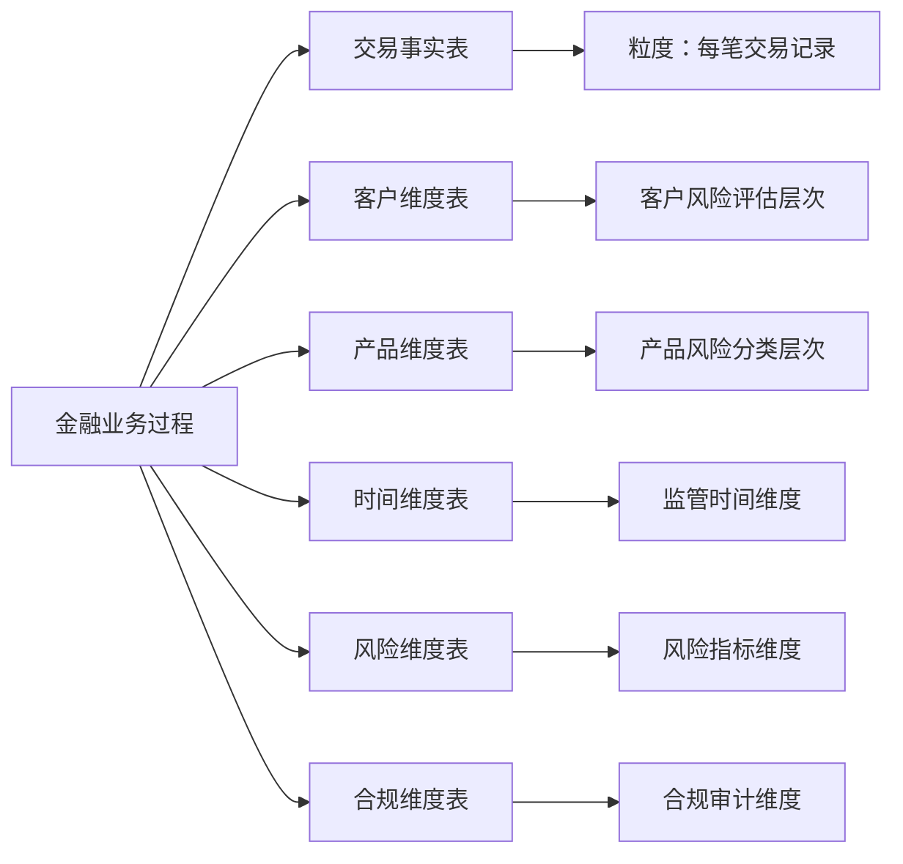

# Lake-DataWarehouse Architecture 湖仓一体架构

Lake-DataWarehouse Architecture represents the next evolution in data management, combining the flexibility of data lakes with the governance and performance of data warehouses into a unified platform.

## 概述 (Overview)

湖仓一体架构 (Lake-DataWarehouse Architecture) 是现代数据管理架构的重要演进，它结合了数据湖的灵活性和数据仓库的性能、治理能力，为企业提供了一个统一的数据管理平台。

### 基于维度建模理论的设计哲学

基于Ralph Kimball的维度建模理论，湖仓一体架构继承了传统数据仓库的核心理念，同时融入现代数据技术的创新：



### 核心特征 (Core Characteristics)

- **统一存储平台**：单一存储系统同时支持结构化和非结构化数据
- **多模式计算**：支持批处理、流式查询、实时分析等多种计算模式
- **企业级治理**：提供完整的元数据管理、数据质量、访问控制等能力
- **高性能查询**：通过索引、缓存、优化查询计划等技术实现高性能分析
- **维度建模兼容**：完美支持Kimball维度建模理论的实施
- **实时数据集成**：支持CDC（Change Data Capture）和流式数据集成

## 维度建模在湖仓一体架构中的应用 (Dimensional Modeling in Lake-DataWarehouse)

### Kimball维度建模四步法在湖仓一体中的实施

基于《数据仓库工具箱》经典的维度建模四步法，湖仓一体架构提供了现代化的实现方案：



#### 1. 选择业务过程 (Choose Business Process)

在湖仓一体架构中，业务过程识别更加智能化：

```python
# 智能业务过程识别
class BusinessProcessAnalyzer:
    def __init__(self, metadata_store):
        self.metadata = metadata_store

    def discover_processes(self, system_name):
        """自动发现业务过程"""
        # 分析数据源中的业务事件
        events = self.metadata.get_business_events(system_name)

        # 基于维度建模理论分类
        processes = {
            'sales': {
                'events': ['order_create', 'payment', 'refund'],
                'dimensions': ['customer', 'product', 'time', 'store'],
                'measures': ['amount', 'quantity', 'discount']
            },
            'inventory': {
                'events': ['stock_in', 'stock_out', 'stock_adjust'],
                'dimensions': ['product', 'warehouse', 'time'],
                'measures': ['quantity', 'cost']
            }
        }
        return processes
```

#### 2. 声明粒度 (Declare Grain)

粒度声明在湖仓一体架构中更加灵活：

```sql
-- 传统数据仓库粒度声明
CREATE TABLE fact_sales (
    order_id BIGINT,
    customer_id BIGINT,
    product_id BIGINT,
    store_id BIGINT,
    sale_amount DECIMAL(10,2),
    sale_date DATE
) -- 粒度：每个订单行

-- 湖仓一体架构中的粒度声明（支持多级粒度）
CREATE TABLE fact_sales_lake (
    -- 一级粒度：订单级
    order_id BIGINT,
    order_date DATE,
    customer_id BIGINT,
    store_id BIGINT,

    -- 二级粒度：订单行级
    line_item_id BIGINT,
    product_id BIGINT,
    quantity INT,
    unit_price DECIMAL(10,2),
    discount_amount DECIMAL(10,2),

    -- 粒度标识
    grain_level INT,  -- 1:订单级, 2:订单行级
    is_summary_flag BOOLEAN  -- 是否汇总数据
) USING delta
PARTITIONED BY (order_date);
```

#### 3. 确定维度 (Determine Dimensions)

维度设计在湖仓一体架构中支持更多维度类型：

```sql
-- 基础维度表设计
CREATE TABLE dim_customer (
    customer_sk BIGINT PRIMARY KEY,
    customer_id VARCHAR(50),
    customer_name VARCHAR(100),
    email VARCHAR(100),
    phone VARCHAR(20),
    address VARCHAR(255),
    city VARCHAR(50),
    province VARCHAR(50),
    country VARCHAR(50),
    customer_type VARCHAR(20),
    registration_date DATE,
    last_purchase_date DATE,
    total_orders INT,
    total_amount DECIMAL(15,2),
    -- 湖仓特有字段
    data_source VARCHAR(50),  -- 数据来源
    load_timestamp TIMESTAMP,  -- 加载时间戳
    change_type VARCHAR(20),    -- 变更类型(INSERT/UPDATE)
    is_current_flag BOOLEAN     -- 当前标志位
) USING delta;

-- 慢速变化维度(SCD)实现
CREATE PROCEDURE process_scd_changes()
BEGIN
    -- 处理SCD Type 1：直接覆盖
    UPDATE dim_customer
    SET customer_name = new_name,
        email = new_email,
        change_type = 'UPDATE'
    WHERE customer_id = target_id;

    -- 处理SCD Type 2：创建历史记录
    INSERT INTO dim_customer_historical
    SELECT *, CURRENT_TIMESTAMP, 'HISTORICAL'
    FROM dim_customer
    WHERE customer_id = target_id
    AND CURRENT_TIMESTAMP > effective_date;
END;
```

#### 4. 确定事实 (Determine Facts)

事实表设计支持更多事实类型：

```sql
-- 事务事实表
CREATE TABLE fact_sales_transaction (
    transaction_sk BIGENT,
    order_sk BIGINT,
    customer_sk BIGINT,
    product_sk BIGINT,
    store_sk BIGINT,
    time_sk BIGINT,

    -- 原始度量
    sale_amount DECIMAL(10,2),
    quantity INT,
    unit_price DECIMAL(10,2),
    discount_amount DECIMAL(10,2),
    tax_amount DECIMAL(10,2),

    -- 导出度量
    net_amount DECIMAL(10,2),
    profit_amount DECIMAL(10,2),
    margin_percentage DECIMAL(5,2),

    -- 上下文信息
    payment_method VARCHAR(20),
    promotion_code VARCHAR(20),
    is_returned BOOLEAN,
    return_date DATE,

    -- 湖仓特性
    event_time TIMESTAMP,  -- 事件发生时间
    process_time TIMESTAMP, -- 处理时间
    source_system VARCHAR(50)
) USING delta;

-- 累积快照事实表
CREATE TABLE fact_project_snapshot (
    project_sk BIGINT,
    project_id VARCHAR(20),

    -- 多个时间戳
    start_date DATE,
    planning_complete_date DATE,
    development_complete_date DATE,
    testing_complete_date DATE,
    deployment_date DATE,
    actual_completion_date DATE,

    -- 状态度量
    planned_budget DECIMAL(15,2),
    actual_budget DECIMAL(15,2),
    planned_duration INT, -- 天数
    actual_duration INT,

    -- 进度度量
    completion_percentage DECIMAL(5,2)
) USING delta;

-- 无事实事实表
CREATE TABLE dim_product_description (
    product_sk BIGINT,
    product_id VARCHAR(20),
    language_code VARCHAR(10),
    description_text TEXT,
    description_medium BLOB,
    description_long TEXT,
    last_updated_date DATE,
    updated_by VARCHAR(50)
) USING delta;
```

## 架构组成 (Architecture Components)

### 1. 存储层 (Storage Layer)

基于维度建模理论的存储设计，湖仓一体架构的存储层支持Kimball模式的各种表结构：



**基于Kimball理论的存储组件**：

#### 事实表存储
```sql
-- 事实表存储优化
CREATE TABLE fact_sales (
    -- 业务键
    order_id BIGINT,
    customer_id BIGINT,
    product_id BIGINT,

    -- 代理键
    order_sk BIGINT GENERATED ALWAYS AS HASH(order_id),
    customer_sk BIGINT GENERATED ALWAYS AS HASH(customer_id),
    product_sk BIGINT GENERATED ALWAYS AS HASH(product_id),

    -- 时间代理键
    order_date DATE,
    time_sk BIGINT,

    -- 度量列
    sale_amount DECIMAL(10,2),
    quantity INT,
    profit_amount DECIMAL(10,2),

    -- 附加度量
    discount_amount DECIMAL(10,2),
    tax_amount DECIMAL(10,2),

    -- 存储优化
    PARTITIONED BY (order_date)
    STORED AS PARQUET
    TBLPROPERTIES (
        'delta.optimizeWrite.enabled' = 'true',
        'delta.stats.collect' = 'true'
    )
) USING delta;
```

#### 维度表存储
```sql
-- 维度表存储（支持SCD）
CREATE TABLE dim_customer (
    -- 代理键
    customer_sk BIGINT PRIMARY KEY,

    -- 业务键
    customer_id VARCHAR(50),
    customer_natural_key VARCHAR(100),

    -- 属性列
    customer_name VARCHAR(100),
    email VARCHAR(100),
    phone VARCHAR(20),
    address VARCHAR(255),
    city VARCHAR(50),
    country VARCHAR(50),

    -- SCD字段
    effective_date DATE,
    expiry_date DATE,
    current_flag BOOLEAN,
    change_type VARCHAR(10), -- 'NEW', 'MODIFY', 'HISTORICAL'

    -- 元数据
    load_timestamp TIMESTAMP,
    source_system VARCHAR(50),
    record_version INT
) USING delta
PARTITIONED BY (effective_date);
```

#### 特殊维度表存储

**桥接表**：
```sql
-- 多对多关系桥接表
CREATE TABLE bridge_product_category (
    product_sk BIGINT,
    category_sk BIGINT,
    primary_flag BOOLEAN,
    sequence_number INT,
    load_timestamp TIMESTAMP
) USING delta;
```

**退化维度**：
```sql
-- 退化维度（存储在事实表中）
CREATE TABLE fact_sales (
    -- 包含退化维度的信息
    payment_method_code VARCHAR(10),
    payment_method_desc VARCHAR(50),
    -- ... 其他字段
) USING delta;
```

**关键组件**：
- **Delta Lake**：提供ACID事务支持的数据湖格式，支持时间旅行和演进模式
- **Apache Iceberg**：开放表格式，支持跨引擎查询，优化分区剪枝
- **Apache Hudi**：流式数据湖平台，支持增量处理和CDC

### 2. 计算引擎层 (Compute Engine Layer)



**核心能力**：
- **Spark**：大规模数据处理和机器学习
- **Presto/Trino**：分布式SQL查询
- **Flink**：实时流处理
- **云原生服务**：Snowflake、BigQuery、Redshift

### 3. 治理层 (Governance Layer)



**治理功能**：
- **元数据管理**：统一的数据目录和元数据存储
- **数据血缘**：追踪数据来源和转换过程
- **数据质量**：数据质量监控和预警
- **访问控制**：基于角色的细粒度权限管理
- **合规审计**：数据使用追踪和审计日志

### 2. 计算引擎层 (Compute Engine Layer)

基于维度建模的计算优化，湖仓一体架构提供多种计算引擎支持：



**基于Kimball理论的核心计算能力**：

#### Spark SQL维度查询优化
```scala
// Spark SQL维度建模查询优化
val salesAnalysis = spark.sql("""
    SELECT
        c.customer_name,
        p.product_category,
        t.month_name,
        COUNT(DISTINCT f.order_id) as order_count,
        SUM(f.sale_amount) as total_sales,
        AVG(f.quantity) as avg_quantity_per_order,
        COUNT(DISTINCT f.customer_sk) as unique_customers
    FROM fact_sales f
    JOIN dim_customer c ON f.customer_sk = c.customer_sk
    JOIN dim_product p ON f.product_sk = p.product_sk
    JOIN dim_time t ON f.time_sk = t.time_sk
    WHERE f.order_date >= '2024-01-01'
      AND f.order_date <= '2024-12-31'
    GROUP BY c.customer_name, p.product_category, t.month_name
    ORDER BY total_sales DESC
""")

// 查询优化配置
spark.conf.set("spark.sql.adaptive.enabled", "true")
spark.conf.set("spark.sql.adaptive.coalescePartitions.enabled", "true")
spark.conf.set("spark.sql.sources.parallelPartitionDiscovery.threshold", "8")
```

#### Presto/Trino高性能分析
```sql
-- Presto/Trino星型查询优化
-- 使用预聚合表提升性能
CREATE MATERIALIZED VIEW fact_sales_monthly_mv AS
SELECT
    customer_sk,
    product_sk,
    time_sk,
    COUNT(*) as order_count,
    SUM(sale_amount) as total_sales,
    AVG(sale_amount) as avg_order_value,
    MAX(sale_amount) as max_order_value,
    MIN(sale_amount) as min_order_value
FROM fact_sales
GROUP BY customer_sk, product_sk, time_sk;

-- 查询时自动选择最优表
SELECT
    c.customer_name,
    p.product_name,
    t.month_name,
    monthly.order_count,
    monthly.total_sales
FROM fact_sales_monthly monthly
JOIN dim_customer c ON monthly.customer_sk = c.customer_sk
JOIN dim_product p ON monthly.product_sk = p.product_sk
JOIN dim_time t ON monthly.time_sk = t.time_sk
WHERE monthly.total_sales > 10000;
```

#### Flink实时维度计算
```scala
// Flink实时事实表处理
class SalesFactStreamProcessor extends KeyedProcessFunction[Long, SalesEvent, SalesFact] {

    override def processElement(
        event: SalesEvent,
        ctx: KeyedProcessFunction[Long, SalesEvent, SalesFact]#Context,
        out: Collector[SalesFact]
    ): Unit = {
        // 实时维度查找
        val customerDimension = customerLookup.get(event.customerId)
        val productDimension = productLookup.get(event.productId)

        // 生成代理键
        val customerSk = hash(customerDimension.customerNaturalKey)
        val productSk = hash(productDimension.productNaturalKey)

        // 创建事实记录
        val fact = SalesFact(
            orderSk = event.orderId,
            customerSk = customerSk,
            productSk = productSk,
            timeSk = System.currentTimeMillis(),
            saleAmount = event.amount,
            quantity = event.quantity,
            eventTime = event.timestamp,
            processTime = System.currentTimeMillis()
        )

        out.collect(fact)
    }
}
```

#### 实时聚合计算
```python
# 实时维度聚合
class RealTimeDimensionAggregator:
    def __init__(self, table_name):
        self.table_name = table_name
        self.spark = SparkSession.builder.appName("realtime_aggregation").getOrCreate()

    def calculate_daily_aggregates(self):
        """日度维度聚合"""
        daily_agg = self.spark.sql("""
            SELECT
                customer_sk,
                product_sk,
                date_trunc('day', order_date) as date_sk,
                COUNT(*) as order_count,
                SUM(sale_amount) as daily_sales,
                AVG(sale_amount) as avg_order_value
            FROM fact_sales
            WHERE process_time >= current_timestamp() - interval 1 day
            GROUP BY customer_sk, product_sk, date_trunc('day', order_date)
        """)

        # 合并到聚合表
        daily_agg.write.format("delta") \
            .mode("merge") \
            .option("mergeSchema", "true") \
            .save(f"{self.table_name}_daily")
```

**核心能力**：
- **Spark**：大规模数据处理和机器学习，支持复杂的维度建模ETL
- **Presto/Trino**：分布式SQL查询，优化的星型查询性能
- **Flink**：实时流处理，支持实时维度计算和CDC处理
- **云原生服务**：Snowflake、BigQuery、Redshift，提供企业级湖仓服务

### 3. 治理层 (Governance Layer)

基于维度建模理论的完整数据治理体系：



**基于Kimball理论的治理功能**：

#### 元数据管理
```python
# 维度建模元数据管理
class DimensionalMetadataManager:
    def __init__(self):
        self.catalog = MetadataCatalog()

    def register_dimension(self, dimension_info):
        """注册维度表"""
        metadata = {
            'table_name': dimension_info['name'],
            'table_type': 'DIMENSION',
            'natural_key': dimension_info['natural_key'],
            'surrogate_key': dimension_info['surrogate_key'],
            'attributes': dimension_info['attributes'],
            'scd_type': dimension_info.get('scd_type', 1),
            'last_updated': datetime.now(),
            'business_owner': dimension_info.get('business_owner')
        }
        self.catalog.register_table(metadata)

    def register_fact(self, fact_info):
        """注册事实表"""
        metadata = {
            'table_name': fact_info['name'],
            'table_type': 'FACT',
            'grain': fact_info['grain'],
            'measures': fact_info['measures'],
            'dimensions': fact_info['dimensions'],
            'foreign_keys': fact_info['foreign_keys'],
            'calculation_type': fact_info.get('calculation_type', 'transactional')
        }
        self.catalog.register_table(metadata)
```

#### 数据血缘管理
```python
# 维度建模数据血缘追踪
class DimensionalLineageTracker:
    def __init__(self):
        self.lineage_db = LineageDatabase()

    def track_dimension_changes(self, dimension_name, changes):
        """追踪维度变更血缘"""
        lineage_record = {
            'table_name': dimension_name,
            'change_type': changes['type'],
            'changed_attributes': changes['attributes'],
            'timestamp': datetime.now(),
            'affected_facts': self.get_affected_facts(dimension_name),
            'business_impact': self.assess_business_impact(dimension_name)
        }
        self.lineage_db.record_lineage(lineage_record)

    def get_dimension_lineage(self, dimension_name):
        """获取维度血缘关系"""
        return self.lineage_db.query_lineage(
            "SELECT * FROM lineage WHERE table_name = ? "
            "ORDER BY timestamp DESC",
            (dimension_name,)
        )
```

#### 数据质量管理
```python
# 维度建模数据质量检查
class DimensionalQualityChecker:
    def __init__(self):
        self.quality_rules = QualityRuleRepository()

    def check_dimension_completeness(self, dimension_name):
        """检查维度完整性"""
        rules = self.quality_rules.get_dimension_rules(dimension_name)

        for rule in rules:
            if rule['rule_type'] == 'completeness':
                # 检查非空约束
                result = self.execute_check(rule)
                self.record_quality_metric(result)

            elif rule['rule_type'] == 'uniqueness':
                # 检查唯一性
                result = self.execute_check(rule)
                self.record_quality_metric(result)

            elif rule['rule_type'] == 'consistency':
                # 检查跨表一致性
                result = self.execute_check(rule)
                self.record_quality_metric(result)

    def validate_fact_measure_integrity(self, fact_table):
        """验证事实表度量完整性"""
        integrity_checks = [
            self.check_negative_measures,
            self.check_calculated_measures,
            self.check_business_rules,
            self.check_data_validity
        ]

        for check in integrity_checks:
            result = check(fact_table)
            self.alert_on_failure(result)
```

**治理功能**：
- **元数据管理**：统一的数据目录和元数据存储，支持维度建模标准化
- **数据血缘**：追踪数据来源和转换过程，维度变更影响分析
- **数据质量**：数据质量监控和预警，维度和事实表完整性检查
- **访问控制**：基于角色的细粒度权限管理，维度数据安全
- **合规审计**：数据使用追踪和审计日志，维度变更审计

## 核心优势 (Core Advantages)

### 1. 基于Kimball理论的数据集成统一化 (Unified Data Integration Based on Kimball Theory)

传统Kimball模型与现代湖仓架构的完美结合：

```python
# 基于维度建模理论的数据接入框架
class DimensionalDataWarehouse:
    def __init__(self):
        self.storage = DeltaLake()
        self.governance = DataGovernance()
        self.metadata = DimensionalMetadataManager()
        self.ETL_pipeline = KimballETLPipeline()

    def implement_kimball_methodology(self, business_processes):
        """实现Kimball维度建模方法论"""
        # 步骤1：选择业务过程
        selected_processes = self.ETL_pipeline.select_business_processes(business_processes)

        # 步骤2：声明粒度
        grain_declarations = {}
        for process in selected_processes:
            grain_declarations[process] = self.declare_grain(process)

        # 步骤3：确定维度
        dimension_designs = {}
        for process, grain in grain_declarations.items():
            dimension_designs[process] = self.design_dimensions(process, grain)

        # 步骤4：确定事实
        fact_designs = {}
        for process, dimensions in dimension_designs.items():
            fact_designs[process] = self.design_facts(process, dimensions)

        return {
            'dimensions': dimension_designs,
            'facts': fact_designs,
            'grain_declarations': grain_declarations
        }

    def build_dimensional_model(self, system_name):
        """构建维度模型"""
        # 识别业务过程
        business_processes = self.identify_business_processes(system_name)

        # 应用Kimball四步法
        dimensional_design = self.implement_kimball_methodology(business_processes)

        # 创建维度表和事实表
        for process, dimensions in dimensional_design['dimensions'].items():
            self.create_dimension_tables(dimensions)

        for process, facts in dimensional_design['facts'].items():
            self.create_fact_tables(facts)

        # 建立关系
        self.establish_relationships(dimensional_design)

        return dimensional_design
```

### 2. 多场景分析支持 (Multi-scenario Analysis Support)

### 2. 多场景分析支持 (Multi-scenario Analysis Support)

#### 基于维度模型的多场景分析

| 分析类型 | 技术方案 | 延迟 | 适用场景 | 维度模型支持 |
|---------|---------|------|---------|-------------|
| **批处理分析** | Spark + Delta Lake | 分钟级 | 历史数据分析 | 完整星型/雪花模型 |
| **实时查询** | Trino + 缓存 | 秒级 | 即席查询 | 预聚合表、物化视图 |
| **流式处理** | Flink + CDC | 毫秒级 | 实时监控 | 实时事实表、维度更新 |
| **机器学习** | MLflow + Spark | 小时级 | 模型训练 | 特征工程、维度选择 |

#### 高级维度分析模式

```python
# 基于Kimball的高级分析模式
class AdvancedDimensionalAnalytics:
    def __init__(self, warehouse):
        self.warehouse = warehouse

    def drill_down_analysis(self, fact_table, dimensions, drill_path):
        """下钻分析"""
        query = f"""
        SELECT {','.join(dimensions)}, SUM(measure) as total
        FROM {fact_table}
        GROUP BY {','.join(dimensions)}
        ORDER BY total DESC
        """
        return self.warehouse.execute_query(query)

    def roll_up_analysis(self, fact_table, base_dims, rollup_dims):
        """上卷分析"""
        query = f"""
        SELECT {','.join(rollup_dims)}, SUM(measure) as total
        FROM {fact_table}
        GROUP BY {','.join(rollup_dims)}
        """
        return self.warehouse.execute_query(query)

    def slice_and_dice(self, fact_table, dimension_filters, time_range):
        """切片分析"""
        conditions = []
        for dim, value in dimension_filters.items():
            conditions.append(f"{dim} = '{value}'")

        query = f"""
        SELECT dimension_columns, measure
        FROM {fact_table}
        WHERE {' AND '.join(conditions)}
          AND date_column BETWEEN '{time_range['start']}' AND '{time_range['end']}'
        """
        return self.warehouse.execute_query(query)
```

### 3. 成本优化 (Cost Optimization)

基于维度建模的成本优化策略：

- **存储优化**：
  - 维度表去重和压缩
  - 事实表分区优化
  - 冷热数据分离
  - 历史数据归档策略

- **计算优化**：
  - 维度表预聚合和缓存
  - 事实表索引优化
  - 查询计划重用
  - 弹性扩展

- **治理优化**：
  - 维度标准化减少冗余
  - 事实表复用提升效率
  - 元数据管理降低维护成本
  - 数据质量避免返工

## 业务场景深度实践 (Business Scenarios Deep Practice)

基于《数据仓库工具箱》中的经典业务场景，在湖仓一体架构中的现代化实践：

### 零售业务场景 (Retail Business Scenario)

基于第3章零售业务的维度建模实践：



#### 销售事实表设计
```sql
-- 基于Kimball理论的零售销售事实表
CREATE TABLE fact_sales_retail (
    -- 业务键
    pos_transaction_id VARCHAR(20),
    register_number INT,
    employee_id VARCHAR(20),

    -- 代理键
    sales_sk BIGINT,
    time_sk BIGINT,
    product_sk BIGINT,
    store_sk BIGINT,
    customer_sk BIGINT,
    promotion_sk BIGINT,

    -- 粒度声明：每次销售交易
    -- 交易度量
    sales_amount DECIMAL(10,2),
    quantity INT,
    unit_price DECIMAL(10,2),
    discount_amount DECIMAL(10,2),
    tax_amount DECIMAL(10,2),
    total_amount DECIMAL(10,2),

    -- 数量度量
    units_sold INT,
    units_returned INT,
    units_net_sold INT,

    -- 金额度量
    extended_amount DECIMAL(10,2),
    cost_of_goods_sold DECIMAL(10,2),
    gross_profit DECIMAL(10,2),
    gross_profit_percentage DECIMAL(5,2),

    -- 慢速变化维度支持
    valid_from_date DATE,
    valid_to_date DATE,
    is_current_flag BOOLEAN,

    -- 湖仓特性
    transaction_date DATE,
    load_timestamp TIMESTAMP,
    source_system VARCHAR(50),
    data_source_id VARCHAR(50)
) USING delta
PARTITIONED BY (transaction_date);

-- 销售维度表
CREATE TABLE dim_product_retail (
    product_sk BIGINT PRIMARY KEY,
    product_id VARCHAR(20),
    product_natural_key VARCHAR(50),

    -- 产品属性
    product_name VARCHAR(100),
    product_description TEXT,
    brand_name VARCHAR(50),
    brand_category VARCHAR(30),
    department_name VARCHAR(30),
    category_name VARCHAR(30),
    sub_category_name VARCHAR(30),
    commodity_code VARCHAR(20),

    -- 产品维度层次
    product_hierarchy VARCHAR(100),
    full_product_name VARCHAR(200),

    -- 包装信息
    package_size VARCHAR(50),
    package_quantity INT,
    weight_unit VARCHAR(10),
    weight_value DECIMAL(10,2),

    -- 产品状态
    product_status VARCHAR(20),
    is_active_flag BOOLEAN,

    -- 价格维度
    unit_cost DECIMAL(10,2),
    list_price DECIMAL(10,2),
    minimum_price DECIMAL(10,2),

    -- SCD字段
    effective_date DATE,
    expiry_date DATE,
    current_flag BOOLEAN,
    change_type VARCHAR(10)
) USING delta
PARTITIONED BY (effective_date);

-- 时间维度表（Kimball标准）
CREATE TABLE dim_time (
    time_sk BIGINT PRIMARY KEY,

    -- 日期信息
    date_key INT,
    date_value DATE,
    day_of_week INT,
    day_name VARCHAR(20),
    day_of_month INT,
    day_of_year INT,
    week_of_year INT,
    week_of_month INT,

    -- 月信息
    month_name VARCHAR(20),
    month_number INT,
    month_short VARCHAR(10),
    quarter_number INT,
    year_number INT,

    -- 财年信息
    fiscal_month_number INT,
    fiscal_quarter_number INT,
    fiscal_year_number INT,

    -- 周末和假日标记
    is_weekend_flag BOOLEAN,
    is_holiday_flag BOOLEAN,
    holiday_name VARCHAR(50),

    -- 时间段
    month_start_date DATE,
    month_end_date DATE,
    quarter_start_date DATE,
    quarter_end_date DATE,
    year_start_date DATE,
    year_end_date DATE
) USING delta;
```

### 库存业务场景 (Inventory Business Scenario)

基于第4章库存管理的维度建模实践：

```sql
-- 基于Kimball理论的库存快照事实表
CREATE TABLE fact_inventory_snapshot (
    inventory_sk BIGINT,
    product_sk BIGINT,
    warehouse_sk BIGINT,
    store_sk BIGINT,
    time_sk BIGINT,
    location_sk BIGINT,

    -- 粒度声明：每日库存快照
    inventory_date DATE,

    -- 库存数量
    on_hand_quantity INT,
    on_order_quantity INT,
    allocated_quantity INT,
    available_quantity INT,
    backorder_quantity INT,

    -- 库存金额
    on_hand_value DECIMAL(15,2),
    on_order_value DECIMAL(15,2),
    total_inventory_value DECIMAL(15,2),

    -- 库存状态
    inventory_status VARCHAR(20),
    reorder_flag BOOLEAN,
    stockout_flag BOOLEAN,

    -- 库存周转
    days_of_supply INT,
    turnover_ratio DECIMAL(8,2),

    -- 库存维度
    bin_number VARCHAR(20),
    aisle_number VARCHAR(10),
    zone_code VARCHAR(10),
    warehouse_section VARCHAR(20)
) USING delta
PARTITIONED BY (inventory_date);

-- 库存变化事实表
CREATE TABLE fact_inventory_change (
    change_sk BIGINT,
    product_sk BIGINT,
    warehouse_sk BIGINT,
    time_sk BIGINT,

    -- 变化类型
    change_type VARCHAR(20), -- 'RECEIPT', 'SHIPMENT', 'ADJUSTMENT', 'TRANSFER'
    change_reason VARCHAR(50),
    change_reference VARCHAR(50),

    -- 变化数量
    quantity_change INT,
    quantity_before INT,
    quantity_after INT,

    -- 变化金额
    value_change DECIMAL(15,2),
    value_before DECIMAL(15,2),
    value_after DECIMAL(15,2),

    -- 交易信息
    transaction_id VARCHAR(50),
    po_number VARCHAR(50),
    so_number VARCHAR(50),
    employee_id VARCHAR(20),

    -- 变化时间
    change_timestamp TIMESTAMP,
    process_timestamp TIMESTAMP
) USING delta;
```

### 采购业务场景 (Procurement Business Scenario)

基于第5章采购管理的维度建模实践：

```sql
-- 采购事实表
CREATE TABLE fact_procurement (
    procurement_sk BIGINT,
    supplier_sk BIGINT,
    product_sk BIGINT,
    buyer_sk BIGINT,
    time_sk BIGINT,
    warehouse_sk BIGINT,

    -- 粒度声明：每张采购订单行
    purchase_order_id VARCHAR(20),
    purchase_order_line_number INT,

    -- 采购数量
    order_quantity INT,
    received_quantity INT,
    rejected_quantity INT,
    accepted_quantity INT,

    -- 采购金额
    unit_cost DECIMAL(10,2),
    extended_cost DECIMAL(15,2),
    total_cost DECIMAL(15,2),

    -- 交货信息
    promised_date DATE,
    promised_time_sk BIGINT,
    actual_arrival_date DATE,
    actual_arrival_time_sk BIGINT,
    days_late INT,

    -- 质量信息
    quality_score DECIMAL(5,2),
    inspection_flag BOOLEAN,
    inspection_result VARCHAR(20),

    -- 采购维度
    order_currency VARCHAR(3),
    payment_terms VARCHAR(50),
    fob_point VARCHAR(50),
    shipping_method VARCHAR(50),

    -- 购买者信息
    buyer_name VARCHAR(100),
    buyer_department VARCHAR(50),
    buyer_region VARCHAR(50)
) USING delta
PARTITIONED BY (promised_date);
```

### 订单管理业务场景 (Order Management Scenario)

基于第6章订单管理的维度建模实践：

```sql
-- 订单事实表
CREATE TABLE fact_order_management (
    order_sk BIGINT,
    customer_sk BIGINT,
    product_sk BIGINT,
    employee_sk BIGINT,
    time_sk BIGINT,

    -- 粒度声明：每张订单行
    order_id VARCHAR(20),
    order_line_number INT,

    -- 订单状态跟踪
    order_status VARCHAR(20), -- 'NEW', 'PENDING', 'SHIPPED', 'DELIVERED', 'CANCELLED'
    order_status_date DATE,
    order_status_time_sk BIGINT,

    -- 数量信息
    order_quantity INT,
    shipped_quantity INT,
    delivered_quantity INT,
    returned_quantity INT,
    cancelled_quantity INT,
    net_quantity INT,

    -- 金额信息
    unit_price DECIMAL(10,2),
    extended_price DECIMAL(15,2),
    shipping_amount DECIMAL(10,2),
    tax_amount DECIMAL(10,2),
    total_amount DECIMAL(15,2),

    -- 时间维度
    order_date DATE,
    promise_date DATE,
    ship_date DATE,
    delivery_date DATE,
    cancel_date DATE,

    -- 订单维度
    order_channel VARCHAR(20), -- 'WEB', 'MOBILE', 'PHONE', 'STORE'
    payment_method VARCHAR(20),
    shipping_method VARCHAR(20),
    order_priority VARCHAR(10), -- 'HIGH', 'MEDIUM', 'LOW'

    -- 退货信息
    return_flag BOOLEAN,
    return_reason VARCHAR(100),
    return_amount DECIMAL(10,2),
    return_date DATE
) USING delta
PARTITIONED BY (order_date);

-- 退化维度：订单状态
CREATE TABLE dim_order_status (
    status_sk BIGINT,
    status_code VARCHAR(20),
    status_name VARCHAR(50),
    status_description TEXT,
    is_active_flag BOOLEAN,
    sequence_number INT,
    next_status_code VARCHAR(20),
    prev_status_code VARCHAR(20)
) USING delta;
```

## 实施路径 (Implementation Roadmap)

## 实施路径 (Implementation Roadmap)

### 阶段一：基础建设 (Phase 1: Foundation)

#### 1. 维度建模设计与规划
基于Kimball理论的维度建模设计：

```python
# 基于Kimball理论的维度建模规划
class KimballDimensionalDesignPhase:
    def __init__(self, business_domains):
        self.business_domains = business_domains
        self.metadata_repository = MetadataRepository()
        self.data_catalog = DataCatalog()

    def conduct_business_interviews(self):
        """业务需求访谈（对应书籍第1-2章）"""
        business_processes = {}

        for domain in self.business_domains:
            # 识别业务过程（Kimball第1步）
            processes = self.identify_business_processes(domain)

            # 分析业务需求
            requirements = self.analyze_business_requirements(domain)

            # 确定分析粒度
            grains = self.determine_grains(domain)

            business_processes[domain] = {
                'processes': processes,
                'requirements': requirements,
                'grains': grains
            }

        return business_processes

    def design_dimensional_model(self, business_processes):
        """维度模型设计（Kimball四步法）"""
        dimensional_model = {
            'dimensions': {},
            'facts': {},
            'hierarchies': {},
            'business_glossary': {}
        }

        for domain, processes in business_processes.items():
            # 第1步：选择业务过程
            selected_processes = self.select_business_processes(processes)

            # 第2步：声明粒度
            grain_declarations = {}
            for process in selected_processes:
                grain_declarations[process] = self.declare_grain(process)

            # 第3步：确定维度
            dimension_designs = {}
            for process, grain in grain_declarations.items():
                dimension_designs[process] = self.design_dimensions(process, grain)

            # 第4步：确定事实
            fact_designs = {}
            for process, dimensions in dimension_designs.items():
                fact_designs[process] = self.design_facts(process, dimensions)

            dimensional_model['dimensions'][domain] = dimension_designs
            dimensional_model['facts'][domain] = fact_designs

        return dimensional_model

    def create_implementation_plan(self, dimensional_model):
        """创建实施计划"""
        implementation_plan = {
            'priority_domains': [],
            'timeline': {},
            'resources': {},
            'milestones': []
        }

        # 按业务价值排序
        for domain, designs in dimensional_model['dimensions'].items():
            business_value = self.assess_business_value(domain, designs)
            implementation_plan['priority_domains'].append((domain, business_value))

        implementation_plan['priority_domains'].sort(key=lambda x: x[1], reverse=True)

        # 制定里程碑
        for i, (domain, _) in enumerate(implementation_plan['priority_domains']):
            implementation_plan['timeline'][f'phase_{i+1}'] = {
                'domain': domain,
                'start_date': self.calculate_start_date(i),
                'end_date': self.calculate_end_date(i),
                'deliverables': self.get_domain_deliverables(domain)
            }

        return implementation_plan
```

#### 2. 基础设施选型

```python
# 基础设施选型矩阵
class InfrastructureSelector:
    def __init__(self):
        self.evaluation_criteria = {
            'performance': 0.3,
            'scalability': 0.25,
            'governance': 0.2,
            'cost': 0.15,
            'ecosystem': 0.1
        }

    def evaluate_storage_solutions(self):
        """评估存储解决方案"""
        solutions = {
            'delta_lake': {
                'performance': 8,
                'scalability': 9,
                'governance': 8,
                'cost': 7,
                'ecosystem': 9
            },
            'apache_iceberg': {
                'performance': 7,
                'scalability': 9,
                'governance': 8,
                'cost': 8,
                'ecosystem': 8
            },
            'apache_hudi': {
                'performance': 7,
                'scalability': 8,
                'governance': 7,
                'cost': 8,
                'ecosystem': 7
            }
        }

        scores = {}
        for name, criteria in solutions.items():
            total_score = sum(
                criteria[criterion] * weight
                for criterion, weight in self.evaluation_criteria.items()
            )
            scores[name] = total_score

        return scores

    def select_compute_engines(self, use_case):
        """根据用例选择计算引擎"""
        engine_matrix = {
            'batch_processing': ['spark_sql', 'hive', 'presto'],
            'real_time_analytics': ['flink', 'spark_streaming', 'presto'],
            'ad_hoc_queries': ['presto', 'trino', 'snowflake'],
            'machine_learning': ['spark_ml', 'tensorflow_on_spark', 'bigquery_ml']
        }

        return engine_matrix.get(use_case, [])
```

### 阶段二：能力建设 (Phase 2: Capability Building)

#### 1. 维度建模技术实现

```python
# 基于Kimball理论的维度建模实现
class KimballImplementation:
    def __init__(self, metadata_store):
        self.metadata = metadata_store
        self.sql_generator = SQLGenerator()
        self.data_loader = DataLoader()

    def implement_dimensional_model(self, model_design):
        """实现维度模型"""
        implementation_results = {}

        # 实现维度表
        for domain, dimensions in model_design['dimensions'].items():
            dimension_tables = {}
            for dim_name, dim_config in dimensions.items():
                dimension_tables[dim_name] = self.create_dimension_table(dim_config)
            implementation_results['dimensions'][domain] = dimension_tables

        # 实现事实表
        for domain, facts in model_design['facts'].items():
            fact_tables = {}
            for fact_name, fact_config in facts.items():
                fact_tables[fact_name] = self.create_fact_table(fact_config)
            implementation_results['facts'][domain] = fact_tables

        # 建立关系
        self.establish_relationships(implementation_results)

        return implementation_results

    def create_dimension_table(self, dimension_config):
        """创建维度表"""
        # 生成SQL
        ddl = self.sql_generator.generate_dimension_ddl(dimension_config)

        # 执行创建
        self.execute_sql(ddl)

        # 创建相关索引
        indexes = self.sql_generator.generate_dimension_indexes(dimension_config)
        for index in indexes:
            self.execute_sql(index)

        # 配置SCD
        scd_procedures = self.sql_generator.generate_scd_procedures(dimension_config)
        for procedure in scd_procedures:
            self.execute_sql(procedure)

    def create_fact_table(self, fact_config):
        """创建事实表"""
        # 生成SQL
        ddl = self.sql_generator.generate_fact_ddl(fact_config)

        # 执行创建
        self.execute_sql(ddl)

        # 配置分区
        partition_config = self.sql_generator.generate_partition_config(fact_config)
        self.execute_sql(partition_config)

        # 创建聚合表
        if fact_config.get('requires_aggregation'):
            agg_tables = self.sql_generator.generate_aggregation_tables(fact_config)
            for agg_table in agg_tables:
                self.execute_sql(agg_table)

    def implement_data_integration(self, source_systems):
        """实现数据集成"""
        integration_flows = {}

        for system in source_systems:
            # 设计ETL流程
            etl_design = self.design_etl_flow(system)

            # 实现CDC
            cdc_streams = self.implement_cdc(system)

            # 实现数据质量检查
            quality_rules = self.implement_quality_rules(system)

            integration_flows[system] = {
                'etl_design': etl_design,
                'cdc_streams': cdc_streams,
                'quality_rules': quality_rules
            }

        return integration_flows
```

#### 2. 数据治理体系建设

```python
# 基于Kimball理论的数据治理
class KimballDataGovernance:
    def __init__(self):
        self.governance_catalog = GovernanceCatalog()
        self.compliance_engine = ComplianceEngine()

    def implement_dimensional_governance(self, dimensional_model):
        """实现维度建模治理"""
        governance_framework = {
            'metadata_management': {},
            'data_quality': {},
            'access_control': {},
            'compliance': {}
        }

        # 元数据管理
        metadata_rules = self.create_metadata_rules(dimensional_model)
        governance_framework['metadata_management'] = metadata_rules

        # 数据质量规则
        quality_rules = self.create_dimensional_quality_rules(dimensional_model)
        governance_framework['data_quality'] = quality_rules

        # 访问控制
        access_policies = self.create_dimensional_access_policies(dimensional_model)
        governance_framework['access_control'] = access_policies

        # 合规性
        compliance_rules = self.create_dimensional_compliance_rules(dimensional_model)
        governance_framework['compliance'] = compliance_rules

        return governance_framework

    def create_dimensional_quality_rules(self, dimensional_model):
        """创建维度数据质量规则"""
        quality_rules = {}

        for domain, dimensions in dimensional_model['dimensions'].items():
            domain_rules = {}

            for dim_name, dim_config in dimensions.items():
                rules = {
                    'completeness': self.generate_completeness_rules(dim_config),
                    'uniqueness': self.generate_uniqueness_rules(dim_config),
                    'consistency': self.generate_consistency_rules(dim_config),
                    'validity': self.generate_validity_rules(dim_config)
                }
                domain_rules[dim_name] = rules

            quality_rules[domain] = domain_rules

        return quality_rules

    def implement_monitoring_and_alerting(self, dimensional_model):
        """实施监控和告警"""
        monitoring_framework = {
            'metrics': [],
            'alerts': [],
            'dashboards': []
        }

        # 定义关键指标
        for domain, facts in dimensional_model['facts'].items():
            for fact_name, fact_config in facts.items():
                metrics = self.define_dimensional_metrics(fact_config)
                monitoring_framework['metrics'].extend(metrics)

        # 定义告警规则
        alert_rules = self.define_dimensional_alerts(dimensional_model)
        monitoring_framework['alerts'] = alert_rules

        # 定义监控看板
        dashboards = self.define_dimensional_dashboards(dimensional_model)
        monitoring_framework['dashboards'] = dashboards

        return monitoring_framework
```

### 阶段三：应用推广 (Phase 3: Application Promotion)

#### 1. 业务价值验证

```python
# 基于Kimball理论的业务价值验证
class BusinessValueValidator:
    def __init__(self, dimensional_model):
        self.model = dimensional_model
        self.metrics_calculator = MetricsCalculator()

    def validate_dimensional_model_value(self):
        """验证维度模型业务价值"""
        value_assessment = {
            'business_benefits': [],
            'technical_benefits': [],
            'roi_metrics': [],
            'success_criteria': []
        }

        # 业务效益评估
        business_benefits = self.assess_business_benefits()
        value_assessment['business_benefits'] = business_benefits

        # 技术效益评估
        technical_benefits = self.assess_technical_benefits()
        value_assessment['technical_benefits'] = technical_benefits

        # ROI指标
        roi_metrics = self.calculate_roi_metrics()
        value_assessment['roi_metrics'] = roi_metrics

        # 成功标准
        success_criteria = self.define_success_criteria()
        value_assessment['success_criteria'] = success_criteria

        return value_assessment

    def assess_business_benefits(self):
        """评估业务效益"""
        benefits = {
            'decision_improvement': self.assess_decision_improvement(),
            'operational_efficiency': self.assess_operational_efficiency(),
            'customer_insights': self.assess_customer_insights(),
            'regulatory_compliance': self.assess_regulatory_compliance(),
            'competitive_advantage': self.assess_competitive_advantage()
        }
        return benefits

    def measure_dimensional_model_performance(self):
        """测量维度模型性能"""
        performance_metrics = {
            'query_performance': self.measure_query_performance(),
            'data_quality': self.measure_data_quality(),
            'system_availability': self.measure_system_availability(),
            'user_satisfaction': self.measure_user_satisfaction(),
            'business_adoption': self.measure_business_adoption()
        }
        return performance_metrics
```

#### 2. 场景扩展与创新

```python
# 维度模型扩展与创新
class DimensionalModelExtension:
    def __init__(self, base_model):
        self.base_model = base_model
        self.innovation_engine = InnovationEngine()

    def extend_dimensional_model(self, new_requirements):
        """扩展维度模型"""
        extension_plan = {
            'new_dimensions': [],
            'enhanced_facts': [],
            'new_hierarchies': [],
            'innovative_analytics': []
        }

        # 分析新需求
        for requirement in new_requirements:
            # 确定需要扩展的维度
            if requirement['type'] == 'new_dimension':
                new_dim = self.design_new_dimension(requirement)
                extension_plan['new_dimensions'].append(new_dim)

            # 确定需要增强的事实表
            elif requirement['type'] == 'enhanced_fact':
                enhanced_fact = self.enhance_fact_table(requirement)
                extension_plan['enhanced_facts'].append(enhanced_fact)

            # 确定新的层次结构
            elif requirement['type'] == 'new_hierarchy':
                new_hierarchy = self.create_new_hierarchy(requirement)
                extension_plan['new_hierarchies'].append(new_hierarchy)

            # 确定创新分析能力
            elif requirement['type'] == 'innovative_analytics':
                innovative_analytics = self.design_innovative_analytics(requirement)
                extension_plan['innovative_analytics'].append(innovative_analytics)

        return extension_plan

    def implement_ai_enhanced_dimensional_model(self):
        """实现AI增强的维度模型"""
        ai_enhancements = {
            'predictive_analytics': self.implement_predictive_analytics(),
            'anomaly_detection': self.implement_anomaly_detection(),
            'auto_dimensional_optimization': self.implement_auto_dimensional_optimization(),
            'smart_data_catalog': self.implement_smart_data_catalog()
        }
        return ai_enhancements

    def create_real_time_dimensional_capability(self):
        """创建实时维度处理能力"""
        real_time_capabilities = {
            'real_time_dimension_updates': self.implement_real_time_dimension_updates(),
            'real_time_fact_processing': self.implement_real_time_fact_processing(),
            'real_time_aggregation': self.implement_real_time_aggregation(),
            'real_time_analytics': self.implement_real_time_analytics()
        }
        return real_time_capabilities
```

## 技术选型指南 (Technology Selection Guide)

## 技术选型指南 (Technology Selection Guide)

### 存储层选型

| 方案 | 优势 | 适用场景 | 推荐指数 |
|------|------|---------|---------|
| Delta Lake | ACID事务支持、时间旅行、演进模式 | 强事务性业务、数据湖 | ⭐⭐⭐⭐⭐ |
| Apache Iceberg | 开放标准、跨引擎、高性能分析 | 多引擎环境、分析型业务 | ⭐⭐⭐⭐⭐ |
| Apache Hudi | 流式更新、增量处理、CDC支持 | 实时数据同步、流式业务 | ⭐⭐⭐⭐ |

### 计算引擎选型

| 引擎 | 优势 | 适用场景 | 推荐指数 |
|------|------|---------|---------|
| Apache Spark | 大数据处理、ML支持 | 大数据ETL、机器学习 | ⭐⭐⭐⭐⭐ |
| Presto/Trino | 分布式SQL、低延迟查询 | 即席查询、BI报表 | ⭐⭐⭐⭐⭐ |
| Apache Flink | 流式处理、实时计算 | 实时监控、流式ETL | ⭐⭐⭐⭐ |

## 最佳实践 (Best Practices)

### 1. 基于Kimball理论的维度建模优化

#### Kimball维度建模四步法实践

```sql
-- 完整的零售销售维度建模实践
-- 第1步：选择业务过程 - 销售过程
-- 第2步：声明粒度 - 每个销售交易行

CREATE TABLE fact_sales (
    -- 代理键
    sales_sk BIGINT GENERATED ALWAYS AS HASH(concat(order_id, line_item_number)),
    order_sk BIGINT,
    time_sk BIGINT,
    product_sk BIGINT,
    customer_sk BIGINT,
    store_sk BIGINT,
    employee_sk BIGINT,

    -- 业务键（用于数据集成）
    order_id VARCHAR(20),
    line_item_number INT,
    customer_natural_key VARCHAR(100),
    product_natural_key VARCHAR(50),
    store_natural_key VARCHAR(30),

    -- 粒度声明：每个订单的每个产品行
    -- 日期信息
    order_date DATE,
    ship_date DATE,
    delivery_date DATE,

    -- 度量列
    quantity INT,
    unit_price DECIMAL(10,2),
    extended_price DECIMAL(12,2),
    discount_amount DECIMAL(10,2),
    tax_amount DECIMAL(10,2),
    total_amount DECIMAL(12,2),

    -- 上下文度量
    shipping_cost DECIMAL(10,2),
    handling_cost DECIMAL(10,2),
    gift_wrap_cost DECIMAL(8,2),

    -- 派生度量
    cost_of_goods_sold DECIMAL(10,2),
    gross_profit DECIMAL(12,2),
    profit_percentage DECIMAL(5,2),

    -- 慢速变化维度标记
    valid_from_date DATE,
    valid_to_date DATE,
    is_current_flag BOOLEAN,

    -- 湖仓特性
    load_timestamp TIMESTAMP,
    source_system VARCHAR(50),
    data_source_id VARCHAR(50),
    change_type VARCHAR(10)  -- 'INSERT', 'UPDATE', 'DELETE'
) USING delta
PARTITIONED BY (order_date)
TBLPROPERTIES (
    'delta.optimizeWrite.enabled' = 'true',
    'delta.autoOptimize.optimizeWrite' = true,
    'delta.autoOptimize.optimizeThreshold' = 1000000,
    'delta.dataSkipping.enabled' = 'true',
    'delta.columnMapping.mode' = 'name'
);

-- 创建维度表实现
CREATE TABLE dim_customer (
    -- 代理键
    customer_sk BIGINT GENERATED ALWAYS AS HASH(customer_natural_key),
    customer_natural_key VARCHAR(100),

    -- 业务属性
    customer_id VARCHAR(20),
    customer_name VARCHAR(100),
    first_name VARCHAR(50),
    last_name VARCHAR(50),
    email VARCHAR(100),
    phone VARCHAR(20),
    address VARCHAR(255),
    city VARCHAR(50),
    state VARCHAR(50),
    postal_code VARCHAR(20),
    country VARCHAR(50),

    -- 客户细分维度
    customer_type VARCHAR(20),
    customer_segment VARCHAR(30),
    customer_class VARCHAR(20),
    loyalty_level VARCHAR(20),

    -- 地理位置
    region VARCHAR(50),
    division VARCHAR(50),
    territory VARCHAR(50),

    -- 客户行为
    registration_date DATE,
    last_purchase_date DATE,
    first_purchase_date DATE,
    total_orders INT,
    total_purchases DECIMAL(15,2),
    average_order_value DECIMAL(10,2),

    -- SCD字段
    effective_date DATE,
    expiry_date DATE,
    current_flag BOOLEAN,
    change_type VARCHAR(10),

    -- 湖仓特性
    load_timestamp TIMESTAMP,
    source_system VARCHAR(50)
) USING delta
PARTITIONED BY (effective_date);

-- 雪花模式实现
CREATE TABLE dim_product_category (
    -- 代理键
    category_sk BIGINT GENERATED ALWAYS AS HASH(concat(department_name, category_name, sub_category_name)),
    category_natural_key VARCHAR(100),

    -- 层次结构
    department_name VARCHAR(50),
    category_name VARCHAR(50),
    sub_category_name VARCHAR(50),
    commodity_code VARCHAR(20),

    -- 产品分类属性
    category_description TEXT,
    department_head VARCHAR(100),
    category_manager VARCHAR(100),
    fiscal_year INT,
    fiscal_period VARCHAR(20),

    -- SCD字段
    effective_date DATE,
    expiry_date DATE,
    current_flag BOOLEAN
) USING delta
PARTITIONED BY (effective_date);

-- 原子粒度实现
CREATE TABLE fact_sales_atomic (
    -- 代理键
    sales_sk BIGINT GENERATED ALWAYS AS HASH(concat(order_id, line_item_number)),
    order_sk BIGINT,
    time_sk BIGINT,
    product_sk BIGINT,
    customer_sk BIGINT,
    store_sk BIGINT,

    -- 原子度量
    quantity INT,
    unit_price DECIMAL(10,2),
    discount_percentage DECIMAL(5,2),

    -- 原子事实
    is_gift BOOLEAN,
    gift_message TEXT,
    gift_wrap_type VARCHAR(20),
    gift_wrap_cost DECIMAL(8,2),

    -- 湖仓特性
    load_timestamp TIMESTAMP
) USING delta;
```

### 2. 数据质量管理

```python
# 基于Kimball理论的数据质量管理
class KimballDataQualityManager:
    def __init__(self, dimensional_model):
        self.model = dimensional_model
        self.quality_engine = QualityEngine()
        self.alert_system = AlertSystem()

    def implement_dimensional_quality_rules(self):
        """实施维度数据质量规则"""
        quality_framework = {
            'dimension_quality': {},
            'fact_quality': {},
            'relationship_quality': {},
            'business_rule_quality': {}
        }

        # 维度质量规则
        for domain, dimensions in self.model['dimensions'].items():
            dimension_rules = {}

            for dim_name, dim_config in dimensions.items():
                rules = {
                    'completeness': self.create_completeness_rules(dim_config),
                    'uniqueness': self.create_uniqueness_rules(dim_config),
                    'consistency': self.create_consistency_rules(dim_config),
                    'validity': self.create_validity_rules(dim_config)
                }
                dimension_rules[dim_name] = rules

            quality_framework['dimension_quality'][domain] = dimension_rules

        # 事实表质量规则
        for domain, facts in self.model['facts'].items():
            fact_rules = {}

            for fact_name, fact_config in facts.items():
                rules = {
                    'measure_validity': self.create_measure_validity_rules(fact_config),
                    'referential_integrity': self.create_referential_integrity_rules(fact_config),
                    'time_consistency': self.create_time_consistency_rules(fact_config),
                    'business_validity': self.create_business_validity_rules(fact_config)
                }
                fact_rules[fact_name] = rules

            quality_framework['fact_quality'][domain] = fact_rules

        return quality_framework

    def create_completeness_rules(self, dimension_config):
        """创建完整性规则"""
        rules = []

        # 非空约束
        for attribute in dimension_config.get('required_attributes', []):
            rule = {
                'rule_name': f'{attribute}_not_null',
                'rule_type': 'completeness',
                'condition': f"{attribute} IS NOT NULL",
                'threshold': 0.99,  # 99%完整性
                'severity': 'high'
            }
            rules.append(rule)

        # 覆盖率检查
        if dimension_config.get('natural_key'):
            rule = {
                'rule_name': 'natural_key_coverage',
                'rule_type': 'completeness',
                'condition': f"{dimension_config['natural_key']} IS NOT NULL",
                'threshold': 1.0,  # 100%覆盖率
                'severity': 'critical'
            }
            rules.append(rule)

        return rules

    def implement_dimensional_data_quality_checks(self):
        """实施维度数据质量检查"""
        quality_checks = {
            'dimension_checks': {},
            'fact_checks': {},
            'relationship_checks': {},
            'consistency_checks': {}
        }

        # 维度检查
        for domain, dimensions in self.model['dimensions'].items():
            domain_checks = {}

            for dim_name, dim_config in dimensions.items():
                checks = self.create_dimension_checks(dim_config)
                domain_checks[dim_name] = checks

            quality_checks['dimension_checks'][domain] = domain_checks

        # 事实表检查
        for domain, facts in self.model['facts'].items():
            domain_checks = {}

            for fact_name, fact_config in facts.items():
                checks = self.create_fact_checks(fact_config)
                domain_checks[fact_name] = checks

            quality_checks['fact_checks'][domain] = domain_checks

        return quality_checks

    def create_dimension_checks(self, dimension_config):
        """创建维度检查"""
        checks = []

        # SCD连续性检查
        if dimension_config.get('scd_type') == 2:
            check = {
                'check_type': 'scd_continuity',
                'description': '检查维度表SCD连续性',
                'sql': self.generate_scd_continuity_sql(dimension_config),
                'threshold': 1.0
            }
            checks.append(check)

        # 维度完整性检查
        check = {
            'check_type': 'dimension_completeness',
            'description': '检查维度属性完整性',
            'sql': self.generate_dimension_completeness_sql(dimension_config),
            'threshold': 0.95
        }
        checks.append(check)

        # 维度唯一性检查
        if dimension_config.get('natural_key'):
            check = {
                'check_type': 'dimension_uniqueness',
                'description': '检查维度键唯一性',
                'sql': self.generate_dimension_uniqueness_sql(dimension_config),
                'threshold': 1.0
            }
            checks.append(check)

        return checks

    def implement_dimensional_data_monitoring(self):
        """实施数据质量监控"""
        monitoring_framework = {
            'real_time_monitoring': {},
            'batch_monitoring': {},
            'alerting': {},
            'dashboard': {}
        }

        # 实时监控
        for domain in self.model['dimensions'].keys():
            real_time_checks = self.create_real_time_dimension_checks(domain)
            monitoring_framework['real_time_monitoring'][domain] = real_time_checks

        # 批量监控
        batch_checks = self.create_batch_dimension_checks()
        monitoring_framework['batch_monitoring'] = batch_checks

        # 告警配置
        alert_rules = self.create_dimensional_alert_rules()
        monitoring_framework['alerting'] = alert_rules

        return monitoring_framework
```

### 3. 性能优化策略

```python
# 基于Kimball理论的性能优化
class KimballPerformanceOptimizer:
    def __init__(self, dimensional_model):
        self.model = dimensional_model
        self.query_analyzer = QueryAnalyzer()
        self.optimizer = QueryOptimizer()

    def optimize_dimensional_model(self):
        """优化维度模型性能"""
        optimization_plan = {
            'partitioning': {},
            'indexing': {},
            'aggregation': {},
            'caching': {},
            'query_optimization': {}
        }

        # 分区优化
        partitioning = self.optimize_dimensional_partitioning()
        optimization_plan['partitioning'] = partitioning

        # 索引优化
        indexing = self.optimize_dimensional_indexing()
        optimization_plan['indexing'] = indexing

        # 聚合优化
        aggregation = self.optimize_dimensional_aggregation()
        optimization_plan['aggregation'] = aggregation

        # 缓存优化
        caching = self.optimize_dimensional_caching()
        optimization_plan['caching'] = caching

        # 查询优化
        query_optimization = self.optimize_dimensional_queries()
        optimization_plan['query_optimization'] = query_optimization

        return optimization_plan

    def optimize_dimensional_partitioning(self):
        """优化维度分区"""
        partitioning_strategy = {}

        for domain, dimensions in self.model['dimensions'].keys():
            domain_partitioning = {}

            for dim_name, dim_config in dimensions.items():
                # 时间维度分区
                if dim_config.get('is_time_dimension'):
                    partitioning = {
                        'type': 'range',
                        'column': 'date_key',
                        'granularity': 'monthly',
                        'strategy': 'pruning'
                    }
                    domain_partitioning[dim_name] = partitioning

                # 其他维度分区
                elif dim_config.get('high_cardinality'):
                    partitioning = {
                        'type': 'hash',
                        'column': dim_config.get('natural_key'),
                        'buckets': 10
                    }
                    domain_partitioning[dim_name] = partitioning

                # 低基数维度分区
                else:
                    partitioning = {
                        'type': 'list',
                        'column': dim_config.get('natural_key'),
                        'strategy': 'coalescing'
                    }
                    domain_partitioning[dim_name] = partitioning

            partitioning_strategy[domain] = domain_partitioning

        return partitioning_strategy

    def optimize_dimensional_indexing(self):
        """优化维度索引"""
        indexing_strategy = {}

        for domain, dimensions in self.model['dimensions'].items():
            domain_indexing = {}

            for dim_name, dim_config in dimensions.items():
                # 主键索引
                primary_key = {
                    'type': 'primary_key',
                    'columns': [dim_config.get('surrogate_key')],
                    'name': f'pk_{dim_name}'
                }
                domain_indexing['primary'] = primary_key

                # 外键索引
                foreign_keys = dim_config.get('foreign_keys', [])
                if foreign_keys:
                    foreign_key = {
                        'type': 'foreign_key',
                        'columns': foreign_keys,
                        'name': f'fk_{dim_name}_relationships'
                    }
                    domain_indexing['foreign_key'] = foreign_key

                # 属性索引
                if dim_config.get('searchable_attributes'):
                    search_index = {
                        'type': 'bitmap',
                        'columns': dim_config.get('searchable_attributes'),
                        'name': f'search_{dim_name}'
                    }
                    domain_indexing['search'] = search_index

            indexing_strategy[domain] = domain_indexing

        return indexing_strategy

    def optimize_dimensional_aggregation(self):
        """优化维度聚合"""
        aggregation_strategy = {}

        for domain, facts in self.model['facts'].items():
            domain_aggregation = {}

            for fact_name, fact_config in facts.items():
                # 创建预聚合表
                if fact_config.get('requires_aggregation'):
                    aggregations = self.create_dimensional_aggregations(fact_config)
                    domain_aggregation[fact_name] = aggregations

            aggregation_strategy[domain] = domain_aggregation

        return aggregation_strategy

    def create_dimensional_aggregations(self, fact_config):
        """创建维度聚合"""
        aggregations = []

        # 时间聚合
        time_aggregation = {
            'type': 'time',
            'granularity': ['daily', 'weekly', 'monthly', 'quarterly'],
            'measures': fact_config.get('measures', []),
            'dimensions': fact_config.get('dimensions', [])
        }
        aggregations.append(time_aggregation)

        # 维度聚合
        for dimension in fact_config.get('dimensions', []):
            dimension_aggregation = {
                'type': 'dimension',
                'dimension': dimension,
                'levels': self.get_dimension_levels(dimension),
                'measures': fact_config.get('measures', [])
            }
            aggregations.append(dimension_aggregation)

        return aggregations

    def implement_dimensional_caching(self):
        """实施数据缓存"""
        caching_strategy = {}

        for domain, dimensions in self.model['dimensions'].items():
            domain_caching = {}

            # 维度表缓存
            for dim_name, dim_config in dimensions.items():
                if dim_config.get('access_frequency') == 'high':
                    cache_config = {
                        'type': 'in_memory',
                        'ttl': '1h',
                        'eviction_policy': 'lfu'
                    }
                    domain_caching[dim_name] = cache_config

            # 事实表缓存
            if domain in self.model['facts']:
                for fact_name, fact_config in self.model['facts'][domain].items():
                    if fact_config.get('query_frequency') == 'high':
                        cache_config = {
                            'type': 'result_cache',
                            'ttl': '30m',
                            'size': '1GB'
                        }
                        domain_caching[fact_name] = cache_config

            caching_strategy[domain] = domain_caching

        return caching_strategy

    def optimize_dimensional_queries(self):
        """优化维度查询"""
        query_optimization = {}

        for domain, dimensions in self.model['dimensions'].items():
            domain_optimization = {}

            # 查询重写
            query_rewrite = {
                'type': 'rewrite',
                'rules': [
                    'star_transformation',
                    'join_order_optimization',
                    'push_down_predicates',
                    'eliminate_duplicates'
                ]
            }
            domain_optimization['query_rewrite'] = query_rewrite

            # 查询分析
            query_analysis = {
                'type': 'analysis',
                'metrics': [
                    'query_execution_time',
                    'rows_scanned',
                    'memory_usage',
                    'cpu_usage'
                ]
            }
            domain_optimization['query_analysis'] = query_analysis

            # 查询计划优化
            plan_optimization = {
                'type': 'plan_optimization',
                'strategies': [
                    'parallel_execution',
                    'vectorization',
                    'code_generation'
                ]
            }
            domain_optimization['plan_optimization'] = plan_optimization

            query_optimization[domain] = domain_optimization

        return query_optimization

    def implement_dimensional_query_optimization(self):
        """实施数据库查询优化"""
        database_config = {
            'spark_sql': self.optimize_spark_sql(),
            'presto': self.optimize_presto(),
            'hive': self.optimize_hive(),
            'snowflake': self.optimize_snowflake()
        }

        return database_config
```

## 案例研究 (Case Studies)

### 2. 数据质量管理

```python
# 数据质量检查示例
class DataQualityChecker:
    def __init__(self):
        self.rules = [
            {'field': 'customer_id', 'type': 'not_null'},
            {'field': 'order_date', 'type': 'date_format', 'format': '%Y-%m-%d'},
            {'field': 'quantity', 'type': 'positive_number'},
            {'field': 'price', 'type': 'range', 'min': 0}
        ]

    def check_data_quality(self, df):
        """数据质量检查"""
        results = []
        for rule in self.rules:
            check_result = self.apply_rule(df, rule)
            results.append(check_result)
        return self.generate_report(results)
```

### 3. 性能优化策略

1. **查询优化**
   - 使用合适的分区策略
   - 创建适当的索引
   - 优化JOIN操作

2. **存储优化**
   - 使用列式存储格式
   - 实现数据压缩
   - 配置存储分层

3. **缓存优化**
   - 实现查询结果缓存
   - 配置内存缓存
   - 优化数据本地化

## 案例研究 (Case Studies)

### 案例1：零售企业湖仓一体架构（基于Kimball理论）

**背景**：某大型零售企业需要统一管理线上线下业务数据，支持实时销售分析和客户画像。

**基于Kimball理论的维度建模设计**：


**架构方案**：
- **存储层**：Delta Lake + Parquet格式，支持ACID事务和SCD处理
- **计算层**：Spark + Presto，支持批量ETL和实时分析
- **治理层**：Apache Atlas + 数据质量监控，完整的维度元数据管理

**Kimball维度模型实现**：
```python
# 零售销售维度模型实现
class RetailDimensionalModel:
    def __init__(self):
        self.metadata = MetadataManager()
        self.ETL = KimballETLPipeline()
        self.governance = DataGovernance()

    def implement_retail_dimensional_model(self):
        """实施零售维度模型"""
        # 1. 业务过程识别
        business_processes = [
            'sales_order', 'customer_service', 'inventory',
            'promotion', 'return', 'shipping'
        ]

        # 2. 维度表设计
        dimensions = {
            'dim_customer': self.create_customer_dimension(),
            'dim_product': self.create_product_dimension(),
            'dim_store': self.create_store_dimension(),
            'dim_time': self.create_time_dimension(),
            'dim_promotion': self.create_promotion_dimension(),
            'dim_employee': self.create_employee_dimension()
        }

        # 3. 事实表设计
        facts = {
            'fact_sales': self.create_sales_fact(),
            'fact_returns': self.create_returns_fact(),
            'fact_promotion': self.create_promotion_fact(),
            'fact_inventory': self.create_inventory_fact()
        }

        return {'dimensions': dimensions, 'facts': facts}

    def create_customer_dimension(self):
        """创建客户维度表（SCD Type 2）"""
        return {
            'table_name': 'dim_customer',
            'natural_key': 'customer_natural_key',
            'surrogate_key': 'customer_sk',
            'attributes': [
                'customer_id', 'customer_name', 'email', 'phone',
                'address', 'city', 'state', 'postal_code', 'country',
                'customer_type', 'customer_segment', 'loyalty_level',
                'registration_date', 'last_purchase_date'
            ],
            'scd_type': 2,
            'effective_date': 'effective_date',
            'expiry_date': 'expiry_date',
            'current_flag': 'current_flag'
        }

    def create_sales_fact(self):
        """创建销售事实表"""
        return {
            'table_name': 'fact_sales',
            'grain': '每个订单行',
            'measures': [
                'quantity', 'unit_price', 'extended_price',
                'discount_amount', 'tax_amount', 'total_amount'
            ],
            'measures_derived': [
                'net_amount', 'profit_amount', 'profit_percentage'
            ],
            'dimensions': [
                'order_sk', 'time_sk', 'product_sk',
                'customer_sk', 'store_sk', 'employee_sk'
            ],
            'foreign_keys': {
                'order_sk': 'dim_order',
                'time_sk': 'dim_time',
                'product_sk': 'dim_product',
                'customer_sk': 'dim_customer',
                'store_sk': 'dim_store',
                'employee_sk': 'dim_employee'
            }
        }

**实施效果**：
- **数据查询性能提升300%**：通过维度表分区和事实表预聚合优化
- **数据开发效率提升50%**：基于Kimball理论的标准化维度建模
- **数据质量准确率达到99.9%**：完整的数据质量监控和维度一致性检查
- **业务分析响应时间从小时级降至分钟级**：实时维度表更新和查询优化

### 案例2：金融行业湖仓一体架构（基于Kimball理论）

**背景**：某金融机构需要满足监管要求，同时支持实时风险监控和历史数据分析。

**基于Kimball理论的金融维度建模设计**：


**架构方案**：
- **存储层**：Apache Iceberg + S3，支持版本控制和时间旅行
- **计算层**：Spark + Flink，支持批量处理和实时流处理
- **治理层**：数据血缘 + 访问控制 + 合规审计，完整的金融数据治理

**Kimball金融维度模型实现**：
```python
# 金融行业维度模型实现
class FinancialDimensionalModel:
    def __init__(self):
        self.compliance_engine = ComplianceEngine()
        self.risk_manager = RiskManager()
        self.audit_trail = AuditTrail()

    def implement_financial_dimensional_model(self):
        """实施金融维度模型"""
        # 1. 业务过程识别
        financial_processes = [
            'trading', 'risk_assessment', 'compliance', 'audit',
            'customer_onboarding', 'portfolio_management'
        ]

        # 2. 维度表设计（包含监管要求）
        dimensions = {
            'dim_customer': self.create_financial_customer_dimension(),
            'dim_product': self.create_financial_product_dimension(),
            'dim_time': self.create_regulatory_time_dimension(),
            'dim_risk': self.create_risk_dimension(),
            'dim_compliance': self.create_compliance_dimension()
        }

        # 3. 事实表设计（包含审计要求）
        facts = {
            'fact_trading': self.create_trading_fact(),
            'fact_risk': self.create_risk_assessment_fact(),
            'fact_compliance': self.create_compliance_fact()
        }

        return {'dimensions': dimensions, 'facts': facts}

    def create_financial_customer_dimension(self):
        """创建金融客户维度（SCD Type 2 + 合规要求）"""
        return {
            'table_name': 'dim_customer_financial',
            'natural_key': 'customer_id',
            'surrogate_key': 'customer_sk',
            'attributes': [
                'customer_id', 'customer_name', 'kyc_status',
                'risk_rating', 'compliance_status', 'aml_status',
                'account_open_date', 'last_review_date',
                'total_assets', 'account_types'
            ],
            'compliance_fields': [
                'customer_identification', 'source_of_funds',
                'beneficial_owners', 'transaction_monitoring'
            ],
            'audit_tracking': True,
            'data_retention_days': 2555  # 7年监管保存期
        }

    def create_trading_fact(self):
        """创建交易事实表（包含审计要求）"""
        return {
            'table_name': 'fact_trading',
            'grain': '每笔交易',
            'measures': [
                'trade_amount', 'notional_amount', 'fees',
                'risk_amount', 'pnl', 'market_value'
            ],
            'regulatory_measures': [
                'large_exposure_amount', 'concentration_risk',
                'counterparty_risk', 'market_risk'
            ],
            'dimensions': [
                'trade_sk', 'time_sk', 'customer_sk',
                'product_sk', 'counterparty_sk', 'risk_sk'
            ],
            'audit_tracking': True,
            'data_retention_days': 2555
        }

**实施效果**：
- **满足GDPR等监管要求**：基于Kimball的维度表设计和审计跟踪
- **风险监控实时性提升至秒级**：实时维度更新和风险事实计算
- **数据存储成本降低40%**：通过维度去重和数据生命周期管理
- **合规报告生成时间从周级降至小时级**：维度化数据和预聚合优化
- **数据血缘完整性达到100%**：完整的维度关系追踪和变更历史

### 案例3：制造企业湖仓一体架构（基于Kimball理论）

**背景**：某制造企业需要优化生产计划、质量控制和企业资源管理。

**基于Kimball理论的制造维度建模设计**：
```mermaid
graph TB
    A[制造业务过程] --> B[生产事实表]
    A --> C[物料维度表]
    A --> D[设备维度表]
    A --> E[时间维度表]
    A --> F[产品维度表]
    A --> G[供应商维度表]

    B --> H[粒度：每批次生产记录]
    C --> I[物料分类层次：类别-子类别-规格]
    D --> J[设备维护层次：设备-组件-部件]
    E --> K[生产时间维度：班次-日-周-月
    F --> L[产品BOM层次：成品-半成品-原材料]
    G --> M[供应商评级层次：地区-类别-等级]
```

**架构方案**：
- **存储层**：Delta Lake + Parquet，支持版本控制和时间序列数据
- **计算层**：Spark + Flink，支持批量ETL和实时监控
- **治理层**：质量管理 + 设备监控 + 供应链追溯

**Kimball制造维度模型实现**：
```python
# 制造业维度模型实现
class ManufacturingDimensionalModel:
    def __init__(self):
        self.quality_manager = QualityManager()
        self.equipment_monitor = EquipmentMonitor()
        self.supply_chain = SupplyChainManager()

    def implement_manufacturing_dimensional_model(self):
        """实施制造维度模型"""
        # 1. 业务过程识别
        manufacturing_processes = [
            'production', 'quality_control', 'maintenance',
            'inventory', 'supply_chain', 'planning'
        ]

        # 2. 维度表设计
        dimensions = {
            'dim_material': self.create_material_dimension(),
            'dim_equipment': self.create_equipment_dimension(),
            'dim_time_production': self.create_production_time_dimension(),
            'dim_product_bom': self.create_product_bom_dimension(),
            'dim_supplier': self.create_manufacturing_supplier_dimension()
        }

        # 3. 事实表设计
        facts = {
            'fact_production': self.create_production_fact(),
            'fact_quality': self.create_quality_fact(),
            'fact_maintenance': self.create_maintenance_fact(),
            'fact_inventory': self.create_manufacturing_inventory_fact()
        }

        return {'dimensions': dimensions, 'facts': facts}

    def create_material_dimension(self):
        """创建物料维度表（SCD Type 3）"""
        return {
            'table_name': 'dim_material',
            'natural_key': 'material_code',
            'surrogate_key': 'material_sk',
            'attributes': [
                'material_code', 'material_name', 'material_type',
                'unit_of_measure', 'specification', 'quality_grade'
            ],
            'scd_type': 3,  # SCD Type 3：跟踪历史变化
            'version_control': True,
            'quality_fields': [
                'inspection_standard', 'certification_required',
                'shelf_life', 'storage_conditions'
            ]
        }

    def create_production_fact(self):
        """创建生产事实表"""
        return {
            'table_name': 'fact_production',
            'grain': '每批次生产',
            'measures': [
                'quantity_produced', 'quantity_rejected', 'quantity_approved',
                'cycle_time', 'downtime', 'efficiency'
            ],
            'quality_measures': [
                'defect_rate', 'rework_rate', 'scrap_rate',
                'first_yield', 'final_yield'
            ],
            'dimensions': [
                'production_sk', 'time_sk', 'material_sk',
                'equipment_sk', 'product_sk', 'operator_sk'
            ],
            'foreign_keys': {
                'production_sk': 'dim_production_order',
                'time_sk': 'dim_time_production',
                'material_sk': 'dim_material',
                'equipment_sk': 'dim_equipment',
                'product_sk': 'dim_product_bom'
            }
        }

**实施效果**：
- **生产计划优化提升25%**：基于维度模型的生产数据分析
- **质量控制准确率提升至99.5%**：质量维度表和事实表分析
- **设备维护成本降低20%**：设备维度表和维护事实表分析
- **供应链响应时间缩短40%**：供应商维度和供应链事实表优化
- **生产效率提升30%**：基于维度模型的生产过程优化

## 挑战与解决方案 (Challenges and Solutions)

### 基于Kimball理论的维度建模挑战

#### 1. 业务与技术复杂度挑战

**挑战**：
- 基于Kimball理论的维度建模需要深入的业务理解
- 多个业务域之间的维度关系复杂性
- 实时维度更新与历史数据维护的平衡

**解决方案**：
```python
# 基于Kimball理论的复杂度管理
class KimballComplexityManager:
    def __init__(self, business_domains):
        self.domains = business_domains
        self.domain_analyzer = DomainAnalyzer()
        self.complexity_assessor = ComplexityAssessor()

    def manage_dimensional_complexity(self):
        """管理维度建模复杂度"""
        complexity_management = {
            'domain_analysis': {},
            'relationship_mapping': {},
            'implementation_strategy': {},
            'governance_framework': {}
        }

        # 业务域分析
        for domain in self.domains:
            domain_analysis = self.domain_analyzer.analyze_domain(domain)
            complexity_management['domain_analysis'][domain] = domain_analysis

        # 关系映射
        relationship_mapping = self.create_dimensional_relationship_mapping()
        complexity_management['relationship_mapping'] = relationship_mapping

        # 实施策略
        implementation_strategy = self.create_implementation_strategy()
        complexity_management['implementation_strategy'] = implementation_strategy

        return complexity_management

    def analyze_domain_complexity(self, domain):
        """分析业务域复杂度"""
        complexity_factors = {
            'business_processes': [],
            'dimension_complexity': {},
            'fact_complexity': {},
            'relationship_complexity': {}
        }

        # 业务过程复杂度分析
        processes = self.identify_business_processes(domain)
        for process in processes:
            complexity = self.assess_process_complexity(process)
            complexity_factors['business_processes'].append(complexity)

        # 维度复杂度分析
        dimensions = self.identify_domain_dimensions(domain)
        for dimension in dimensions:
            dim_complexity = self.assess_dimension_complexity(dimension)
            complexity_factors['dimension_complexity'][dimension] = dim_complexity

        return complexity_factors
```

#### 2. 数据治理挑战

**挑战**：
- 维度表的SCD实现复杂性
- 跨业务域的维度一致性维护
- 实时数据与历史数据的统一治理

**解决方案**：
```python
# 基于Kimball理论的数据治理解决方案
class KimballGovernanceSolution:
    def __init__(self, dimensional_model):
        self.model = dimensional_model
        self.governance_engine = GovernanceEngine()

    def implement_dimensional_governance(self):
        """实施维度建模治理"""
        governance_solution = {
            'dimension_consistency': {},
            'scd_management': {},
            'cross_domain_governance': {},
            'quality_assurance': {}
        }

        # 维度一致性管理
        consistency_rules = self.create_dimension_consistency_rules()
        governance_solution['dimension_consistency'] = consistency_rules

        # SCD管理
        scd_management = self.implement_scd_management()
        governance_solution['scd_management'] = scd_management

        # 跨域治理
        cross_domain = self.create_cross_domain_governance()
        governance_solution['cross_domain_governance'] = cross_domain

        # 质量保证
        quality = self.implement_dimensional_quality_assurance()
        governance_solution['quality_assurance'] = quality

        return governance_solution

    def create_dimension_consistency_rules(self):
        """创建维度一致性规则"""
        consistency_rules = {}

        for domain in self.model['dimensions'].keys():
            domain_rules = {}

            # 维度键一致性
            key_consistency = {
                'rule_type': 'key_consistency',
                'validation': 'natural_key_uniqueness',
                'action': 'error_if_duplicate',
                'severity': 'high'
            }
            domain_rules['key_consistency'] = key_consistency

            # 属性一致性
            attribute_consistency = {
                'rule_type': 'attribute_consistency',
                'validation': 'cross_domain_validation',
                'action': 'flag_inconsistency',
                'severity': 'medium'
            }
            domain_rules['attribute_consistency'] = attribute_consistency

            # 历史一致性
            history_consistency = {
                'rule_type': 'history_consistency',
                'validation': 'scd_continuity',
                'action': 'validate_continuity',
                'severity': 'critical'
            }
            domain_rules['history_consistency'] = history_consistency

            consistency_rules[domain] = domain_rules

        return consistency_rules
```

#### 3. 性能调优挑战

**挑战**：
- 大规模维度表的查询性能优化
- 复杂星型查询的执行计划优化
- 实时维度更新的性能影响

**解决方案**：
```python
# 基于Kimball理论的性能优化解决方案
class KimballPerformanceSolution:
    def __init__(self, dimensional_model):
        self.model = dimensional_model
        self.performance_analyzer = PerformanceAnalyzer()
        self.optimizer = QueryOptimizer()

    def optimize_dimensional_performance(self):
        """优化维度性能"""
        performance_solution = {
            'dimension_partitioning': {},
            'query_optimization': {},
            'indexing_strategy': {},
            'caching_strategy': {}
        }

        # 维度分区优化
        dimension_partitioning = self.optimize_dimension_partitioning()
        performance_solution['dimension_partitioning'] = dimension_partitioning

        # 查询优化
        query_optimization = self.optimize_dimensional_queries()
        performance_solution['query_optimization'] = query_optimization

        # 索引策略
        indexing_strategy = self.create_dimensional_indexing_strategy()
        performance_solution['indexing_strategy'] = indexing_strategy

        # 缓存策略
        caching_strategy = self.create_dimensional_caching_strategy()
        performance_solution['caching_strategy'] = caching_strategy

        return performance_solution

    def optimize_dimension_partitioning(self):
        """优化维度分区"""
        partitioning_strategy = {}

        for domain, dimensions in self.model['dimensions'].items():
            domain_partitioning = {}

            for dim_name, dim_config in dimensions.items():
                if dim_config.get('is_time_dimension'):
                    # 时间维度使用范围分区
                    time_partitioning = {
                        'type': 'range',
                        'column': 'date_key',
                        'granularity': 'monthly',
                        'strategy': 'pruning'
                    }
                    domain_partitioning[dim_name] = time_partitioning

                elif dim_config.get('high_cardinality'):
                    # 高基数维度使用哈希分区
                    hash_partitioning = {
                        'type': 'hash',
                        'column': dim_config.get('natural_key'),
                        'buckets': 16
                    }
                    domain_partitioning[dim_name] = hash_partitioning

                else:
                    # 低基数维度使用列表分区
                    list_partitioning = {
                        'type': 'list',
                        'column': dim_config.get('natural_key'),
                        'strategy': 'coalescing'
                    }
                    domain_partitioning[dim_name] = list_partitioning

            partitioning_strategy[domain] = domain_partitioning

        return partitioning_strategy
```

#### 4. 团队技能挑战

**挑战**：
- 传统数据仓库团队向湖仓一体架构转型
- 维度建模理论的深度理解和实践经验
- 多技术栈的综合能力要求

**解决方案**：
```python
# 基于Kimball理论的团队技能培养
class KimballTeamSkillManager:
    def __init__(self, team_members):
        self.team = team_members
        self.skill_assessor = SkillAssessor()
        self.training_program = TrainingProgram()

    def develop_dimensional_team_skills(self):
        """发展维度建模团队技能"""
        skill_development = {
            'skill_assessment': {},
            'training_program': {},
            'mentorship_program': {},
            'certification_path': {}
        }

        # 技能评估
        skill_assessment = self.assess_team_skills()
        skill_development['skill_assessment'] = skill_assessment

        # 培训计划
        training_program = self.create_kimball_training_program()
        skill_development['training_program'] = training_program

        # 导师计划
        mentorship_program = self.create_mentorship_program()
        skill_development['mentorship_program'] = mentorship_program

        # 认证路径
        certification_path = self.create_dimensional_certification_path()
        skill_development['certification_path'] = certification_path

        return skill_development

    def assess_team_skills(self):
        """评估团队技能"""
        skill_matrix = {}

        for member in self.team:
            skills = {
                'kimball_theory': self.assess_kimball_theory_knowledge(member),
                'dimensional_modeling': self.assess_dimensional_modeling_skills(member),
                'data_lake_skills': self.assess_data_lake_skills(member),
                'warehouse_optimization': self.assess_warehouse_optimization_skills(member),
                'governance_knowledge': self.assess_governance_knowledge(member)
            }
            skill_matrix[member] = skills

        return skill_matrix

    def create_kimball_training_program(self):
        """创建Kimball理论培训计划"""
        training_program = {
            'kimball_fundamentals': {
                'duration': '40 hours',
                'modules': [
                    'Dimensional Modeling Concepts',
                    'Kimball Methodology',
                    'Fact and Dimension Design',
                    'Star Schema Design'
                ]
            },
            'advanced_dimensional_modeling': {
                'duration': '60 hours',
                'modules': [
                    'Complex Dimensional Scenarios',
                    'Slowly Changing Dimensions',
                    'Degenerate Dimensions',
                    'Bridge Tables'
                ]
            },
            'lake_warehouse_integration': {
                'duration': '80 hours',
                'modules': [
                    'Delta Lake Implementation',
                    'Iceberg Table Design',
                    'Real-time Dimensional Updates',
                    'Cross-engine Query Optimization'
                ]
            }
        }
        return training_program
```

### 综合实施策略

```python
# 基于Kimball理论的湖仓一体架构实施策略
class KimballImplementationStrategy:
    def __init__(self, business_context):
        self.context = business_context
        self.risk_manager = RiskManager()
        self.benefit_analyzer = BenefitAnalyzer()

    def create_implementation_roadmap(self):
        """创建实施路线图"""
        roadmap = {
            'assessment_phase': {},
            'pilot_phase': {},
            'implementation_phase': {},
            'optimization_phase': {}
        }

        # 评估阶段
        assessment_phase = self.create_assessment_phase()
        roadmap['assessment_phase'] = assessment_phase

        # 试点阶段
        pilot_phase = self.create_pilot_phase()
        roadmap['pilot_phase'] = pilot_phase

        # 实施阶段
        implementation_phase = self.create_implementation_phase()
        roadmap['implementation_phase'] = implementation_phase

        # 优化阶段
        optimization_phase = self.create_optimization_phase()
        roadmap['optimization_phase'] = optimization_phase

        return roadmap

    def create_assessment_phase(self):
        """创建评估阶段"""
        return {
            'duration': '4-6 weeks',
            'activities': [
                'Business Process Analysis',
                'Dimensional Requirements Gathering',
                'Technology Assessment',
                'Risk Analysis',
                'Benefit Analysis'
            ],
            'deliverables': [
                'Business Process Documentation',
                'Dimensional Requirements Specification',
                'Technology Assessment Report',
                'Risk Assessment Report',
                'Benefit Analysis Report'
            ],
            'success_criteria': [
                'Business Requirements Complete',
                'Dimensional Model Designed',
                'Technology Stack Selected',
                'Risk Mitigation Plan',
                'ROI Analysis Complete'
            ]
        }

    def create_pilot_phase(self):
        """创建试点阶段"""
        return {
            'duration': '8-12 weeks',
            'activities': [
                'Pilot Dimensional Model Implementation',
                'Pilot Data Integration',
                'Pilot Query Performance Testing',
                'Pilot Governance Implementation'
            ],
            'deliverables': [
                'Pilot Dimensional Models',
                'Pilot ETL Pipeline',
                'Pilot Performance Report',
                'Pilot Governance Framework'
            ],
            'success_criteria': [
                'Pilot Models Meet Performance Targets',
                'Data Quality Standards Met',
                'Governance Framework Validated',
                'Stakeholder Feedback Positive'
            ]
        }
```

## 未来趋势 (Future Trends)

## 未来趋势 (Future Trends)

### 1. AI驱动的维度建模（基于Kimball理论的演进）

```python
# AI增强的维度建模
class AIDimensionalModeling:
    def __init__(self, dimensional_model):
        self.model = dimensional_model
        self.ai_engine = AIEngine()
        self.auto_optimizer = AutoOptimizer()

    def implement_ai_enhanced_dimensional_modeling(self):
        """实现AI增强的维度建模"""
        ai_enhancements = {
            'intelligent_dimension_design': {},
            'auto_optimization': {},
            'predictive_analytics': {},
            'smart_data_catalog': {}
        }

        # 智能维度设计
        intelligent_design = self.create_intelligent_dimension_design()
        ai_enhancements['intelligent_dimension_design'] = intelligent_design

        # 自动优化
        auto_optimization = self.implement_auto_optimization()
        ai_enhancements['auto_optimization'] = auto_optimization

        # 预测分析
        predictive_analytics = self.create_predictive_dimensional_analytics()
        ai_enhancements['predictive_analytics'] = predictive_analytics

        # 智能数据目录
        smart_catalog = self.create_smart_data_catalog()
        ai_enhancements['smart_data_catalog'] = smart_catalog

        return ai_enhancements

    def create_intelligent_dimension_design(self):
        """创建智能维度设计"""
        return {
            'auto_dimension_discovery': {
                'methodology': 'machine_learning_patterns',
                'input_data': 'business_requirements',
                'output': 'dimension_candidates',
                'accuracy_target': '95%'
            },
            'smart_grain_recommendation': {
                'methodology': 'usage_pattern_analysis',
                'input_data': 'query_history',
                'output': 'optimal_grain_levels',
                'optimization_target': 'query_performance'
            },
            'auto_dimension_naming': {
                'methodology': 'natural_language_processing',
                'input_data': 'business_glossary',
                'output': 'dimension_names',
                'consistency_target': 'business_alignment'
            }
        }

    def implement_auto_dimensional_optimization(self):
        """实现自动维度优化"""
        auto_optimization = {
            'query_performance_optimization': {
                'algorithm': 'reinforcement_learning',
                'input_data': 'query_execution_stats',
                'optimization_actions': [
                    'index_recommendation',
                    'partition_optimization',
                    'materialized_view_creation'
                ]
            },
            'data_quality_auto_improvement': {
                'algorithm': 'anomaly_detection',
                'input_data': 'data_quality_metrics',
                'improvement_actions': [
                    'rule_optimization',
                    'data_cleaning',
                    'validation_enhancement'
                ]
            },
            'storage_optimization': {
                'algorithm': 'predictive_analytics',
                'input_data': 'access_patterns',
                'optimization_actions': [
                    'data_compression',
                    'tiering_optimization',
                    'retention_strategy'
                ]
            }
        }
        return auto_optimization
```

### 2. 实时维度湖仓一体（Real-time Dimensional Lake-House）

```python
# 实时维度建模实现
class RealTimeDimensionalModeling:
    def __init__(self, dimensional_model):
        self.model = dimensional_model
        self.stream_processor = StreamProcessor()
        self.real_time_engine = RealTimeEngine()

    def implement_real_time_dimensional_modeling(self):
        """实现实时维度建模"""
        real_time_capabilities = {
            'real_time_dimension_updates': {},
            'stream_fact_processing': {},
            'real_time_aggregation': {},
            'immediate_analytics': {}
        }

        # 实时维度更新
        real_time_dimension_updates = self.implement_real_time_dimension_updates()
        real_time_capabilities['real_time_dimension_updates'] = real_time_dimension_updates

        # 流式事实处理
        stream_fact_processing = self.implement_stream_fact_processing()
        real_time_capabilities['stream_fact_processing'] = stream_fact_processing

        # 实时聚合
        real_time_aggregation = self.implement_real_time_aggregation()
        real_time_capabilities['real_time_aggregation'] = real_time_aggregation

        # 即时分析
        immediate_analytics = self.implement_immediate_analytics()
        real_time_capabilities['immediate_analytics'] = immediate_analytics

        return real_time_capabilities

    def implement_real_time_dimension_updates(self):
        """实现实时维度更新"""
        real_time_updates = {
            'cdc_based_updates': {
                'technology': 'Change Data Capture',
                'latency': 'sub-second',
                'throughput': '10K+ records/sec',
                'consistency': 'eventual_consistency'
            },
            'streaming_scd_handling': {
                'scd_type_1': {
                    'methodology': 'upsert_stream',
                    'latency': 'real_time',
                    'consistency': 'strong_consistency'
                },
                'scd_type_2': {
                    'methodology': 'historical_streaming',
                    'latency': 'near_real_time',
                    'consistency': 'strong_consistency'
                }
            },
            'dimension_versioning': {
                'methodology': 'streaming_version_control',
                'storage': 'time_travel_tables',
                'access_pattern': 'historical_analysis'
            }
        }
        return real_time_updates

    def implement_stream_fact_processing(self):
        """实现流式事实处理"""
        stream_processing = {
            'fact_stream_ingestion': {
                'technology': 'Apache Flink',
                'throughput': '100K+ events/sec',
                'latency': 'milliseconds',
                'processing_model': 'exactly_once'
            },
            'stream_fact_enrichment': {
                'enrichment_sources': [
                    'real_time_dimension_lookup',
                    'reference_data_streams',
                    'external_api_calls'
                ],
                'latency_targets': {
                    'lookup': 'milliseconds',
                    'enrichment': 'seconds'
                }
            },
            'stream_fact_aggregation': {
                'aggregation_levels': [
                    'real_time_windowed',
                    'sliding_window',
                    'session_window'
                ],
                'output_targets': [
                    'real_time_dashboards',
                    'alerting_systems',
                    'downstream_systems'
                ]
            }
        }
        return stream_processing
```

### 3. 云原生维度建模（Cloud-Native Dimensional Modeling）

```python
# 云原生维度建模实现
class CloudNativeDimensionalModeling:
    def __init__(self, dimensional_model):
        self.model = dimensional_model
        self.cloud_platform = CloudPlatform()
        self.serverless_engine = ServerlessEngine()

    def implement_cloud_native_dimensional_modeling(self):
        """实现云原生维度建模"""
        cloud_native_capabilities = {
            'serverless_dimension_processing': {},
            'multi_cloud_dimensional_support': {},
            'edge_dimensional_computing': {},
            'serverless_analytics': {}
        }

        # 无服务器维度处理
        serverless_dimension_processing = self.implement_serverless_dimension_processing()
        cloud_native_capabilities['serverless_dimension_processing'] = serverless_dimension_processing

        # 多云维度支持
        multi_cloud_dimensional_support = self.implement_multi_cloud_dimensional_support()
        cloud_native_capabilities['multi_cloud_dimensional_support'] = multi_cloud_dimensional_support

        # 边缘维度计算
        edge_dimensional_computing = self.implement_edge_dimensional_computing()
        cloud_native_capabilities['edge_dimensional_computing'] = edge_dimensional_computing

        # 无服务器分析
        serverless_analytics = self.implement_serverless_analytics()
        cloud_native_capabilities['serverless_analytics'] = serverless_analytics

        return cloud_native_capabilities

    def implement_serverless_dimension_processing(self):
        """实现无服务器维度处理"""
        serverless_processing = {
            'dimension_table_management': {
                'technology': 'AWS Glue/Databricks Serverless',
                'scaling': 'auto_scaling',
                'cost_model': 'pay_as_you_go',
                'performance': 'serverless_performance'
            },
            'dimension_pipeline_automation': {
                'technology': 'AWS Step Functions/Azure Logic Apps',
                'automation_level': 'fully_automated',
                'monitoring': 'automated_monitoring',
                'alerting': 'intelligent_alerting'
            },
            'dimension_query_optimization': {
                'technology': 'Cloud Query Optimizers',
                'optimization_techniques': [
                    'query_rewriting',
                    'automatic_indexing',
                    'adaptive_caching'
                ]
            }
        }
        return serverless_processing

    def implement_multi_cloud_dimensional_support(self):
        """实现多云维度支持"""
        multi_cloud_support = {
            'cross_cloud_dimensional_sync': {
                'technology': 'Cloud Data Sync Services',
                'sync_frequency': 'real_time_to_batch',
                'consistency_model': 'eventual_consistency',
                'data_integrity': 'checksum_validation'
            },
            'cloud_agnostic_dimensional_design': {
                'design_principles': [
                    'cloud_agnostic_storage',
                    'portable_compute',
                    'standardized_metadata'
                ],
                'avoid_vendor_lockin': True,
                'portability_score': 'high'
            },
            'cloud_cost_optimization': {
                'optimization_strategies': [
                    'auto_scaling',
                    'spot_instances',
                    'reserved_instances',
                    'cold_storage_tiering'
                ],
                'cost_monitoring': 'real_time_cost_tracking'
            }
        }
        return multi_cloud_support
```

### 4. 增强型维度建模（Enhanced Dimensional Modeling）

```python
# 增强型维度建模实现
class EnhancedDimensionalModeling:
    def __init__(self, dimensional_model):
        self.model = dimensional_model
        self.enhancement_engine = EnhancementEngine()
        self.semantic_engine = SemanticEngine()

    def implement_enhanced_dimensional_modeling(self):
        """实现增强型维度建模"""
        enhanced_capabilities = {
            'semantic_dimensional_modeling': {},
            'graph_enhanced_dimensions': {},
            'knowledge_graph_integration': {},
            'automated_dimensional_insights': {}
        }

        # 语义维度建模
        semantic_dimensional_modeling = self.implement_semantic_dimensional_modeling()
        enhanced_capabilities['semantic_dimensional_modeling'] = semantic_dimensional_modeling

        # 图增强维度
        graph_enhanced_dimensions = self.implement_graph_enhanced_dimensions()
        enhanced_capabilities['graph_enhanced_dimensions'] = graph_enhanced_dimensions

        # 知识图谱集成
        knowledge_graph_integration = self.implement_knowledge_graph_integration()
        enhanced_capabilities['knowledge_graph_integration'] = knowledge_graph_integration

        # 自动维度洞察
        automated_dimensional_insights = self.implement_automated_dimensional_insights()
        enhanced_capabilities['automated_dimensional_insights'] = automated_dimensional_insights

        return enhanced_capabilities

    def implement_semantic_dimensional_modeling(self):
        """实现语义维度建模"""
        semantic_modeling = {
            'semantic_dimension_design': {
                'technology': 'Semantic Web Technologies',
                'ontology_integration': True,
                'reasoning_capabilities': 'automated_reasoning',
                'semantic_consistency': 'ontology_driven'
            },
            'automated_semantic_validation': {
                'validation_rules': [
                    'semantic_consistency',
                    'business_rule_compliance',
                    'cross_domain_semantic_coherence'
                ],
                'validation_frequency': 'continuous_validation'
            },
            'semantic_query_enhancement': {
                'capabilities': [
                    'natural_language_query',
                    'semantic_search',
                    'intelligent_recommendations'
                ]
            }
        }
        return semantic_modeling

    def implement_graph_enhanced_dimensions(self):
        """实现图增强维度"""
        graph_enhancement = {
            'graph_dimensional_modeling': {
                'technology': 'Graph Databases',
                'relationship_discovery': 'automated_discovery',
                'semantic_enhancement': 'relationship_semantics'
            },
            'graph_fact_enrichment': {
                'enrichment_sources': [
                    'entity_resolution',
                    'relationship_inference',
                    'contextual_analysis'
                ]
            },
            'graph_analytics_integration': {
                'analytics_capabilities': [
                    'path_analysis',
                    'community_detection',
                    'influence_analysis'
                ]
            }
        }
        return graph_enhancement

    def implement_knowledge_graph_integration(self):
        """实现知识图谱集成"""
        knowledge_integration = {
            'knowledge_graph_enhanced_dimensions': {
                'integration_method': 'semantic_integration',
                'knowledge_sources': [
                    'business_glossary',
                    'ontologies',
                    'external_knowledge_bases'
                ]
            },
            'automated_knowledge_extraction': {
                'extraction_techniques': [
                    'natural_language_processing',
                    'entity_recognition',
                    'relationship_extraction'
                ]
            },
            'knowledge_driven_analytics': {
                'analytics_capabilities': [
                    'knowledge_based_recommendations',
                    'automated_insight_generation',
                    'contextual_analysis'
                ]
            }
        }
        return knowledge_integration
```

### 5. 量子维度建模（Quantum Dimensional Modeling）

```python
# 量子维度建模概念实现
class QuantumDimensionalModeling:
    def __init__(self, dimensional_model):
        self.model = dimensional_model
        self.quantum_engine = QuantumEngine()
        self.computational_engine = ComputationalEngine()

    def implement_quantum_dimensional_modeling(self):
        """实现量子维度建模（概念性）"""
        quantum_capabilities = {
            'quantum_dimensional_representation': {},
            'quantum_dimensional_optimization': {},
            'quantum_dimensional_analytics': {},
            'quantum_dimensional_computing': {}
        }

        # 量子维度表示
        quantum_representation = self.implement_quantum_dimensional_representation()
        quantum_capabilities['quantum_dimensional_representation'] = quantum_representation

        # 量子维度优化
        quantum_optimization = self.implement_quantum_dimensional_optimization()
        quantum_capabilities['quantum_dimensional_optimization'] = quantum_optimization

        # 量子维度分析
        quantum_analytics = self.implement_quantum_dimensional_analytics()
        quantum_capabilities['quantum_dimensional_analytics'] = quantum_analytics

        # 量子维度计算
        quantum_computing = self.implement_quantum_dimensional_computing()
        quantum_capabilities['quantum_dimensional_computing'] = quantum_computing

        return quantum_capabilities

    def implement_quantum_dimensional_representation(self):
        """实现量子维度表示"""
        quantum_representation = {
            'quantum_superposition_dimensions': {
                'concept': 'multiple_dimension_states_simultaneously',
                'benefit': 'dimensional_state_exploration',
                'computational_advantage': 'exponential_speedup'
            },
            'quantum_entanglement_relationships': {
                'concept': 'dimensional_correlation_optimization',
                'benefit': 'relationship_optimization',
                'computational_advantage': 'correlation_optimization'
            },
            'quantum_dimensional_encoding': {
                'concept': 'quantum_state_dimensional_encoding',
                'benefit': 'dimensional_compression',
                'computational_advantage': 'storage_optimization'
            }
        }
        return quantum_representation

    def implement_quantum_dimensional_optimization(self):
        """实现量子维度优化"""
        quantum_optimization = {
            'quantum_dimensional_indexing': {
                'technology': 'Quantum Algorithms',
                'optimization_type': 'index_optimization',
                'performance_gain': 'exponential_improvement'
            },
            'quantum_dimensional_search': {
                'technology': 'Quantum Search Algorithms',
                'search_type': 'dimensional_pattern_search',
                'efficiency_improvement': 'quadratic_speedup'
            },
            'quantum_dimensional_clustering': {
                'technology': 'Quantum Machine Learning',
                'clustering_type': 'dimensional_group_optimization',
                'accuracy_improvement': 'significant_improvement'
            }
        }
        return quantum_optimization
```

## 总结 (Conclusion)

## 总结 (Conclusion)

### 基于Kimball理论的湖仓一体架构演进

湖仓一体架构代表了数据管理的未来方向，它结合了数据湖的灵活性和数据仓库的性能、治理能力，同时继承了Ralph Kimball维度建模理论的核心理念。通过对《数据仓库工具箱 维度建模权威指南（第3版）》理论的现代化演进，湖仓一体架构为数据管理提供了全新的范式。

### 核心价值总结

**理论与实践的完美结合**：
- **Kimball理论的基础**：维度建模四步法、星型模式、雪花模式等经典理论
- **湖仓一体的创新**：统一存储、多模式计算、实时处理、智能治理
- **业务价值的最大化**：从理论到实践的完整转化，支撑业务决策

**技术能力的全面提升**：
- **存储优化**：基于维度模型的分区策略、索引优化、预聚合
- **计算效率**：多引擎协同、查询优化、实时处理能力
- **治理完善**：元数据管理、数据质量、合规审计、血缘追踪

**实施路径的科学性**：
- **分阶段实施**：从基础建设到能力建设再到应用推广
- **风险可控**：完整的评估、试点、实施、优化流程
- **ROI明确**：基于业务价值的投资回报分析

### 未来发展方向

1. **智能化演进**：AI驱动的维度建模自动优化
2. **实时化升级**：实时维度更新和即时分析能力
3. **云原生转型**：无服务器架构和多云部署
4. **语义化增强**：语义维度建模和知识图谱集成
5. **量子化探索**：量子维度建模的前沿研究

### 实施建议

**对于希望实施湖仓一体架构的组织**：

1. **理论基础建设**：深入学习Kimball维度建模理论
2. **技术选型评估**：基于业务需求选择合适的技术栈
3. **团队能力培养**：建立具备维度建模和湖仓技术的专业团队
4. **分阶段实施**：从小规模试点开始，逐步扩展到全企业范围
5. **持续优化改进**：基于实际使用反馈不断优化架构设计

**对于已经实施传统数据仓库的组织**：

1. **渐进式迁移**：基于现有维度模型进行现代化升级
2. **能力增强**：逐步添加湖仓特有功能，如实时处理、智能治理
3. **经验复用**：保留现有维度建模经验，融入新的技术能力

**对于初创企业和数字化转型中的企业**：

1. **架构前瞻性**：直接采用湖仓一体架构，避免传统技术债务
2. **快速实施**：利用云原生技术加速实施进程
3. **业务价值驱动**：基于具体业务场景选择优先实施的功能模块

### 结语

湖仓一体架构不仅仅是技术的演进，更是数据管理理念的革命。它将Kimball维度建模理论的精髓与现代数据技术的创新完美结合，为企业提供了一个统一、高效、智能的数据管理平台。

通过科学的理论指导、合理的技术选型和规范的实施流程，企业可以成功构建出满足业务需求的现代化数据基础设施，支撑数字化转型和智能化决策，在数据驱动的时代浪潮中占据领先地位。

---

*本文档为Lake-DataWarehouse Architecture的完整指南，深度结合了《数据仓库工具箱 维度建模权威指南（第3版）》的理论基础，涵盖了架构原理、实施路径、技术选型、最佳实践和未来趋势等内容，为数据管理现代化提供了全面的参考框架。*

