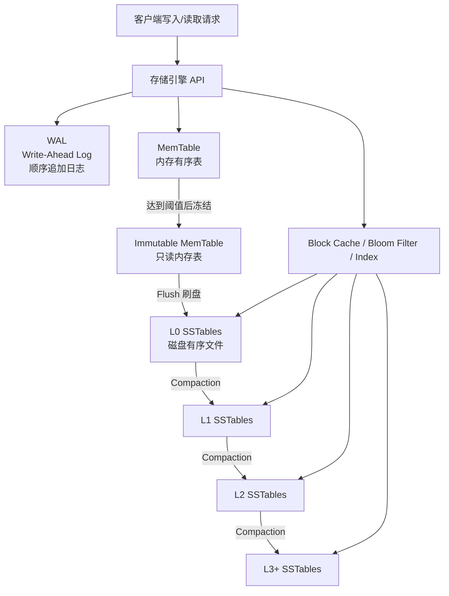
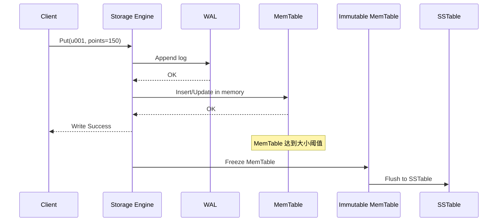
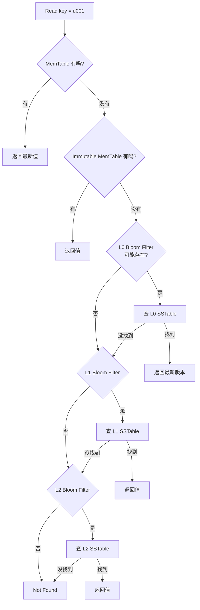
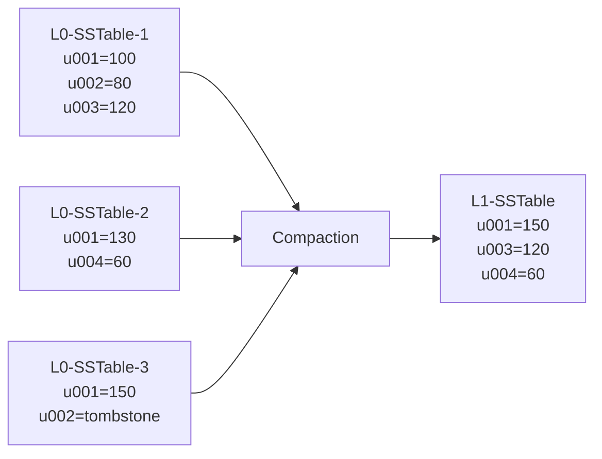
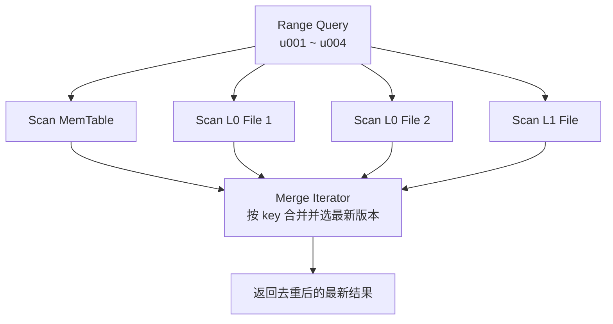
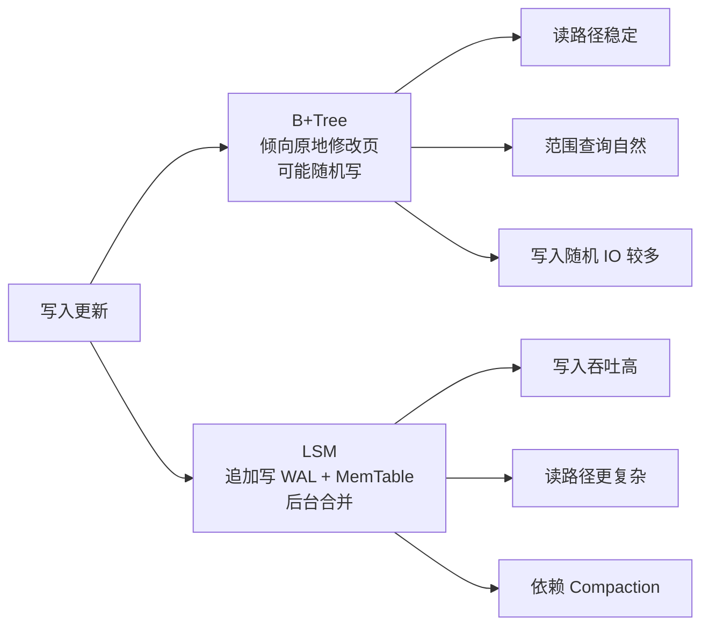

## **1. LSM 是什么**

LSM，全称 **Log-Structured Merge Tree，日志结构合并树**，是一种常见的存储引擎架构，核心目标是：

> 用顺序写和批量合并，替代频繁的随机写。

它非常适合写入密集型系统，例如：

- RocksDB / LevelDB
- Cassandra
- HBase
- TiKV
- CockroachDB / Pebble
- 时间序列数据库
- 日志、指标、事件存储系统

---

## **2. 整体架构图**



LSM 主要由几部分组成：

| 组件 | 位置 | 作用 |
|---|---|---|
| WAL | 磁盘 | 崩溃恢复，先写日志保证数据不丢 |
| MemTable | 内存 | 接收最新写入，通常是有序结构 |
| Immutable MemTable | 内存 | 冻结后的 MemTable，等待刷盘 |
| SSTable | 磁盘 | 不可变、有序的数据文件 |
| Bloom Filter | 内存/磁盘元数据 | 快速判断某个文件是否可能包含 key |
| Block Index | 磁盘/缓存 | 定位 SSTable 内部数据块 |
| Compaction | 后台任务 | 合并文件、清理旧版本和删除标记 |

---

## **3. 测试表数据**

假设我们有一张用户积分表：

| user_id | name | points | updated_at |
|---|---:|---:|---|
| u001 | Alice | 100 | 10:00 |
| u002 | Bob | 80 | 10:01 |
| u003 | Cindy | 120 | 10:02 |

业务不断更新用户积分：

```text
10:03  u001 points = 130
10:04  u004 points = 60
10:05  delete u002
10:06  u001 points = 150
```

在 LSM 中，这些修改不会立刻去磁盘旧位置原地更新，而是追加新版本。

逻辑上看：

| 时间 | 操作 | key | value |
|---|---|---|---|
| 10:00 | put | u001 | Alice, 100 |
| 10:01 | put | u002 | Bob, 80 |
| 10:02 | put | u003 | Cindy, 120 |
| 10:03 | put | u001 | Alice, 130 |
| 10:04 | put | u004 | David, 60 |
| 10:05 | delete | u002 | tombstone |
| 10:06 | put | u001 | Alice, 150 |

最终查询 `u001` 时，应返回最新版本：

```text
u001 -> Alice, 150
```

查询 `u002` 时，读到 tombstone，表示已删除。

---

## **4. 写入流程图**



写入路径可以简化为：

```text
写请求
  -> 追加 WAL
  -> 写 MemTable
  -> 返回成功
  -> 后台刷盘
  -> 后台合并
```

写入快的原因是：

- WAL 是顺序追加
- MemTable 是内存写入
- 不需要立即随机修改磁盘中的旧数据
- 多次更新可以在后续 compaction 中合并清理

---

## **5. 磁盘上的数据演化**

初始写入后，MemTable 可能长这样：

```text
MemTable
u001 -> Alice, 100
u002 -> Bob, 80
u003 -> Cindy, 120
```

刷盘后生成一个 SSTable：

```text
L0-SSTable-1
u001 -> Alice, 100
u002 -> Bob, 80
u003 -> Cindy, 120
```

后续更新又生成新的 SSTable：

```text
L0-SSTable-2
u001 -> Alice, 130
u004 -> David, 60
```

删除和再次更新：

```text
L0-SSTable-3
u001 -> Alice, 150
u002 -> tombstone
```

此时同一个 key 可能分布在多个文件中：

```text
u001:
  L0-SSTable-3 -> Alice, 150
  L0-SSTable-2 -> Alice, 130
  L0-SSTable-1 -> Alice, 100
```

LSM 查询时会按“新到旧”的顺序找，返回最新值。

---

## **6. 读取流程图**



读取路径比写入复杂，因为数据可能存在于：

- MemTable
- Immutable MemTable
- L0 SSTable
- L1 SSTable
- L2 SSTable
- 更低层 SSTable

为了减少无效查询，LSM 通常依赖：

| 优化手段 | 作用 |
|---|---|
| Bloom Filter | 判断某个 SSTable 是否可能包含 key |
| Sparse Index | 快速定位 SSTable 内部位置 |
| Block Cache | 缓存热点数据块 |
| Prefix Bloom | 优化前缀查询 |
| Partitioned Index | 减少大索引常驻内存压力 |

---

## **7. Compaction 合并过程**

Compaction 是 LSM 的核心后台机制。

它会把多个 SSTable 合并成新的 SSTable，并清理：

- 旧版本数据
- 已删除数据
- tombstone
- 重复 key
- 过期数据

示意图：



合并前：

| key | 文件 1 | 文件 2 | 文件 3 |
|---|---|---|---|
| u001 | 100 | 130 | 150 |
| u002 | 80 | - | tombstone |
| u003 | 120 | - | - |
| u004 | - | 60 | - |

合并后：

| key | 最新结果 |
|---|---|
| u001 | 150 |
| u002 | 已删除 |
| u003 | 120 |
| u004 | 60 |

所以新的 SSTable 中只保留：

```text
u001 -> Alice, 150
u003 -> Cindy, 120
u004 -> David, 60
```

---

## **8. 场景一：高频写入的用户行为日志**

假设业务每秒写入大量用户行为：

```text
user_id, event_type, product_id, timestamp
```

例如：

| user_id | event_type | product_id | timestamp |
|---|---|---|---|
| u001 | view | p100 | 10:00:01 |
| u002 | click | p101 | 10:00:02 |
| u001 | cart | p100 | 10:00:03 |
| u003 | view | p200 | 10:00:04 |

这类场景特点是：

- 写入量大
- 多为追加
- 查询通常按时间范围或用户维度
- 对写吞吐要求高

LSM 很适合，因为数据可以快速追加到 WAL 和 MemTable，再批量刷盘。

适合系统：

- 日志平台
- 埋点系统
- 监控指标
- 时间序列数据库
- 用户行为分析系统

---

## **9. 场景二：商品库存频繁更新**

例如库存表：

| sku_id | stock | updated_at |
|---|---:|---|
| sku001 | 100 | 10:00 |
| sku002 | 80 | 10:00 |

不断发生扣减：

```text
sku001: 100 -> 99 -> 98 -> 97
```

LSM 不会每次都在磁盘原地更新 `sku001`，而是写入多个版本：

```text
sku001 -> 100
sku001 -> 99
sku001 -> 98
sku001 -> 97
```

读取时返回最新版本 `97`，后台 compaction 会逐渐清理旧版本。

这个场景需要注意：

- 热点 key 会产生大量版本
- compaction 压力可能变大
- 读最新值需要良好的缓存
- 如果强事务要求很高，需要结合 MVCC、锁、Raft 等机制

LSM 能承担高写入，但不是单独解决事务一致性的全部答案。

---

## **10. 场景三：范围查询**

假设查询：

```sql
SELECT * FROM user_points
WHERE user_id >= 'u001' AND user_id <= 'u004';
```

LSM 中每个 SSTable 内部是有序的，所以单个文件的范围扫描效率不错。

但问题是，同一个范围可能分布在多个层级和多个文件中：

```text
MemTable:      u001, u004
L0-File-1:     u001, u002
L0-File-2:     u003, u004
L1-File-1:     u001, u002, u003, u004
```

范围查询需要做多路归并：



LSM 的范围查询通常比 B+Tree 更复杂，尤其当 L0 文件较多、层级较多时。

---

## **11. 三种放大问题**

LSM 的核心权衡是三个放大。

| 类型 | 含义 | 例子 |
|---|---|---|
| 写放大 | 一条数据被重复写多次 | 从 L0 合并到 L1、L2、L3 |
| 读放大 | 一次查询要查多个结构 | MemTable + 多个 SSTable |
| 空间放大 | 旧版本和 tombstone 暂时占空间 | 删除后磁盘不立即下降 |

示意：

```text
写放大：
一次业务写入
  -> WAL 写一次
  -> SSTable 写一次
  -> Compaction 又写多次

读放大：
一次 key 查询
  -> 查内存
  -> 查 L0
  -> 查 L1
  -> 查 L2

空间放大：
旧值、新值、删除标记
  -> 在 compaction 前可能同时存在
```

LSM 调优本质上就是在这三个指标之间做平衡。

---

## **12. 常见 Compaction 策略对比**

| 策略 | 特点 | 优点 | 缺点 | 适合场景 |
|---|---|---|---|---|
| Size-Tiered | 大小相近的文件一起合并 | 写放大低 | 读放大、空间放大高 | 写多读少 |
| Leveled | 每层有大小限制，文件尽量不重叠 | 读性能好，空间更稳 | 写放大高 | 读写混合 |
| Universal | 更灵活的批量合并 | 写入友好 | 参数复杂 | 高吞吐写入 |
| FIFO | 按时间淘汰旧文件 | 简单高效 | 不适合任意更新 | 日志、时序数据 |

---

## **13. LSM 和 B+Tree 对比**



| 维度 | LSM | B+Tree |
|---|---|---|
| 写入 | 顺序写为主，吞吐高 | 原地更新，随机写较多 |
| 点查 | 需要 Bloom Filter、缓存优化 | 路径稳定 |
| 范围查询 | 需要多路归并 | 天然有序扫描 |
| 删除 | tombstone + compaction | 可直接修改索引结构 |
| 后台负载 | compaction 很重 | 页分裂、页合并 |
| 适合 | 写密集、大规模 KV | 读密集、传统关系索引 |

---

## **14. 一个完整例子**

以 `put(u001, 150)` 为例：

```text
1. 客户端发起写入
2. 存储引擎追加 WAL
3. 写入 MemTable
4. 返回写入成功
5. MemTable 满后变成 Immutable MemTable
6. Immutable MemTable 刷盘成 L0 SSTable
7. 多个 L0 SSTable 触发 compaction
8. 合并到 L1/L2
9. 清理旧版本和 tombstone
```

以 `get(u001)` 为例：

```text
1. 先查 MemTable
2. 再查 Immutable MemTable
3. 再查较新的 L0 文件
4. 使用 Bloom Filter 跳过不相关 SSTable
5. 查到多个版本时选择最新版本
6. 如果遇到 tombstone，返回不存在
```

---

## **15. 总结**

LSM 架构的核心不是“树”，而是一个分层的日志化存储体系：

```text
WAL + MemTable + SSTable + Compaction
```

它把前台写入做得非常轻：

```text
顺序写日志 + 内存写入
```

再通过后台 compaction 慢慢整理数据。

它的优势是：

- 写入吞吐高
- 适合大规模数据
- 适合 SSD 和分布式 KV
- 对日志、事件、指标、时序数据非常友好

它的代价是：

- 读取路径复杂
- compaction 调度困难
- 存在写放大、读放大、空间放大
- 删除不会立刻释放空间
- 参数调优对性能影响很大

一句话收束：

> LSM 是一种用后台复杂度换前台写入性能的存储架构。写入越重、数据越大、越能接受后台整理，它的价值越明显。