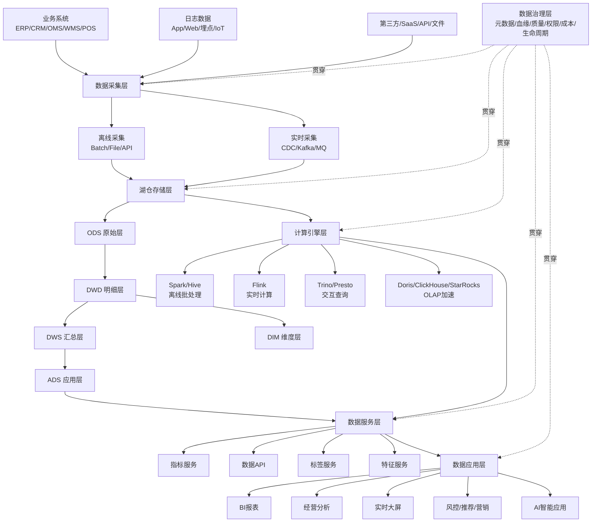
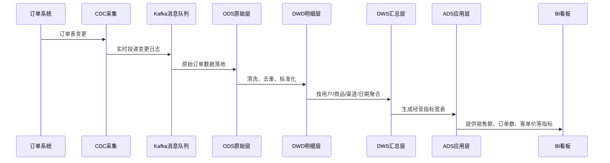
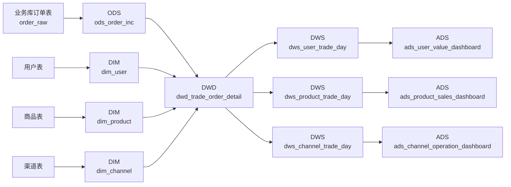
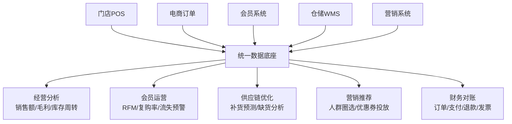
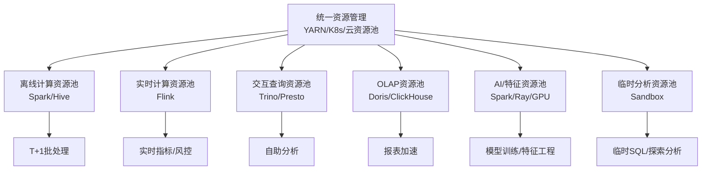
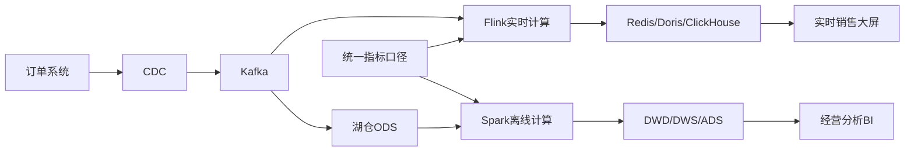
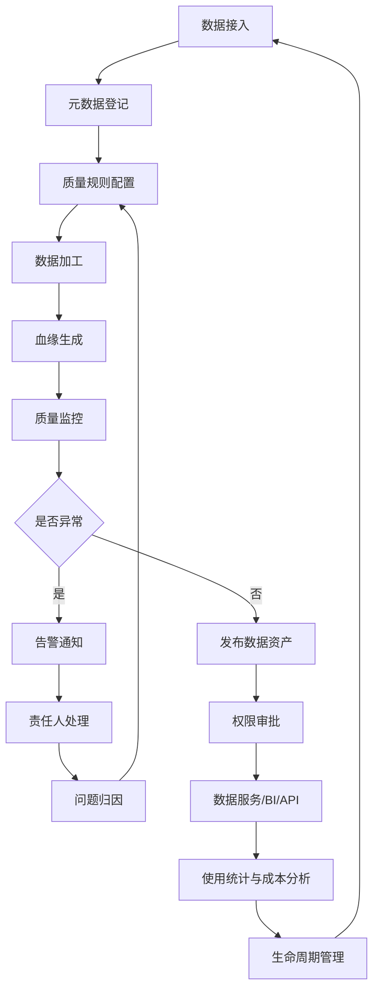

**1. 企业级数据底座总体架构图**



这个图的重点是：**采集统一、存储分层、计算分池、治理贯穿、服务输出**。

**2. 数据流转流程图**

以“订单数据进入数仓并服务经营看板”为例：



典型处理逻辑：

```text
订单原始数据
→ 去重
→ 字段标准化
→ 关联用户维度、商品维度、渠道维度
→ 生成订单明细事实表
→ 聚合为日/周/月指标
→ 输出到经营看板
```

**3. 数仓分层示例图**



分层示例：

| 层级 | 表名示例 | 说明 |
|---|---|---|
| ODS | `ods_order_inc` | 订单原始增量数据 |
| DWD | `dwd_trade_order_detail` | 清洗后的订单明细事实表 |
| DIM | `dim_user`、`dim_product` | 公共维度表 |
| DWS | `dws_user_trade_day` | 用户粒度每日交易汇总 |
| ADS | `ads_sales_dashboard` | 面向经营看板的应用表 |

**4. 业务场景示例：零售企业数据底座**



零售企业可沉淀的核心主题域：

| 主题域 | 核心数据 | 典型应用 |
|---|---|---|
| 交易域 | 订单、支付、退款 | 销售分析、财务对账 |
| 商品域 | SKU、类目、价格 | 商品分析、毛利分析 |
| 会员域 | 用户、等级、积分 | 画像、营销、复购 |
| 库存域 | 入库、出库、库存 | 补货、缺货、周转 |
| 渠道域 | 门店、电商、直播 | 渠道经营分析 |
| 营销域 | 活动、券、触达 | ROI、转化率分析 |

**5. 容量测算示例**

假设一家中大型零售企业：

| 数据类型 | 日新增量 | 保留周期 | 说明 |
|---|---:|---:|---|
| 业务数据库 CDC | 500 GB/天 | 3 年 | 订单、会员、商品、库存 |
| 用户行为日志 | 1.5 TB/天 | 1 年 | App/Web/小程序埋点 |
| 实时消息数据 | 300 GB/天 | 180 天 | 风控、营销触达 |
| 第三方/API/文件 | 200 GB/天 | 3 年 | 广告、物流、供应商 |

总日新增：

```text
500 GB + 1.5 TB + 300 GB + 200 GB = 2.5 TB/天
```

存储估算公式：

```text
总存储 = 日新增量 × 保留天数 × 副本系数 × 冗余系数 / 压缩比
```

按 3 年综合保留粗略估算：

```text
日新增：2.5 TB
保留：1095 天
副本系数：3
冗余系数：1.3
压缩比：3:1

2.5 × 1095 × 3 × 1.3 / 3 ≈ 3559 TB
```

也就是大约：

```text
3.5 PB 存储空间
```

如果采用对象存储 + 冷热分层：

| 数据层级 | 保留策略 | 存储建议 |
|---|---|---|
| 热数据 | 最近 30-90 天 | 高性能存储/高频访问 |
| 温数据 | 3-12 个月 | 标准对象存储 |
| 冷数据 | 1-3 年 | 低频对象存储/归档 |
| 过期数据 | 超过合规周期 | 删除或离线归档 |

**6. 计算资源配置示例**

假设每日需要处理 2.5 TB 新增数据，并要求 6 小时内完成 T+1 加工。

基础吞吐需求：

```text
2.5 TB / 6 小时 = 0.42 TB/小时
```

但实际 ETL 会包含清洗、Join、聚合、宽表加工，通常要乘复杂度系数：

| 任务类型 | 复杂度系数 |
|---|---:|
| 简单清洗 | 1-2 倍 |
| 多表 Join | 2-5 倍 |
| 大宽表加工 | 3-8 倍 |
| 历史回刷 | 单独评估 |

如果按 4 倍复杂度估算：

```text
0.42 TB/小时 × 4 = 1.68 TB/小时
```

再预留 40% 峰值冗余：

```text
1.68 × 1.4 ≈ 2.35 TB/小时
```

也就是说，离线计算集群至少要稳定支持 **约 2.35 TB/小时** 的加工吞吐。

资源池建议：



核心原则：**生产任务、实时任务、BI 查询、临时分析、历史回刷要资源隔离**。

**7. 实时 + 离线一体化场景图**

以“实时销售大屏 + 次日经营分析”为例：



这个场景的关键是：

- 实时链路服务“分钟级/秒级”指标。
- 离线链路服务“准确、完整、可追溯”的 T+1 分析。
- 实时和离线必须共用统一指标口径，否则大屏和日报会打架。

**8. 企业数据治理闭环图**



治理不是一次性动作，而是闭环：

```text
登记 → 校验 → 监控 → 告警 → 修复 → 发布 → 使用 → 成本优化 → 生命周期管理
```

**9. 指标体系示例**

以销售分析为例：

| 一级指标 | 二级指标 | 计算口径 |
|---|---|---|
| 销售规模 | GMV | 下单金额，未剔除退款 |
| 销售规模 | 实收金额 | 支付金额 - 退款金额 |
| 订单效率 | 订单数 | 支付成功订单数 |
| 客户价值 | 客单价 | 实收金额 / 支付用户数 |
| 转化效率 | 支付转化率 | 支付用户数 / 访问用户数 |
| 商品效率 | 动销率 | 有销量 SKU 数 / 上架 SKU 数 |
| 库存效率 | 库存周转天数 | 平均库存 / 日均销售成本 |

指标平台中建议维护：

```text
指标名称
业务定义
技术口径
统计周期
统计维度
负责人
数据来源
更新时间
权限等级
```

**10. 最终推荐架构选型**

如果是新建企业级数据底座，推荐如下组合：

| 能力 | 推荐选型 |
|---|---|
| 存储底座 | 对象存储/HDFS + Iceberg/Hudi/Delta |
| 离线计算 | Spark |
| 实时计算 | Flink |
| 消息队列 | Kafka/Pulsar |
| 查询引擎 | Trino/Presto |
| OLAP 加速 | Doris/ClickHouse/StarRocks |
| 调度编排 | Airflow/DolphinScheduler/DataWorks |
| 元数据治理 | DataHub/Atlas/云厂商数据治理 |
| 数据质量 | Great Expectations/自研规则平台 |
| BI 分析 | Superset/Power BI/Tableau/Quick BI |
| 数据服务 | API 网关 + 指标服务 + 标签服务 |

**一句话版架构原则**

```text
底层用湖仓承载规模，中层用分层模型沉淀复用，上层用指标和服务支撑业务，横向用治理体系保证可信，纵向用资源隔离保障稳定。
```