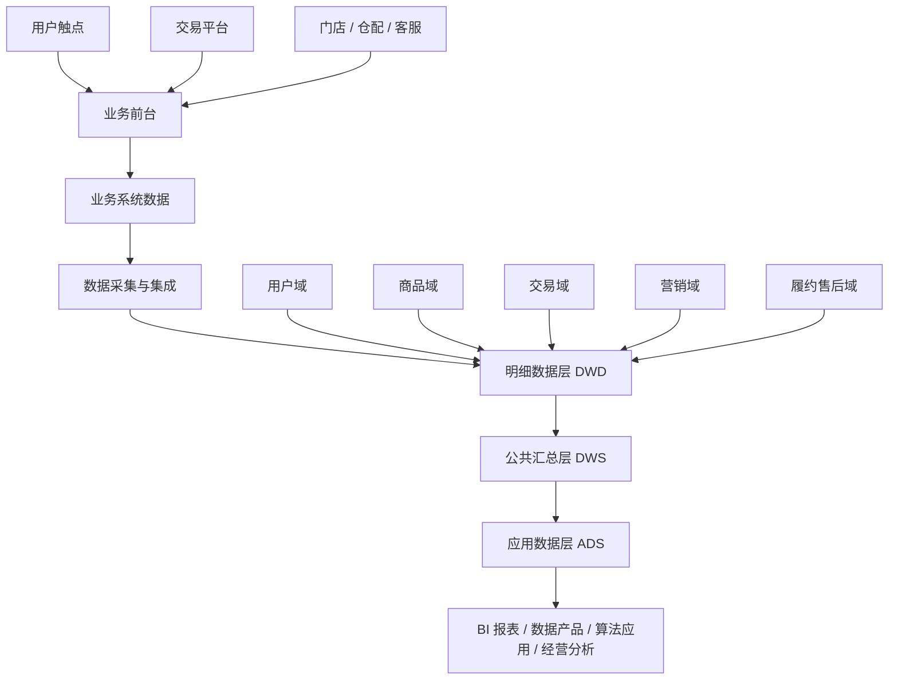
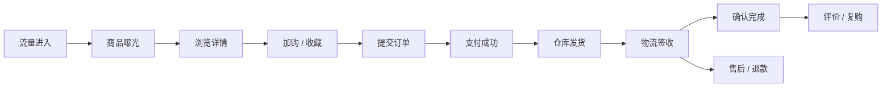
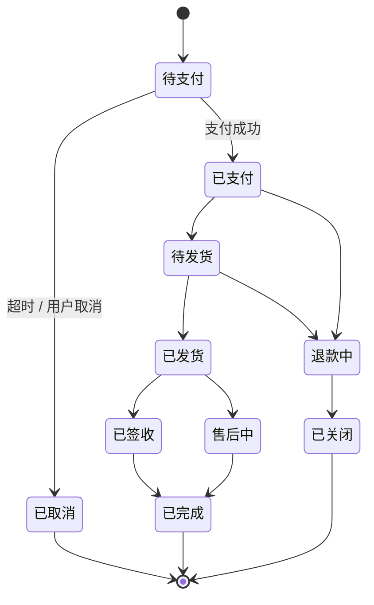
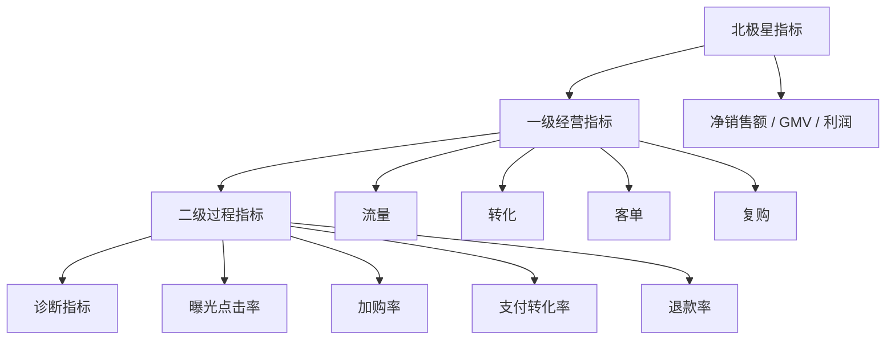

# 电商数据中台业务知识手册

这份手册的目标不是罗列电商名词，而是把电商业务拆成可建模、可治理、可复用的数据知识。使用时可以从四个问题切入：

1. 这个业务属于哪个主题域？
2. 业务对象、业务流程、状态机是什么？
3. 会产生哪些事实表、维度表和指标？
4. 在数据中台里应该沉淀成哪些公共数据资产？

## 1. 总体框架

电商数据中台可以理解为把前台业务系统中的用户、商品、交易、营销、库存、履约、售后、财务等业务活动，沉淀为统一的数据模型、指标口径、标签能力和数据服务。



数据建模时建议遵循：

```text
业务域 -> 业务流程 -> 业务实体 -> 事件事实 -> 维度属性 -> 指标口径 -> 数据服务
```

## 2. 电商核心业务链路

标准电商主链路如下：



围绕这条链路，数据中台至少要沉淀三类能力：

| 能力 | 说明 | 典型产物 |
| --- | --- | --- |
| 业务对象沉淀 | 识别电商世界中的核心对象 | 用户、商品、SKU、订单、支付、仓库、活动、券、售后单 |
| 业务过程沉淀 | 识别每个业务动作如何发生 | 曝光、点击、加购、下单、支付、发货、签收、退款 |
| 指标口径沉淀 | 统一经营分析口径 | GMV、实付金额、支付转化率、退款率、动销率、复购率 |

## 3. 业务主题域总览

| 主题域 | 核心问题 | 主要实体 | 主要事实 |
| --- | --- | --- | --- |
| 用户域 | 谁来了、谁买了、谁流失了 | 用户、会员、标签、等级、账户 | 注册、登录、访问、购买、复购、流失 |
| 流量域 | 用户从哪里来、如何浏览 | 渠道、页面、会话、搜索词、广告 | 曝光、点击、浏览、搜索、加购、收藏 |
| 商品域 | 卖什么、如何组织货品 | SPU、SKU、类目、品牌、属性、价格 | 上架、下架、改价、曝光、销售、库存变动 |
| 交易域 | 订单如何产生和完成 | 订单、订单明细、支付单、优惠、发票 | 下单、支付、取消、改价、退款 |
| 营销域 | 如何拉新、促活、转化 | 活动、优惠券、满减、积分、会员权益 | 领券、核销、参与活动、触达、转化 |
| 库存域 | 货在哪里、还能卖多少 | 仓库、库位、库存批次、渠道库存 | 入库、出库、锁定、释放、盘点、调拨 |
| 履约域 | 如何发货、如何送达 | 包裹、运单、物流商、配送节点 | 拣货、打包、出库、揽收、运输、签收 |
| 售后域 | 退换修赔如何处理 | 售后单、退款单、退货单、工单 | 申请、审核、寄回、验收、退款、关闭 |
| 商家 / 渠道域 | 谁在卖、在哪卖 | 店铺、商家、渠道、平台、门店 | 上架、销售、结算、评分、服务 |
| 财务结算域 | 钱如何确认和结算 | 支付流水、退款流水、结算单、发票 | 收款、退款、分账、佣金、对账、开票 |

## 4. 核心数据对象

### 4.1 用户 User

用户是电商经营的主体，需要区分自然人、账号、会员、设备、OpenID、手机号等不同标识。

| 概念 | 说明 | 建模提示 |
| --- | --- | --- |
| 用户 ID | 业务系统内的用户唯一标识 | 作为用户域主键，但不一定能跨渠道统一 |
| 会员 ID | 会员体系中的身份标识 | 适合沉淀会员等级、积分、权益 |
| 设备 ID | App / 小程序 / Web 设备标识 | 适合流量归因和匿名行为分析 |
| OpenID / UnionID | 平台生态身份 | 微信、小程序、企微、公众号等场景常见 |
| 手机号 | 强身份标识 | 需要脱敏、加密和权限控制 |

用户域建模难点在于身份打通。数据中台需要建设统一用户 ID 或 OneID，用于连接访问、交易、会员、客服和售后数据。

### 4.2 商品 Product / SPU / SKU

商品域通常有三层概念：

| 层级 | 说明 | 示例 |
| --- | --- | --- |
| SPU | 标准产品单元，表达“是什么商品” | iPhone 17 Pro |
| SKU | 库存量单位，表达“可售卖的具体规格” | iPhone 17 Pro 256G 黑色 |
| Item / Listing | 渠道售卖单元，表达“在哪个渠道怎么卖” | 天猫某链接、抖音某商品卡、门店某价签 |

建模时要区分：

- 商品主数据：类目、品牌、属性、规格、生命周期。
- 售卖数据：上架渠道、售卖价格、活动价格、上下架状态。
- 库存数据：仓库、门店、渠道、可售库存、锁定库存。

### 4.3 订单 Order / 订单明细 Order Item

订单表达用户的一次交易意图，订单明细表达订单中每个 SKU 的购买行。

| 对象 | 推荐粒度 | 典型字段 |
| --- | --- | --- |
| 订单 | 一笔订单一行 | 订单 ID、用户 ID、店铺 ID、渠道、下单时间、订单状态、订单金额 |
| 订单明细 | 一笔订单中的一个 SKU 一行 | 订单 ID、明细 ID、SKU ID、数量、原价、优惠、实付、退款状态 |

电商交易分析通常优先使用订单明细事实表，因为它天然能按商品、类目、品牌、渠道、活动进行拆解。

### 4.4 支付 Payment

支付是资金确认的关键动作，不能简单等同于订单。

| 对象 | 说明 |
| --- | --- |
| 支付单 | 一次支付请求，可对应一笔或多笔订单 |
| 支付流水 | 支付机构返回的资金流水 |
| 退款流水 | 退款机构返回的资金逆向流水 |
| 支付渠道 | 微信、支付宝、银行卡、余额、礼品卡等 |

常见关系：

- 一笔订单可能多次支付尝试。
- 一笔支付可能合并支付多笔订单。
- 一笔订单可能发生多次部分退款。

### 4.5 优惠 Promotion

优惠是影响 GMV、实付、毛利和营销 ROI 的核心对象。

| 优惠类型 | 说明 | 数据关注点 |
| --- | --- | --- |
| 优惠券 | 用户领取后使用 | 发券、领券、核销、过期、退回 |
| 满减 | 满足门槛自动减免 | 门槛、分摊、活动归因 |
| 秒杀 / 限时折扣 | 限时低价活动 | 活动库存、活动价、转化率 |
| 会员价 | 会员身份权益 | 会员等级、权益成本 |
| 积分 / 储值 | 用户资产抵扣 | 账户流水、财务确认 |

建模重点是优惠分摊。订单级优惠要按订单明细分摊，否则商品毛利、品类分析和活动 ROI 会失真。

## 5. 业务流程与状态机

### 5.1 订单状态



订单状态建模注意事项：

- 待支付订单通常不计入支付 GMV，但有些业务会统计下单 GMV。
- 已支付未发货订单是履约压力和备货分析的重要对象。
- 已关闭订单要区分未支付关闭、全额退款关闭、风控关闭。
- 订单状态和售后状态不要混成一个字段。

### 5.2 支付状态

| 状态 | 说明 | 指标影响 |
| --- | --- | --- |
| 未支付 | 已下单但未付款 | 下单转化分析 |
| 支付中 | 已发起支付，等待回调 | 支付链路监控 |
| 支付成功 | 支付机构确认成功 | 支付 GMV、实付金额 |
| 支付失败 | 支付失败或超时 | 支付成功率 |
| 部分退款 | 部分金额退回 | 净销售额 |
| 全额退款 | 全部金额退回 | 退款率、净销售额 |

### 5.3 库存状态

| 库存概念 | 公式 / 说明 |
| --- | --- |
| 实物库存 | 仓库或门店实际存在的库存 |
| 可售库存 | 可被前台销售的库存 |
| 锁定库存 | 已下单未出库、暂时占用的库存 |
| 在途库存 | 采购、调拨、退货途中库存 |
| 残次库存 | 不可正常销售库存 |

常见公式：

```text
可售库存 = 实物库存 - 锁定库存 - 不可售库存
```

但不同企业会把安全库存、活动库存、渠道预占库存纳入计算，因此可售库存必须沉淀企业级口径。

### 5.4 售后状态

| 状态 | 说明 |
| --- | --- |
| 申请中 | 用户发起退款、退货、换货或维修申请 |
| 待审核 | 客服或系统审核中 |
| 待寄回 | 用户需要寄回商品 |
| 待验收 | 仓库或门店验收退货 |
| 退款中 | 财务或支付渠道处理中 |
| 已完成 | 售后流程完成 |
| 已拒绝 | 不满足售后条件 |
| 已取消 | 用户取消售后 |

售后建模要区分仅退款、退货退款、换货、补发、维修、赔付等不同类型。

## 6. 数据分层与主题建模

### 6.1 推荐分层

| 层级 | 定位 | 电商示例 |
| --- | --- | --- |
| ODS | 原始业务数据，尽量贴源 | 订单表、支付表、商品表、库存流水表、埋点日志 |
| DWD | 明细事实和干净维度 | 订单明细事实、支付流水事实、商品维度、用户维度 |
| DWS | 公共汇总，面向主题复用 | 用户日汇总、商品日汇总、渠道日汇总、活动日汇总 |
| ADS | 应用数据集市 | 经营看板、交易分析、商品分析、用户画像、库存预警 |
| DIM | 公共维度 | 日期、用户、商品、店铺、渠道、活动、仓库 |

### 6.2 主题域与表设计

| 主题域 | DWD 明细事实 | DIM 公共维度 | DWS 公共汇总 |
| --- | --- | --- | --- |
| 流量域 | dwd_traffic_event_di | dim_channel、dim_page、dim_device | dws_user_traffic_1d、dws_page_traffic_1d |
| 用户域 | dwd_user_register_di、dwd_member_change_di | dim_user、dim_member_level | dws_user_lifecycle_1d |
| 商品域 | dwd_product_status_change_di | dim_product_sku、dim_product_spu、dim_category | dws_sku_trade_1d、dws_category_trade_1d |
| 交易域 | dwd_trade_order_detail_di、dwd_trade_payment_di | dim_shop、dim_channel、dim_activity | dws_trade_user_1d、dws_trade_sku_1d |
| 营销域 | dwd_coupon_receive_di、dwd_coupon_use_di | dim_coupon、dim_campaign | dws_campaign_effect_1d |
| 库存域 | dwd_inventory_change_di、dwd_inventory_snapshot_df | dim_warehouse、dim_store | dws_sku_inventory_1d |
| 履约域 | dwd_fulfillment_package_di、dwd_logistics_trace_di | dim_logistics_provider | dws_fulfillment_efficiency_1d |
| 售后域 | dwd_after_sales_order_di、dwd_refund_flow_di | dim_after_sales_reason | dws_after_sales_sku_1d |
| 财务域 | dwd_settlement_flow_di、dwd_invoice_di | dim_payment_channel | dws_finance_revenue_1d |

命名后缀建议：

| 后缀 | 含义 |
| --- | --- |
| `_di` | 增量事实表，按天分区 |
| `_df` | 全量快照表，按天分区 |
| `_1d` | 最近 1 天汇总 |
| `_nd` | 最近 N 天汇总 |
| `_td` | 截至当天累计 |

## 7. 核心事实表设计

### 7.1 订单明细事实表

推荐粒度：一笔订单中的一个 SKU 一行。

| 字段类别 | 典型字段 |
| --- | --- |
| 主键 | order_id、order_item_id |
| 业务维度键 | user_id、sku_id、spu_id、shop_id、channel_id、activity_id |
| 时间 | order_create_time、pay_time、ship_time、finish_time |
| 状态 | order_status、pay_status、refund_status、fulfillment_status |
| 金额 | original_amount、discount_amount、payable_amount、paid_amount、refund_amount |
| 数量 | order_qty、paid_qty、refund_qty |
| 分摊 | order_discount_alloc_amount、coupon_alloc_amount、platform_subsidy_amount |

典型指标：

- 下单件数
- 下单金额
- 支付件数
- 支付金额
- 实付金额
- 退款金额
- 净销售额
- 客单价
- 件单价

建模注意：

- 支付金额、实付金额、应付金额、退款后净额必须拆开。
- 优惠分摊要在订单明细粒度完成。
- 订单事实可以按订单创建时间入分区，但支付分析可能需要按支付时间重算。
- 跨天支付、跨天退款会带来口径差异，需要明确统计日期。

### 7.2 支付流水事实表

推荐粒度：一笔支付渠道流水一行。

| 字段类别 | 典型字段 |
| --- | --- |
| 主键 | payment_flow_id、payment_id |
| 关联键 | order_id、user_id、payment_channel |
| 时间 | pay_request_time、pay_success_time、callback_time |
| 状态 | payment_status、reconcile_status |
| 金额 | pay_amount、fee_amount |
| 渠道 | 微信、支付宝、银行卡、余额、储值卡 |

建模注意：

- 用于资金对账时，以支付渠道流水为准。
- 用于经营交易分析时，以订单明细分摊后的支付金额为准。
- 合并支付场景必须建立支付单与订单的桥接关系。

### 7.3 流量行为事实表

推荐粒度：一次用户行为事件一行。

| 字段类别 | 典型字段 |
| --- | --- |
| 用户标识 | user_id、member_id、device_id、session_id |
| 行为 | event_type、event_name、page_id、element_id |
| 商品 | sku_id、spu_id、category_id |
| 渠道 | channel_id、utm_source、utm_campaign |
| 时间 | event_time、event_date |
| 环境 | app_version、os、city、ip、network_type |

典型事件：

- 页面访问
- 商品曝光
- 商品点击
- 搜索
- 加购
- 收藏
- 提交订单
- 支付成功

建模注意：

- 曝光、点击、浏览、加购、下单、支付要能串成漏斗。
- 匿名用户和登录用户要通过 OneID 或设备映射打通。
- 流量归因要保留来源参数、落地页、会话、首次触点和末次触点。

### 7.4 库存快照事实表

推荐粒度：某天某仓库某 SKU 一行。

| 字段类别 | 典型字段 |
| --- | --- |
| 主键 | snapshot_date、warehouse_id、sku_id |
| 库存数量 | physical_qty、available_qty、locked_qty、in_transit_qty、defective_qty |
| 库存金额 | cost_amount、retail_amount |
| 状态 | inventory_status |
| 组织 | warehouse_id、store_id、channel_id |

建模注意：

- 库存适合用快照事实表表达存量，用库存流水事实表表达变化。
- 周转天数、售罄率、缺货率依赖库存快照与销售事实的组合。
- 一盘货场景要区分真实库存、渠道可售库存、平台同步库存。

## 8. 公共维度设计

### 8.1 用户维度

| 字段类别 | 典型字段 |
| --- | --- |
| 身份 | user_id、one_id、member_id、mobile_hash |
| 基础属性 | gender、birth_year、city、register_channel |
| 会员属性 | member_level、points_balance、growth_value |
| 生命周期 | first_visit_date、first_order_date、last_order_date、lifecycle_stage |
| 标签 | new_customer_flag、high_value_flag、silent_flag、churn_risk_flag |

用户维度需要支持 SCD 缓慢变化。会员等级、生命周期阶段、城市、标签等字段会随时间变化，分析时要明确使用当前值还是历史快照值。

### 8.2 商品维度

| 字段类别 | 典型字段 |
| --- | --- |
| 标识 | sku_id、spu_id、barcode |
| 类目 | category_id、category_lv1、category_lv2、category_lv3 |
| 品牌 | brand_id、brand_name |
| 属性 | color、size、spec、season、series |
| 价格 | list_price、cost_price、suggested_price |
| 生命周期 | create_date、launch_date、offline_date、product_status |

商品维度要关注历史拉链。类目调整、品牌调整、规格修正会影响历史销售归属。

### 8.3 渠道维度

| 渠道类型 | 示例 |
| --- | --- |
| 自营线上 | App、官网、小程序、私域商城 |
| 平台电商 | 天猫、京东、拼多多、唯品会 |
| 内容电商 | 抖音、快手、小红书 |
| 本地生活 | 美团、到店团购、即时零售 |
| 线下门店 | 直营店、加盟店、商场店 |
| 私域触点 | 企微、社群、公众号、短信 |

渠道维度需要统一渠道层级，例如一级渠道、二级渠道、三级触点。否则跨平台经营分析会出现口径冲突。

### 8.4 时间维度

时间维度除了自然日，还要维护经营日历：

- 周、月、季度、年。
- 节假日、工作日、周末。
- 大促周期，如 618、双 11、年货节。
- 活动预热期、爆发期、返场期。
- 财务月、零售周、业务经营周期。

## 9. 指标体系

### 9.1 指标分层



### 9.2 经营指标总览

| 指标域 | 核心指标 | 常见分析维度 |
| --- | --- | --- |
| 流量 | UV、PV、访问次数、曝光次数、点击次数、跳出率 | 渠道、页面、活动、设备、城市 |
| 转化 | 点击率、加购率、下单转化率、支付转化率 | 商品、渠道、活动、用户分层 |
| 交易 | GMV、支付金额、实付金额、订单数、客单价、件单价 | 日期、商品、店铺、渠道、活动 |
| 用户 | 新客数、老客数、复购率、留存率、流失率、LTV | 会员等级、注册渠道、生命周期 |
| 商品 | 动销率、售罄率、库存周转天数、缺货率、滞销率 | SKU、SPU、类目、品牌、季节 |
| 营销 | 活动 GMV、券核销率、补贴金额、ROI、拉新人数 | 活动、券、触达渠道、人群包 |
| 履约 | 发货时效、签收时效、履约成功率、物流异常率 | 仓库、物流商、地区、渠道 |
| 售后 | 退款率、退货率、售后率、投诉率、客服响应时长 | 商品、渠道、原因、客服团队 |
| 财务 | 实收金额、退款金额、净销售额、毛利、结算金额 | 渠道、店铺、支付方式、结算周期 |

### 9.3 关键指标口径

| 指标 | 推荐口径 | 易错点 |
| --- | --- | --- |
| 下单 GMV | 下单成功订单的商品金额，通常不扣退款 | 是否包含未支付订单 |
| 支付 GMV | 支付成功订单的商品金额，通常不扣退款 | 是否包含运费、税费、礼品卡 |
| 实付金额 | 用户实际支付金额，扣除商家优惠、平台优惠等 | 是否包含积分、余额、储值卡 |
| 净销售额 | 支付金额 - 退款金额 | 退款按申请日还是退款成功日 |
| 客单价 | 支付金额 / 支付订单数 | 分母是否剔除退款订单 |
| 件单价 | 支付金额 / 支付件数 | 套装、赠品是否计件 |
| 支付转化率 | 支付用户数 / 访问用户数 | 分子分母是否同一周期、同一渠道 |
| 复购率 | 周期内购买 2 次及以上用户 / 购买用户 | 统计周期不同差异很大 |
| 退款率 | 退款金额 / 支付金额，或退款订单数 / 支付订单数 | 金额口径和订单口径不能混用 |
| 动销率 | 有销售 SKU 数 / 可售 SKU 数 | 可售 SKU 的定义要统一 |
| 售罄率 | 销售数量 / 期初库存或总可售量 | 适合季节性货品，口径需固定 |
| 库存周转天数 | 平均库存成本 / 销售成本 * 天数 | 需区分零售价和成本价 |

## 10. 各业务域建模详解

### 10.1 商品域

业务目标：

- 建立统一商品主数据。
- 支持商品销售、库存、毛利、动销、生命周期分析。
- 支持跨渠道商品映射。

核心实体：

- SPU
- SKU
- 类目
- 品牌
- 属性
- 价格
- 上下架状态
- 渠道商品

事实表：

| 表 | 粒度 | 用途 |
| --- | --- | --- |
| 商品状态变更事实 | 一次状态变更一行 | 上架、下架、禁售、删除 |
| 商品价格变更事实 | 一次价格变更一行 | 分析调价影响 |
| 商品销售明细事实 | 一笔订单 SKU 一行 | 商品交易分析 |
| 商品库存快照事实 | 某天某仓某 SKU 一行 | 库存与周转分析 |

建模注意：

- 商品主数据要区分业务主数据和渠道映射数据。
- SKU 不能直接等同于平台 item_id。
- 套装、组合商品、赠品需要单独建模。
- 类目变更需要保留历史归属。

### 10.2 用户域

业务目标：

- 建立统一用户视图。
- 支持拉新、促活、留存、复购、流失召回。
- 支持会员经营和用户分层。

核心实体：

- 用户
- 会员
- 设备
- 账户
- 标签
- 积分
- 权益

事实表：

| 表 | 粒度 | 用途 |
| --- | --- | --- |
| 用户注册事实 | 一个用户注册一行 | 拉新分析 |
| 用户登录事实 | 一次登录一行 | 活跃分析 |
| 用户行为事实 | 一次行为一行 | 漏斗与路径分析 |
| 用户交易事实 | 一个用户一天一行或一笔交易一行 | 购买分析 |
| 会员等级变更事实 | 一次等级变化一行 | 会员成长分析 |

建模注意：

- 用户、会员、客户、账号不是同一个概念。
- 跨渠道身份打通要保留置信度和来源。
- 用户标签要区分事实标签、统计标签、算法标签、人工标签。
- 用户生命周期口径要可解释，例如新客、活跃、沉默、流失、召回。

### 10.3 流量域

业务目标：

- 分析流量来源和访问质量。
- 支持渠道投放、页面优化、商品转化分析。
- 支持从曝光到支付的漏斗追踪。

核心实体：

- 访问会话
- 页面
- 坑位
- 渠道
- 广告计划
- 搜索词
- 推荐位

事实表：

| 表 | 粒度 | 用途 |
| --- | --- | --- |
| 行为事件事实 | 一次埋点事件一行 | 全链路行为分析 |
| 会话事实 | 一次 session 一行 | 访问质量分析 |
| 曝光事实 | 一次商品或内容曝光一行 | 曝光点击率 |
| 搜索事实 | 一次搜索一行 | 搜索转化和无结果分析 |

建模注意：

- 事件命名、事件属性、页面编码必须标准化。
- 同一漏斗的分子分母必须来自同一套埋点口径。
- 曝光数据量巨大，需考虑明细保留周期和聚合层设计。
- 流量归因模型要明确首次触点、末次触点还是多触点。

### 10.4 交易域

业务目标：

- 统一订单、支付、退款、优惠口径。
- 支持经营看板、品类分析、渠道分析、活动复盘。
- 支持财务、履约、售后下游分析。

核心实体：

- 订单
- 订单明细
- 支付单
- 支付流水
- 优惠分摊
- 发票

事实表：

| 表 | 粒度 | 用途 |
| --- | --- | --- |
| 订单事实 | 一笔订单一行 | 订单状态和订单级金额 |
| 订单明细事实 | 一个订单 SKU 一行 | 交易分析主事实 |
| 支付事实 | 一笔支付流水一行 | 支付成功率和资金确认 |
| 退款事实 | 一笔退款流水一行 | 退款和净销售额 |
| 优惠分摊事实 | 一个订单明细一种优惠一行 | 活动成本和毛利分析 |

建模注意：

- 交易域的核心是订单明细事实表。
- 同时保留下单时间、支付时间、发货时间、完成时间。
- 订单状态变化要么保留状态流水，要么支持历史回放。
- 退款会改变净销售额，但不应该覆盖原始交易事实。

### 10.5 营销域

业务目标：

- 评估活动效果。
- 支持优惠成本、ROI、用户触达、转化归因分析。
- 支持会员营销、私域营销、自动化营销。

核心实体：

- 活动
- 优惠券
- 人群包
- 触达任务
- 营销素材
- 权益

事实表：

| 表 | 粒度 | 用途 |
| --- | --- | --- |
| 活动参与事实 | 用户参与一次活动一行 | 活动转化分析 |
| 券领取事实 | 用户领取一张券一行 | 领券率 |
| 券核销事实 | 一张券使用一行 | 核销率和优惠成本 |
| 触达事实 | 一次用户触达一行 | 触达效果 |
| 人群包快照 | 某天某人群包用户一行 | 人群效果分析 |

建模注意：

- 营销活动要建立统一活动 ID。
- 活动归因要定义时间窗口。
- 券成本要区分商家承担、平台承担、品牌承担。
- 触达、打开、点击、购买需要能串联。

### 10.6 库存域

业务目标：

- 统一库存口径。
- 支持可售、缺货、滞销、周转、补货分析。
- 支持一盘货和多渠道库存同步。

核心实体：

- 仓库
- 门店
- 库位
- SKU
- 库存批次
- 库存流水
- 调拨单
- 采购单

事实表：

| 表 | 粒度 | 用途 |
| --- | --- | --- |
| 库存快照事实 | 某天某仓某 SKU 一行 | 存量分析 |
| 库存流水事实 | 一次库存变化一行 | 库存追溯 |
| 调拨事实 | 一张调拨单明细一行 | 仓间调拨分析 |
| 采购入库事实 | 一张入库单明细一行 | 到货与补货分析 |

建模注意：

- 库存有存量和流量两类事实。
- 库存分析必须保留组织层级：仓、门店、区域、渠道。
- 可售库存口径要和前台售卖系统一致。
- 缺货率需要结合曝光、访问、销售机会判断，不能只看库存为零。

### 10.7 履约域

业务目标：

- 监控订单从支付到签收的效率。
- 支持仓库、物流商、区域、渠道履约质量分析。
- 支持异常预警和成本优化。

核心实体：

- 履约单
- 包裹
- 运单
- 仓库
- 物流商
- 配送节点

事实表：

| 表 | 粒度 | 用途 |
| --- | --- | --- |
| 履约单事实 | 一个履约单一行 | 履约状态分析 |
| 包裹事实 | 一个包裹一行 | 拆单、合单、包裹跟踪 |
| 物流轨迹事实 | 一个物流节点一行 | 时效和异常分析 |
| 发货明细事实 | 一个包裹 SKU 一行 | 商品履约分析 |

建模注意：

- 一笔订单可能拆成多个包裹。
- 一个包裹可能包含多个 SKU。
- 履约时效要拆成支付到发货、发货到揽收、揽收到签收。
- 门店自提、即时配送、快递发货的履约口径不同。

### 10.8 售后域

业务目标：

- 分析退款、退货、换货、投诉原因。
- 支持商品质量、客服效率、渠道服务质量评估。
- 支持净销售额和财务核算。

核心实体：

- 售后单
- 退款单
- 退货单
- 换货单
- 工单
- 售后原因

事实表：

| 表 | 粒度 | 用途 |
| --- | --- | --- |
| 售后申请事实 | 一个售后单一行 | 售后率 |
| 退款流水事实 | 一笔退款流水一行 | 退款金额 |
| 退货入库事实 | 一个退货 SKU 一行 | 退货验收 |
| 客服工单事实 | 一个工单一行 | 服务质量分析 |

建模注意：

- 退款申请、退款审核、退款成功是不同时间点。
- 仅退款和退货退款要分开。
- 售后原因要标准化，否则无法做商品质量分析。
- 退款金额应回流交易域，形成净销售额口径。

### 10.9 财务结算域

业务目标：

- 支持收入确认、退款、佣金、平台服务费、结算、对账。
- 支持经营口径和财务口径的差异解释。

核心实体：

- 支付流水
- 退款流水
- 结算单
- 对账单
- 发票
- 佣金
- 服务费

事实表：

| 表 | 粒度 | 用途 |
| --- | --- | --- |
| 收款流水事实 | 一笔收款流水一行 | 收入确认与对账 |
| 退款流水事实 | 一笔退款流水一行 | 退款确认 |
| 结算事实 | 一张结算单明细一行 | 平台结算 |
| 费用事实 | 一笔费用一行 | 佣金、服务费、物流费 |

建模注意：

- 经营 GMV 不等于财务收入。
- 支付成功不等于收入确认。
- 平台电商存在平台扣点、技术服务费、佣金、账期。
- 财务域要保留凭证号、结算周期、对账状态。

## 11. 数据中台公共能力

### 11.1 主数据

电商数据中台最重要的主数据包括：

| 主数据 | 作用 |
| --- | --- |
| 商品主数据 | 统一商品、SKU、类目、品牌、属性 |
| 用户主数据 | 统一用户、会员、身份映射 |
| 组织主数据 | 统一公司、区域、门店、仓库 |
| 渠道主数据 | 统一平台、渠道、触点 |
| 活动主数据 | 统一活动、券、权益、营销任务 |
| 供应商主数据 | 支持采购、库存、结算 |

### 11.2 指标中心

指标中心应沉淀：

- 指标名称
- 业务定义
- 计算公式
- 统计粒度
- 统计周期
- 过滤条件
- 维度范围
- 负责人
- 数据来源
- 适用场景

示例：

| 项 | 内容 |
| --- | --- |
| 指标名称 | 支付 GMV |
| 业务定义 | 用户支付成功订单产生的商品交易金额 |
| 公式 | sum(订单明细支付商品金额) |
| 时间口径 | 支付成功时间 |
| 过滤条件 | 剔除测试订单、风控关闭订单 |
| 不包含 | 运费、退款、未支付订单 |
| 适用场景 | 交易日报、活动复盘、渠道经营分析 |

### 11.3 标签中心

标签中心应区分：

| 标签类型 | 示例 |
| --- | --- |
| 基础标签 | 性别、城市、注册渠道 |
| 统计标签 | 近 30 天支付金额、近 90 天购买次数 |
| 规则标签 | 高价值用户、沉默用户、价格敏感用户 |
| 算法标签 | 流失概率、购买偏好、推荐类目 |
| 人工标签 | 客服标记、运营标记、黑名单 |

标签建模注意：

- 标签必须有口径和更新时间。
- 标签要有有效期。
- 标签来源要可追溯。
- 标签服务要支持人群圈选和下游同步。

### 11.4 数据服务

常见数据服务：

| 服务 | 说明 |
| --- | --- |
| 用户画像服务 | 查询用户基本属性、标签、生命周期 |
| 商品画像服务 | 查询商品销售、库存、价格、动销 |
| 指标 API | 为看板和应用提供统一指标 |
| 人群服务 | 人群圈选、导出、同步营销平台 |
| 实时大屏服务 | 实时 GMV、订单、库存、物流监控 |
| 风险预警服务 | 库存告警、价格异常、退款异常、履约异常 |

## 12. 常见数据应用场景

### 12.1 经营驾驶舱

核心问题：

- 今天卖了多少？
- 哪些渠道增长或下滑？
- 哪些商品贡献最大？
- 活动是否有效？
- 退款和履约是否异常？

核心指标：

- 支付 GMV
- 实付金额
- 订单数
- 支付用户数
- 客单价
- 退款金额
- 净销售额
- 毛利

### 12.2 商品分析

核心问题：

- 哪些商品卖得好？
- 哪些商品有流量但不转化？
- 哪些商品库存高但卖不动？
- 哪些商品退款率高？

核心指标：

- 商品曝光
- 点击率
- 加购率
- 支付转化率
- 支付金额
- 动销率
- 售罄率
- 库存周转天数
- 退款率

### 12.3 用户生命周期分析

核心问题：

- 新客从哪里来？
- 新客多久首购？
- 老客多久复购？
- 哪些用户正在沉默或流失？

用户阶段示例：

| 阶段 | 定义示例 |
| --- | --- |
| 新访客 | 近 7 天首次访问，未注册 |
| 新会员 | 近 30 天注册，未首购 |
| 新客 | 近 30 天完成首次购买 |
| 活跃老客 | 近 30 天有购买，历史购买次数大于 1 |
| 沉默用户 | 近 60 天无访问或购买 |
| 流失用户 | 近 180 天无购买 |
| 召回用户 | 流失后重新访问或购买 |

### 12.4 营销活动复盘

核心问题：

- 活动带来多少新增用户？
- 活动 GMV 和净销售额是多少？
- 优惠成本是多少？
- ROI 是否合理？
- 活动后用户是否留存？

复盘框架：

```text
活动曝光 -> 活动点击 -> 活动参与 -> 下单 -> 支付 -> 退款 -> 复购
```

### 12.5 库存与补货分析

核心问题：

- 哪些 SKU 即将缺货？
- 哪些 SKU 库存积压？
- 哪些仓库或门店补货不及时？
- 库存是否被无效订单占用？

核心指标：

- 可售库存
- 锁定库存
- 缺货率
- 库存周转天数
- 动销率
- 滞销天数
- 补货满足率

## 13. 建模易错点

| 问题 | 表现 | 建议 |
| --- | --- | --- |
| 订单表直接做所有分析 | 商品、活动、类目分析困难 | 以订单明细事实表为交易主事实 |
| GMV 口径混乱 | 下单 GMV、支付 GMV、净销售额混用 | 建立指标中心统一口径 |
| 退款覆盖原始订单 | 无法还原历史交易 | 退款建独立事实，净额在汇总层计算 |
| 商品 ID 不统一 | 跨渠道商品无法对齐 | 建立 SPU/SKU/渠道商品映射 |
| 用户身份不统一 | 访问、交易、会员割裂 | 建设 OneID 和身份映射表 |
| 优惠未分摊 | 商品毛利和活动 ROI 失真 | 订单级优惠分摊到订单明细 |
| 库存只看当前值 | 无法分析周转和历史缺货 | 建库存快照和库存流水 |
| 状态只保留当前值 | 无法分析过程时效 | 保留状态变更流水 |
| 维度不做历史 | 历史销售归属被当前类目污染 | 关键维度使用拉链表 |
| 财务和经营口径混用 | 对账不一致 | 区分经营事实、支付流水、财务结算 |

## 14. 数据架构设计清单

建设电商数据中台前，可以用下面清单做需求澄清。

### 14.1 业务边界

- 是否包含平台电商、内容电商、私域、门店、本地生活？
- 是否需要一盘货？
- 是否有多品牌、多店铺、多商家？
- 是否存在自营、联营、加盟、代发等经营模式？
- 是否需要支持跨境、预售、团购、秒杀、直播？

### 14.2 数据源

- 订单系统
- 商品系统
- 会员系统
- 营销系统
- 库存系统
- 仓储系统
- 物流系统
- 客服系统
- 支付系统
- 财务系统
- 埋点日志
- 第三方平台数据

### 14.3 关键口径

- GMV 按下单还是支付？
- 销售额是否扣退款？
- 退款按申请时间还是退款成功时间？
- 活动归因按订单活动、商品活动还是流量来源？
- 新客按注册、首访还是首购？
- 渠道归因按访问渠道、下单渠道还是支付渠道？
- 库存是否包含门店、在途、安全库存？

### 14.4 表模型

- 是否有统一用户维度？
- 是否有统一商品维度？
- 是否有统一渠道维度？
- 是否有统一订单明细事实？
- 是否有支付、退款、优惠分摊事实？
- 是否有库存快照和库存流水？
- 是否有状态变更流水？
- 是否有公共汇总层服务多个应用？

### 14.5 治理要求

- 指标是否有负责人？
- 数据质量规则是否覆盖核心链路？
- 是否能追溯指标来源表和字段？
- 敏感数据是否脱敏或加密？
- 数据权限是否按组织、渠道、品牌隔离？
- 数据资产是否有分级分类？

## 15. 推荐建设路径

### 阶段一：统一交易主链路

优先建设：

- 商品维度
- 用户维度
- 渠道维度
- 订单明细事实
- 支付事实
- 退款事实
- 交易主题汇总
- 经营日报指标

目标是先回答“卖了多少、谁买的、买了什么、在哪买的”。

### 阶段二：补齐流量与转化

建设：

- 埋点事件规范
- 流量行为事实
- 页面和渠道维度
- 商品漏斗模型
- 用户路径分析

目标是回答“为什么卖得好或不好”。

### 阶段三：补齐营销与用户经营

建设：

- 活动维度
- 优惠券事实
- 触达事实
- 用户标签
- 人群圈选
- 活动复盘模型

目标是回答“运营动作是否有效”。

### 阶段四：补齐库存、履约、售后、财务

建设：

- 库存快照与流水
- 履约包裹与物流轨迹
- 售后与退款原因
- 财务结算与对账

目标是回答“交易背后的供应链、服务和利润是否健康”。

### 阶段五：形成数据产品和智能应用

建设：

- 经营驾驶舱
- 商品诊断
- 用户生命周期运营
- 库存预警
- 活动 ROI 分析
- 智能选品
- 智能补货
- 智能定价

目标是把数据中台能力沉淀为可复用的数据产品和智能决策能力。

## 16. 一句话总结

电商数据中台建设的核心不是先做很多报表，而是先把业务世界中的用户、商品、订单、支付、营销、库存、履约、售后、财务等对象统一建模，再把过程事实、公共维度、指标口径和数据服务沉淀下来。

最终形成的能力应该是：

```text
业务看得懂 -> 数据接得住 -> 模型复用得了 -> 指标解释得清 -> 应用跑得起来
```
