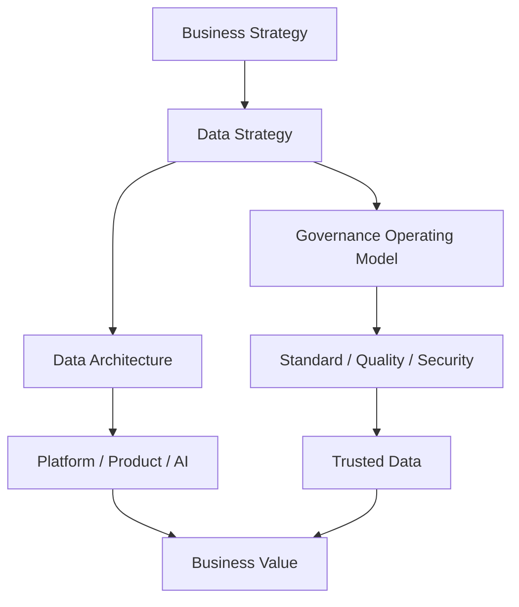

## Definition

**CDO** 通常指 Chief Data Officer，**CDAO** 通常指 Chief Data and Analytics Officer。这个角色负责把数据从技术资源转化为组织资产、经营能力和 AI 生产力。

## Business Value

CDO/CDAO 关注的不是单点技术，而是数据如何支持：

- 降本增效：减少重复建设、提升交付效率。
- 风险控制：数据安全、合规、质量和审计。
- 业务增长：客户洞察、精细化运营、数据产品。
- AI Ready：让数据、语义、质量和权限可被 AI Agent 可靠使用。

## Architecture

## Commercial Practice

成熟企业中的 CDO/CDAO 通常会推动：

- 建立数据治理组织和权责体系。
- 建立指标体系、语义层和数据资产目录。
- 用 [[DCMM]] 或类似模型评估能力成熟度。
- 用 [[DAMA-DMBOK]] 对齐国际化数据管理知识域。
- 将 BI、数据服务和 AI Agent 纳入统一治理。

## Interview Answer

CDO/CDAO 的核心价值是把数据能力和业务结果连接起来。数据架构师向 CDO 汇报方案时，不能只讲 Kafka、Flink、湖仓和 OLAP，还要讲这些能力如何提升指标时效、降低质量风险、减少重复开发，并为 AI 和数据产品提供可信上下文。

## Links

- part-of:: [[MOC-数据架构师能力地图]]
- governs:: [[Data Standard]]
- governs:: [[Data Quality]]
- depends-on:: [[Metadata Management]]
- enables:: [[Data Agent Architecture]]
