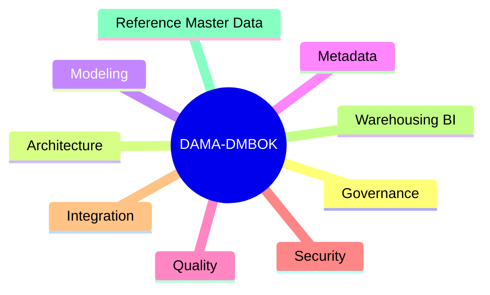

## Definition

**DAMA-DMBOK** 是 DAMA International 发布的数据管理知识体系，用于描述组织如何规划、治理、架构、建模、集成、存储、保护、管理质量并应用数据。

在 [[Bigdata Wiki OS]] 中，DAMA-DMBOK 是国际化知识域坐标系；[[DCMM]] 是成熟度评估和落地证据坐标系。

## Business Value

- 让数据管理职责、活动和交付物有统一语言。
- 帮助数据架构师把技术方案映射到治理、质量、安全和价值。
- 支撑 CDO/CDAO 设计组织模型、制度体系和数据资产运营路径。

## Architecture

## Commercial Practice

在企业落地中，DAMA 不应停留在知识域背诵，而应转化为：

- 数据治理委员会和数据 Owner/Steward 职责。
- 数据标准、元数据、质量、安全的制度和流程。
- 数据目录、血缘、质量监控、权限审计等平台能力。
- 数据资产、指标体系、语义层和 AI Agent 的可复用上下文。

## Interview Answer

DAMA-DMBOK 是偏国际通用的数据管理知识框架，强调数据管理有哪些知识域、活动和最佳实践；DCMM 更偏成熟度评估，强调组织当前能力处在哪个等级、有哪些证据和改进项。实际项目中可以用 DAMA 做知识域和职责设计，用 DCMM 做评估和路线图。

## Links

- part-of:: [[MOC-DCMM-DAMA Map]]
- compares-with:: [[DCMM]]
- supports:: [[CDO]]
- related:: [[Metadata Management]]
- related:: [[Data Quality]]
