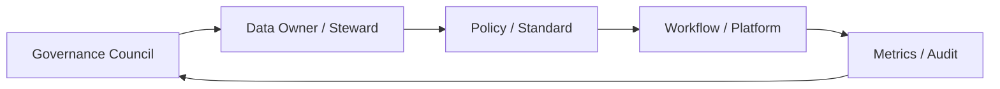

## Definition

**Data Governance Operating Model** 是数据治理的组织和运行机制，明确谁负责、按什么流程执行、用什么平台支撑、如何度量效果。

## Business Value

- 让 [[Data Standard]]、[[Data Quality]]、[[Metadata Management]] 不停留在文档层。
- 帮助 CDO/CDAO 建立跨部门治理协同和问责机制。
- 为 DCMM 成熟度评估提供组织、制度、流程和证据。

## Architecture / Flow

## Commercial Practice

治理机制通常包含数据治理委员会、数据 owner、数据 steward、标准审批、质量问题闭环、元数据维护责任、权限审批和月度治理看板。

## Common Pitfalls

- 只有治理制度，没有 owner 和执行流程。
- 只做平台采购，没有业务参与。
- 治理指标只统计数量，不衡量业务风险和效率改善。

## Interview Answer

数据治理要落地，关键不是写制度，而是建立运行机制：组织角色、流程门禁、平台能力、度量指标和问题闭环必须同时存在。否则标准、质量和元数据都会变成一次性文档。

## Links

- part-of:: [[MOC-DCMM-DAMA 数据治理地图]]
- supports:: [[CDO]]
- depends-on:: [[DAMA-DMBOK]]
- connects:: [[Data Quality]]

