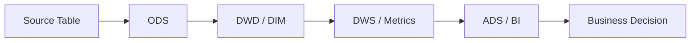

## Definition

**Data Lineage** 是数据在系统、表、字段、任务、指标和报表之间的来源、加工和消费关系。

## Business Value

- 变更前做影响分析，避免上游字段调整破坏下游报表。
- 质量异常时快速定位来源、加工任务和责任人。
- 为 [[Data Agent Architecture]] 提供可解释证据链。

## Architecture / Flow

## Commercial Practice

血缘要区分表级、字段级、任务级、指标级和报表级。商业落地中，字段级血缘价值高，但采集和维护成本也高，建议优先覆盖核心链路。

## Common Pitfalls

- 只展示表关系，没有字段、任务和指标上下文。
- 血缘不与质量、权限、标准和责任人联动。
- 自动解析覆盖不足，却没有人工补录和校验机制。

## Interview Answer

数据血缘解决的是“数据从哪里来、怎么加工、影响谁”的问题。它既能用于变更影响分析，也能用于质量追踪和审计。成熟血缘不只是图，还要能连接元数据、任务、指标、报表和责任人。

## Links

- part-of:: [[MOC-DCMM-DAMA 数据治理地图]]
- depends-on:: [[Metadata Management]]
- supports:: [[Data Quality]]
- supports:: [[Data Observability]]

