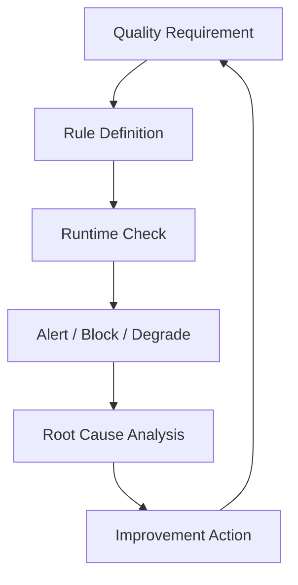

## Definition

**Data Quality** 是对数据是否满足业务和技术使用要求的持续管理能力，通常覆盖完整性、准确性、一致性、及时性、唯一性、有效性和可追溯性。

## Business Value

- 降低错误报表、错误决策和重复核数成本。
- 提升指标可信度、数据产品体验和 AI Agent 输出可靠性。
- 为数据资产化提供可信基础。

## Architecture

## Commercial Practice

质量治理要从核心业务指标和关键链路开始，而不是先铺满所有表。常见做法包括：指标波动监控、空值率监控、主键唯一性、枚举合法性、跨表一致性、产出时效、血缘影响分析和质量事故复盘。

## Interview Answer

数据质量不是简单跑校验 SQL，而是一套从质量需求、规则定义、运行检测、告警阻断、根因分析到持续改进的闭环。对实时数仓来说，还要关注端到端延迟、乱序、重复消费、Exactly-once 语义和下游降级策略。

## Links

- part-of:: [[MOC-DCMM-DAMA 数据治理地图]]
- depends-on:: [[Metadata Management]]
- governed-by:: [[Data Standard]]
- supports:: [[Indicator System]]
- supports:: [[Data Agent Architecture]]
