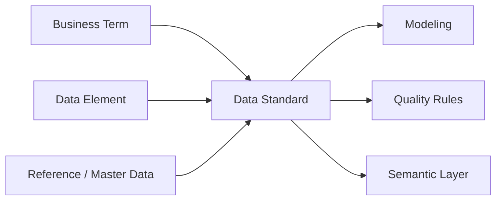

## Definition

**Data Standard** 是组织对数据命名、定义、编码、格式、口径、责任和使用规则的统一约束。

## Business Value

- 统一业务语言，减少跨部门沟通成本。
- 降低重复建模、重复取数和指标口径冲突。
- 支撑 [[Semantic Layer]]、[[Indicator System]]、数据服务和 DATA+AI Agent。

## Architecture

## Commercial Practice

标准建设要和实际开发流程绑定：字段命名、分层命名、指标口径、主数据编码、数据类型、枚举值、生命周期和责任人都应进入模型评审、上线检查和质量监控。

## Interview Answer

数据标准的目标是让同一个业务对象在不同系统、模型和报表中有一致表达。它通常包括业务术语、数据元、参考数据、主数据和指标标准。没有数据标准，后续元数据、质量、语义层和 Text2SQL 都会缺少可信依据。

## Links

- part-of:: [[MOC-DCMM-DAMA 数据治理地图]]
- governs:: [[Indicator System]]
- governs:: [[Semantic Layer]]
- supports:: [[Data Quality]]
- supports:: [[CDO]]
