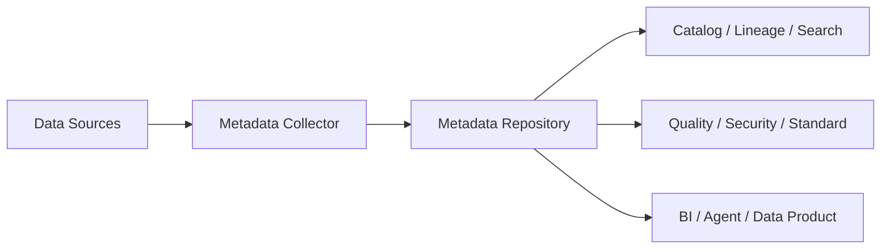

## Definition

**Metadata Management** 是对数据资产的技术元数据、业务元数据、操作元数据和治理元数据进行采集、维护、关联和应用的过程。

## Business Value

- 让用户知道数据在哪里、是什么、由谁负责、是否可信。
- 支撑血缘分析、影响分析、质量追踪和权限审计。
- 为 [[Semantic Layer]]、[[Indicator System]] 和 [[Data Agent Architecture]] 提供上下文。

## Architecture

## Commercial Practice

元数据平台应优先覆盖高价值资产，而不是追求一次性全量接入。推荐从核心数仓表、指标、调度任务、BI 报表、权限策略和质量规则开始，形成可被业务和工程共同使用的数据目录。

## Interview Answer

元数据管理的价值在于让数据资产可理解、可追踪、可治理。技术元数据告诉我们表结构和任务依赖，业务元数据说明指标口径和业务含义，操作元数据反映运行状态，治理元数据连接标准、质量、安全和责任人。

## Links

- part-of:: [[MOC-DCMM-DAMA 数据治理地图]]
- supports:: [[Data Quality]]
- supports:: [[Semantic Layer]]
- supports:: [[Data Agent Architecture]]
- related:: [[Apache Atlas]]
