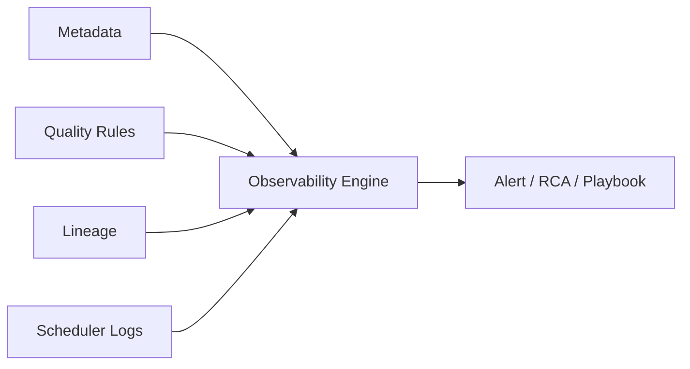

## Definition

**Data Observability** 是对数据新鲜度、分布、容量、Schema、血缘、质量规则和任务状态进行持续监控与诊断的能力。

## Business Value

- 在业务发现异常前识别数据延迟、空值突增、口径漂移和链路失败。
- 缩短数据事故定位和恢复时间。
- 为 [[Data Agent Architecture]] 提供诊断上下文和证据。

## Architecture / Flow

## Commercial Practice

优先监控核心表、核心指标和高价值报表。常见维度包括数据新鲜度、记录数、空值率、唯一性、分布漂移、Schema 变化、任务时长和下游影响。

## Common Pitfalls

- 告警太多但没有分级和 owner。
- 只监控技术任务，不监控业务指标异常。
- 没有把观测结果回写到知识库和复盘文档。

## Interview Answer

数据可观测性解决的是数据平台“出问题太晚发现、发现后难定位”的问题。它把元数据、血缘、质量规则、调度日志和业务指标监控结合起来，让数据事故更早发现、更快恢复。

## Links

- part-of:: [[MOC-BigData Map]]
- depends-on:: [[Metadata Management]]
- depends-on:: [[Data Lineage]]
- supports:: [[Data Pipeline SLA]]
- supports:: [[Data Quality]]

