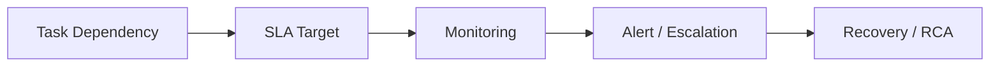

## Definition

**Data Pipeline SLA** 是对数据链路在产出时间、数据完整性、质量阈值、失败恢复和通知升级方面的明确承诺。

## Business Value

- 帮助业务理解报表、指标和数据产品何时可信可用。
- 支撑任务监控、故障分级、影响分析和责任协同。
- 与 [[Data Quality]]、[[Data Observability]] 和 [[Data Lineage]] 共同构成数据可靠性体系。

## Architecture / Flow

## Commercial Practice

核心链路应定义 T+1 或分钟级产出时间、上游依赖、重跑策略、质量校验、失败通知、业务影响范围和负责人。SLA 要进入调度平台和治理看板，而不只写在文档里。

## Common Pitfalls

- 只监控任务成功失败，不监控数据是否及时、完整、正确。
- 所有任务同一优先级，故障处理没有业务影响分级。
- SLA 没有和上游依赖、下游报表、责任人联动。

## Interview Answer

数据链路 SLA 不是简单说任务几点跑完，而是定义数据交付的服务承诺：时效、质量、依赖、恢复和通知机制。成熟的数据平台会把 SLA 与调度、质量、血缘和告警联动。

## Links

- part-of:: [[MOC-大数据全栈工程师能力地图]]
- depends-on:: [[Data Lineage]]
- supports:: [[Data Quality]]
- related:: [[Apache DolphinScheduler]]

