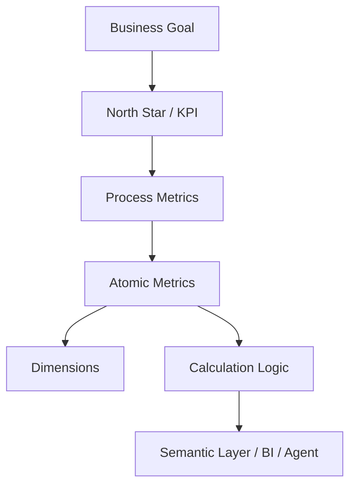

## Definition

**Indicator System** 是对业务指标进行体系化定义、分层、归口、计算和治理的方法。它把经营目标拆解为可度量、可追踪、可复用的指标网络。

## Business Value

- 统一经营分析语言，减少口径争议。
- 支撑看板、专题分析、归因分析和目标管理。
- 为 [[Semantic Layer]]、ChatBI、Text2SQL 和 Agent 提供指标上下文。

## Architecture

## Commercial Practice

指标体系建设要从业务过程出发，明确指标名称、定义、计算逻辑、统计周期、维度、数据来源、责任人、质量规则和适用场景。核心指标应沉淀到公共模型或语义层，而不是散落在报表 SQL 中。

## Interview Answer

指标体系的关键不是列一个指标清单，而是建立从业务目标到过程指标、原子指标、维度和计算口径的可治理关系。好的指标体系可以支撑 BI 分析，也可以支撑 AI Agent 理解“用户问的业务问题到底对应哪个指标”。

## Links

- part-of:: [[MOC-Data Architecture Map]]
- depends-on:: [[Dimensional Modeling]]
- governed-by:: [[Data Standard]]
- supports:: [[Semantic Layer]]
- supports:: [[Data Quality]]
