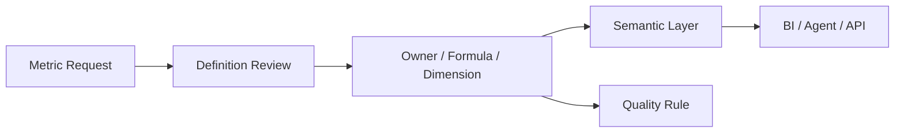

## Definition

**Metrics Governance** 是对指标定义、口径、维度、计算逻辑、owner、变更流程、质量规则和使用场景的治理机制。

## Business Value

- 避免同名指标多口径、同口径多实现。
- 支撑 [[Indicator System]]、[[Semantic Layer]]、BI 和 Text2SQL。
- 让 CDO/CDAO 可以用统一经营指标沟通业务价值。

## Architecture / Flow

## Commercial Practice

指标治理应优先覆盖管理层、高频报表和跨部门指标。每个核心指标至少要有业务定义、统计口径、维度范围、计算 SQL、数据 owner、质量规则和变更记录。

## Common Pitfalls

- 指标只在报表里定义，没有进入指标库。
- 只有计算逻辑，没有业务解释和适用边界。
- 指标变更没有影响分析，导致历史报表不可比。

## Interview Answer

指标治理的目标是让企业对关键经营指标有统一语言。它不是单纯建指标库，而是把业务定义、计算逻辑、维度、owner、质量规则和变更流程一起管起来。

## Links

- part-of:: [[MOC-数据架构师能力地图]]
- depends-on:: [[Indicator System]]
- enables:: [[Semantic Layer]]
- supports:: [[Text2SQL]]

