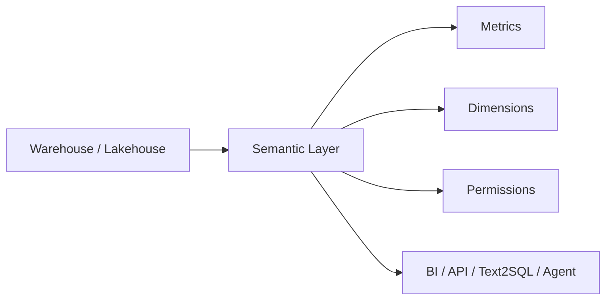

## Definition

**Semantic Layer** 是位于数据模型和消费工具之间的业务语义抽象层，用统一的维度、指标、口径、权限和查询接口屏蔽底层表结构复杂度。

## Business Value

- 让 BI、报表、Ad-hoc、API 和 ChatBI 使用同一套指标口径。
- 降低业务用户理解底层表结构的成本。
- 为 Text2SQL 和 [[Data Agent Architecture]] 提供可靠上下文。

## Architecture

## Commercial Practice

语义层应优先覆盖高频、核心、跨团队使用的指标和维度。它需要和 [[Indicator System]]、[[Data Standard]]、[[Metadata Management]]、权限体系和质量规则一起设计。

## Interview Answer

语义层解决的是“业务问题和物理表之间缺少稳定翻译层”的问题。没有语义层，Text2SQL 容易生成看似正确但口径错误的 SQL；有语义层后，AI Agent 可以基于指标、维度、过滤条件和权限边界生成更可信的查询。

## Links

- part-of:: [[MOC-DATA+AI Agent 地图]]
- depends-on:: [[Indicator System]]
- depends-on:: [[Metadata Management]]
- governed-by:: [[Data Standard]]
- enables:: [[Data Agent Architecture]]
