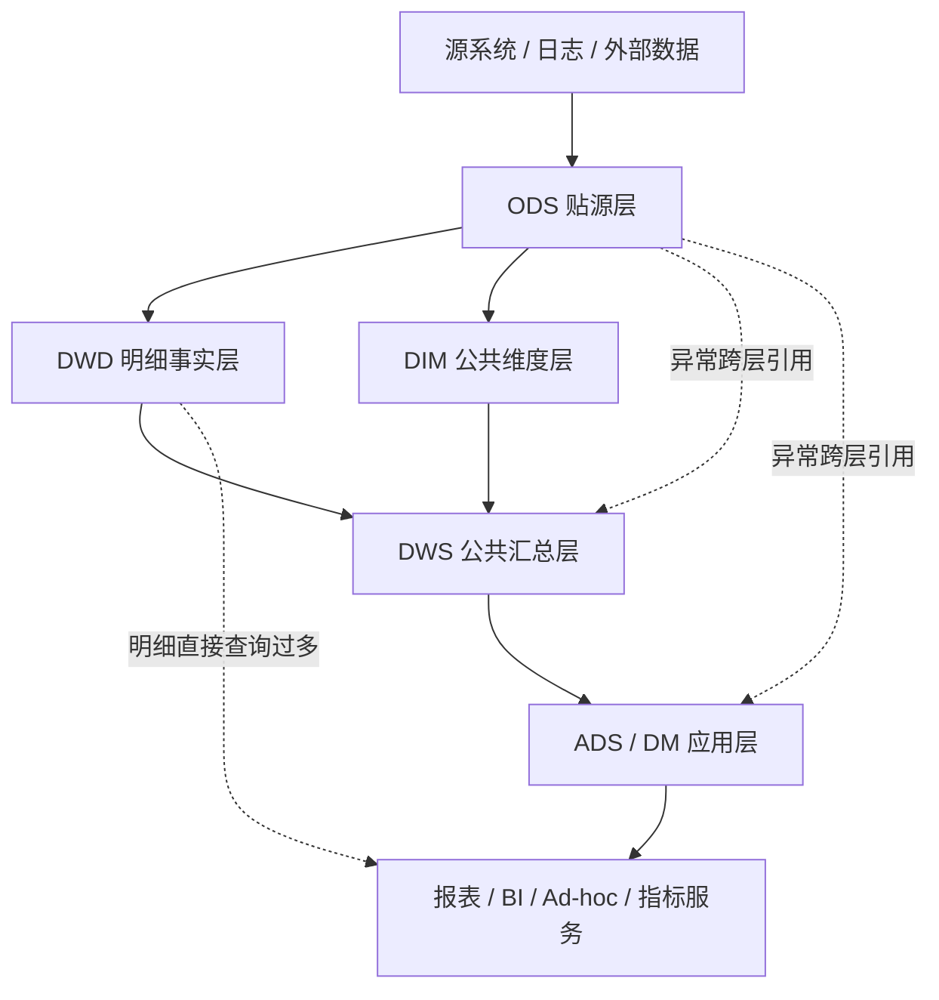
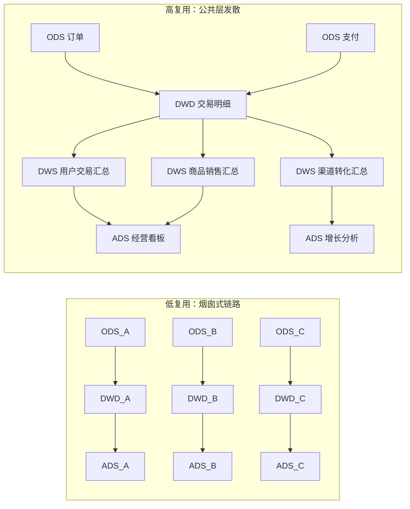
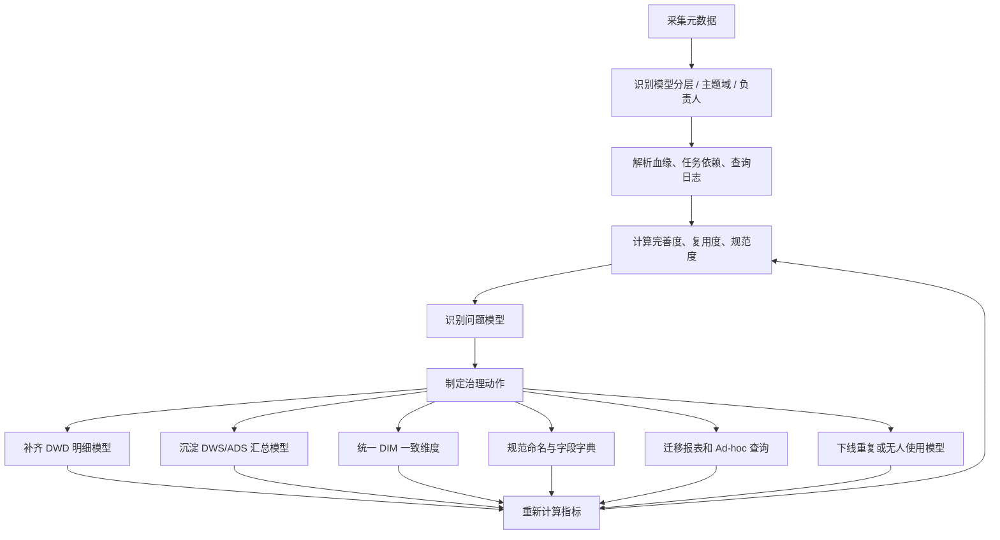

## 核心问题

分析型数仓的数据模型不能只看“表是否已经建出来”，更要看模型是否真正沉淀为公共资产。

一个好的数仓模型，应该满足三件事：

- **完善度**：公共明细层、汇总层、应用层是否建设充分，是否减少了对原始层的直接依赖。
- **复用度**：DWD、DWS、DIM 等公共模型是否被多个下游场景复用。
- **规范度**：模型是否符合分层、命名、主题域、元数据、质量规则和生命周期规范。

> [!summary]
> 好模型不是表越多越好，而是让业务需求尽量从 DWS、ADS、DM 或指标层取数，让 DWD/DIM 成为稳定公共资产，让 ODS 保持贴源输入角色。

## 分层理想路径



理想链路是：

```text
ODS -> DWD/DIM -> DWS -> ADS/DM -> 应用
```

需要治理的链路是：

```text
ODS -> DWS
ODS -> ADS/DM
ODS -> 报表/临时查询
DWD -> 大量重复宽表
```

## 评价总框架

可以将模型健康度抽象为一个加权评分：

```text
模型健康度 = 完善度得分 * 40% + 复用度得分 * 35% + 规范度得分 * 25%
```

| 一级指标 | 关注问题 | 核心指标 | 健康方向 |
| --- | --- | --- | --- |
| 完善度 | 公共层有没有建好 | 跨层引用率、ODS 查询率、汇总查询比例、公共维度覆盖率、指标沉淀率 | 跨层低，汇总高 |
| 复用度 | 模型有没有被共享 | DWD 引用系数、DWS 引用系数、DIM 引用系数、公共模型复用率 | 引用高，僵尸少 |
| 规范度 | 模型能不能治理 | 分层识别率、主题域归属率、命名规范率、元数据完整率、质量规则覆盖率 | 识别高，标准高 |

## 完善度

完善度衡量数仓分层是否真正发挥作用，尤其要观察 ODS 是否被大量直接消费。

| 指标 | 计算公式 | 说明 | 方向 |
| --- | --- | --- | --- |
| 跨层引用率 | `跨层引用次数 / 总引用次数` | 下游是否跳过中间公共层直接引用底层数据 | 越低越好 |
| ODS 直接任务读取率 | `读取 ODS 的任务数 / 已识别分层读表任务数` | 调度任务是否大量绕过 DWD/DWS | 越低越好 |
| ODS 直接查询率 | `查询 ODS 的次数 / 总查询次数` | 分析查询是否依赖原始层 | 越低越好 |
| 汇总数据查询比例 | `查询 DWS、ADS、DM 的次数 / 总查询次数` | 汇总层、应用层是否承接主要查询 | 越高越好 |
| 公共维度覆盖率 | `引用公共 DIM 的事实/汇总模型数 / 应引用 DIM 的模型数` | 是否使用一致维度 | 越高越好 |
| 指标沉淀率 | `已沉淀指标数 / 常用指标总数` | 指标是否从报表 SQL 中公共化 | 越高越好 |

### 跨层引用率

跨层引用率用来识别分层失效。

```text
ODS 跨层引用率 =
ODS 直接被 DWS/ADS/DM 引用的活跃表数 / ODS 活跃表数
```

也可以按引用次数计算：

```text
跨层引用率 =
异常跨层引用次数 / 全部引用次数
```

常见异常包括：

- DWS 直接引用 ODS。
- ADS/DM 直接引用 ODS。
- ADS/DM 大量直接引用 DWD 明细，绕过 DWS 公共汇总。
- 应用报表直接查询 ODS。

### 汇总数据查询比例

汇总数据查询比例用来判断 DWS/ADS/DM 是否承接了主要分析流量。

```text
汇总数据查询比例 =
查询 DWS/ADS/DM 的次数 / 总查询次数
```

更推荐使用扫描量口径：

```text
汇总数据扫描比例 =
DWS/ADS/DM 查询扫描数据量 / 总查询扫描数据量
```

扫描量比查询次数更能反映真实成本。

## 复用度

复用度衡量公共模型是否真的被使用。如果每个需求都新建链路，模型就没有沉淀为资产。

| 指标 | 计算公式 | 说明 | 方向 |
| --- | --- | --- | --- |
| DWD 引用系数 | `DWD 被 DWS/ADS/DM 引用次数 / DWD 模型数` | 明细事实层是否被复用 | 越高越好 |
| DWS 引用系数 | `DWS 被 ADS/DM/报表引用次数 / DWS 模型数` | 公共汇总层是否被复用 | 越高越好 |
| DIM 引用系数 | `DIM 被事实/汇总/应用表引用次数 / DIM 模型数` | 公共维度是否统一 | 越高越好 |
| 公共模型复用率 | `被 2 个及以上下游引用的公共模型数 / 公共模型总数` | 是否形成共享资产 | 越高越好 |
| 有效模型占比 | `近 N 天被查询或被依赖的模型数 / 模型总数` | 是否存在大量无人使用模型 | 越高越好 |
| 僵尸模型率 | `近 N 天无查询且无下游依赖的模型数 / 模型总数` | 无效资产占比 | 越低越好 |

模型引用系数可以作为核心复用指标：

```text
模型引用系数 = 下游引用次数 / 模型数量
```

经验判断：

| 模型引用系数 | 评价 |
| --- | --- |
| `< 1` | 大量模型无人使用 |
| `1 - 2` | 复用偏弱 |
| `2 - 3` | 基本可接受 |
| `>= 3` | 复用较好 |
| `> 5` | 高复用公共资产 |

### 低复用与高复用形态



## 规范度

规范度衡量模型是否可维护、可治理、可自动化运营。

| 指标 | 计算公式 | 说明 | 方向 |
| --- | --- | --- | --- |
| 分层识别率 | `已识别分层表数 / 总表数` | 是否能识别 ODS/DWD/DIM/DWS/ADS/DM | 越高越好 |
| 主题域归属率 | `已归属主题域表数 / 总表数` | 是否归入交易、用户、商品等主题域 | 越高越好 |
| 命名规范率 | `符合命名规范的表/字段数 / 总表/字段数` | 是否能从名称识别层级、主题、周期 | 越高越好 |
| 字段标准化率 | `匹配字段字典的字段数 / 字段总数` | 同义字段是否统一 | 越高越好 |
| 元数据完整率 | `关键元数据完整的模型数 / 模型总数` | 是否有负责人、粒度、生命周期等 | 越高越好 |
| 质量规则覆盖率 | `配置质量规则的核心模型数 / 核心模型总数` | 是否可验证 | 越高越好 |
| 调度依赖完整率 | `配置上游依赖的任务数 / 应配置依赖任务数` | 是否避免空跑、错跑、乱序产出 | 越高越好 |

建议至少要求核心模型具备：

- 表中文名、字段中文名、字段描述。
- 负责人、主题域、业务过程。
- 数据粒度、主键或唯一键。
- 更新频率、生命周期、分区策略。
- 上游来源、下游去向。
- 数据质量规则。

## 元数据支撑

这些指标不能靠人工判断，需要元数据中心提供数据支撑。

### 表资产元数据

| 字段 | 示例 | 说明 |
| --- | --- | --- |
| table_id | `t_1001` | 表唯一 ID |
| table_name | `dwd_trade_order_detail_di` | 表名 |
| layer | `DWD` | 分层 |
| subject_area | `trade` | 主题域 |
| business_process | `order` | 业务过程 |
| grain | `one row per order item` | 数据粒度 |
| owner | `zhangsan` | 负责人 |
| lifecycle_days | `1095` | 生命周期 |
| is_active | `1` | 是否活跃 |
| created_at | `2026-01-01` | 创建时间 |

### 血缘依赖元数据

| 字段 | 示例 | 说明 |
| --- | --- | --- |
| upstream_table | `ods_trade_order_df` | 上游表 |
| upstream_layer | `ODS` | 上游层级 |
| downstream_table | `ads_trade_dashboard_di` | 下游表 |
| downstream_layer | `ADS` | 下游层级 |
| relation_type | `read_to_build` | 依赖类型 |
| job_id | `job_2001` | 任务 ID |
| stat_date | `2026-05-17` | 统计日期 |

### 查询日志元数据

| 字段 | 示例 | 说明 |
| --- | --- | --- |
| query_id | `q_9001` | 查询 ID |
| user_id | `analyst_01` | 查询用户 |
| table_name | `dws_trade_user_1d` | 命中表 |
| layer | `DWS` | 命中层级 |
| scan_bytes | `120GB` | 扫描量 |
| duration_seconds | `35` | 查询耗时 |
| query_type | `ad_hoc` | 查询类型 |
| stat_date | `2026-05-17` | 统计日期 |

### 数据质量元数据

| 字段 | 示例 | 说明 |
| --- | --- | --- |
| table_name | `dwd_trade_order_detail_di` | 表名 |
| rule_type | `primary_key_unique` | 规则类型 |
| rule_expr | `order_id,item_id unique` | 规则表达式 |
| enabled | `1` | 是否启用 |
| last_status | `pass` | 最近执行结果 |
| owner | `zhangsan` | 负责人 |

## 指标计算 SQL

### ODS 跨层引用率

```sql
select
  count(distinct case
    when upstream_layer = 'ODS'
     and downstream_layer in ('DWS', 'ADS', 'DM')
    then upstream_table end
  ) * 1.0
  / count(distinct case when upstream_layer = 'ODS' then upstream_table end)
    as ods_cross_layer_ref_rate
from lineage_edges
where stat_date between '${start_date}' and '${end_date}';
```

### 汇总数据查询比例

```sql
select
  count(case when layer in ('DWS', 'ADS', 'DM') then 1 end) * 1.0
  / count(*) as summary_query_rate
from query_log
where stat_date between '${start_date}' and '${end_date}';
```

### DWD 模型引用系数

```sql
select
  count(*) * 1.0 / count(distinct upstream_table) as dwd_ref_coefficient
from lineage_edges
where upstream_layer = 'DWD'
  and downstream_layer in ('DWS', 'ADS', 'DM')
  and stat_date between '${start_date}' and '${end_date}';
```

### 分层识别率

```sql
select
  count(case when layer is not null and layer <> 'UNKNOWN' then 1 end) * 1.0
  / count(*) as layer_identify_rate
from table_metadata
where is_active = 1;
```

## 治理闭环



## 治理动作清单

| 问题现象 | 可能原因 | 治理动作 |
| --- | --- | --- |
| ODS 直接查询率高 | DWD/DWS 没有覆盖常用需求 | 补齐明细事实层和公共汇总层 |
| 跨层引用率高 | 分层约束弱，开发绕层取数 | 建立依赖规则和上线检查 |
| DWD 引用系数低 | 明细模型粒度不清或主题不稳定 | 重构核心业务过程模型 |
| DWS 引用系数低 | 汇总模型太贴近单个报表 | 按主题、周期、粒度重建公共汇总 |
| DIM 引用系数低 | 维度口径分散 | 建设一致维度和维度映射规则 |
| 元数据完整率低 | 模型资产没有纳管 | 强制表说明、字段说明、负责人、粒度声明 |
| 质量规则覆盖率低 | 缺少自动验证机制 | 核心表配置唯一性、非空、波动、枚举、及时性规则 |
| 僵尸模型率高 | 历史需求沉淀但未清理 | 建立生命周期和下线机制 |

## 最小指标看板

如果只能先做一版治理看板，优先放这 6 个指标：

| 优先级 | 指标 | 价值 |
| --- | --- | --- |
| P0 | 跨层引用率 | 判断数仓分层是否失效 |
| P0 | 汇总数据查询比例 | 判断 DWS/ADS/DM 是否承接分析流量 |
| P0 | DWD/DWS 模型引用系数 | 判断公共模型是否被复用 |
| P1 | 公共维度覆盖率 | 判断一致维度是否建立 |
| P1 | 元数据完整率 | 判断模型是否可治理 |
| P1 | 质量规则覆盖率 | 判断模型是否可信 |

## 参考

- [数据模型无法复用，归根结底还是设计问题](https://blog.51cto.com/u_15259710/2933049)
- [[维度建模]]
- [[Dimensional Modeling]]
- [[范式建模]]
