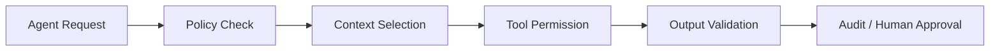

## Definition

**Agent Governance** 是对 AI Agent 在数据场景中的上下文、工具、权限、输出、审计和人工确认机制进行治理。

## Business Value

- 降低 Agent 错查、越权、误导和误操作风险。
- 支撑 Text2SQL、DataOps Agent、Quality Agent 等能力进入生产场景。
- 将 [[Data Security]]、[[Data Quality]]、[[Metadata Management]] 和 [[Semantic Layer]] 转化为 Agent 运行边界。

## Architecture / Flow

## Commercial Practice

低风险任务可以自动化，例如解释指标、生成 SQL 草稿、总结报表。高风险任务如写数据、改权限、发布任务、访问敏感明细，应默认要求人工审批。

## Common Pitfalls

- Agent 直接连生产库，缺少只读限制和审计。
- Prompt 中写了规则，但工具层没有权限控制。
- 没有记录 Agent 使用了哪些指标、表、文档和规则。

## Interview Answer

Agent 治理的核心是把 AI 的能力放进受控边界：上下文可信、工具可控、权限最小化、输出可验证、过程可审计。数据场景尤其要防止口径错误、越权访问和自动化误操作。

## Links

- part-of:: [[MOC-DATA+AI Agent 地图]]
- governs:: [[Text2SQL]]
- governs:: [[Data Agent Architecture]]
- depends-on:: [[Data Security]]
- depends-on:: [[Data Quality]]

