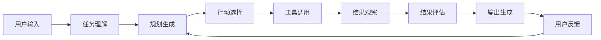

### Agent 执行流程

![[agent-ppa.png]]

### 基于 LLM 的 Agent 

![[agent-llm.png]]

### 开源 Agent 框架

> 来自: https://github.com/e2b-dev/awesome-ai-agents

### Agent 的核心组件

1. **思考（Thought）**
   - 分析当前环境和任务
   - 确定需要执行的动作
   - 评估可能的行动方案

2. **行动（Action）**
   - 调用工具和 API
   - 执行具体的操作
   - 获取外部信息

3. **观察（Observation）**
   - 收集执行结果
   - 分析返回的数据
   - 评估行动效果

4. **记忆（Memory）**
   - 短期记忆：当前对话的上下文
   - 长期记忆：过去的学习经验和知识
   - 工作记忆：处理当前任务所需的信息

### Agent 的工作原理

### Agent 的类型

#### 1. 反射型 Agent（Reflective Agent）
- 具有自我反思能力
- 可以评估自己的行为并调整策略
- 适合复杂问题的解决

#### 2. 协作型 Agent（Collaborative Agent）
- 多个 Agent 协作完成任务
- 分工明确，各司其职
- 适用于大型项目的团队协作

#### 3. 自主型 Agent（Autonomous Agent）
- 能够独立完成任务
- 具有目标导向的能力
- 可以在没有人类干预的情况下运行

### Agent 的关键技术

#### 提示工程（[[Prompt Engineering]]）
- 设计有效的系统提示
- 构建清晰的指令模板
- 优化推理链的引导

#### 工具集成（Tool Integration）
- API 调用能力
- 函数执行功能
- 外部数据访问

#### 记忆管理（Memory Management）
- 上下文窗口管理
- 向量存储和检索
- 知识图谱构建

### Agent 的应用场景

#### 1. 代码开发
- 自动编程助手
- 代码审查和优化
- 调试和错误修复

#### 2. 数据分析
- 自动化数据处理
- 智能报告生成
- 可视化创建

#### 3. 客户服务
- 智能客服机器人
- 问题自动解答
- 用户需求分析

#### 4. 创意写作
- 内容自动生成
- 创意故事创作
- 文案优化建议

### Agent 的挑战与未来

#### 当前挑战
- **推理能力限制**：复杂逻辑推理仍有不足
- **事实准确性**：可能出现"幻觉"或错误信息
- **成本控制**：大量计算资源消耗
- **安全与隐私**：数据安全和伦理问题

#### 未来发展方向
- **多模态交互**：结合文本、图像、音频等多种模态
- **个性化定制**：根据用户需求定制 Agent 行为
- **实时学习**：持续学习和适应新环境
- **边缘计算**：在本地设备上高效运行

### 最佳实践建议

1. **明确目标定义**：为 Agent 设定清晰、可衡量的目标
2. **工具选择优化**：根据任务选择合适的工具集
3. **错误处理机制**：建立完善的错误恢复和重试机制
4. **用户反馈循环**：设计有效的用户反馈和调整机制
5. **性能监控**：持续监控 Agent 的性能和效果
