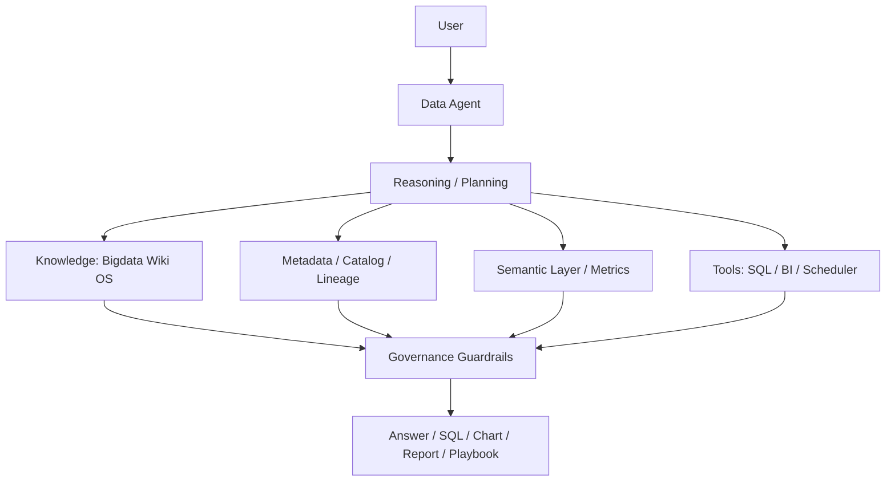

## Definition

**Data Agent Architecture** 是面向数据工作的 AI Agent 架构，它让 LLM 在受控上下文中调用 SQL、BI、元数据、调度、文档和知识库工具，完成查询、分析、建模、质量检查和报告生成。

## Business Value

- 提升数据分析、SQL 编写、排障和文档沉淀效率。
- 降低业务用户获取数据洞察的门槛。
- 将 [[Bigdata Wiki OS]]、[[Metadata Management]]、[[Semantic Layer]] 和治理规则转化为 Agent 可用上下文。

## Architecture

<section class="wiki-diagram wiki-diagram-flow" aria-labelledby="data-agent-flow">
  Data Agent
  <h2 class="wiki-diagram-title" id="data-agent-flow">Governed Data Agent Execution Flow</h2>
  

    

      User Intent
      业务问题、指标解释、SQL 草稿、排障请求
    

    
→

    

      Planner
      分解任务、选择上下文、决定工具调用路径
    

    
→

    

      Data Context
      Wiki、元数据、语义层、指标口径、质量规则
    

    
→

    

      Tools
      SQL、BI、Catalog、Scheduler、Docs
    

    
→

    

      Governed Output
      答案、SQL、图表、报告、Playbook，带权限和审计边界
    

  

  
Data Agent 的重点不是直接连库，而是让意图、上下文、工具和治理边界形成闭环。

</section>

## Commercial Practice

数据 Agent 应优先做低风险、高频、可审计的工作：指标解释、SQL 草稿、报表说明、质量异常解释、任务失败诊断和知识库编译。涉及写数据、改权限、发布任务等动作时，应默认走人工确认。

## Interview Answer

数据 Agent 的核心不是“让大模型直接连库查数”，而是把语义层、元数据、指标口径、权限、安全、质量规则和工具调用边界组织起来。这样 Agent 生成 SQL 或分析结论时，才有可解释、可审计、可治理的依据。

## Links

- part-of:: [[MOC-DATA+AI Agent Map]]
- depends-on:: [[Semantic Layer]]
- depends-on:: [[Metadata Management]]
- depends-on:: [[Data Quality]]
- related:: [[Agent]]
- related:: [[RAG]]
