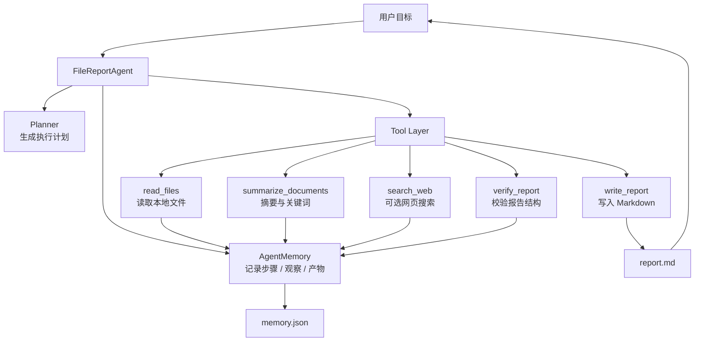
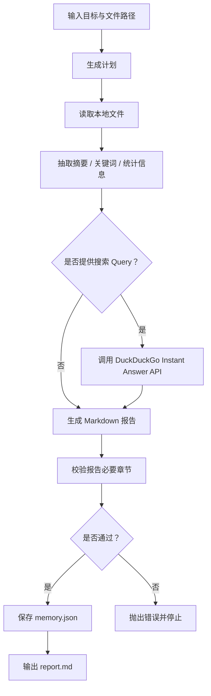
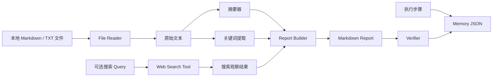
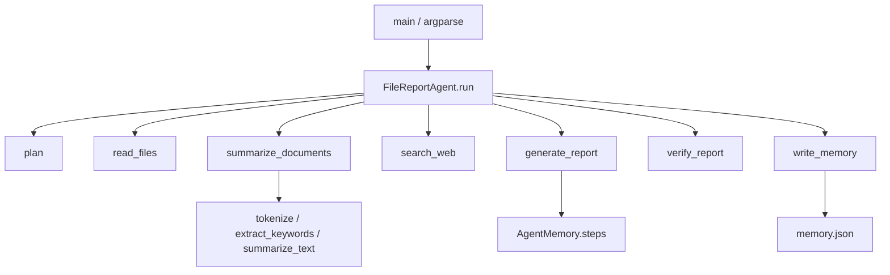

## 项目目标

做一个最小可运行的 AI Agent 学习项目：

> 读取本地文件，提取摘要，可选调用搜索，生成 Markdown 报告，并保存执行记忆。

这个项目不追求复杂框架，而是把 Agent 最核心的能力跑通：

- Planning：先拆解任务。
- Tool Calling：把读文件、搜索、写报告都当成工具动作。
- Memory：记录步骤、观察结果和产物。
- Verification：生成报告后做最小校验。
- Report：输出可读的 Markdown 结果。

示例代码在：

```bash
examples/local_report_agent/local_report_agent.py
```

## 总体架构



## 执行流程



## 数据链路



## 如何运行

只跑本地文件总结：

```bash
python3 examples/local_report_agent/local_report_agent.py \
  examples/local_report_agent/sample.md \
  --no-search
```

带搜索补充：

```bash
python3 examples/local_report_agent/local_report_agent.py \
  examples/local_report_agent/sample.md \
  --query "AI Agent tool calling memory planning"
```

默认输出：

```text
examples/local_report_agent/out/report.md
examples/local_report_agent/out/memory.json
```

## 代码结构



## 可以继续扩展的方向

- 把 `summarize_text` 替换成真实 LLM 调用。
- 把工具注册表抽出来，改成 `tool_name + arguments` 的统一调用协议。
- 把 `memory.json` 换成 SQLite 或向量数据库。
- 给报告增加引用、置信度和失败重试记录。
- 增加测试：验证空文件、中文文件、多文件、搜索失败等场景。
