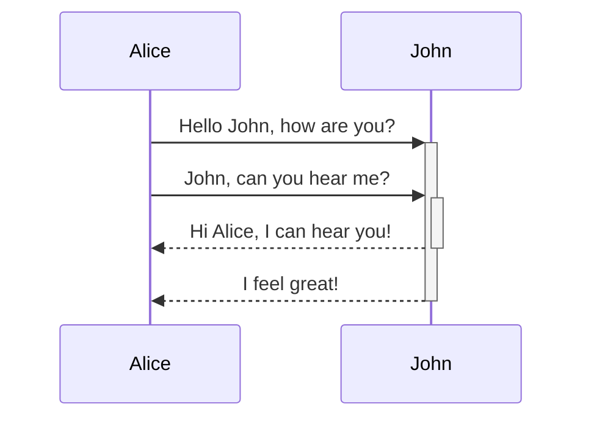

# Markdown syntax guide

## Headers

# This is a Heading h1
## This is a Heading h2

*This text will be italic*  
_This will also be italic_

**This text will be bold**  
__This will also be bold__

### This is a Heading h3

*This text will be italic*  
_This will also be italic_

**This text will be bold**  
__This will also be bold__


## Emphasis

*This text will be italic*  
_This will also be italic_

**This text will be bold**  
__This will also be bold__

_You **can** combine them_

## Lists

### Unordered

* Item 1
* Item 2
* Item 2a
* Item 2b
    * Item 3a
    * Item 3b

### Ordered

1. Item 1
2. Item 2
3. Item 3
    1. Item 3a
    2. Item 3b

## Images


## Links

You may be using [Markdown Live Preview](https://markdownlivepreview.com/).

## Blockquotes

> Markdown is a lightweight markup language with plain-text-formatting syntax, created in 2004 by John Gruber with Aaron Swartz.
>
>> Markdown is often used to format readme files, for writing messages in online discussion forums, and to create rich text using a plain text editor.

## Tables

| Left columns  | Right columns |
| ------------- |:-------------:|
| left foo      | right foo     |
| left bar      | right bar     |
| left baz      | right baz     |

## Blocks of code

```
let message = 'Hello world';
alert(message);
```

## Inline code

This web site is using `markedjs/marked`.

## Mermaid



## Syntax Highlighting

```js title="title…" 
export function trimPathSuffix(fp: string): string {
  fp = clientSideSlug(fp)
  let [cleanPath, anchor] = fp.split("#", 2)
  anchor = anchor === undefined ? "" : "#" + anchor
 
  return cleanPath + anchor
}
```

```js {1-3,4} 
export function trimPathSuffix(fp: string): string {
  fp = clientSideSlug(fp)
  let [cleanPath, anchor] = fp.split("#", 2)
  anchor = anchor === undefined ? "" : "#" + anchor
 
  return cleanPath + anchor
}
```
