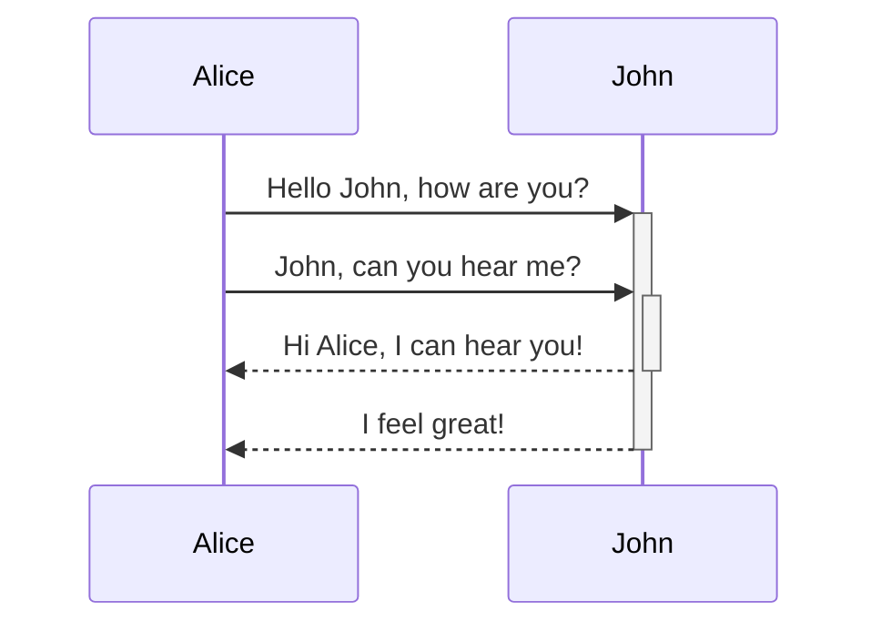

## Mermaid



## Syntax Highlighting

```js title="title…" 
export function trimPathSuffix(fp: string): string {
  fp = clientSideSlug(fp)
  let [cleanPath, anchor] = fp.split("#", 2)
  anchor = anchor === undefined ? "" : "#" + anchor
 
  return cleanPath + anchor
}
```

```js {1-3,4} 
export function trimPathSuffix(fp: string): string {
  fp = clientSideSlug(fp)
  let [cleanPath, anchor] = fp.split("#", 2)
  anchor = anchor === undefined ? "" : "#" + anchor
 
  return cleanPath + anchor
}
```

## Wikilinks

- `![[Crossbell IPFS.png]]`: embeds an image into the page
- `![[Crossbell IPFS.png|100x145]]`: embeds an image into the page with dimensions 100px by 145px
- `![[Link Icon Test.md]]`: transclude an entire page
- `![[Link Icon Test.md#anchor|Anchor]]`: transclude everything under the header `Anchor`
- `![[Link Icon Test.md#^b15695|^b15695]]`: transclude block with ID `^b15695`


> [!column|flex 3]
> 
> > [!warning] Use Nested Callouts
> > 
> > `[column]` is designed to have callouts nested within it.
> > 
> > To remove styling from nested callouts, add `clean no-title` to the metadata
> 
> > [!NOTE|clean no-t]
> > 
> > This callout has `clean no-title` metadata.
> > 
> > ```markdown title="syntax:"
> > > [!column]
> > >
> > > > [!note] title
> > > >
> > > > content
> > >
> > > > [!column] title
> > > >
> > > > content
> > ```
> 
> > [!caption]
> > 
> > ![[Crossbell IPFS.png|wsmall]]
> > 
> > A caption callout nested in the grid.

### Captions

> [!caption|right]
> 
> ![[Crossbell IPFS.png|wsmall]]
> 
> `[!caption|right]` callout

A borderless callout for adding captions to images. 

Use [[custom-formatting-features#Callout Positioning|Callout Positioning]] metadata to float these left or right for wiki-style article image captions

```markdown title="syntax"
> [!caption]
> 
> ![[Crossbell IPFS.png]]
> 
> Image caption.

```

<br>

### Infobox

A wiki-style infobox displayed in the top right of an article to summarize data from the article, such as requirements for a tutorial article.

> [!infobox]
> 
> ## Infobox
> 
> ![[Crossbell IPFS.png]]
> 
> ### Table
> 
> | Type | Name |
> | --- | --- |
> | Row | Row |
> | Row | Row |

**Type:**
- `[!infobox]`

**Syntax:**

```
> [!infobox]
> 
> ## Article Title
> 
> ![[image]]
> 
> ### Table Heading
> 
> | Type | Name |
> | --- | --- |
> | Row | Row |
> | Row | Row |
```

---

## Embed Adjustments

Adjustments for Obsidian [embedded files](https://help.obsidian.md/Linking+notes+and+files/Embed+files), otherwise known as 'transclusions'

```markdown title="syntax"
![[Embedded Note|attribute attribute]]

![[intereting-note-title|clean right]]
```

| Attribute | Description                        |
| --------- | ---------------------------------- |
| `clean`   | Removes border to hide embed style |
| `left`    | Float                              |
| `right`   | Floats embed to the right          |

### Hide Embed Styling

You can hide the borders of embedded notes and blocks by adding '`|clean]]`' to the wikilink's alias.
^4beb5b

This allows the embed to appear seamlessly as a part of the page it is embedded in. 

> [!column|2 flex clean]
> > [!example] This is a standard transclusion:
> > - ews
> > - ss
>
> > [!example] This is a 'clean' transclusion:
> > - we
> > - ses

> [!warning] Embedding block links which float left or right
> You must add a `left` or `right` attribute to embeds if the embedded content itself already floats left or right.
> 
> **Example:**
> - The [[custom-formatting-features#Infobox|infobox callout]] already floats right. To embed it in another page, add `|right` to the embed wikilink's alias.
> 
> This prevents the embed from taking up 100% of the page-width, instead of wrapping around other content

### Float Embed Left or Right

Embeds can be made to float to the left or right of a page by adding `|left` or `|right` to the embed wikilink's alias. ^cb5c00

As well as being a stylistic choice to move supplementary content outside of the main flow of the text, it is also necessary when embedding a block which contains an element with a float property already stipulated (e.g., an infobox callout).

## Daedric Font

Daedric style font can be added by wrapping text in HTML `<span>` tags, courtesy of George Duffner's [OMW Ayembedt font](https://github.com/georgd/OpenMW-Fonts) (license: [SIL Open Font License](https://openfontlicense.org/).

**Syntax**:

```markdown
<span class="daedric">your daedric text here</span>
```

> [!example]
> 
> **Regular Text**: "Morrowind"
> **Daedric Text**: "<span class="daedric">"Morrowind"</span>"

## Gallery Card View

Use this reusable card view on any page by copying the HTML block and changing each card link, title, and subtitle.

<nav class="gallery-card-view" aria-label="Featured page gallery">
  <a class="gallery-card internal" href="/index/Posts/Markdown%20syntax%20guide">
    <span class="gallery-card-title">Learning English</span>
    <span class="gallery-card-subtitle">Self-taught, total immersion</span>
  </a>
  <a class="gallery-card internal" href="/index/Posts/Awesome%20Digital%20Garden">
    <span class="gallery-card-title">Building in Public</span>
    <span class="gallery-card-subtitle">Ship, share, get noticed</span>
  </a>
  <a class="gallery-card internal" href="/index/Posts/Links%20Anythings">
    <span class="gallery-card-title">Remote Careers</span>
    <span class="gallery-card-subtitle">Visibility over CVs</span>
  </a>
  <a class="gallery-card internal" href="/index/Posts/Interesting%20Website">
    <span class="gallery-card-title">Design Engineering</span>
    <span class="gallery-card-subtitle">Design + code = superpower</span>
  </a>
</nav>

<div class="qt-wrap">
  <input class="qt-radio" type="radio" name="quote-tab-qmkd" id="qt-cursor" checked />
  <input class="qt-radio" type="radio" name="quote-tab-qmkd" id="qt-lovable" />
  <input class="qt-radio" type="radio" name="quote-tab-qmkd" id="qt-cognition" />

  <div class="qt-bar">
    <label for="qt-cursor">Cursor</label>
    <label for="qt-lovable">Lovable</label>
    <label for="qt-cognition">Cognition</label>
  </div>

  <div class="qt-panels">
    <div class="qt-panel qt-panel-cursor">
      <blockquote>
        <p>“GPT-5.5 is noticeably smarter and more persistent than GPT-5.4, with stronger coding performance and more reliable tool use. It stays on task for significantly longer without stopping early, which matters most for the complex, long-running work our users delegate to Cursor.”
— Michael Truell, Co-founder & CEO at Cursor</p>
      </blockquote>
      <p class="qt-attribution">— Michael Truell, Co-founder & CEO at Cursor</p>
    </div>
    <div class="qt-panel qt-panel-lovable">
      <blockquote>
        <p>Builders want continuous progress …（Lovable 引用正文）</p>
      </blockquote>
      <p class="qt-attribution">— Fabian Hedin, CTO & Co-founder at Lovable</p>
    </div>
    <div class="qt-panel qt-panel-cognition">
      <blockquote>
        <p>第三段文案 …</p>
      </blockquote>
      <p class="qt-attribution">— 署名</p>
    </div>
  </div>
</div>

## Callout

> [!info] Default title

> [!question]+ Can callouts be _nested_?
> 
> > [!todo]- Yes!, they can. And collapsed!
> > 
> > > [!example] You can even use multiple layers of nesting.

> [!abstract] Aliases: "abstract", "summary", "tldr"

> [!info] Aliases: "info"

> [!todo] Aliases: "todo"

> [!success] Aliases: "success", "check", "done"

> [!question] Aliases: "question", "help", "faq"

> [!failure] Aliases: "failure", "missing", "fail"

> [!danger] Aliases: "danger", "error"

> [!bug] Aliases: "bug"

> [!example] Aliases: "example"

> [!quote] Aliases: "quote", "cite"

> [!tree] Aliases: "quote", "cite"

> [!blur]
> This content is hidden until hovered. Works as a spoiler box or redaction block.

> [!box]
> Normal content displayed inside a grey bordered box.
> No blur, no hover effect — just a clean styled container.


> [Fetching Title#6kdx](https://github.com/jackyzha0/quartz/blob/v4/docs/features/callouts.md

